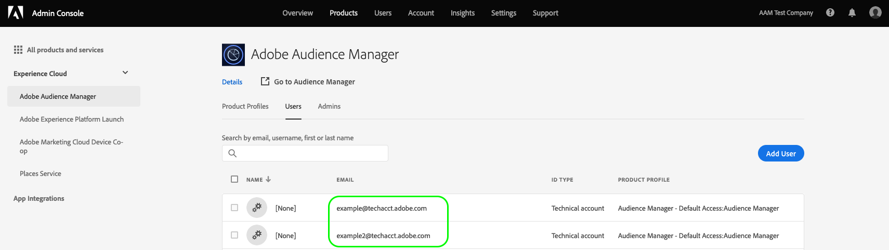

# Prise en main de [!DNL REST] [!DNL APIs] {#getting-started-with-rest-apis}

Informations sur les exigences générales, authentification, paramètres de requête facultatifs, requête [!DNL URLs], ainsi que d’autres références.

## Configuration requise pour l’API et Recommendations {#api-requirements-recommendations}

Notez ce qui suit lorsque vous utilisez [API AUDIENCE MANAGER](https://bank.demdex.com/portal/swagger/index.html#/) code :

* **Paramètres de requête :** tous les paramètres de requête sont requis, sauf indication contraire.
* **En-têtes de requête**: lors de l’utilisation [Adobe Developer](https://www.adobe.io/) jetons, vous devez fournir la variable `x-api-key` en-tête . Vous pouvez obtenir votre [!DNL API] en suivant les instructions de la section [Intégration de compte de service](https://www.adobe.io/authentication/auth-methods.html#!AdobeDocs/adobeio-auth/master/AuthenticationOverview/ServiceAccountIntegration.md) page.
* **[!DNL JSON]type de contenu :** Spécifier `content-type: application/json`  *et*  `accept: application/json` dans votre code.
* **Demandes et réponses :** Envoi de requêtes sous la forme correcte [!DNL JSON] . [!DNL Audience Manager] répond avec [!DNL JSON] données formatées. Les réponses du serveur peuvent contenir les données demandées, un code d’état ou les deux.
* **Accès :** Votre [!DNL Audience Manager] Un consultant vous fournira un identifiant client et une clé qui vous permettent d’effectuer les opérations suivantes : [!DNL API] requêtes.
* **Documentation et exemples de code :** Texte dans *italique* représente une variable que vous fournissez ou transmettez lors de la création ou de la réception. [!DNL API] data. Remplacer *italicized* texte avec votre propre code, paramètres ou d’autres informations requises.

## Authentification {#authentication}

La variable [!DNL Audience Manager] [!DNL REST APIs] prennent en charge trois méthodes d’authentification.

* [!BADGE Recommandé]{type=positive}[Authentification OAuth serveur à serveur](#oauth-adobe-developer) using [Adobe Developer Console](https://www.adobe.io/). [!DNL Adobe Developer] est l’écosystème de développement et la communauté de l’Adobe. Elle comprend [API pour tous les produits Adobe](https://developer.adobe.com/apis/). Il s’agit de la méthode recommandée pour configurer et utiliser [!DNL Adobe] [!DNL APIs]. En savoir plus sur [Authentification OAuth serveur à serveur](https://developer.adobe.com/developer-console/docs/guides/authentication/ServerToServerAuthentication/implementation/) dans la documentation destinée aux développeurs d’Adobes.
* [!BADGE Obsolète]{type=negative}[Authentification JWT (compte de service)](#jwt) using [Adobe Developer Console](https://www.adobe.io/). [!DNL Adobe Developer] est l’écosystème de développement et la communauté de l’Adobe. Elle comprend [API pour tous les produits Adobe](https://developer.adobe.com/apis/).
* [!BADGE Obsolète]{type=negative}[Authentification OAuth héritée](#oauth-deprecated). Bien que cette méthode soit obsolète, les clients qui disposent d’ [!DNL OAuth] les intégrations peuvent continuer à utiliser cette méthode.

>[!IMPORTANT]
>
>Selon votre méthode d’authentification, vous devez ajuster votre requête. [!DNL URLs] en conséquence. Voir [Environnements](#environments) pour plus d’informations sur les noms d’hôtes que vous devez utiliser.

## Authentification OAuth serveur à serveur à l’aide d’Adobe Developer {#oauth-adobe-developer}

Cette section explique comment rassembler les informations d’identification requises pour authentifier les appels API d’Audience Manager, comme indiqué dans l’organigramme ci-dessous. Vous pouvez rassembler la plupart des informations d’identification requises dans la configuration initiale unique. Le jeton d’accès doit toutefois être actualisé toutes les 24 heures.


### Présentation d’Adobe Developer {#developer-overview}

[!DNL Adobe Developer] est l’écosystème de développement et la communauté de l’Adobe. Elle comprend [API pour tous les produits Adobe](https://developer.adobe.com/apis).

Il s’agit de la méthode recommandée pour configurer et utiliser [!DNL Adobe] [!DNL APIs].

### Conditions préalables {#prerequisites-server-to-server}

Avant de pouvoir configurer [!DNL OAuth Server-to-Server] authentification, assurez-vous que vous avez accès au [Console Adobe Developer](https://developer.adobe.com/console/home) in [Adobe Developer](https://developer.adobe.com/). Contactez l’administrateur de votre entreprise pour les demandes d’accès.

### Authentification {#oauth}

Suivez les étapes ci-dessous pour configurer [!DNL OAuth Server-to-Server] authentification [!DNL Adobe Developer]:

1. Connectez-vous au [Console Adobe Developer](https://developer.adobe.com/console/home).
1. Suivez les étapes de la section [Guide de mise en oeuvre des informations d’identification OAuth Server-to-Server](https://developer.adobe.com/developer-console/docs/guides/authentication/ServerToServerAuthentication/implementation/).
   * Durant [Étape 2 : Ajout d’une API à votre projet à l’aide de l’authentification du compte de service](https://www.adobe.io/authentication/auth-methods.html#!AdobeDocs/adobeio-auth/master/AuthenticationOverview/ServiceAccountIntegration.md), choisissez la variable [!DNL Audience Manager] [!DNL API] .
1. Essayez la connexion en effectuant votre première [!DNL API] d’après les instructions de [Étape 3](https://www.adobe.io/authentication/auth-methods.html#!AdobeDocs/adobeio-auth/master/AuthenticationOverview/ServiceAccountIntegration.md).

>[!NOTE]
>
>Pour configurer et utiliser le [!DNL Audience Manager] [!DNL REST APIs] de manière automatisée, vous pouvez faire pivoter les secrets client par programmation. Voir [documentation destinée aux développeurs](https://developer.adobe.com/developer-console/docs/guides/authentication/ServerToServerAuthentication/implementation/#rotating-client-secrets-programmatically) pour obtenir des instructions détaillées.

### Ajout de l’API d’Audience Manager à un projet {#add-aam-api-to-project}

Accédez à [Console Adobe Developer](https://www.adobe.com/go/devs_console_ui) et connectez-vous avec votre Adobe ID. Suivez ensuite les étapes décrites dans le tutoriel sur [création d’un projet vide](https://developer.adobe.com/developer-console/docs/guides/projects/projects-empty/) dans la documentation de la console Adobe Developer.

Une fois que vous avez créé un projet, sélectionnez **[!UICONTROL Add API]** sur le **[!UICONTROL Project Overview]** écran.

>[!TIP]
>
>Si vous êtes configuré pour plusieurs organisations, utilisez le sélecteur d’organisations dans le coin supérieur droit de l’interface pour vous assurer que vous êtes dans l’organisation dont vous avez besoin.


La variable **[!UICONTROL Add an API]** s’affiche. Sélectionnez l’icône de produit pour Adobe Experience Cloud, puis choisissez **[!UICONTROL Audience Manager API]** avant de sélectionner **[!UICONTROL Next]**.


>[!TIP]
>
>Sélectionnez la variable **[!UICONTROL View docs]** pour accéder à la [Documentation de référence de l’API d’Audience Manager](https://bank.demdex.com/portal/swagger/index.html#).

### Sélectionnez le type d’authentification OAuth Server-to-Server {#select-oauth-server-to-server}

Sélectionnez ensuite le type d&#39;authentification pour générer les jetons d&#39;accès et accéder à l&#39;API d&#39;Audience Manager.

>[!IMPORTANT]
>
>Sélectionnez la variable **[!UICONTROL OAuth Server-to-Server]** car il s’agira de la seule méthode prise en charge à l’avenir. La variable **[!UICONTROL Service Account (JWT)]** est obsolète. Bien que les intégrations utilisant la méthode d’authentification JWT continueront à fonctionner jusqu’au 1er janvier 2025, Adobe recommande vivement de migrer les intégrations existantes vers la nouvelle méthode OAuth Server-to-Server avant cette date.


### Sélection des profils de produit pour votre intégration {#select-product-profiles}

Dans le **[!UICONTROL Configure API]** sélectionnez les profils de produit souhaités. Le compte de service de votre intégration aura accès à des fonctionnalités granulaires par le biais des profils de produits sélectionnés ici.


Sélectionner **[!UICONTROL Save configured API]** lorsque vous êtes prêt.

### Collecte des informations d’identification {#gather-credentials}

Une fois l’API ajoutée au projet, la variable **[!UICONTROL Audience Manager API]** La page du projet affiche les informations d’identification suivantes, requises dans tous les appels aux API d’Audience Manager :


* `{API_KEY}` ([!UICONTROL Client ID])
* `{ORG_ID}` ([!UICONTROL Organization ID])

## Générer un jeton d’accès {#generate-access-token}

L’étape suivante consiste à générer une `{ACCESS_TOKEN}` informations d’identification à utiliser dans les appels API d’Audience Manager. Contrairement aux valeurs de `{API_KEY}` et `{ORG_ID}`, un nouveau jeton doit être généré toutes les 24 heures pour continuer à utiliser les API Audience Manager. Sélectionner **[!UICONTROL Generate access token]**, comme illustré ci-dessous.


## Test d’un appel API {#test-api-call}

Après avoir obtenu votre jeton porteur d’authentification, effectuez un appel API pour tester si vous pouvez désormais accéder aux API d’Audience Manager.

1. Accédez au [Documentation de référence sur les API](https://bank.demdex.com/portal/swagger/index.html#/Data%20Source%20API/get_datasources_).
2. Sélectionner **[!UICONTROL Authorize]** et collez le jeton d’accès obtenu dans la variable [générer un jeton d’accès](#generate-access-token) étape .

   

3. Effectuez un appel de GET à la fonction `/datasources` point d’entrée d’API pour récupérer une liste de toutes les sources de données disponibles globalement, comme indiqué dans la variable [Documentation de référence sur les API](https://bank.demdex.com/portal/swagger/index.html#/Data%20Source%20API/get_datasources_). Sélectionner **[!UICONTROL Try it out]**, suivie de **[!UICONTROL Execute]**, comme illustré ci-dessous.

   


>[!BEGINSHADEBOX]

>[!BEGINTABS]

>[!TAB Requête API]

```shell
curl -X 'GET' \
  'https://api.demdex.com/v1/datasources/' \
  -H 'accept: application/json' \
  -H 'Authorization: Bearer your-access-token'
```


>[!TAB Réponse de l’API en cas d’utilisation du jeton porteur correct]


Lors de l’utilisation d’un jeton d’accès fonctionnel, le point de terminaison de l’API renvoie une réponse 200, ainsi qu’un corps de réponse qui inclut toutes les sources de données globales auxquelles votre organisation a accès.

```json
[
  {
    "pid": 1794,
    "name": "testdatasource1",
    "description": "Test data source",
    "status": "ACTIVE",
    "integrationCode": "test_ds1",
    "dataExportRestrictions": [],
    "updateTime": 1595340792000,
    "crUID": 0,
    "upUID": 15910,
    "linkNamespace": false,
    "type": "GENERAL",
    "subIdType": "CROSS_DEVICE_PERSON",
    "inboundS2S": true,
    "outboundS2S": true,
    "useAudienceManagerVisitorID": false,
    "allowDataSharing": true,
    "masterDataSourceIdProvider": true,
    "uniqueTraitIntegrationCodes": false,
    "uniqueSegmentIntegrationCodes": false,
    "marketingCloudVisitorIdVersion": 0,
    "idType": "CROSS_DEVICE",
    "samplingEndTime": 1596550392825,
    "allowDeviceGraphSharing": false,
    "supportsAuthenticatedProfile": true,
    "deviceGraph": false,
    "authenticatedProfileName": "testdatasource1",
    "deviceGraphName": "",
    "customNamespaceId": 29769,
    "customNamespaceCode": "silviu_ds1",
    "customerProfileDataRetention": 62208000,
    "samplingStartTime": 1595340792825,
    "dataSourceId": 29769,
    "containerIds": [],
    "samplingEnabled": false
  },
  {
    "pid": 1794,
    "name": "AAM Test Company Audiences",
    "description": "Automatically generated trait data source",
    "status": "ACTIVE",
    "integrationCode": "adobe-provided",
    "dataExportRestrictions": [
      "PII"
    ],

    [...]
```

>[!ENDTABS]

>[!ENDSHADEBOX]

## [!BADGE Obsolète]{type=negative}[!DNL JWT] ([!DNL Service Account]) Authentification à l’aide d’Adobe Developer {#jwt}

+++ Afficher des informations sur les [!DNL JWT] ([!DNL Service Account]) pour obtenir les jetons d’authentification.

### Présentation d’Adobe Developer {#adobeio}

[!DNL Adobe Developer] est l’écosystème de développement et la communauté de l’Adobe. Elle comprend [API pour tous les produits Adobe](https://www.adobe.io/apis.html).

Il s’agit de la méthode recommandée pour configurer et utiliser [!DNL Adobe] [!DNL APIs].

### Conditions préalables {#prerequisites}

Avant de pouvoir configurer [!DNL JWT] authentification, assurez-vous que vous avez accès au [Console Adobe Developer](https://console.adobe.io/) in [Adobe Developer](https://www.adobe.io/). Contactez l’administrateur de votre entreprise pour les demandes d’accès.

### Authentification {#auth}

Suivez les étapes ci-dessous pour configurer [!DNL JWT (Service Account)] authentification [!DNL Adobe Developer]:

1. Connectez-vous au [Console Adobe Developer](https://console.adobe.io/).
1. Suivez les étapes décrites dans la section [Connexion au compte de service](https://www.adobe.io/authentication/auth-methods.html#!AdobeDocs/adobeio-auth/master/AuthenticationOverview/ServiceAccountIntegration.md).
   * Durant [Étape 2 : Ajout d’une API à votre projet à l’aide de l’authentification du compte de service](https://www.adobe.io/authentication/auth-methods.html#!AdobeDocs/adobeio-auth/master/AuthenticationOverview/ServiceAccountIntegration.md), choisissez la variable [!DNL Audience Manager] [!DNL API] .
1. Essayez la connexion en effectuant votre première [!DNL API] d’après les instructions de [Étape 3](https://www.adobe.io/authentication/auth-methods.html#!AdobeDocs/adobeio-auth/master/AuthenticationOverview/ServiceAccountIntegration.md).

>[!NOTE]
>
>Pour configurer et utiliser le [!DNL Audience Manager] [!DNL REST APIs] vous pouvez générer automatiquement la variable [!DNL JWT] par programmation. Voir [Authentification JWT (compte de service)](https://www.adobe.io/authentication/auth-methods.html#!AdobeDocs/adobeio-auth/master/JWT/JWT.md) pour obtenir des instructions détaillées.

### Autorisations RBAC du compte technique

Si votre compte d’Audience Manager utilise [Contrôle d’accès en fonction du rôle](../../features/administration/administration-overview.md), vous devez créer un compte utilisateur technique d’Audience Manager et l’ajouter au groupe RBAC d’Audience Manager qui effectuera les appels d’API.

Pour créer un compte d’utilisateur technique et l’ajouter à un groupe RBAC, procédez comme suit :

1. Effectuez une `GET` appel à `https://aam.adobe.io/v1/users/self`. L’appel crée un compte d’utilisateur technique que vous pouvez voir dans la variable [!UICONTROL Admin Console], dans la variable [!UICONTROL Users] page.

   

1. Connectez-vous à votre compte d’Audience Manager et [ajouter le compte utilisateur technique ;](../../features/administration/administration-overview.md#create-group) au groupe d’utilisateurs qui effectuera les appels d’API.

+++

## [!BADGE Obsolète]{type=negative}[!DNL OAuth] Authentification (obsolète) {#oauth-deprecated}

+++ Affichage d’informations sur l’héritage obsolète [!DNL OAuth] Méthode d’authentification pour obtenir des jetons d’authentification.

>[!WARNING]
> [!DNL Audience Manager] [!UICONTROL REST API] authentification et renouvellement des jetons via [!DNL OAuth 2.0] est désormais obsolète.
>
> Veuillez utiliser [Authentification JWT (compte de service)](#jwt-service-account-authentication-jwt) au lieu de .

La variable [!DNL Audience Manager] [!UICONTROL REST API] following [!DNL OAuth 2.0] normes d’authentification et de renouvellement des jetons. Les sections ci-dessous décrivent comment vous authentifier et commencer à utiliser le [!DNL API]s.

### Création d’une variable générique [!DNL API] Utilisateur {#requirements}

Nous vous recommandons de créer un compte d’utilisateur technique distinct pour utiliser la variable [!DNL Audience Manager] [!DNL API]s. Il s’agit d’un compte générique qui n’est pas associé à un utilisateur spécifique de votre entreprise ou qui ne lui est pas associé. Ce type de [!DNL API] Le compte utilisateur vous permet d’accomplir 2 tâches :

* Identifiez le service qui appelle le [!DNL API] (par exemple, les appels de vos applications qui utilisent notre [!DNL API]s ou à partir d’autres outils de [!DNL API] requêtes).
* Fournissez un accès ininterrompu au [!DNL API]s. Un compte lié à une personne spécifique peut être supprimé lorsqu’elle quitte votre société. Cela vous empêchera de travailler avec les [!DNL API] code. Un compte générique qui n’est pas lié à un employé spécifique vous permet d’éviter ce problème.

Par exemple, pour ce type de compte, supposons que vous souhaitiez modifier de nombreux segments à la fois avec la variable [Outils de gestion en bloc](../../reference/bulk-management-tools/bulk-management-intro.md). Pour ce faire, votre compte d’utilisateur doit [!DNL API] accès. Au lieu d’ajouter des autorisations à un utilisateur spécifique, créez un [!DNL API] compte utilisateur disposant des informations d’identification, de la clé et du secret appropriés pour créer [!DNL API] appels . Cela s’avère également utile si vous développez vos propres applications qui utilisent la variable [!DNL Audience Manager] [!DNL API]s.

Travaillez avec votre [!DNL Audience Manager] consultant pour configurer une variable générique, [!DNL API]compte utilisateur uniquement.

### Processus d’authentification par mot de passe {#password-authentication-workflow}

Authentification par mot de passe sécurisé accédez à [!DNL REST API]. Les étapes ci-dessous décrivent le processus d’authentification par mot de passe à partir d’un [!DNL JSON] dans votre navigateur.

>[!TIP]
>
>Chiffrez l’accès et actualisez les jetons si vous les stockez dans une base de données.

#### Étape 1 : Requête [!DNL API] Accès

Contactez votre responsable Partenaires en solutions . Ils vous fourniront un [!DNL API] ID client et secret. L’identifiant et le secret vous authentifient dans la variable [!DNL API].

Remarque : si vous souhaitez recevoir un jeton d’actualisation, indiquez-le lorsque vous demandez [!DNL API] accès.

#### Étape 2 : demander le jeton

Transmettre une requête de jeton avec vos préférences [!DNL JSON] client. Lorsque vous créez la requête :

* Utilisez une `POST` méthode d’appel `https://api.demdex.com/oauth/token`.
* Convertissez votre ID client et votre secret client en chaîne codée en base 64. Séparez l’ID et le secret par deux points au cours du processus de conversion. Par exemple, les informations d’identification `testId : testSecret` convertir en `dGVzdElkOnRlc3RTZWNyZXQ=`.
* Transmettre [!DNL HTTP] [!DNL headers] `Authorization:Basic <base-64 clientID:clientSecret>` et `Content-Type: application/x-www-form-urlencoded` . Par exemple, votre en-tête peut ressembler à ceci : <br/>`Authorization: Basic dGVzdElkOnRlc3RTZWNyZXQ=` <br/>`Content-Type: application/x-www-form-urlencoded`
* Configurez le corps de la requête comme suit :
  <br/> `grant_type=password&username=<your-AudienceManager-user-name>&password=<your-AudienceManager-password>`

#### Étape 3 : Réception du jeton

La variable [!DNL JSON] La réponse contient votre jeton d’accès. La réponse doit se présenter comme suit :

```json
{
    "access_token": "28fed402-eafd-456c-9341-ac753f25bbbc",
    "token_type": "bearer",
    "refresh_token": "b27122c0-b0c7-4b39-a71b-1547a3b3b88e",
    "expires_in": 21922,
    "scope": "read write"
}
```

La variable `expires_in` key représente le nombre de secondes jusqu’à l’expiration du jeton d’accès. Pour respecter les bonnes pratiques, utilisez de courts délais d’expiration pour limiter l’exposition si le jeton est un jour exposé.

### Actualiser le jeton {#refresh-token}

Actualiser le renouvellement des jetons [!DNL API] accéder après l’expiration du jeton d’origine. Si nécessaire, la réponse [!DNL JSON] dans le workflow du mot de passe, inclut un jeton d’actualisation. Si vous ne recevez pas de jeton d’actualisation, créez-en un nouveau par le biais du processus d’authentification par mot de passe.

Vous pouvez également utiliser un jeton d’actualisation pour générer un nouveau jeton avant l’expiration du jeton d’accès existant.

Si votre jeton d’accès a expiré, vous recevez un `401 Status Code` et l’en-tête suivant dans la réponse :

`WWW-Authenticate: Bearer realm="oauth", error="invalid_token", error_description="Access token expired: <token>"`

Les étapes suivantes décrivent le processus d’utilisation d’un jeton d’actualisation pour créer un jeton d’accès à partir d’un [!DNL JSON] dans votre navigateur.

#### Étape 1 : demander le nouveau jeton

Transmettez une requête de jeton d’actualisation avec vos préférences. [!DNL JSON] client. Lorsque vous créez la requête :

* Utilisez une `POST` méthode d’appel `https://api.demdex.com/oauth/token`.
* Convertissez votre ID client et votre secret client en chaîne codée en base 64. Séparez l’ID et le secret par deux points au cours du processus de conversion. Par exemple, les informations d’identification `testId : testSecret` convertir en `dGVzdElkOnRlc3RTZWNyZXQ=`.
* Transmission des en-têtes HTTP `Authorization:Basic <base-64 clientID:clientSecret>` et `Content-Type: application/x-www-form-urlencoded`. Par exemple, votre en-tête peut ressembler à ceci : <br> `Authorization: Basic dGVzdElkOnRlc3RTZWNyZXQ=` <br> `Content-Type: application/x-www-form-urlencoded`
* Dans le corps de la requête, spécifiez la variable `grant_type:refresh_token` et transmettez le jeton d’actualisation que vous avez reçu dans votre demande d’accès précédente. La requête doit se présenter comme suit : <br> `grant_type=refresh_token&refresh_token=b27122c0-b0c7-4b39-a71b-1547a3b3b88e`

#### Étape 2 : réception du nouveau jeton

La variable [!DNL JSON] La réponse contient votre nouveau jeton d’accès. La réponse doit se présenter comme suit :

```json
{
    "access_token": "4fdfc261-2ffc-4fb7-8dbd-64221714c45f",
    "token_type": "bearer",
    "refresh_token": "295fa487-1825-4caa-a715-80b81ac17dae",
    "expires_in": 21922,
    "scope": "read write"
}
```

### Code d’autorisation et authentification implicite {#authentication-code-implicit}

La variable [!DNL Audience Manager] [!UICONTROL REST API] prend en charge le code d’autorisation et l’authentification implicite. Pour utiliser ces méthodes d’accès, les utilisateurs doivent se connecter à `https://api.demdex.com/oauth/authorize` pour accéder aux jetons et les actualiser.

+++

## Faire authentifier [!DNL API] Demandes {#authenticated-api-requests}

Conditions requises pour l’appel [!DNL API] une fois que vous avez reçu un jeton d’authentification.

Pour lancer des appels par rapport à la disponibilité [!DNL API] methods:

* Dans le `HTTP` header, set `Authorization: Bearer <token>`.
* Lorsque vous utilisez [Authentification JWT (compte de service)](#jwt), vous devez fournir la variable `x-api-key` , qui sera identique à votre `client_id`. Vous pouvez obtenir votre `client_id` de la [Intégration d’Adobe Developer](https://www.adobe.io/authentication/auth-methods.html#!AdobeDocs/adobeio-auth/master/AuthenticationOverview/ServiceAccountIntegration.md) page.
* Appelez les [!DNL API] .

## Facultatif [!DNL API] Paramètres de requête {#optional-api-query-parameters}

Définissez les paramètres facultatifs disponibles pour les méthodes qui renvoient toutes les propriétés d’un objet.

Vous pouvez utiliser ces paramètres facultatifs avec [!DNL API] méthodes renvoyées *all* propriétés d’un objet. Définissez ces options dans la chaîne de requête lors de la transmission de cette requête à la variable [!DNL API].

| Paramètre | Description |
|--- |--- |
| `page` | Renvoie les résultats par numéro de page. La numérotation commence à 0. |
| `pageSize` | Définit le nombre de résultats de réponse renvoyés par la requête (10 est la valeur par défaut). |
| `sortBy` | Trie et renvoie les résultats en fonction des [!DNL JSON] . |
| `descending` | Trie et renvoie les résultats dans l’ordre décroissant. `ascending` est la valeur par défaut. |
| `search` | Renvoie des résultats en fonction de la chaîne spécifiée que vous souhaitez utiliser comme paramètre de recherche. Par exemple, supposons que vous souhaitiez trouver des résultats pour tous les modèles ayant le mot &quot;Test&quot; dans l’un des champs de valeur de cet élément. Votre exemple de requête peut ressembler à ceci :   `GET https://aam.adobe.io/v1/models/?search=Test`.  Vous pouvez rechercher n’importe quelle valeur renvoyée par un &quot;[!DNL get all]&quot;. |
| `folderId` | Renvoie tous les identifiants pour [!UICONTROL traits] dans le dossier spécifié. Non disponible pour toutes les méthodes. |
| `permissions` | Renvoie une liste de segments basée sur l’autorisation spécifiée. `READ` est la valeur par défaut. Les autorisations incluent :<ul><li>`READ` : renvoie et affiche des informations sur un segment.</li><li>`WRITE` : utilisez  `PUT`  pour mettre à jour un segment.</li><li>`CREATE` : utilisez  `POST`  pour créer un segment.</li><li>`DELETE` : permet de supprimer un segment. Nécessite l’accès aux caractéristiques sous-jacentes, le cas échéant. Par exemple, vous aurez besoin de droits pour supprimer les caractéristiques qui appartiennent à un segment si vous souhaitez le supprimer.</li></ul><br>Spécifiez plusieurs autorisations avec des paires clé-valeur distinctes. Par exemple, pour renvoyer une liste de segments avec  `READ`  et  `WRITE`  autorisations uniquement, transmettre  `"permissions":"READ"`, `"permissions":"WRITE"` . |
| `includePermissions` | ([!DNL Boolean]) Défini sur `true` pour renvoyer vos autorisations pour le segment. Par défaut : `false`. |

### Remarque À Propos Des Options De Page

Lorsque des informations sur la page *n’est pas* spécifié, la requête renvoie plain [!DNL JSON] donne un tableau. Si des informations sur la page *is* spécifié, alors la liste renvoyée est encapsulée dans une [!DNL JSON] contenant des informations sur le résultat total et la page active. Votre exemple de requête utilisant les options de page peut ressembler à ceci :

```
GET https://aam.adobe.io/v1/models/?page=1&pageSize=2&search=Test
```

## [!DNL API URLs] {#api-urls}

[!DNL URLs] pour les demandes, les environnements d’évaluation et de production, ainsi que les versions.

## Requête [!DNL URLs] {#request-urls}

Le tableau suivant répertorie la requête. [!DNL URLs] utilisé pour transmettre [!DNL API] requêtes, par méthode.

Selon la méthode d’authentification que vous utilisez, vous devez ajuster votre requête. [!DNL URLs] selon les tableaux ci-dessous.

### Requête [!DNL URLs] pour [!DNL JWT] Authentification {#request-urls-jwt}

| [!DNL API] Méthodes | Requête [!DNL URL] |
|--- |--- |
| [!DNL Algorithmic Modeling] | `https://aam.adobe.io/v1/models/` |
| [!DNL Data Source] | `https://aam.adobe.io/v1/datasources/` |
| [!DNL Derived Signals] | `https://aam.adobe.io/v1/signals/derived/` |
| [!DNL Destinations] | `https://aam.adobe.io/v1/destinations/` |
| [!DNL Domains] | `https://aam.adobe.io/v1/partner-sites/` |
| [!DNL Folders] | Caractéristiques :  `https://aam.adobe.io/v1/folders/traits /`<br>Segments :  `https://aam.adobe.io/v1/folders/segments /` |
| [!DNL Schema] | `https://aam.adobe.io/v1/schemas/` |
| [!DNL Segments] | `https://aam.adobe.io/v1/segments/` |
| [!DNL Traits] | `https://aam.adobe.io/v1/traits/` |
| [!DNL Trait Types] | `https://aam.adobe.io/v1/customer-trait-types` |
| [!DNL Taxonomy] | `https://aam.adobe.io/v1/taxonomies/0/` |

### Requête [!DNL URLs] pour [!DNL OAuth] Authentification (obsolète) {#request-urls-oauth}

| [!DNL API] Méthodes | Requête [!DNL URL] |
|--- |--- |
| [!DNL Algorithmic Modeling] | `https://api.demdex.com/v1/models/` |
| [!DNL Data Source] | `https://api.demdex.com/v1/datasources/` |
| [!DNL Derived Signals] | `https://api.demdex.com/v1/signals/derived/` |
| [!DNL Destinations] | `https://api.demdex.com/v1/destinations/` |
| [!DNL Domains] | `https://api.demdex.com/v1/partner-sites/` |
| [!DNL Folders] | Caractéristiques :  `https://api.demdex.com/v1/folders/traits /`<br>Segments :  `https://api.demdex.com/v1/folders/segments /` |
| [!DNL Schema] | `https://api.demdex.com/v1/schemas/` |
| [!DNL Segments] | `https://api.demdex.com/v1/segments/` |
| [!DNL Traits] | `https://api.demdex.com/v1/traits/` |
| [!DNL Trait Types] | `https://api.demdex.com/v1/customer-trait-types` |
| [!DNL Taxonomy] | `https://api.demdex.com/v1/taxonomies/0/` |

## Environnements {#environments}

La variable [!DNL Audience Manager] [!DNL API]s permettent d’accéder à différents environnements de travail. Ces environnements vous aident à tester le code par rapport à des bases de données distinctes sans affecter les données de production en direct. Le tableau suivant répertorie les [!DNL API] environnements et noms d’hôtes de ressources correspondants.

Selon la méthode d’authentification que vous utilisez, vous devez ajuster votre environnement. [!DNL URLs] selon le tableau ci-dessous.

| Environnement | Hostname pour [!DNL JWT] authentication | Hostname pour [!DNL OAuth] authentication |
|---|---|---|
| **Production** | `https://aam.adobe.io/...` | `https://api.demdex.com/...` |
| **Beta** | `https://aam-beta.adobe.io/...` | `https://api-beta.demdex.com/...` |

>[!NOTE]
>
>La variable [!DNL Audience Manager] L’environnement bêta est une version autonome à plus petite échelle de l’environnement de production. Toutes les données que vous souhaitez tester doivent être entrées et collectées dans cet environnement.

## Versions {#versions}

Nouvelles versions de ces [!DNL API]s sont publiés selon un calendrier régulier. Une nouvelle version incrémente le [!DNL API] numéro de version. Le numéro de version est référencé dans la requête. [!DNL URL] as `v<version number>` comme illustré dans l’exemple suivant :

`https://<host>/v1/...`

## Codes de réponse définis {#response-codes-defined}

`HTTP` codes d’état et texte de réponse renvoyés par la variable [!DNL Audience Manager] [!UICONTROL REST API].

| Identifiant de code de réponse | Texte de la réponse | Définition |
|---|---|---|
| `200` | `OK` | La requête a été traitée avec succès. Renvoie le contenu ou les données attendus, le cas échéant. |
| `201` | `Created` | La ressource a été créée. Renvoie pour `PUT` et `POST` requêtes. |
| `204` | `No Content` | La ressource a été supprimée. Le corps de la réponse sera vide. |
| `400` | `Bad Request` | Le serveur n’a pas compris la requête. En raison d’une syntaxe incorrecte. Vérifiez votre requête, puis réessayez. |
| `403` | `Forbidden` | Vous n’avez pas accès à la ressource. |
| `404` | `Not Found` | La ressource est introuvable pour le chemin spécifié. |
| `409` | `Conflict` | Impossible de terminer la requête en raison d’un conflit avec l’état de la ressource. |
| `500` | `Server Error` | Le serveur a rencontré une erreur inattendue qui l’a empêché de répondre à la demande. |

>[!MORELIKETHIS]
>
>* [Authentification JWT (compte de service)](https://www.adobe.io/authentication/auth-methods.html#!AdobeDocs/adobeio-auth/master/JWT/JWT.md)
>* [Authentification OAuth](../../api/rest-api-main/aam-api-getting-started.md#oauth)
>* [OAuth 2.0](https://oauth.net/2/)
>* [OAuth 2 simplifié](https://aaronparecki.com/articles/2012/07/29/1/oauth2-simplified#browser-based-apps)
