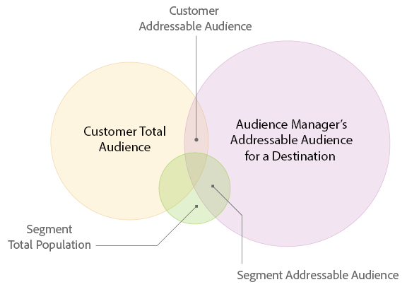

# [!UICONTROL Addressable Audiences] {#addressable-audiences}

Présentation des cas d’ [!UICONTROL Addressable Audience] utilisation et des fonctionnalités.

## Qu’est-ce qu’une [!UICONTROL Addressable Audience]? {#addressable-audience-description}

La [!UICONTROL Addressable Audiences] fonction vous montre le chevauchement entre les audiences que vous voyez sur toutes vos propriétés où [!DNL Audience Manager] collecte des données et la destination sélectionnée. Pour vous aider à comprendre ce concept, jetez un coup d&#39;oeil à l&#39;illustration ci-dessous. Le chevauchement entre chaque cercle représente les différents types d&#39;audiences adressables.

| Mesure | Description |
|---|---|
| [!UICONTROL Audience Manager Addressable Audience] pour un [!UICONTROL Destination] | Nombre de tous les périphériques qui ont interagi avec tous les [!DNL Audience Manager] clients au niveau de la plate-forme au cours de la période de rétrospective du rapport et qui ont pu être mis en correspondance avec votre choix [!UICONTROL destination].   Cette mesure est utile car elle vous montre : <ul><li>Taille du total [!UICONTROL addressable audience] pouvant [!DNL Audience Manager] atteindre un ciblage particulier [!UICONTROL destination].</li><li>La taille du pool de [!DNL Audience Manager] profils pour une plateforme de ciblage et la taille de leurs audiences.</li></ul> |
| [!UICONTROL Customer Total Audience] | Nombre de périphériques qui ont réalisé une [!UICONTROL rule-based trait] sur vos propriétés ou une [!UICONTROL onboarded trait] à partir de vos fichiers hors ligne pendant la fenêtre de recherche. |
| [!UICONTROL Addressable Audience Match Rate] | Nombre de chevauchements de périphériques qui ont réalisé un ou [!UICONTROL rule-based trait] un ou plusieurs niveaux au cours de la fenêtre de retour arrière et de périphériques pour lesquels nous avons synchronisé un identifiant avec le ou les périphériques sélectionnés [!UICONTROL onboarded trait] [!UICONTROL destination] , quelle que soit l&#39;heure de la synchronisation.  Cette mesure représente les périphériques qui :<ul><li>Have realized either a [!UICONTROL rule-based] or an [!UICONTROL onboarded trait] during the look-back window `AND`</li><li>Have an ID sync with the chosen [!UICONTROL destination] regardless of the time of syncs.</li> |
| [!UICONTROL Customer Match Rate] | [!UICONTROL Customer Addressable Audience] : [!UICONTROL Customer Total Audience] exprimé en pourcentage. |
| [!UICONTROL Total Segment Population] | Nombre de tous les périphériques qui ont été membres de votre [!UICONTROL segment] équipe pendant la période de recherche en arrière du rapport. |
| [!UICONTROL Segment Addressable Audience] | The number of users who have belonged to the [!UICONTROL segment] during the report look-back period and have an active ID sync on your site. [!UICONTROL Segments] peuvent inclure vos propres données propriétaires et vos propres données propriétaires et tierces, via [!UICONTROL traits] une acquisition dans l’ [Audience Marketplace](../features/audience-marketplace/marketplace-data-buyers/marketplace-data-buyers.md).   Conseil : Lorsqu’elle est utilisée avec la période de recherche en amont d’un jour, cette mesure peut vous aider à comprendre l’état actuel de votre [!UICONTROL segments]application. Cela est dû au fait que la [!UICONTROL Segment Addressable Audience] mesure représente les utilisateurs qui sont restés dans une [!UICONTROL segment] journée au cours de la journée précédente. Combinez cela au fait que [!DNL Audience Manager] s’actualise [!UICONTROL Addressable Audiences] quotidiennement, en combinant cette mesure et cette période de recherche, vous obtenez l’instantané le plus à jour de votre [!UICONTROL segments]activité. |
| [!UICONTROL Segment Match Rate] | [!UICONTROL Segment Addressable Audience] : [!UICONTROL Total Segment Population] exprimé en pourcentage. |

## [!UICONTROL Addressable Audiences] Interface {#addressable-audience-interface}

Cette [!UICONTROL Addressable Audience] caractéristique transforme ce concept abstrait en données quantifiables. Dans [!DNL Audience Manager]cette fonction, les audiences se chevauchent avec les visualisations de données qui fournissent des informations en un coup d’oeil ainsi que des données numériques sous forme de tableau.

[!UICONTROL Addressable Audiences] se trouve dans **[!UICONTROL Audience Data > Destinations]**. Sélectionnez cette option **[!UICONTROL Integrated Platforms > Device-Based]** pour afficher les mesures d’audiences adressables.

Les trois mesures que vous pouvez voir sur le [!UICONTROL Addressable Audiences] landing page représentent :

| Mesure | Description |
---------|----------|
| **[!UICONTROL Addressable Audience (Device)]** | Cette mesure représente la [!UICONTROL Customer Addressable Audience] (décrite dans le tableau ci-dessus) *pour les 30 derniers jours.* |
| **[!UICONTROL Match Rate]** | Cette mesure représente la [!UICONTROL Addressable Audience Match Rate] (décrite dans le tableau ci-dessus) *pour les 30 derniers jours*. |
| **[!UICONTROL Lifetime Addressable Audience (Device)]** | Nombre de tous les périphériques qui ont interagi avec tous les [!DNL Audience Manager] clients au niveau de la plate-forme au cours de la période de rétrospective du rapport et qui peuvent correspondre à cette [!UICONTROL destination]période. Voir Mesures [de niveau](/help/using/features/addressable-audiences.md#platform-level-metrics) Platform pour en savoir plus. |

Cliquez sur le nom d&#39;un [!UICONTROL server-to-server destination] pour vue vos données d&#39;audience adressables. Remarque : cette fonctionnalité renvoie des données pour [!UICONTROL server-to-server destinations] uniquement et l’accès nécessite des autorisations d’administrateur.

La révision de ces données peut vous aider à :

* **Prévisions et planification :** [!UICONTROL Segment Addressable Audience] les données vous donnent plus de granularité dans les segments que vous prévoyez d’envoyer à une destination pour le ciblage et l’activation des audiences.

* **Évaluations de performances :** Cette [!UICONTROL Addressable Audiences] fonctionnalité est également un outil de dépannage. Il vous permet d’examiner les performances des campagnes, de comprendre la portée des campagnes et de vérifier avec les partenaires de ciblage/d’activation si vous ne voyez pas les résultats attendus.

### Prospection avec des données tierces et implications pour les taux de correspondance

Avant d’acheter des données tierces pour l’acquisition d’audiences, les clients peuvent valider le chevauchement avec d’autres fournisseurs de données. Cela peut vous aider à prendre une décision éclairée avant d&#39;acheter de nouvelles données. La synchronisation des identifiants pour les données tierces achetées repose non seulement sur le chevauchement de vos données, mais également sur les empreintes des fournisseurs tiers par rapport à tous les autres [!DNL Audience Manager] clients. Votre [!DNL Adobe] consultant peut vous aider à identifier d’autres sources de données pertinentes pour optimiser les campagnes de prospection.

### Utilisateurs mobiles et taux de correspondance

Il existe des lacunes lors de la tentative de connexion [!DNL Safari] d’utilisateurs d’applications mobiles lorsqu’il n’y a pas de tiers [!DNL cookies] présents. Il est donc difficile de synchroniser les utilisateurs avec certains partenaires, car seuls les [!DNL Adobe] identifiants des tiers synchronisés [!DNL cookies] sont fournis dans les logs de diffusion multimédias. C’est la raison pour laquelle vous pouvez constater des taux [de correspondance](../features/addressable-audiences.md#low-match-rates) faibles pour votre [!UICONTROL destinations]groupe.

## Plages de dates dans [!UICONTROL Addressable Audiences] et [!UICONTROL Destinations] {#date-ranges}

Lisez les sections ci-dessous pour connaître les plages de dates disponibles et la façon dont les données s’échelonnent au-delà de chaque intervalle dans les rapports pour une période [!UICONTROL Addressable Audience] ou [!UICONTROL Destination].

## Plages de dates et fuseaux horaires disponibles {#available-date-ranges}

<!-- addressable-audience-dates.xml -->

Les rapports pour vos [!UICONTROL Addressable Audiences] et [Destinations](../features/destinations/destinations.md) utilisent les mêmes intervalles de plage de dates. Les options de plage de dates sont les suivantes :

* [!UICONTROL Last 1 Day] (Cet intervalle s’étend de minuit à minuit de la période précédente de 24 heures. Il ne s’agit pas d’une mesure en temps réel ou en cours.)
* [!UICONTROL Last 7 Days]
* [!UICONTROL Last 14 Days]
* [!UICONTROL Last 30 Days]
* [!UICONTROL Last 60 Days]
* [!UICONTROL Last 90 Days]
* [!UICONTROL Lifetime]

Toutes les dates et plages de dates sont définies dans le [!DNL UTC] fuseau horaire. See [Time Zones in Audience Manager](../reference/aam-time-zones.md).

## Données dans les intervalles de plage de dates {#date-range-intervals}

Les [!UICONTROL Addressable Audience] mesures et [!UICONTROL Destination] les mesures renvoient un nombre d’utilisateurs uniques pour l’intervalle de temps sélectionné. Par exemple, un visiteur n’est comptabilisé qu’une seule fois, même s’il vient plusieurs fois sur votre site. La première visite est la visite unique et est enregistrée. Les visites suivantes reviennent sur le site et ne sont pas comptabilisées car elles ne sont pas uniques.

Les plages de dates contiennent des données pour l’intervalle de temps sélectionné ou plus ancien. De plus, les données vieillissent au fil de chaque intervalle de rapport au fil du temps. Supposons, par exemple, que vous voyiez 2 visiteurs après avoir choisi l’ [!UICONTROL Last 30 Days] option. Dans les rapports, ces visiteurs :

* *Sera* inclus dans les résultats renvoyés par les intervalles de temps plus longs (60 jours, 90 jours et Durée de vie).
* *Ne sera pas* inclus dans les intervalles plus courts qui précèdent l’ [!UICONTROL Last 30 Day] option (Actuel, 7 et 14 jours).

Et, au 31° jour, ces visiteurs n&#39;apparaissent que dans les 60, 90 jours, et les [!UICONTROL Lifetime] résultats. Ils ont vieilli sur l&#39;intervalle de 30 jours. Les Visiteurs ne vieillissent pas en dehors de l&#39; [!UICONTROL Lifetime] intervalle.

## [!UICONTROL Addressable Audiences] Mesures {#addressable-audience-metrics}

Cette section décrit les types de mesures fournis par [!UICONTROL Addressable Audiences].

### Mesures au niveau du client {#customer-level-metrics}

<!-- addressable-audience-metrics.xml -->

Ces mesures renvoient des données pour les caractéristiques réalisées lorsque des visiteurs se rendent sur votre site ou lorsque vous envoyez des fichiers de données entrants à [!DNL Audience Manager]. Ces mesures fournissent une vue complète de la taille de l’audience pour votre compte.

| Mesure | Description |
|---|---|
| [!UICONTROL Customer Addressable Audience] | Nombre de chevauchements de périphériques qui se sont produits au cours de la fenêtre [!UICONTROL rule-based trait] ou d&#39;une [!UICONTROL onboarded trait] fenêtre de retour arrière et de périphériques sur lesquels nous avons synchronisé un identifiant avec la destination choisie, quel que soit le moment de la synchronisation.  Cette mesure représente les périphériques qui :<ul><li>Have realized either a [!UICONTROL rule-based] or an [!UICONTROL onboarded trait] during the look-back window `AND`</li><li>Have an ID sync with the chosen [!UICONTROL destination] regardless of the time of syncs.</li></ul> |
| [!UICONTROL Customer Total Audience] | Nombre de périphériques qui ont réalisé une [!UICONTROL rule-based trait] sur vos propriétés ou une [!UICONTROL onboarded trait] à partir de vos fichiers hors ligne pendant la fenêtre de recherche. |
| [!UICONTROL Customer Match Rate] | [!UICONTROL Customer Addressable Audience] : [!UICONTROL Customer Total Audience] exprimé en pourcentage. |

### Mesures de correspondance au niveau du segment {#segment-level-metrics}

Ces mesures renvoient des données sur [!UICONTROL segment] l’adhésion. Ils vous aident à obtenir une vue plus précise et plus précise de la taille de l&#39;audience pour chacun de vos [!UICONTROL segments]produits.

>[!NOTE]
>
>La manière dont la fenêtre de retour en arrière est appliquée au [!UICONTROL segment] niveau est différente de celle appliquée au niveau client. Les Visiteurs peuvent venir sur le site et réaliser qu&#39;il y a [!UICONTROL trait] 10 jours, et ils pourraient se qualifier pour un an [!UICONTROL segment] depuis et ont abandonné il y a [!UICONTROL segment] 2 jours. Lorsque la recherche en amont de 7 jours est appliquée, ces visiteurs sont comptabilisés au [!UICONTROL segment] niveau mais pas au niveau du client.

| Mesure | Description |
|---|---|
| [!UICONTROL Segment Addressable Audience] | The number of users who have belonged to the [!UICONTROL segment] during the report look-back period and have an active ID sync on your site. Segments can include your own first-party data and second party and third party data, via [!UICONTROL traits] acquired in the [Audience Marketplace](../features/audience-marketplace/marketplace-data-buyers/marketplace-data-buyers.md).  Conseil : Lorsqu’elle est utilisée avec la période de recherche en amont d’un jour, cette mesure peut vous aider à comprendre l’état actuel de votre [!UICONTROL segments]application. Cela est dû au fait que la [!UICONTROL Segment Addressable Audience] mesure représente les utilisateurs qui sont restés dans une [!UICONTROL segment] journée au cours de la journée précédente. Combinez cela au fait que [!DNL Audience Manager] s’actualise [!UICONTROL Addressable Audiences] quotidiennement, en combinant cette mesure et cette période de recherche, vous obtenez l’instantané le plus à jour de votre [!UICONTROL segments]activité. |
| [!UICONTROL Total Segment Population] | Nombre de tous les périphériques qui ont été membres de votre [!UICONTROL segment] équipe pendant la période de recherche en arrière du rapport. |
| [!UICONTROL Segment Match Rate] | [!UICONTROL Segment Addressable Audience] : [!UICONTROL Total Segment Population] exprimé en pourcentage. |

### Mesures de niveau Platform {#platform-level-metrics}

Cette mesure renvoie des données sur les activités collectées pour tous les [!DNL Audience Manager] clients. Elles peuvent fournir une vue plus large de l&#39;audience du client par rapport aux [!DNL Audience Manager] clients agrégés.

| Mesure | Description |
|---|---|
| [!DNL Audience Manager] [!UICONTROL Addressable Audience] | Nombre de tous les périphériques qui ont interagi avec tous les [!DNL Audience Manager] clients au niveau de la plate-forme au cours de la période de rétrospective du rapport et qui ont pu être mis en correspondance avec votre choix [!UICONTROL destination].   Cette mesure est utile car elle vous montre :<ul><li>Taille de la [!UICONTROL total addressable audience] cible [!DNL Audience Manager] pouvant être atteinte sur une destination de ciblage particulière.</li><li>La taille du pool de [!DNL Audience Manager] profils pour une plateforme de ciblage et la taille de leurs audiences.</li></ul> |

## Comparaison [!UICONTROL Customer] et [!UICONTROL Segment Addressable Audiences] {#comparing-metrics}

Vous ne devriez pas comparer les [!UICONTROL Customer Addressable Audience] mesures et [!UICONTROL Segment Addressable Audience] les mesures pour déterminer si l’une est plus significative que l’autre. Il s’agit de mesures distinctes, différentes et indépendantes. Comme indiqué dans les définitions ci-dessus, chacune de ces variables est dérivée de différents ensembles de données. Dans ce contexte, évitez de tirer des conclusions si une mesure est supérieure à l’autre. Tout ce que vous pouvez dire en comparant ces éléments est :

* [!UICONTROL Customer Addressable Audiences] est basée sur [!UICONTROL trait] des réalisations *pour vos propres données* propriétaires. Cette mesure fournit une vue large et complète de votre intégration à un partenaire de données.

* [!UICONTROL Segment Addressable Audiences] repose sur les qualifications des segments *pour vos propres données propriétaires, ainsi que sur les données* tierces et secondaires. Cette mesure fournit une vue granulaire et plus précise de votre [!UICONTROL addressable audiences] contenu dans une plateforme de ciblage.

## Causes des taux de faible correspondance pour [!UICONTROL Addressable Audiences] {#low-match-rates}

Éléments communs à l&#39;origine de faibles taux de [!UICONTROL Addressable Audience] correspondance ou d&#39;écarts dans les chiffres signalés.

| Cause | Description |
|---|---|
| Trafic mobile | La plupart des [!UICONTROL server-to-server] intégrations reposent sur des processus de synchronisation facilités par des tiers [!DNL cookies]. Cependant, les environnements mobiles n’utilisent pas de tiers [!DNL cookies]. Par conséquent, vos [!UICONTROL Addressable Audiences] nombres peuvent sembler faibles par rapport à [!UICONTROL segment] la taille.   Depuis janvier 2018, vous pouvez activer les audiences mobiles dans les mêmes [!DNL Google] et [!DNL Adobe Advertising Cloud] destinations configurées pour les [!UICONTROL cookie-based] audiences. Bien que cela signifie que vous pouvez envoyer [!UICONTROL segments] avec l’appartenance à un ID combiné [!DNL cookie] et mobile à vos [!DNL Google][!DNL Advertising Cloud] destinations et à vos destinations, gardez à l’esprit que cela [!UICONTROL Addressable Audiences] n’affiche que le chevauchement entre [!DNL cookie] les identifiants et les destinations. [!DNL Audience Manager] envoie 100 % des audiences mobiles à [!UICONTROL destinations], mais les audiences mobiles ne sont pas mesurées par la [!UICONTROL Addressable Audience] mesure.   **Remarque **: Par exemple, prenez une[!UICONTROL segment]population de 1 000 000 habitants. Si vous mappez cette[!UICONTROL segment]carte à une[!DNL Google]destination ou à une[!DNL Adobe Advertising Cloud]destination, vous verrez peut-être un[!UICONTROL Addressable Audience]de 700 000 périphériques et un[!UICONTROL Match Rate]de 70 %. Les 700 000 membres sont constitués d’[!DNL cookie]identifiants synchronisés avec le[!UICONTROL destination]système. Il[!UICONTROL Addressable Audience]se peut en fait que votre nombre d’identifiants mobiles adressables n’apparaisse pas dans cette mesure. |
| [!DNL Safari] Trafic | [!DNL Safari] bloque des tiers [!DNL cookies]. Ceci empêche [!DNL Audience Manager] la synchronisation des identifiants avec le [!UICONTROL destination]. Avec l&#39;introduction de [ITP 2.0](https://webkit.org/blog/8311/intelligent-tracking-prevention-2-0/), vous pouvez vous attendre à ce que vous [!UICONTROL addressable audiences] n&#39;incluiez pas [!DNL Safari] d&#39;utilisateurs. |
| Impressions de médias suivies | En raison des bonnes pratiques du serveur d’annonces, les synchronisations d’ID ne sont pas effectuées dans les balises d’annonce. Les clients qui effectuent une grande quantité de publicité hors site ne synchronisent pas les utilisateurs avec les intégrations tierces dans ces environnements. En outre, une grande quantité de données d’impression des médias collectées pourrait réduire [!UICONTROL addressable audience] les chiffres. |

## Dépannage avec [!UICONTROL Addressable Audiences] {#troubleshooting}

Outre les taux de correspondance de surface, vous pouvez également utiliser [!UICONTROL Addressable Audiences] comme outil de dépannage.

Supposons, par exemple, que vous envoyiez un segment à un [!UICONTROL destination] et que [!UICONTROL destination] les chiffres de rapports soient faibles. Si vous vérifiez les [!UICONTROL Addressable Audience] résultats, vous verrez s&#39;il s&#39;agit d&#39;un problème technique ou simplement d&#39;un cas de faible taux de correspondance. Un faible taux de correspondance indique que votre [!UICONTROL destination] n’est pas si intéressant pour les segments sélectionnés. Cependant, une différence de [!UICONTROL total addressable audience] nombre entre [!DNL Audience Manager] et le [!UICONTROL destination] indique un problème d’intégration, de synchronisation ou autre problème technique. Dans ce cas, contactez votre gestionnaire de compte.
