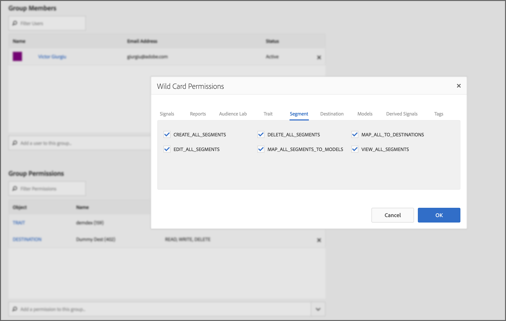

# [!UICONTROL Administration] (Commandes RBAC) {#administration}

Les options du [!UICONTROL Administration] menu permettent de créer des utilisateurs d’Audience Manager et de les affecter à des groupes. Vous pouvez également définir des limites de vue (caractéristiques, segments, destinations et modèles).

Les clients d’entreprise qui utilisent [!DNL Audience Manager] une plateforme de data Management pour toutes leurs données doivent être en mesure de contrôler la visibilité des différents éléments de données sur des unités commerciales spécifiques. Pour ce faire, vous pouvez utiliser des autorisations de groupe, également appelées [!UICONTROL Role-Based Access Control] ([!UICONTROL RBAC]).

[!DNL Audience Manager] utilise des groupes pour attribuer des autorisations. Les autorisations ne sont pas attribuées au niveau de l’utilisateur. Les permissions de groupe sont liées aux objets ([!UICONTROL traits], segments, etc.) et aux actions que vous pouvez effectuer sur ces objets (modification, vue, etc.). Ces commandes sont également disponibles via les API REST d’Audience Manager. Voir les méthodes [User Management](/help/using/api/rest-api-main/aam-api-user-group-permission/aam-api-user.md), [Group Management](/help/using/api/rest-api-main/aam-api-user-group-permission/aam-api-group.md)et [Permissions Management](/help/using/api/rest-api-main/aam-api-user-group-permission/aam-api-permissions.md) API.

## Create Users {#create-users}

<!-- t_create_users.xml -->

Créez des utilisateurs dans [!DNL Audience Manager] et spécifiez des détails d’utilisateur, l’état de connexion et l’affectation d’utilisateurs à des groupes.

1. Cliquez sur **[!UICONTROL Administration]** > **[!UICONTROL Users]**.
1. Cliquez sur  pour afficher la [!UICONTROL Create New User] page.
1. Under **[!UICONTROL User Details]**, fill in the fields:
   * **[!UICONTROL Username]:**Indiquez un nom d’utilisateur unique pour l’Audience Manager.
   * **[!UICONTROL First Name]:**Indiquez le prénom de l’utilisateur.
   * **[!UICONTROL Last Name]:**Indiquez le nom de famille de l’utilisateur.
   * **[!UICONTROL Email Address]:**Indiquez l’adresse électronique de l’utilisateur.[!DNL Audience Manager]n’envoie pas de notification régulière aux utilisateurs.[!DNL Audience Manager]les administrateurs ont accès aux adresses électroniques des utilisateurs et peuvent envoyer manuellement des messages électroniques aux utilisateurs si nécessaire. Par exemple, si un utilisateur oublie son mot de passe, l’adresse électronique indiquée dans ce champ est utilisée pour envoyer un mot de passe temporaire et des instructions pour réinitialiser le mot de passe.
   * **[!UICONTROL Phone Number]:**Indiquez le numéro de téléphone de l’utilisateur.
   * **[!UICONTROL Is Admin]:**Indiquez si cet utilisateur est un[!DNL Audience Manager]administrateur. Les administrateurs peuvent gérer les utilisateurs (créer, modifier, etc.) et les groupes (créer, attribuer des autorisations, etc.). Les utilisateurs non administrateurs ne peuvent contrôler que leurs propres profils d’utilisateurs, y compris la modification de leurs adresses électroniques et la réinitialisation de leurs propres mots de passe. Pour plus d’informations, voir[Modifier les paramètres](../../features/administration/edit-account-settings.md)de votre compte.
1. Sous **[!UICONTROL Login]**, sélectionnez un état :
   * **[!UICONTROL Active]:**Les utilisateurs actifs peuvent accéder[!DNL Audience Manager]et disposer des autorisations accordées par l’appartenance à un groupe.
   * **[!UICONTROL Deactivated]:**Les utilisateurs désactivés ne peuvent pas accéder[!DNL Audience Manager]et ne disposent d’aucune autorisation. Si vous désactivez des utilisateurs, leurs informations d’utilisateur restent présentes[!DNL Audience Manager]et vous pouvez les réactiver simplement, si nécessaire. Si vous supprimez des utilisateurs, vous devez les recréer s’ils doivent être réutilisés[!DNL Audience Manager]ultérieurement.
   * **[!UICONTROL Expired]:**Le mot de passe d’un utilisateur a plus de 90 jours.
   * **[!UICONTROL Pending]:**L’utilisateur dispose d’un mot de passe temporaire, soit après la réinitialisation d’un mot de passe, soit en tant que nouveau compte, et il n’a pas encore défini de mot de passe permanent.
   * **[!UICONTROL Locked Out]:**5 tentatives de connexion incorrectes verrouilleront un utilisateur.
1. Sous **[!UICONTROL Assigned Groups]**, dans la liste déroulante, sélectionnez les groupes auxquels vous souhaitez affecter cet utilisateur.
Pour plus d’informations sur les groupes et les autorisations, voir [Création d’un groupe](../../features/administration/administration-overview.md#create-group).
1. Cliquez sur **[!UICONTROL Save]**.

## Créez un [!UICONTROL Group] {#create-group}

Un *groupe* est un ensemble d’utilisateurs qui partagent des droits d’accès à [!UICONTROL destination]des objets, [!UICONTROL segment]et des [!UICONTROL trait] objets. Vous pouvez limiter les groupes à des objets uniques ou leur donner un large accès à des combinaisons d’objets différents.

<!-- t_create_groups.xml -->

Création d’un groupe:

1. Cliquez sur **[!UICONTROL Administration]** > **[!UICONTROL Groups]**.
1. Cliquez sur  pour ouvrir la [!UICONTROL Group Settings] page.
1. Dans [!UICONTROL Group Details]:
   * Nommez le groupe.
   * Fournissez une brève description du groupe.
1. Dans [!UICONTROL Group Members], cliquez sur un utilisateur à partir **[!UICONTROL Add Users]** des options pour les ajouter au groupe.
1. Dans [!UICONTROL Group Permissions], sélectionnez une [caractéristique](../../features/traits/trait-details-page.md), un [segment](../../features/segments/segments-purpose.md)ou une [destination](../../features/destinations/destinations.md) dans .
**[!UICONTROL Add Object]**
Cette opération ouvre une fenêtre d&#39;autorisations pour l&#39;objet sélectionné.
1. Cochez la case correspondant aux autorisations que vous souhaitez que les membres du groupe possèdent.
1. *(Facultatif)* Attribuez des autorisations [de carte](../../features/administration/administration-overview.md#wild-card-permissions) générique au groupe.
1. Cliquez sur **[!UICONTROL Save Group]**.

## Compréhension [!UICONTROL Wild Card Permissions] {#wild-card-permissions}

Simplifiez la gestion des droits de groupe avec [!UICONTROL Wild Card Permissions].

<!-- c_wildcard_permissions.xml -->

[!UICONTROL Wild Card Permissions] donnent aux membres du groupe un accès automatique à chaque source de données associée à une source [!UICONTROL segment], [!UICONTROL destination]ou [!UICONTROL trait]. Par comparaison, les autorisations régulières ne vous permettent d’affecter que des autorisations spécifiques [!UICONTROL data sources] à l’un de ces objets. Et, lorsque vous ajoutez de nouvelles sources [!UICONTROL data sources], les membres du groupe n&#39;ont pas accès à ces nouvelles sources.

Vous devez ouvrir les autorisations de groupe et les affecter [!UICONTROL data sources] au groupe. [!UICONTROL Wild Card Permissions] évitez ce processus de [!UICONTROL data source] mise à jour manuelle. Les groupes qui [!UICONTROL Wild Card Permissions] ont accès à de nouvelles [!UICONTROL data sources] informations sans autorisation explicite.

Lisez ci-dessous la description de chaque [!UICONTROL wildcard permission] signification :

**[!UICONTROL Trait]**

* `MAP_ALL_TRAITS_TO_MODELS` - Les utilisateurs peuvent sélectionner [!UICONTROL traits] comme ligne de base pour [!UICONTROL models].
* `EDIT_ALL_TRAITS` - Les utilisateurs peuvent modifier toutes les [!UICONTROL traits] configurations configurées dans leur compte de société.
* `VIEW_ALL_TRAITS` - Les utilisateurs peuvent vue tous les éléments [!UICONTROL traits] configurés dans leur compte de société.
* `DELETE_ALL_TRAITS` - Les utilisateurs peuvent supprimer tous les éléments [!UICONTROL traits] configurés dans leur compte de société.
* `CREATE_ALL_ALGO_TRAITS` - Les utilisateurs peuvent créer [!UICONTROL algorithmic traits].
* `MAP_ALL_TO_SEGMENTS` - Les utilisateurs peuvent ajouter n&#39;importe quel [!UICONTROL traits] membre de leur société à [!UICONTROL segments].
* `CREATE_ALL_TRAITS` - Les utilisateurs peuvent créer [!UICONTROL traits].

**[!UICONTROL Reports]**

* `PTRREPORTS` - Ceci [!UICONTROL wildcard permission] fait référence à des fonctionnalités obsolètes et sera supprimé sous peu de l&#39;interface utilisateur de l&#39;Audience Manager.

**[!UICONTROL Models]**

* `VIEW_MODELS` - Les utilisateurs ont la permission de vue [!UICONTROL models] appartenant à leur société.

**[!UICONTROL Derived Signals]**

* `VIEW_DERIVED_SIGNALS` - Les utilisateurs peuvent vue tous les [!UICONTROL derived signals] membres de leur société.
* `CREATE_DERIVED_SIGNALS` - Les utilisateurs peuvent créer [!UICONTROL derived signals].
* `EDIT_DERIVED_SIGNALS` - Les utilisateurs peuvent modifier tous les éléments [!UICONTROL derived signals] appartenant à leur société.
* `DELETE_DERIVED_SIGNALS` - Les utilisateurs peuvent supprimer n&#39;importe quel élément [!UICONTROL derived signals] appartenant à leur société.

**[!UICONTROL Destination]**

* `EDIT_ALL_DESTINATIONS` - Les utilisateurs peuvent modifier toutes les [!UICONTROL destinations] configurations de leur compte de société.
* `CREATE_DESTINATIONS` - Les utilisateurs peuvent créer [!UICONTROL destinations].
* `VIEW_ALL_DESTINATIONS` - Les utilisateurs peuvent vue toutes les [!UICONTROL destinations] configurations de leur compte de société.
* `DELETE_ALL_DESTINATIONS` - Les utilisateurs peuvent supprimer tous les éléments [!UICONTROL destinations] configurés dans leur compte de société.

**[!UICONTROL Tags]**

* `VIEW_TAGS` - Les utilisateurs peuvent tout faire (vue, créer, modifier, supprimer) sur leur [!UICONTROL Tag Containers]site.

**[!UICONTROL Audience Lab]**

* `MANAGE_SEGMENT_TEST_GROUPS` - Les utilisateurs peuvent faire tout ce qui est en leur pouvoir (vue, création, modification, suppression) sur leurs groupes de [!UICONTROL Audience Lab] tests.

**[!UICONTROL Segment]**

* `CREATE_ALL_SEGMENTS` - Les utilisateurs peuvent créer des segments.
* `DELETE_ALL_SEGMENTS` - Les utilisateurs peuvent supprimer tous les segments configurés dans leur compte de société.
* `MAP_ALL_TO_DESTINATIONS` - Les utilisateurs peuvent mapper n’importe quel segment appartenant à leur société vers des destinations.
* `EDIT_ALL_SEGMENTS` - Les utilisateurs peuvent modifier tous les segments configurés dans leur compte de société.
* `MAP_ALL_SEGMENTS_TO_MODELS` - Les utilisateurs peuvent sélectionner des segments comme référence pour les modèles.
* `VIEW_ALL_SEGMENTS` - Les utilisateurs peuvent vue tous les segments configurés dans leur compte de société.

**[!UICONTROL Signals]**

* `VIEW_ALL_SIGNALS` - Les utilisateurs peuvent vue tous les signaux capturés dans [Data Explorer](/help/using/features/data-explorer/data-explorer-overview.md).

## Cas d’utilisation {#use-cases}

### Contrôle de l&#39;accès utilisateur {#monitoring-user-access}

[!UICONTROL Role-Based Access Control] peut vous aider à surveiller l’état de connexion de l’utilisateur, en vous donnant une idée claire de qui peut accéder à votre instance d’Audience Manager.

En fonction des besoins de votre entreprise, vous pouvez activer et désactiver les comptes d’utilisateurs si nécessaire.

### Garantir la protection d&#39;accès pour les utilisateurs sensibles [!UICONTROL Data Sources] {#protect-sensitive-data-sources}

Vous pouvez configurer [!UICONTROL Role-Based Access Control] au niveau [!UICONTROL trait], segment et [!UICONTROL destination] au niveau de chaque groupe d’utilisateurs.

Cette fonctionnalité vous permet de gérer la manière dont vos utilisateurs vue, créent, lisent, écrivent et modifient des jeux de données spécifiques, et même de limiter l&#39;accès des utilisateurs aux jeux de données qui ne devraient pas leur être accessibles.

