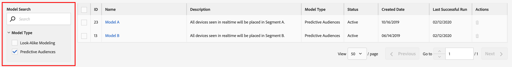

# Rapports des audiences prédictives

Après avoir enregistré un modèle [!UICONTROL Predictive Audiences], l’Audience Manager commence à l’entraîner. Dans quelques heures, le modèle calculé commencera à analyser les audiences sur les [serveurs de collecte de données](https://experienceleague.adobe.com/docs/audience-manager/user-guide/reference/system-components/components-data-collection.html#dcs-pcs). Les rapports seront disponibles le lendemain.

Pour afficher les résultats de votre classification [!UICONTROL Predictive Audiences], accédez à **[!UICONTROL Audience Data]** > **[!UICONTROL Models]**, puis cliquez sur votre modèle dans la liste.

Utilisez les options de filtrage situées à gauche pour rechercher le nom du modèle ou filtrer les résultats selon le type de modèle.

Le tableau des modèles présente les informations suivantes :

* **[!UICONTROL ID]**: l’ID de modèle identifie de manière unique chaque modèle de votre compte d’Audience Manager ;
* **[!UICONTROL Name]**: le nom que vous avez fourni à l’étape de création du modèle ;
* **[!UICONTROL Description]**: la description que vous avez fournie à l’étape de création du modèle ;
* **[!UICONTROL Model Type]**: le type de chaque modèle ([!UICONTROL Look-Alike Modeling]  ou  [!UICONTROL Predictive Audiences]) ;
* **[!UICONTROL Status]**: l’état de chaque modèle :
   * **[!UICONTROL Pending]**: le modèle est en cours d&#39;initialisation et commencera bientôt à produire des résultats;
   * **[!UICONTROL Active]**: le modèle fonctionne correctement et produit des résultats ;
   * **[!UICONTROL Warning]**: le modèle n’a pas produit de résultats en raison d’un manque de données (c’est-à-dire une population de lignes de base faible, les profils utilisateur ne sont pas riches);
   * **[!UICONTROL Error]**: l’exécution du modèle a échoué. Vous devriez contacter votre représentant Adobe.

## Rapport Aperçu d’un modèle{#model-report}

Une fois que vous avez sélectionné un modèle, sa page de création de rapports se charge. En haut de la page, vous pouvez voir les 5 segments prédictifs les plus grands, en fonction de la prise de conscience en temps réel d’une journée, selon laquelle le modèle a classé votre audience cible en fonction de . La catégorie **[!UICONTROL Other]** inclut le reste des personas, qui n’étaient pas incluses dans les 5 segments prédictifs les plus grands.

L’Audience Manager affiche à la fois un graphique en anneau avec code-couleur et un graphique de chronologie pour votre [!UICONTROL Predictive Audiences].

Cliquez sur les onglets de personnages en haut de la page pour les ajouter ou les supprimer du graphique et du graphique.

Le graphique en anneau présente une ventilation par personne de votre audience cible, tandis que le graphique présente la tendance de population en temps réel d’un jour de vos segments prédictifs au cours des 6 derniers jours.

Si l’état du modèle est [!UICONTROL Pending], [!UICONTROL Warning] ou [!UICONTROL Error], l’état du modèle s’affiche à la place des graphiques.

Le tableau du rapport présente les informations suivantes pour chaque segment [!UICONTROL Predictive Audiences].

1. **[!UICONTROL SEGMENT ID]**: l’identifiant du segment du segment créé automatiquement associé à chaque persona ;
1. **[!UICONTROL NAME]**: le nom de la personne ;
1. **[!UICONTROL STATUS]**: l’état du  [!UICONTROL Predictive Audiences] segment :
   * **[!UICONTROL Succeeded]**: les utilisateurs sont classés dans ce segment ;
   * **[!UICONTROL Pending]**: le segment est toujours en cours d’initialisation ;
   * **[!UICONTROL Insufficient Training Data]**: les utilisateurs ne sont pas classés dans ce segment en raison de données insuffisantes. La population de base totale est trop faible et ne fournit pas suffisamment de données pour en tirer les leçons.
1. **[!UICONTROL 1 DAY REAL TIME POPULATION]**: Nombre d’réalisations de segment pour chaque personnage, au cours des dernières 24 heures.
1. **[!UICONTROL 1 DAY REAL TIME POPULATION %]**: Pourcentage de réalisations de segment pour chaque persona, sur les dernières 24 heures, par rapport à la population totale de modèles.

## Caractéristiques influentes{#influential-traits}

[!UICONTROL Influential Traits] sont des caractéristiques que l’ [!UICONTROL Predictive Audiences] algorithme a découvertes être les plus solides prédicteurs pour déterminer la classification persona d’un visiteur.

Leur signe indique si la présence de la caractéristique augmente (+) ou diminue (-) la probabilité de l’utilisateur appartenant à la personne sélectionnée.

Pour afficher les caractéristiques d’influence pour toutes vos personas, cliquez sur [!UICONTROL View All Influential Traits].

La fenêtre [!UICONTROL Influential Traits] affiche les informations suivantes, pour chaque persona du modèle sélectionné :

1. **[!UICONTROL TRAIT ID]**: l’identifiant de caractéristique de chaque caractéristique influente pour la personne sélectionnée ;
1. **[!UICONTROL NAME]**: le nom de chaque caractéristique influente pour la personne sélectionnée ;
1. **[!UICONTROL DESCRIPTION]**: la description de chaque caractéristique influente pour la personne sélectionnée ;
1. **[!UICONTROL WEIGHT]**: le poids de chaque caractéristique influente pour le personnage sélectionné. [!UICONTROL Influential Traits] sont triées par défaut par poids, dans l’ordre décroissant.  La valeur des poids indique leur puissance prédictive. Le signe indique si la présence de la caractéristique augmente (+) ou diminue (-) la probabilité d’appartenance à une personne.
1. **[!UICONTROL 30 DAY REAL TIME POPULATION]**: le nombre de réalisations de caractéristiques uniques pour chaque caractéristique influente pour la personne sélectionnée, au cours des 30 derniers jours.
