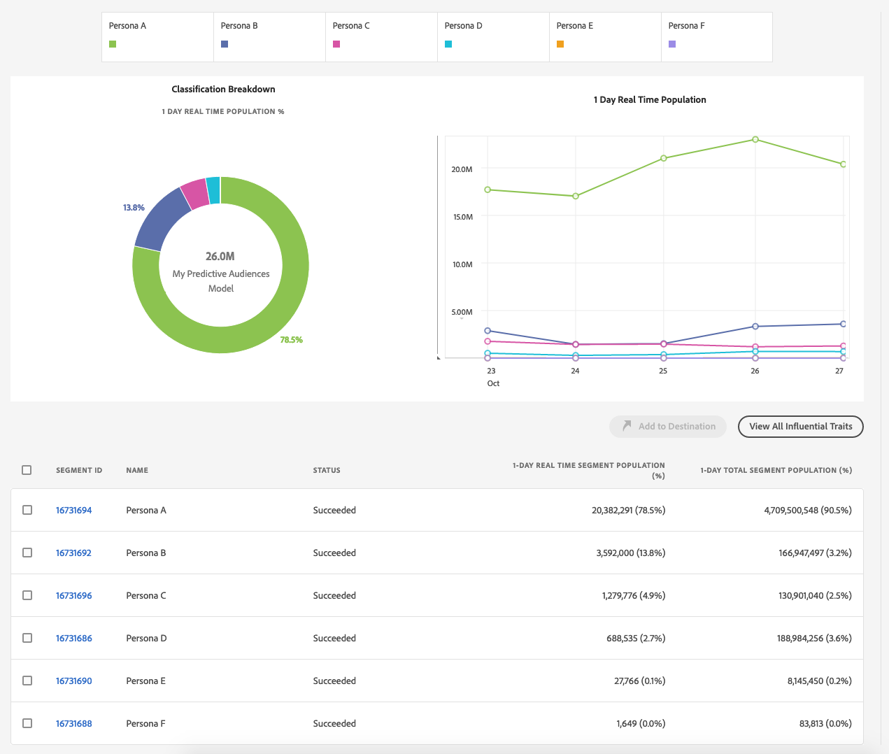

# Rapports des audiences prédictives

Une fois que vous avez enregistré un [!UICONTROL Predictive Audiences] modèle, les débuts d’Audience Manager l’ont formé. En quelques heures, le modèle calculé analysera les audiences sur les serveurs [de collecte de](https://docs.adobe.com/content/help/en/audience-manager/user-guide/reference/system-components/components-data-collection.html#dcs-pcs)données. Le Rapports sera disponible le lendemain.

Pour afficher les résultats de votre [!UICONTROL Predictive Audiences] classification, sélectionnez **[!UICONTROL Audience Data]** > **[!UICONTROL Models]**, puis cliquez sur votre modèle dans la liste.

Utilisez les options de filtrage sur le côté gauche pour rechercher le nom du modèle ou filtrer les résultats en fonction du type de modèle.

Le tableau des modèles présente les informations suivantes :

* **[!UICONTROL ID]**: l&#39;ID de modèle identifie de manière unique chaque modèle de votre compte d&#39;Audience Manager ;
* **[!UICONTROL Name]**: le nom que vous avez fourni à l&#39;étape de création du modèle ;
* **[!UICONTROL Description]**: la description que vous avez fournie à l&#39;étape de création du modèle ;
* **[!UICONTROL Model Type]**: le type de chaque modèle ([!UICONTROL Look-Alike Modeling] ou [!UICONTROL Predictive Audiences]);
* **[!UICONTROL Status]**: l&#39;état de chaque modèle :
   * **[!UICONTROL Pending]**: le modèle est en train d&#39;être initialisé et il aura début de produire des résultats sous peu ;
   * **[!UICONTROL Active]**: le modèle fonctionne correctement et produit des résultats ;
   * **[!UICONTROL Warning]**: le modèle n&#39;a pas produit de résultats en raison de données insuffisantes (c&#39;est-à-dire d&#39;une faible population de référence, les profils utilisateurs ne sont pas riches);
   * **[!UICONTROL Error]**: l&#39;exécution du modèle a échoué. Vous devriez contacter votre représentant d&#39;Adobe.

## Rapport Présentation du modèle{#model-report}

Une fois que vous avez choisi un modèle, sa page de rapports se charge. En haut de la page, vous pouvez voir les 5 principaux segments prédictifs, basés sur la prise de conscience en temps réel d’une journée, selon laquelle le modèle a classé votre audience de cible par. La **[!UICONTROL Other]** catégorie inclut le reste des personnages, qui n&#39;étaient pas inclus dans les 5 principaux segments prédictifs.

L’Audience Manager affiche à la fois un graphique en anneau codé en couleur et un graphique en chronologie pour votre [!UICONTROL Predictive Audiences]graphique.

Un clic sur les onglets de personnages en haut de la page les ajoute ou les supprime du graphique et du graphique.

Le graphique en anneau présente une ventilation personnelle de votre audience de cible, tandis que le graphique présente la tendance de population en temps réel de 1 jour de vos segments prédictifs au cours des 6 derniers jours.

Si l’état du modèle est [!UICONTROL Pending], [!UICONTROL Warning]ou [!UICONTROL Error], l’état du modèle s’affiche à la place des graphiques.

Le tableau du rapport présente les informations suivantes pour chaque [!UICONTROL Predictive Audiences] segment.

1. **[!UICONTROL SEGMENT ID]**: l’identifiant de segment du segment créé automatiquement associé à chaque personne ;
1. **[!UICONTROL NAME]**: le nom de la personne ;
1. **[!UICONTROL STATUS]**: l’état du [!UICONTROL Predictive Audiences] segment :
   * **[!UICONTROL Succeeded]**: les utilisateurs sont classés dans ce segment ;
   * **[!UICONTROL Pending]**: le segment est encore en cours d’initialisation ;
   * **[!UICONTROL Insufficient Training Data]**: les utilisateurs ne sont pas classés dans ce segment en raison de données insuffisantes. La population de base totale est trop faible et ne fournit pas suffisamment de données pour en tirer des enseignements.
1. **[!UICONTROL 1 DAY REAL TIME POPULATION]**: Nombre de réalisations de segment pour chaque personne, au cours des dernières 24 heures.
1. **[!UICONTROL 1 DAY REAL TIME POPULATION %]**: Pourcentage de réalisations de segment pour chaque personne, au cours des dernières 24 heures, sur la population totale du modèle.

## Caractéristiques influentes{#influential-traits}

[!UICONTROL Influential Traits] sont des caractéristiques que l’ [!UICONTROL Predictive Audiences] algorithme a découvert être les plus puissants prédicteurs pour déterminer la classification persona d’un visiteur.

Leur signe indique si la présence de la caractéristique augmente (+) ou diminue (-) la probabilité de l’utilisateur appartenant à la personne sélectionnée.

Pour vue les traits d’influence de toutes vos personnalités, cliquez sur [!UICONTROL View All Influential Traits].

La [!UICONTROL Influential Traits] fenêtre affiche les informations suivantes, pour chaque personne du modèle sélectionné :

1. **[!UICONTROL TRAIT ID]**: l’identifiant de caractéristique de chaque caractéristique influente pour la personne sélectionnée ;
1. **[!UICONTROL NAME]**: le nom de chaque caractéristique influente pour la personne sélectionnée ;
1. **[!UICONTROL DESCRIPTION]**: la description de chaque caractéristique influente pour la personne sélectionnée ;
1. **[!UICONTROL WEIGHT]**: poids de chaque caractéristique influente pour la personne sélectionnée. [!UICONTROL Influential Traits] sont triées par poids par défaut, dans l’ordre décroissant.  La valeur des poids indique leur puissance prédictive. Le signe indique si la présence de la caractéristique augmente (+) ou diminue (-) la probabilité d&#39;appartenance à une personne.
1. **[!UICONTROL 30 DAY REAL TIME POPULATION]**: nombre de réalisations de caractéristiques uniques pour chaque caractéristique influente pour la personne sélectionnée, au cours des 30 derniers jours.
