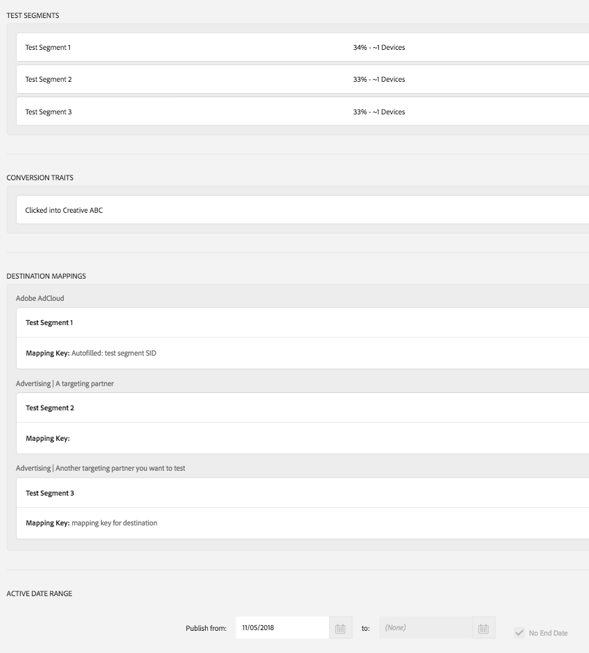
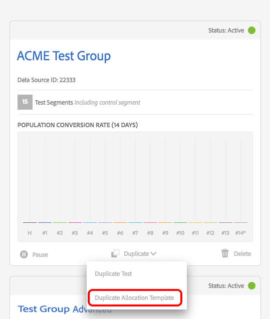
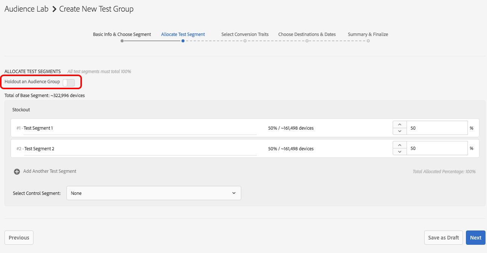
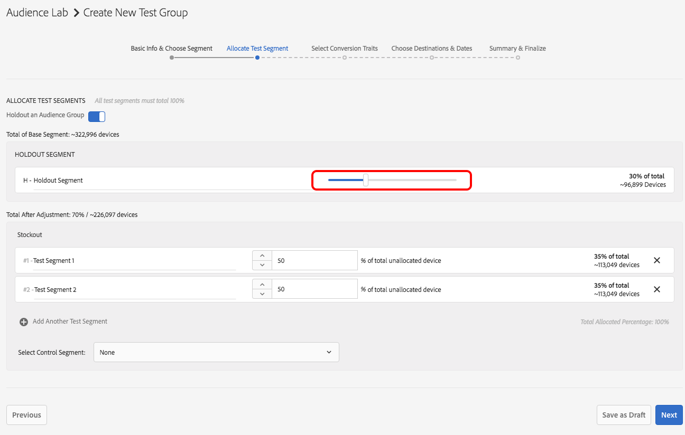

# Fonctionnalité avancée [!DNL Audience Lab] {#audience-lab-advanced-functionality}

Cet article décrit deux fonctionnalités avancées pour [!DNL Audience Lab] : [!DNL Duplicate Allocation Template] et [!DNL Segment Holdout].

## Dupliquer le modèle d&#39;allocation {#duplicate-allocation-template}

<!-- 

The <b>Allocation Template</b> represents how you split a test group into test segments and the way the test segments are mapped to destinations. 

 -->

En [!DNL Audience Lab], le [!DNL Allocation Template] représente les différentes sélections que vous effectuez lors de la création d’un groupe de test :

* la répartition des dispositifs entre les segments d&#39;essai ;
* la mise en correspondance des segments de test avec les destinations ;
* Caractéristique(s) de conversion que vous utilisez pour un groupe de test ;
* Période de publication du groupe de test vers les destinations sélectionnées.

En dupliquant un modèle d’affectation, vous pouvez réutiliser la même distribution de segments et de destinations de test pour un autre segment de base, dans un nouveau groupe de test. Un exemple de modèle d’allocation est illustré ci-dessous. L’image provient de l’étape [!UICONTROL Summary & Finalize] du workflow **Créer un groupe de test**.

<!--
With the option to duplicate allocation templates, you can increase your productivity when running multivariate tests as part of multivariate campaigns.
-->

### Utilisation d&#39;un modèle d&#39;allocation en double

Créez un groupe de test initial, puis sélectionnez **[!UICONTROL Duplicate Allocation Template]** pour réutiliser les mêmes paramètres dans plusieurs groupes de test. Par exemple, vous pouvez utiliser cette fonctionnalité si vous exécutez un test dans lequel vous souhaitez déterminer l’efficacité de plusieurs destinations pour plusieurs segments.

1. Dans la vue principale de l’Audience Lab, recherchez le groupe de test dont vous souhaitez reproduire le modèle d’attribution dans un nouveau groupe de test. Dans la liste déroulante, sélectionnez **[!UICONTROL Duplicate Allocation Template]**.

   

2. Dans l’assistant de [!UICONTROL Create Test Group], vous pouvez spécifier un segment de base et renommer vos segments de test, si vous le souhaitez.
3. Vous *ne pouvez pas* modifier :

   * la répartition des dispositifs entre les segments d&#39;essai ;
   * Caractéristique(s) de conversion ;
   * Mappage des segments de test aux destinations. Vous ne pouvez renseigner que la clé de mappage, pour les destinations qui en ont besoin.
   * La période pendant laquelle votre groupe de test publiera sur les destinations sélectionnées.

4. Passez en revue les informations que vous avez ajoutées lors des étapes précédentes et sélectionnez **[!UICONTROL Finalize Group]**.

## Test d’exclusion de segment {#test-segment-holdout}

>[!NOTE]
>
>[!UICONTROL Test Segment Holdout] est une fonctionnalité avancée, activée à la demande du client. Veuillez contacter [!DNL Customer Care] ou [!DNL Adobe Consulting] pour activer cette fonctionnalité.

Utilisez cette fonctionnalité pour empêcher qu’une partie de l’audience ne soit incluse dans le test. Le pourcentage que vous sélectionnez est exclu du test. Vous pouvez ainsi mesurer et comparer le nombre de conversions des audiences ciblées (activées sur les destinations) et non ciblées (groupes d’exclusion).

<!--

Note that this option is different to the control segment because it subtracts the percentage ................. You can withhold an audience group and still use a control segment. 

-->

### Utilisation de l’exclusion de segment de test

1. Créez un groupe de test à l’aide de l’assistant [!UICONTROL Create Test Group].
1. À l’étape **[!UICONTROL Allocate Test Segment]**, vous pouvez sélectionner une partie de l’audience à ne pas tester.

   

1. Utilisez le curseur pour ajuster le nombre d’appareils que vous souhaitez exclure des tests. Notez que les segments de test 1 et 2 ne représentent désormais que 70 % du nombre total d’appareils.

   

1. Passez en revue les autres étapes du workflow de **[!UICONTROL Create Test Group]** et sélectionnez **[!UICONTROL Finalize Group]** lorsque vous êtes satisfait(e) de votre sélection. Vous disposez désormais d’un groupe de test dont une partie de l’audience n’est pas testée.
