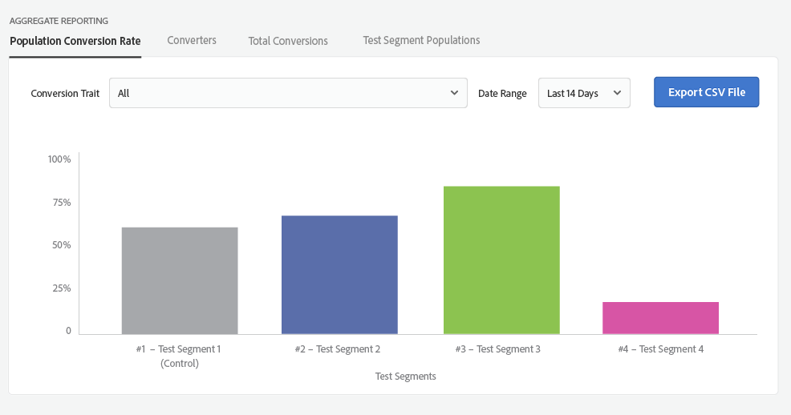

# Test des rapports de groupe {#test-group-reporting}

La section de rapport sur les groupes de test renvoie des informations sur les conversions des groupes de test, ce qui permet de comparer facilement l'efficacité des segments de test. De nombreux filtres et dimensions sont disponibles pour la visualisation des données.

[!UICONTROL Audience Lab] renvoie des informations de rapport détaillées pour les segments de test que vous avez créés et vous permet d’enregistrer les données de rapport sous forme de [!DNL CSV] fichiers. Vous pouvez choisir entre **[!UICONTROL Aggregate Reporting]** et **[!UICONTROL Trend Reporting]**.

**[!UICONTROL Aggregate Reporting]** renvoie les nombres absolus pour vos segments de test. **[!UICONTROL Trend Reporting]** renvoie un graphique de la tendance *sur une période* spécifique. Quatre onglets vous permettent de personnaliser les rapports :

<table id="table_446384AE9A36408A9C570CB7DB72C3D6"> 
 <thead> 
  <tr> 
   <th colname="col1" class="entry"> Paramètre </th> 
   <th colname="col2" class="entry"> Description </th> 
  </tr> 
 </thead>
 <tbody> 
  <tr> 
   <td colname="col1"> 
 <b> Taux de conversion de population</b> 
 </td> 
   <td colname="col2"> 
Renvoie le pourcentage de périphériques appartenant à un segment de test particulier, qui ont été convertis. 
 </td> 
  </tr> 
  <tr> 
   <td colname="col1"> 
 <b> Convertisseurs</b> 
 </td> 
   <td colname="col2"> 
Renvoie le nombre de périphériques qui ont présenté les caractéristiques de conversion sélectionnées dans les groupes de test. <a href="https://helpx.adobe.com/audience-manager/kt/using/creating-conversion-traits-feature-video-use.html" format="https" scope="external"> Regardez cette vidéo</a> pour savoir comment créer des caractéristiques de conversion. 
 </td> 
  </tr> 
  <tr> 
   <td colname="col1"> 
 <b> Total des conversions</b> 
 </td> 
   <td colname="col2"> 
Renvoie le nombre de conversions générées par les segments de test. 
 </td> 
  </tr> 
  <tr> 
   <td colname="col1"> 
 <b> Test des populations de segments</b> 
 </td> 
   <td colname="col2"> 
Renvoie le nombre de périphériques appartenant aux segments de test. Basculer entre la population <b></b> totale et la population <b></b>en temps réel. La différence est expliquée dans la FAQ <a href="../../faq/faq-reporting.md"> sur les</a> rapports . 
 </td>
  </tr>
 </tbody>
</table>

Vous pouvez sélectionner une caractéristique de conversion spécifique pour laquelle générer le rapport ou sélectionner toutes les caractéristiques combinées. Vous pouvez définir une plage de dates pour laquelle les informations doivent être renvoyées et exporter le rapport dans un [!DNL CSV] fichier.

>[!NOTE]
>
>* La création de rapports pour un groupe de test est renseignée le lendemain de sa date de début.
>* Une conversion n’est comptabilisée pour un périphérique qu’après la date de début d’un test et après l’ajout du périphérique à un segment de test. Si une conversion survient pour ce périphérique avant qu’un groupe de test ne lui soit affecté, la conversion ne sera pas comptabilisée.

Un **[!UICONTROL Aggregate Reporting]** graphique renvoyé peut se présenter comme suit :

Un **[!UICONTROL Trend Reporting]** graphique renvoyé peut ressembler à celui ci-dessous. Cochez **[!UICONTROL Normalized]** la case si vous souhaitez ignorer les chiffres absolus et vous concentrer simplement sur les tendances des segments de test.

