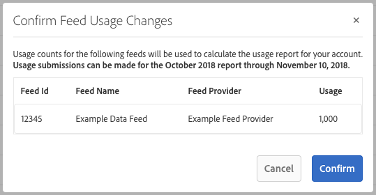

# Facturation des acheteurs de flux de données {#billing-for-data-feed-buyers}

Les acheteurs de données d’Audience Marketplace acceptent de signaler toutes les impressions publicitaires diffusées en utilisant les caractéristiques contenues dans le flux de données, dont le prix est fixé par millier d’impressions publicitaires ([!DNL CPM]). [!DNL CPM] l’utilisation est due le 5e jour de chaque mois calendaire et inclut les données du mois précédent. Les abonnés à des frais fixes n&#39;ont pas besoin de signaler l&#39;utilisation.

  

## Comment signaler l&#39;utilisation du CPM {#report-cpm-usage}

<!-- t_marketplace_report_cpm_usage.xml -->

[!UICONTROL Audience Marketplace] les acheteurs de données acceptent de signaler toutes les impressions publicitaires diffusées à l’aide des caractéristiques contenues dans le flux de données, sur la base d’un coût par millier d’impressions publicitaires ([!DNL CPM]). [!DNL CPM] l’utilisation est due le 5 jour de chaque mois calendaire et inclut les données du mois précédent. Les abonnés à des frais fixes n&#39;ont pas besoin de signaler l&#39;utilisation.

[!UICONTROL Audience Marketplace] offres de deux façons de signaler [!DNL CPM] l’utilisation :

* **Rapports** de niveau segment : il s’agit de la méthode de rapports d’ [!DNL CPM] utilisation recommandée. Lorsque vous signalez [!DNL CPM] l’utilisation au niveau du segment, la section rapports au niveau du flux de données est automatiquement complétée avec les montants d’utilisation correspondants, en fonction des algorithmes décrits dans la section Attribution des [coûts pour les flux](#cost-attribution)de données CPM.
* **Rapports** au niveau du flux de données : cette méthode requiert que vous signaliez individuellement l’ [!DNL CPM] utilisation de chaque flux de données, en fonction des algorithmes décrits dans la section Attribution des [coûts pour les flux](#cost-attribution)de données CPM. Cependant, cette méthode est plus fastidieuse et susceptible aux erreurs que le rapports au niveau du segment.

  

## Rapport sur l&#39;utilisation du CPM au niveau du segment {#segment-level-report}

L’ [!UICONTROL Segment Usage] onglet permet de créer des rapports sur l’utilisation au niveau des segments, tout en affichant les segments regroupés par destination à laquelle ils sont associés.

Après l’utilisation du rapports [!DNL CPM] au niveau du segment, [!UICONTROL Audience Marketplace] affecte automatiquement les flux de données correspondants à l’utilisation correcte, en fonction de l’attribution de [coût pour les flux](#cost-attribution)de données CPM.

Pour signaler [!DNL CPM] l’utilisation au niveau du segment :

1. Allez à **[!UICONTROL Audience Marketplace > Payables]**.
1. Sélectionnez l’ **[!UICONTROL Segment Usage]** onglet.
1. Renseignez l’utilisation de vos segments. Vous pouvez utiliser la [!UICONTROL Search] zone pour filtrer les segments si vous devez uniquement signaler l’utilisation de certains d’entre eux.
1. Cliquez sur **[!UICONTROL Edit Segments Usage]**.
1. Entrez le montant [!DNL CPM] d&#39;utilisation dans la [!UICONTROL Usage] colonne.
1. Cliquez sur **[!UICONTROL Save]** une fois terminé et passez en revue la boîte de dialogue de confirmation.

   

1. Cliquez sur **[!UICONTROL Confirm]**.

Consultez également notre vidéo de démonstration de la façon dont vous pouvez créer des rapports sur l’utilisation au niveau des segments :

>[!VIDEO](https://video.tv.adobe.com/v/25522/)

 

## Rapport sur l’utilisation du CPM au niveau du flux de données {#feed-level-report}

Le rapports au niveau du flux de données est un processus plus fastidieux et plus susceptible d’erreurs, car vous devez calculer individuellement [!DNL CPM] l’utilisation de chaque flux de données. Nous vous recommandons plutôt de [signaler l’utilisation du CPM au niveau](#segment-level-report) du segment.

Pour signaler [!DNL CPM] l’utilisation au niveau du segment :

1. Allez à **[!UICONTROL Audience Marketplace > Payables]**.
2. Sélectionnez l’ **[!UICONTROL Feed Usage]** onglet.
3. Utilisez la [!UICONTROL Search] zone pour filtrer les flux de données et identifier ceux pour lesquels vous devez créer des rapports d’utilisation.
4. Cliquez sur **[!UICONTROL Edit Feeds Usage]**.
5. Calculez l’ [!DNL CPM] utilisation de chaque flux de données en fonction de l’attribution de [coût pour les flux](#cost-attribution)de données CPM et saisissez-le dans la [!UICONTROL Usage] colonne.
6. Cliquez sur **[!UICONTROL Save]** une fois terminé et passez en revue la boîte de dialogue de confirmation.

   

7. Cliquez sur **[!UICONTROL Confirm]**.

  

## Rapports en masse

Pour réduire les erreurs et les frais généraux liés à l’utilisation du rapports, vous pouvez utiliser l’option de rapports en bloc pour télécharger un [!DNL CPM] fichier contenant les flux de données et les segments, remplir l’utilisation et le télécharger à nouveau dans [!DNL CSV] [!DNL Audience Manager]. Vous pouvez utiliser le rapports en vrac pour rapporter à la fois l’utilisation des flux et des segments.

Pour mettre à jour [!DNL CPM] l&#39;utilisation en bloc :

1. Allez à **[!UICONTROL Audience Marketplace > Payables]**.
1. Sélectionnez l’ **[!UICONTROL Feed Usage]** onglet ou **[!UICONTROL Segment Usage]** l’onglet, en fonction du type de rapports à mettre à jour.
1. Cliquez sur **[!UICONTROL Edit Feeds Usage]** ou **[!UICONTROL Edit Segments Usage]**.
1. Cliquez sur **[!UICONTROL download the current usage]** pour vous assurer d’utiliser un fichier CSV valide.
1. Ouvrez le fichier sur votre ordinateur et complétez le rapport d’utilisation.
1. Cliquez sur **[!UICONTROL Choose a CSV file]** pour télécharger le rapport d’utilisation mis à jour.

   

1. [!DNL Audience Manager] valide le fichier dès que vous l’avez téléchargé et vous invite à vérifier s’il détecte des erreurs dans le fichier.

  

### Erreurs de validation de Rapports en masse

| Message d’erreur | Description | Correction de l’affichage inapproprié comme titre de la valeur |
| ------------- | -------------| -----|
| Entrée non valide | [!DNL Audience Manager] a détecté un changement dans le schéma de fichiers, tel que des colonnes manquantes ou des modifications de titres de colonnes. [!DNL CSV] | Evitez de modifier la structure du tableau. |
| introuvables | En effet, [!UICONTROL Segment Level Reporting][!DNL Audience Manager] n&#39;a pas pu identifier la [!UICONTROL Segment ID] combinaison et la [!UICONTROL Destination ID] combinaison. En effet, [!UICONTROL Feed Level Reporting][!DNL Audience Manager] n&#39;a pas pu identifier la [!UICONTROL Data Provider Name]combinaison, [!UICONTROL Feed Name]et [!UICONTROL Use Case] . | Pour [!UICONTROL Segment Level Reporting]cela, vérifiez la validité de la [!UICONTROL Segment ID] combinaison et de la [!UICONTROL Destination ID] combinaison. Pour [!UICONTROL Feed Level Reporting], vérifiez la validité de la [!UICONTROL Data Provider Name]combinaison, [!UICONTROL Feed Name]et [!UICONTROL Use Case] . |
| Enregistrements de duplicata trouvés | [!DNL Audience Manager] des enregistrements de duplicata détectés avec des valeurs d’impression différentes. | Consultez le rapport et assurez-vous de ne pas signaler des valeurs d’utilisation différentes pour le même flux de données ou segment. |
| Valeurs non prises en charge | [!DNL Audience Manager] a détecté des valeurs non numériques dans la [!DNL Audience Manager] colonne. | Consultez le rapport et veillez à n&#39;entrer que des valeurs numériques dans la [!DNL Audience Manager] colonne. |
| En-têtes des champs obligatoires manquants | [!DNL Audience Manager] des en-têtes de tableau manquants détectés pour les champs obligatoires. Par exemple, [!UICONTROL Segment Level Reporting]les champs obligatoires sont les suivants : [!UICONTROL Segment ID], [!UICONTROL Destination ID]. Par exemple, [!UICONTROL Feed Level Reporting]les champs obligatoires sont les suivants : [!UICONTROL Data Provider Name], [!UICONTROL Data Feed Name],  [!UICONTROL Use Case] | Consultez le rapport et assurez-vous que les en-têtes de tableau n’ont pas été modifiés. |

>[!NOTE]
>La suppression de lignes du rapport d&#39; [!DNL CSV] utilisation n&#39;a aucun effet sur le rapport d&#39;utilisation existant. [!DNL Audience Manager] traite uniquement les champs inclus dans le rapport.

  

## [!DNL CPM] Bonnes pratiques en matière de rapports

<table id="table_E68FA2130D1C495FAB8982DFB6A31FD9"> 
 <thead> 
  <tr> 
   <th colname="col1" class="entry"> Recommandations </th> 
   <th colname="col2" class="entry"> Description </th> 
  </tr>
 </thead>
 <tbody> 
  <tr> 
   <td colname="col1"> 
<b>Toujours signaler le nombre total d’impressions</b> 
 </td> 
   <td colname="col2"> 
Pour les totaux d’impression CPM : 

   
 Signaler le nombre total d’impressions, sans utiliser de décimales. L’Audience Manager calcule automatiquement le CPM en fonction du nombre total que vous signalez.

Si vous devez signaler 1 234 567 impressions, signalez-le exactement comme cela. Il n’est pas nécessaire de diviser le nombre total d’impressions par 1 000 pour calculer le CPM.

Les caractéristiques utilisées pour optimiser le contenu Web ou d’application (Optimisation du contenu) à l’aide d’outils tels que Adobe Target ou une destination Analytics ne contribuent pas aux totaux d’utilisation des plans CPM. Les fournisseurs de données sont généralement rémunérés pour l’optimisation du contenu en appliquant des forfaits.

Pour plus d’informations, voir Attribution de <a href="#cost-attribution">coûts pour les flux</a> de données CPM. 
 </td>
  </tr>
  <tr> 
   <td colname="col1"> 
<b>Se cantonner à l'intervalle de rapports mensuel</b> 
 </td> 
   <td colname="col2"> 
Le système de rapports se ferme après le 5 de chaque mois. Si vous ne signalez pas l'utilisation du CPM d'ici là, vous devez ajouter ce montant au rapport pour le mois suivant. Supposons, par exemple, que vous utilisiez 1 000 impressions en octobre, que vous manquiez l’échéance du rapports d’octobre et que vous utilisiez 1 000 impressions en novembre. Dans ce cas, vous signalez le total d’octobre et de novembre (2000) en décembre, entre le 1er et le 5.

<b>Conseil</b>: Vous devez toujours essayer de signaler l'utilisation du CPM pour le mois précédent entre le 1er et le 5e jour du mois suivant.

Vous pouvez signaler l'utilisation du CPM jusqu'au 5 du nouveau mois calendaire, mais cela n'est pas recommandé. L'utilisation du CPM rapports avant le 5 de chaque mois donne à l'Audience Manager le temps de vérifier et de traiter les données.
 </td>
  </tr> 
 </tbody> 
</table>

  

## Attribution des coûts pour les flux de données CPM {#cost-attribution}

Dans [!UICONTROL Audience Marketplace] vous devez auto-déclarer les montants d’impression chaque mois, pour chacun de vos segments. Nous recommandons l’utilisation des rapports [!DNL CPM] au niveau du segment, de sorte que l’attribution des coûts soit effectuée automatiquement.

<!-- marketplace_cpm_billing.xml -->

### Récapitulatif de la facturation {#billing-summary}

Vous devez envoyer des montants d’impression [!DNL CPM] de flux de données entre le 1er et le 5e jour de chaque mois calendaire. Pour ce faire, nous vous recommandons de [signaler l’utilisation du CPM au niveau](#segment-level-report)du segment.

>[!TIP]
>Lorsque vous signalez [!DNL CPM] l’utilisation au niveau du segment, la section rapports au niveau du flux de données est automatiquement complétée avec les montants d’utilisation correspondants.

Si nécessaire, [!UICONTROL Report CPM Usage at Data Feed Level]vous devez compiler individuellement toutes les impressions distribuées pour chaque flux au cours du mois civil précédent et les reporter en fonction de l’allocation de facturation décrite dans cet article.

Une fois le [!DNL CPM] numéro de rapport du mois civil précédent généré, [!DNL Adobe] procédez comme suit :

* Créez une facture et une facture en fonction du [!DNL CPM] taux de chaque flux de données souscrit.
* Les frais dus par les fournisseurs de données de paiement (vendeurs) en fonction de votre [!DNL CPM] utilisation déclarée.

>[!IMPORTANT]
>
>En tant qu’acheteur, tous les totaux d’impression signalés doivent être exacts et exacts. Si vous ne signalez pas les totaux d’impression au plus tard le 5e jour de chaque mois, vous devez inclure les totaux du mois non signalé au cours du mois suivant.

  

## Affecter des impressions au niveau du flux en fonction des règles de qualification des caractéristiques {#assign-impressions}

Le cas d’ [!UICONTROL Activation] utilisation vous permet d’utiliser des caractéristiques dans le flux de données correspondant pour créer des segments dans le créateur [de](../../../features/segments/segment-builder.md) segments et mapper ces segments à une destination. Les opérateurs booléens [!UICONTROL AND], [!UICONTROL OR]et [!UICONTROL NOT] vous permettent de définir les conditions de qualification des caractéristiques et des segments.

Lorsque vous [signalez l’utilisation du CPM au niveau](#feed-level-report)du flux de données, vous devez allouer les impressions proportionnellement pour chaque flux de données, en fonction des [!DNL Boolean] opérateurs utilisés dans les règles de qualification des caractéristiques. Le tableau suivant liste comment allouer correctement les impressions par règle booléenne ou type de caractéristique.

>[!TIP]
>[Signaler l’utilisation du CPM au niveau](#segment-level-report) du segment pour que l’rapports au niveau du flux de données soit effectué automatiquement par Audience Manager.

<table id="table_BF00FE6740D2459DAFA62F2478492586"> 
 <thead> 
  <tr> 
   <th colname="col1" class="entry"> Logique ou type de qualification de règle </th> 
   <th colname="col2" class="entry"> Distribution de facturation </th> 
  </tr> 
 </thead>
 <tbody> 
  <tr> 
   <td colname="col1"> 
 ET 
 </td> 
   <td colname="col2"> 
Appliquez 100 % des totaux d’impression distribués à toutes les caractéristiques du fournisseur dans un segment basé sur des règles qui utilise une condition Boolean  AND . 
 </td> 
  </tr> 
  <tr> 
   <td colname="col1"> 
 OU 
 </td> 
   <td colname="col2"> 
Appliquez une allocation pondérée des totaux d’impression distribués à toutes les caractéristiques du fournisseur dans un segment basé sur des règles qui utilise une condition OU booléenne. La répartition pondérée est calculée à l’aide de la formule suivante :

<code>(Trait Population / Segment Population) * Number of Impressions * Cost of CPM</code>
 </td> 
  </tr>
  <tr> 
   <td colname="col1"> 
 SAUF 
 </td> 
   <td colname="col2"> 
Appliquez 100 % des totaux d’impression distribués à toutes les caractéristiques du fournisseur dans un segment basé sur des règles qui utilise une condition Boolean  NOT . 
 </td> 
  </tr> 
  <tr> 
   <td colname="col1"> 
Segments algorithmiques 
 </td> 
   <td colname="col2"> 
Appliquez 100 % des totaux d’impression distribués à tous les flux du fournisseur dans un segment contenant des caractéristiques algorithmiques. 
 </td> 
  </tr>
 </tbody>
</table>

  

## Exemples de facturation {#billing-examples}

Les exemples ci-dessous illustrent la manière dont l’allocation de [!DNL CPM] l’utilisation est effectuée au niveau du flux de données.

>[!IMPORTANT]
>Nous vous recommandons plutôt de [signaler l’utilisation du CPM au niveau](#segment-level-report) du segment pour que ce processus soit effectué automatiquement.

Examinons le scénario suivant :

  

### Cas 1 : Segments avec règles de qualification ET

Ce segment contient 3 caractéristiques provenant de fournisseurs de données distincts. Comme la qualification des segments est basée sur une [!UICONTROL AND] condition, les visiteurs doivent se rendre compte des caractéristiques des trois flux pour être admissibles au segment.

Avec une [!UICONTROL AND] condition, vous devez affecter 100 % des impressions reçues au cours du mois aux trois fournisseurs de données. Dans la [!UICONTROL Audience Marketplace > Payables] section, vous attribuez à chaque fournisseur 1 000 000 impressions.

Cet exemple s’applique aux segments qui utilisent [!DNL Boolean][!UICONTROL NOT] des opérateurs ou aux segments qui contiennent des caractéristiques algorithmiques.

  

### Cas 2 : Segments avec règles de qualification OU

Ce segment contient 3 caractéristiques provenant de fournisseurs de données distincts. Comme la qualification des segments est fondée sur une [!UICONTROL OR] condition, les visiteurs doivent comprendre au moins une des trois caractéristiques pour être admissibles au segment.

Nous ne pouvons pas dire quel trait est responsable d&#39;une impression parce que la qualification est basée sur une [!UICONTROL OR] condition. Par conséquent, dans la [!UICONTROL Audience Marketplace > Payables] section, vous attribuez à chaque fournisseur une allocation pondérée du total des impressions, en fonction de la population de caractéristiques.

  

### Cas 3 : Segments avec des cas d’utilisation de la modélisation et des Activations

Cet exemple décrit l’attribution en fonction de deux cas d’utilisation du flux de données : Modélisation et Activation. Dans cet exemple, nous examinons deux fournisseurs de données, avec les informations suivantes :

Dans le tableau ci-dessous, le segment X contient deux caractéristiques, T1 et T2, avec la règle de segmentation T1 OU T2, où :

* T1 est une caractéristique du flux de données A ;
* T2 est une caractéristique algorithmique modélisée en fonction de caractéristiques tierces du flux de données A et du flux de données B.

Le segment est mappé à une destination et 1 000 000 impressions sont entrées pour ce segment au cours d’un mois, à l’aide d’un Rapports [de niveau](#segment-level-report)segment.

Parmi ces 1 000 000 impressions :

* T1 représente 40 % de la population du segment, ce qui se traduit par 400 000 impressions pour le flux A.
* T2 représente 60 % de la population de segments, ce qui se traduit par 600 000 impressions pour les flux A et B.

Au niveau du flux de données, les impressions sont attribuées de la manière suivante :

* Le flux de données A reçoit 600 000 impressions de la caractéristique T2 (qui est modelée sur les caractéristiques du flux de données A et du flux de données B, de sorte que les deux reçoivent les impressions) et 400 000 impressions de la caractéristique T1 (qui est une caractéristique du flux de données A), totalisant 1 000 00 impressions.
* Le flux de données B reçoit 600 000 impressions de la caractéristique T2 (voir l’explication ci-dessus) et 0 impressions de la caractéristique T1.

La ventilation en un coup d’oeil par flux de données et cas d’utilisation est la suivante :

  

## Attribution de la facturation et de l’impression pour les flux de données à frais fixes {#billing-flat-fee}

Un flux de données à frais fixes vous facture un montant fixe chaque mois, indépendamment du moment où l’abonnement début ou du nombre d’impressions que vous utilisez. Les frais ne sont pas calculés au prorata pour l’utilisation partielle du mois ou les intervalles. Comme pour la facturation CPM, l&#39;Adobe va générer une facture et vous facturer au tarif mensuel forfaitaire pour vos flux de données abonnés.

Supposons, par exemple, que vous ayez décidé d’activer certaines caractéristiques dans un flux au milieu du mois. Vous serez toujours facturé au tarif mensuel complet, quel que soit le moment où vous avez démarré l&#39;abonnement ou activé certaines caractéristiques.