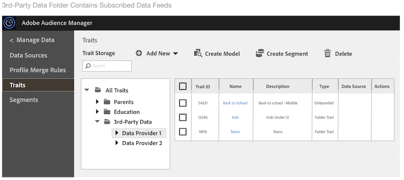

# Gestion des flux de données  {#manage-data-feed-subscriptions}

C’ [!UICONTROL Marketplace] est là que les acheteurs de données se rendent à la recherche et s’abonnent aux flux de données publics et privés. Pour vous abonner à un flux de données public, procédez comme suit.

## S’abonner à un flux de données public {#subscript-public-data-feed}

C’ [!UICONTROL Marketplace] est là que les acheteurs de données se rendent à la recherche et s’abonnent aux flux de données publics et privés. Pour vous abonner à un flux de données public, procédez comme suit.

<!-- t_subscribe_feed.xml -->

Pour vous abonner à un flux de données public :

1. Allez-y **[!UICONTROL Audience Marketplace > Marketplace]**. Utilisez la fonction de recherche ou parcourez le  pour rechercher un flux de données.

   

1. Cliquez sur le nom du flux de données à utiliser. La page [Détails du](../../../features/audience-marketplace/marketplace-data-buyers/marketplace-manage-subscriptions.md#marketplace-buyer-details) plan s’ouvre alors pour le flux sélectionné.

   

1. Choisissez un cas d’utilisation dans le tableau   et :
   * Déplacez le **[!UICONTROL Subscription]** curseur vers **[!UICONTROL On]**.
   * Cliquez sur **[!UICONTROL Review & Subscribe]**. Cela ouvre la [!UICONTROL Terms and Conditions] fenêtre.
   

1. Dans la [!UICONTROL Terms and Conditions] fenêtre :

   * **Important :** Laissez la **[!UICONTROL ID sync]** case à cocher cochée. Ce paramètre permet d’améliorer les taux de correspondance avec votre fournisseur de données.
   * Cochez la case Conditions générales et cliquez sur **[!UICONTROL Accept]** pour terminer le processus   du.
   

### Étapes suivantes

Après vous être abonné à un flux de données :

* Vérifiez le   en vérifiant votre [!UICONTROL Traits] dossier. Voir [ pour les flux](../../../features/audience-marketplace/marketplace-data-buyers/marketplace-manage-subscriptions.md#find-subscribed-data-fee)de données abonnés.

* Consultez les documents de facturation et de paiement. Consultez les liens connexes ci-dessous.

### Bonnes pratiques {#best-practices}

Voici un ensemble de bonnes pratiques que nous vous recommandons de suivre lorsque vous travaillez avec [!UICONTROL Audience Marketplace]:

Lors de l’exploration de nouveaux jeux de données tiers et secondaires par le biais [!UICONTROL Audience Marketplace]de, la première étape que nous recommandons est d’activer les flux de données pour [!UICONTROL Segments & Overlap]. Cela permet aux utilisateurs d’explorer les données en créant des segments afin d’évaluer  taille de  de et en exécutant des rapports de chevauchement pour obtenir des informations de  initiales. La plupart des fournisseurs de données   ce cas d’utilisation gratuitement. Vous pouvez donc exécuter ce  sans frais supplémentaires.

Lors de l’exécution de rapports de chevauchement, suivez ces bonnes pratiques pour vous assurer d’obtenir des résultats utiles.

1. Assurez-vous que vos jeux de données qui se chevauchent sont similaires en termes de type de données et de méthodologies de collecte, telles que :
   * Géographie
   * Cookie ou ID mobiles
   * Intervalle de recherche en amont
   *  de  hors ligne et en ligne
   * Fréquence à laquelle le fournisseur de données actualise les données

1. Le chevauchement peut s’étendre légèrement au fil du temps. Veillez donc à prévoir jusqu’à 30 jours avant d’exécuter des rapports de chevauchement pour permettre la synchronisation des données.
1. Le chevauchement peut augmenter si vous utilisez des données d’un fournisseur de données dans plusieurs campagnes marketing.
et initiatives. Cela permet aux utilisateurs des deux ensembles de données de mieux se synchroniser.
1. Il n’y a aucune garantie qu’il y aura chevauchement entre vos jeux de données. Pour qu’un chevauchement soit valide, un utilisateur de l’ensemble de données du client doit être associé à l’ensemble de données du fournisseur de données pendant la période  du. Si les données de média du client n’ont pas été diffusées aux utilisateurs dans l’ensemble de données du fournisseur de données, il n’y aura jamais de chevauchement.
1. Ne pensez pas que les faibles chevauchements sont une mauvaise chose. Tirez parti d&#39;un faible chevauchement des  et engagez les nouveaux utilisateurs.

## S’abonner à un flux de données privé {#subscript-private-data-feed}

Les acheteurs s’abonnent à des flux de données privés et planifient en **[!UICONTROL Audience Marketplace > Marketplace]** anglais.

<!-- t_private_feed.xml -->

>[!TIP]
>
>Parfois, les fournisseurs de données peuvent   une remise sur un flux de données privé. Vous souhaiterez peut-être demander une remise possible lors de l’envoi de votre demande de  .

Pour vous abonner à un flux de données privé :

1. Cliquez sur le nom du flux de données dans le [!UICONTROL Marketplace].
1. Cliquez sur **[!UICONTROL Request Access]**. La boîte de dialogue de demande s’ouvre.
1. Dans la boîte de dialogue de demande, écrivez au fournisseur une note exprimant votre intérêt pour leur flux de données, puis cliquez sur **[!UICONTROL Send]**. Le vendeur examinera votre message et approuvera ou rejettera votre demande. En attente d’approbation, &quot;Demandé&quot; apparaît dans le [!UICONTROL Marketplace] pour ce flux de données.

   * **[!UICONTROL Request approved]**: L’état dans le [!UICONTROL Marketplace] devient &quot;Accès accordé&quot; et vous recevrez une notification automatisée. A ce stade, vous pouvez vous abonner au flux. Voir [S’abonner à un flux](../../../features/audience-marketplace/marketplace-data-buyers/marketplace-manage-subscriptions.md#subscript-public-data-feed) de données public pour obtenir des instructions.
   * **[!UICONTROL Request denied]**: Le texte &quot;Demandé&quot; est supprimé du [!UICONTROL Marketplace] du flux. Vous pouvez essayer de vous abonner à nouveau ou choisir un autre flux.

## Remises sur les flux de données pour les acheteurs {#buyer-discount}

En [!UICONTROL Audience Marketplace]effet, les fournisseurs peuvent  les acheteurs  une remise sur le prix publié d’un flux de données à [!DNL CPM] tarif fixe ou fixe. Toutefois, les montants de remise ne sont pas visibles par les acheteurs dans le  du [!DNL Marketplace] flux. Mais vous pouvez également demander une remise lorsque vous vous abonnez à un flux de données privé ou lorsque vous demandez plus d’informations sur un flux particulier.

## Demander une remise {#request-discount}

<!-- marketplace-buyer-discounts.xml -->

<table id="table_3C6E58F593BA48EC89ACBD9A26E4E74F"> 
 <thead> 
  <tr> 
   <th colname="col1" class="entry"> Statut d'acheteur </th> 
   <th colname="col2" class="entry"> Description </th> 
  </tr> 
 </thead>
 <tbody> 
  <tr> 
   <td colname="col1"> 
 <b>Abonnés actuels</b> 
 </td> 
   <td colname="col2"> 
Si vous êtes déjà abonné à un flux de données privé et souhaitez demander une remise : 
 
    <ol id="ol_A58D419EBB9349E9B1225202535130F6"> 
     <li id="li_D0DDC8AC6E9C4675AA4630D63FE8F071"> <a href="../../../features/audience-marketplace/marketplace-data-buyers/marketplace-manage-subscriptions.md#unsubscribe"> Se désabonner</a> du flux de données. </li> 
     <li id="li_05A5379F2A944FB28AB39C196DDE3A1D">Contactez le fournisseur de données et demandez un prix réduit. </li> 
     <li id="li_B1B5AA6F6CC64512A02D5E8861A5F266">Si le fournisseur vous accorde une remise, réabonnez-vous au flux le 1premier jour du mois suivant. </li> 
    </ol> </td> 
  </tr> 
  <tr> 
   <td colname="col1"> 
 <b>Nouveaux abonnés aux flux de données privés</b> 
 </td> 
   <td colname="col2"> 
Demandez une remise dans votre demande de  de . Voir <a href="../../../features/audience-marketplace/marketplace-data-buyers/marketplace-manage-subscriptions.md#subscript-private-data-feed"> S’abonner à un flux</a>de données privé. 
 </td>
  </tr> 
  <tr> 
   <td colname="col1"> 
 <b>Abonnés potentiels</b> 
 </td> 
   <td colname="col2"> 
Un abonné  potentiel est un acheteur de données qui a demandé l’accès à un flux de données privé, a reçu l’approbation du vendeur, mais n’a pas souscrit au flux. Pour demander une remise en tant qu’abonné potentiel : 
 
    <ol id="ol_9CECDA92E7894B20AC8A777D78962188"> 
     <li id="li_618B64160CF24549AFCA73E006DCA35A">Accédez à <b>  Marketplace &gt; Marketplace</b>. </li> 
     <li id="li_FE52A06B30FC4858B48AF81954365FE9">Cliquez sur le nom du flux pour lequel vous avez été approuvé. </li> 
     <li id="li_763C050AC9464BE380D00F6085B6E540">Cliquez sur <b> Demander plus de détails</b>. Demandez une remise dans votre demande de détails au vendeur. </li> 
    </ol> </td> 
  </tr> 
 </tbody> 
</table>

## Vérification des flux actualisés {#review-discounted-feeds}

Pour consulter vos flux à tarif réduit :

1. Allez-y **[!UICONTROL Audience Marketplace > Marketplace]**.
1. Cliquez sur le nom d’un flux auquel vous êtes déjà abonné.
1. Examinez les [!UICONTROL Price] colonnes et les [!UICONTROL Your Price] colonnes du [!UICONTROL Plan Details] tableau. Si le flux est actualisé :

   * Le prix d&#39;origine est marqué d&#39;une ligne rouge.
   * Les frais de la [!UICONTROL Your Price] colonne seront inférieurs à ceux de la [!UICONTROL Price] colonne.

Dans l&#39;exemple, l&#39;acheteur bénéficie d&#39;une remise de 10 % sur le [!UICONTROL Segments and Overlap] plan dans le **[!UICONTROL Software Audience Feed]**.

## Recherche de données de flux souscrits {#find-subscribed-data-fee}

Les données (caractéristiques) de vos flux de données s’affichent dans leurs propres caractéristiques  les dossiers  des. Accédez au **[!UICONTROL Audience Data > Traits]** dossier **[!UICONTROL 3rd-Party Data]** et développez-le pour le  et utilisez les caractéristiques de vos flux abonnés. Recherchez le sous-dossier nommé d’après votre fournisseur de données. Elles contiennent des dossiers nommés d’après les caractéristiques individuelles du flux de données et  des caractéristiques fournies par le flux.

<!-- marketplace-feed-storage.xml -->

## Désabonnement d’un flux de données {#unsubscribe}

Les acheteurs de données se désabonnent des flux de données et planifient dans **[!UICONTROL Audience Marketplace > Marketplace]**.

<!-- t_unsubscribe_feed.xml -->

Pour vous désabonner d’un flux de données :

1. Cliquez sur le nom du flux de données dans le [!UICONTROL Marketplace].
1. Dans la [!UICONTROL Use Case] section recherchez le plan que vous souhaitez utiliser et déplacez le **[!UICONTROL Subscription]** curseur vers **[!UICONTROL Off]**.

## Désactivation des flux de données : Pourquoi cela se produit et comment réagir {#data-feed-deactivation-reasons}

Dans [!UICONTROL Audience Marketplace]ce cas, les fournisseurs de données peuvent révoquer l’accès à vos flux de données abonnés. Ne soyez pas alarmée si ça vous arrive. Nous vous avons couvert. Consultez cette section pour connaître les processus et procédures liés aux désactivations des flux de données.

## Raisons courantes de la désactivation des flux de données {#reasons-for-deactivation}

<!-- marketplace-subscriber-deactivated.xml -->

Cela peut être déroutant ou même dérangeant si un flux auquel vous vous abonnez est désactivé. Toutefois, les fournisseurs de données peuvent désactiver un flux de données pour diverses raisons. Voici quelques raisons courantes :

* **Facturation :** Les fournisseurs de données désactivent un flux si vous êtes constamment en retard avec le paiement des frais ou si vous ne payez pas vos frais.
* **Mises à jour du flux :** Les fournisseurs de données doivent désactiver les flux lorsqu’ils mettent à jour leur taxonomie des flux ou leurs structures de coûts.
* **Acheteurs inactifs :** Les fournisseurs de données se réservent le droit de désactiver les flux si les abonnés n’affichent aucune dépense sur une période prolongée.
* **Vendeurs inactifs :** Les fournisseurs de données qui quittent [!UICONTROL Audience Marketplace] désactivent et suppriment tous leurs flux de données.

>[!TIP]
>
>Contactez directement votre fournisseur de données si vous pensez qu’un flux de données a été désactivé par erreur. Votre [!DNL Adobe] consultant peut vous aider avec des coordonnées ou un support supplémentaire.

## E-mail de désactivation {#deactivation-email}

Lorsqu’un fournisseur de données désactive l’un de vos flux de données, [!DNL Audience Manager] envoie un courrier électronique aux utilisateurs de votre  qui disposent [!UICONTROL Administrator] d’autorisations. Parfois, les de messagerie  classifient ce message comme indésirable. Par conséquent, cette notification importante peut vous manquer. Pour vous aider à identifier le message de désactivation, ce courrier électronique contient les éléments suivants :

* **De :** Le courrier électronique de désactivation provient de `aam-noreply@adobe.com`. Pro-tip : Ne répondez pas à ce courriel.

* **Objet:**  le  du *nom du flux de données ici* est annulé.

* **Pièces jointes :** Le courrier électronique comprend une pièce jointe intitulée &quot; `list-of-affected-entities-by-feed-revocation.csv`&quot;. C&#39;est une façon alambiquée de dire que le de pièces jointes  toutes les caractéristiques incluses dans le flux annulé. En tant qu’acheteur de données, vous devez consulter cette pièce jointe. Il vous aidera à trouver et à supprimer les caractéristiques désactivées de vos segments et modèles algorithmiques.

##  de caractéristiques désactivées {#deactivation-trait-list}

Le qui accompagne un courrier électronique de désactivation contient les champs comme illustré ci-dessous.

<table id="table_5C3800F9D8AA43EFAB4690959A721F63"> 
 <thead> 
  <tr> 
   <th colname="col1" class="entry"> Champ </th> 
   <th colname="col2" class="entry"> Description </th> 
  </tr> 
 </thead>
 <tbody> 
  <tr> 
   <td colname="col1"> 
<b> ID du flux de données</b> 
 </td> 
   <td colname="col2"> 
ID du flux de données désactivé. 
 </td> 
  </tr> 
  <tr> 
   <td colname="col1"> 
<b> Nom du flux de données</b> 
 </td> 
   <td colname="col2"> 
Nom du flux de données désactivé. 
 </td> 
  </tr> 
  <tr> 
   <td colname="col1"> 
<b> Trait SID</b> 
 </td> 
   <td colname="col2"> 
ID de caractéristique désactivés. 
 </td> 
  </tr> 
  <tr> 
   <td colname="col1"> 
<b> Nom du trait</b> 
 </td> 
   <td colname="col2"> 
Noms de caractéristiques désactivés. 
 </td> 
  </tr> 
  <tr> 
   <td colname="col1"> 
<b> SID de segment</b> 
 </td> 
   <td colname="col2"> 
ID du segment qui contient des caractéristiques désactivées. 
 </td> 
  </tr> 
  <tr> 
   <td colname="col1"> 
<b> Nom du segment</b> 
 </td> 
   <td colname="col2"> 
Nom du segment qui contient des caractéristiques désactivées. 
 </td> 
  </tr> 
  <tr> 
   <td colname="col1"> 
<b> ID de modèle Algo</b> 
 </td> 
   <td colname="col2"> 
ID du modèle algorithmique contenant des caractéristiques désactivées. 
 </td> 
  </tr> 
  <tr> 
   <td colname="col1"> 
<b> Nom du modèle Algo</b> 
 </td> 
   <td colname="col2"> 
Noms des modèles algorithmiques contenant des caractéristiques désactivées. 
 </td> 
  </tr> 
 </tbody> 
</table>

## Supprimer les caractéristiques désactivées {#remove-deactivated-traits}

En tant qu’acheteur de données, vous êtes responsable de la suppression des caractéristiques d’un flux annulé de tous vos segments actifs/en cours d’utilisation ou inactifs. Les options de suppression sont les suivantes :

* Suppression en bloc avec les API  REST ou les outils [de gestion](../../../reference/bulk-management-tools/bulk-management-intro.md)en bloc.

* Recherchez manuellement les segments affectés et supprimez les caractéristiques désactivées à l’aide [!UICONTROL Segment Builder]. Voir [Suppression de caractéristiques d’un segment](../../../features/segments/segment-builder.md#segment-builder-controls-traits).

>[!NOTE]
>
>La suppression des caractéristiques des modèles ou destinations algorithmiques actifs affecte l’échelle et la précision du ciblage. Si possible, essayez de remplacer les caractères révoqués par de nouveaux caractères actifs.

[Désabonnez-vous du flux](../../../features/audience-marketplace/marketplace-data-buyers/marketplace-manage-subscriptions.md#unsubscribe) de données désactivé après avoir supprimé toutes les caractéristiques révoquées de votre compte. S’il s’agit d’une désactivation temporaire, vous pouvez vous réabonner une fois que le fournisseur de données a terminé d’apporter les modifications requises et de réactiver le flux. Comme pour la plupart des choses, une bonne communication avec vos partenaires (le fournisseur de données et [!DNL Adobe]) peut vous aider à accomplir ce processus.

## Présentation de la page des détails de la formule d’Audience Marketplace{#marketplace-buyer-details} (en anglais)

Lorsque vous cliquez sur le nom d’un plan de données dans la section [!UICONTROL Marketplace], [!DNL Audience Manager] fournit des informations qui peuvent vous aider à faire des choix éclairés concernant l’abonnement à un flux de données.

<!-- marketplace-buyer-details.xml -->

Cette page vous donne les informations suivantes :

1. **Informations** de base sur le plan. Ces informations comprennent les informations de flux telles que :
   * Nom du flux de données. Par exemple, comme illustré ci-dessus, le nom de ce flux est &quot;Exemple de flux de données&quot;.
   * nom du fournisseur de données;
   * ID du flux de données ;
   * Description;
   * nombre de caractéristiques dans l&#39;alimentation;

1. Boutons Informations sur le plan.
   * Cliquez sur **[!UICONTROL Explore All Traits]** pour afficher les détails sur toutes les caractéristiques du flux de données sélectionné.
   * Cliquez sur **[!UICONTROL Request More Details]** pour poser des questions au fournisseur de données sur le flux de données sélectionné ou pour demander une remise. Cette fonctionnalité envoie vos commentaires et vos questions directement au fournisseur de données.

1. Mesures du rapport Flux de données. Le diagramme de Venn (et les mesures connexes) montre les données de chevauchement des caractéristiques des 30 derniers jours. Voir [Le Marché : A propos](marketplace-data-buyers.md#about-marketplace) des détails.
   * **[!UICONTROL 30 Day Overlapped Uniques]**: Nombre d’utilisateurs uniques de votre compte qui chevauchent les utilisateurs du compte du fournisseur. Pour obtenir une définition d’utilisateurs uniques, voir UUID AAM dans l’ [index des identifiants dans  Gestionnaire de](/help/using/reference/ids-in-aam.md)de.
   * **[!UICONTROL 30 Day Provider Unique Users]**: Nombre d’utilisateurs uniques provenant du compte du fournisseur.
   * **[!UICONTROL Your Unique Users]**: Nombre d’utilisateurs uniques provenant de votre compte.

1. **[!UICONTROL Plan Details]** Tableau. Ce tableau présente les cas d’utilisation pour lesquels vous pouvez vous abonner au flux de données, ainsi que son modèle de tarification. Voir [Présentation des cas](#use-cases)d’utilisation des flux de données.

1. Boutons d’action de plan.
   * Cliquez sur **[!UICONTROL Cancel]** pour quitter la page sans apporter de modifications.
   * Cliquez sur **[!UICONTROL Review & Subscribe]** pour vous abonner à un flux de données. Ce bouton est grisé jusqu&#39;à ce que vous changiez de [!UICONTROL Subscription] bascule [!UICONTROL On]. Voir aussi [S’abonner à un flux](#subscript-public-data-feed) de données public et [S’abonner à un flux](#subscript-private-data-feed)de données privé.

## Présentation des cas d’utilisation des flux de données {#use-cases}

En tant qu’acheteur de [!UICONTROL Audience Marketplace] données, vous pouvez acheter des données pour des cas de chevauchement, de modélisation et d’utilisation de  de . Chaque cas d’utilisation est conçu pour un objectif spécifique et limite ce que vous pouvez faire avec les données. Ces descriptions de cas d&#39;utilisation peuvent vous aider à prendre la bonne décision quant au type de plan de données à acheter.

## Comparaison avec les segments et les plans de chevauchement {#comparisons}

<!-- c_use_cases_for_buyers.xml -->

### Segments et chevauchement

Ce cas d’utilisation vous permet de comparer vos caractéristiques avec celles du fournisseur dans un rapport de chevauchement [caractéristique/caractéristique.](../../../reporting/dynamic-reports/trait-trait-overlap-report.md#trait-to-trait-overlap-report) Vous pouvez également créer ou ajouter des caractéristiques de fournisseur à un segment et effectuer des comparaisons supplémentaires avec les rapports [segment à caractéristique](../../../reporting/dynamic-reports/segment-trait-overlap-report.md) et [segment à segment](../../../reporting/dynamic-reports/segment-segment-overlap-report.md) . Les comparaisons de chevauchement peuvent vous aider à :

* **Étendre  portée  :** Un chevauchement faible suggère que vos caractéristiques contiennent des utilisateurs que vous n’avez jamais vus auparavant. Vous souhaiterez peut-être que ces caractéristiques tentent d’atteindre de nouveaux utilisateurs.
* **Améliorer l&#39;  existante :** Un chevauchement élevé indique que vos caractéristiques sont similaires à celles détenues par le fournisseur de données. Vous souhaiterez peut-être que ces caractéristiques aident à apporter des améliorations ciblées et incrémentielles à un  déjà développé .

### Modèles algorithmiques

Ce cas d’utilisation vous permet d’évaluer les caractéristiques du fournisseur par rapport à vos caractéristiques avec la modélisation algorithmique. Par exemple, notre système de modélisation algorithmique utilise l’une de vos caractéristiques comme base de comparaison avec une caractéristique fournisseur. Lorsque le modèle s’exécute, il peut indiquer si   de caractéristiques fournisseur partagent des attributs de conversion similaires à vos caractéristiques.

### Activation

Ce cas d’utilisation vous permet d’envoyer des données vers une [destination](../../../features/destinations/destinations.md). Dans [!UICONTROL Audience Manager]ce cas, une destination est tout système tiers (serveur publicitaire, [!DNL DSP], [!DNL DMP], échange, etc.) que vous souhaitez partager avec. Toutefois, dans un cas d’ [!UICONTROL Activation] utilisation, vous ne pouvez pas exécuter de rapports de chevauchement ni tester les données dans un modèle algorithmique.

>[!MORELIKETHIS]
>
>* [Attribution de la facturation et de l’impression pour les flux de données CPM](../../../features/audience-marketplace/marketplace-data-buyers/marketplace-buyer-billing.md#cost-attribution)
>* [Attribution de la facturation et de l’impression pour les flux de données à frais fixes](../../../features/audience-marketplace/marketplace-data-buyers/marketplace-buyer-billing.md)
>* [Comment signaler l&#39;utilisation du CPM](../../../features/audience-marketplace/marketplace-data-buyers/marketplace-buyer-billing.md#report-cpm-usage)
>* [S’abonner à un flux de données public](../../../features/audience-marketplace/marketplace-data-buyers/marketplace-manage-subscriptions.md#subscript-public-data-feed)
>* [Remises pour les acheteurs de données](../../../features/audience-marketplace/marketplace-data-buyers/marketplace-manage-subscriptions.md#buyer-discount)
>* [Le Marché : À propos de](../../../features/audience-marketplace/marketplace-data-buyers/marketplace-data-buyers.md#about-marketplace)

