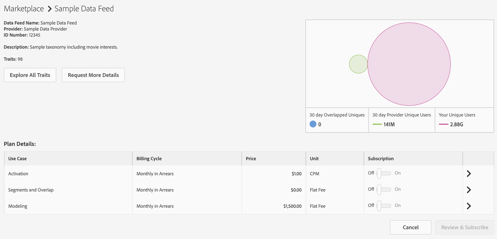

# Gestion des abonnements aux flux de données {#manage-data-feed-subscriptions}

[!UICONTROL Marketplace] est l’endroit où les acheteurs de données se rendent pour la recherche et s’abonnent aux flux de données publics et privés. Pour vous abonner à un flux de données public, procédez comme suit.

## Abonnement à un flux de données public {#subscript-public-data-feed}

[!UICONTROL Marketplace] est l’endroit où les acheteurs de données se rendent pour la recherche et s’abonnent aux flux de données publics et privés. Pour vous abonner à un flux de données public, procédez comme suit.

<!-- t_subscribe_feed.xml -->

Pour vous abonner à un flux de données public :

1. Accédez à **[!UICONTROL Audience Marketplace > Marketplace]**. Utilisez la fonction de recherche ou parcourez la liste pour trouver un flux de données.

   

1. Cliquez sur le nom du flux de données à utiliser. Cela ouvre la [page des détails du plan](../../../features/audience-marketplace/marketplace-data-buyers/marketplace-manage-subscriptions.md#marketplace-buyer-details) pour le flux sélectionné.

   

1. Sélectionnez un cas pratique dans la table des abonnements et :
   * Déplacez le curseur **[!UICONTROL Subscription]** vers **[!UICONTROL On]**.
   * Cliquez sur **[!UICONTROL Review & Subscribe]**. La fenêtre [!UICONTROL Terms and Conditions] s’ouvre alors.

   

1. Dans la fenêtre [!UICONTROL Terms and Conditions] :

   * **Important :** Laissez la  **[!UICONTROL ID sync]** case cochée. Ce paramètre permet d’améliorer les taux de correspondance avec votre fournisseur de données.
   * Cochez la case Conditions générales et cliquez sur **[!UICONTROL Accept]** pour terminer le processus d&#39;inscription.

   

### Étapes suivantes

Après vous être abonné à un flux de données :

* Vérifiez l’abonnement en vérifiant votre dossier [!UICONTROL Traits]. Voir [Stockage pour les flux de données abonnés](../../../features/audience-marketplace/marketplace-data-buyers/marketplace-manage-subscriptions.md#find-subscribed-data-fee).

* Consultez la documentation sur la facturation et le paiement. Reportez-vous aux liens connexes ci-dessous.

### Bonnes pratiques {#best-practices}

Voici un ensemble de bonnes pratiques que nous vous recommandons de suivre lorsque vous utilisez [!UICONTROL Audience Marketplace] :

Lors de l’exploration de nouveaux jeux de données tiers et de deuxième niveau via [!UICONTROL Audience Marketplace], la première étape que nous recommandons est d’activer les flux de données pour [!UICONTROL Segments & Overlap]. Cela permet aux utilisateurs d’explorer les données en créant des segments pour évaluer la taille de l’audience et en exécutant des rapports de chevauchement pour obtenir des informations initiales sur l’audience. La plupart des fournisseurs de données proposent gratuitement ce cas pratique. Vous pouvez donc effectuer cette analyse sans frais supplémentaires.

Lors de l’exécution de rapports de chevauchement, suivez ces bonnes pratiques pour vous assurer que vous obtenez des résultats utiles.

1. Assurez-vous que vos jeux de données qui se chevauchent sont similaires en termes de type de données et de méthodologies de collecte, telles que :
   * Géographie du visiteur
   * Cookie et identifiants mobiles
   * Intervalle de recherche en amont
   * Activité hors ligne ou en ligne
   * Fréquence à laquelle le fournisseur de données actualise les données

1. Le chevauchement peut légèrement augmenter au fil du temps. Dès lors, veillez à prévoir jusqu’à 30 jours avant d’exécuter les rapports de chevauchement pour permettre la synchronisation des données.
1. Le chevauchement peut augmenter si vous utilisez les données d’un fournisseur de données dans plusieurs campagnes marketing.
et les initiatives. Cela permet aux utilisateurs des deux jeux de données de se synchroniser davantage.
1. Il n’existe aucune garantie qu’il y aura un chevauchement entre vos jeux de données. Pour qu’un chevauchement soit valide, un utilisateur de l’ensemble de données du client doit être associé aux données.
ensemble de données du fournisseur pendant la période de création de rapports. Si les données multimédia du client n’ont pas été diffusées aux utilisateurs dans l’ensemble de données du fournisseur de données, il n’y aura jamais de chevauchement.
1. Ne pensez pas que les faibles chevauchements sont une mauvaise chose. Tirez parti d’un faible chevauchement pour prospect et impliquer de nouveaux utilisateurs.

## Abonnement à un flux de données privé {#subscript-private-data-feed}

Les acheteurs s’abonnent aux flux de données privés et aux plans dans **[!UICONTROL Audience Marketplace > Marketplace]**.

<!-- t_private_feed.xml -->

>[!TIP]
>
>Parfois, les fournisseurs de données peuvent offrir une remise sur un flux de données privé. Vous pouvez demander une remise lors de l’envoi de votre demande d’abonnement.

Pour vous abonner à un flux de données privé :

1. Cliquez sur le nom du flux de données dans la balise [!UICONTROL Marketplace].
1. Cliquez sur **[!UICONTROL Request Access]**. La boîte de dialogue de requête s’ouvre alors.
1. Dans la boîte de dialogue de demande, écrivez au fournisseur une note exprimant votre intérêt pour son flux de données, puis cliquez sur **[!UICONTROL Send]**. Le vendeur examinera votre message et approuvera ou rejettera votre demande. En attendant l’approbation, &quot;Demandé&quot; apparaît dans la liste [!UICONTROL Marketplace] correspondant à ce flux de données.

   * **[!UICONTROL Request approved]**: L’état de la  [!UICONTROL Marketplace] liste passe à &quot;Accès accordé&quot; et vous recevrez une notification automatisée. À ce stade, vous pouvez vous abonner au flux. Voir [S’abonner à un flux de données public](../../../features/audience-marketplace/marketplace-data-buyers/marketplace-manage-subscriptions.md#subscript-public-data-feed) pour obtenir des instructions.
   * **[!UICONTROL Request denied]**: Le texte &quot;Demandé&quot; est supprimé de la  [!UICONTROL Marketplace] liste pour le flux. Vous pouvez essayer de vous abonner à nouveau ou choisir un autre flux.

## Remises sur les flux de données pour les acheteurs {#buyer-discount}

Dans [!UICONTROL Audience Marketplace], les fournisseurs peuvent offrir aux acheteurs une remise sur le prix publié d’un flux de données [!DNL CPM] ou à taux fixe. Toutefois, les montants de remise ne sont pas visibles par les acheteurs dans la liste de flux [!DNL Marketplace]. Vous pouvez également demander une remise lorsque vous vous abonnez à un flux de données privé ou lorsque vous demandez plus d’informations sur un flux particulier.

## Demander une remise {#request-discount}

<!-- marketplace-buyer-discounts.xml -->

<table id="table_3C6E58F593BA48EC89ACBD9A26E4E74F"> 
 <thead> 
  <tr> 
   <th colname="col1" class="entry"> État de l’acheteur </th> 
   <th colname="col2" class="entry"> Description </th> 
  </tr> 
 </thead>
 <tbody> 
  <tr> 
   <td colname="col1"> 
 <b>Abonnés actuels</b> 
 </td> 
   <td colname="col2"> 
Si vous êtes déjà abonné à un flux de données privé et souhaitez demander une remise : 
 
    <ol id="ol_A58D419EBB9349E9B1225202535130F6"> 
     <li id="li_D0DDC8AC6E9C4675AA4630D63FE8F071">  Désabonnez-vous du flux de données. </li> 
     <li id="li_05A5379F2A944FB28AB39C196DDE3A1D">Contactez le fournisseur de données et demandez un prix réduit. </li> 
     <li id="li_B1B5AA6F6CC64512A02D5E8861A5F266">Si le fournisseur vous accorde une remise, réabonnez-vous au flux le jour 1st du mois suivant. </li> 
    </ol> </td> 
  </tr> 
  <tr> 
   <td colname="col1"> 
 <b>Nouveaux abonnés aux flux de données privés</b> 
 </td> 
   <td colname="col2"> 
Demandez une remise dans votre demande d'abonnement. Voir <a href="../../../features/audience-marketplace/marketplace-data-buyers/marketplace-manage-subscriptions.md#subscript-private-data-feed"> Abonnement à un flux de données privé</a>. 
 </td>
  </tr> 
  <tr> 
   <td colname="col1"> 
 <b>Abonnés potentiels</b> 
 </td> 
   <td colname="col2"> 
Un <a href="../../../features/audience-marketplace/marketplace-private-feeds.md"> abonné potentiel</a> est un acheteur de données qui a demandé l’accès à un flux de données privé, a reçu l’approbation du vendeur, mais ne s’est pas abonné au flux. Pour demander une remise en tant qu'abonné potentiel : 
 
    <ol id="ol_9CECDA92E7894B20AC8A777D78962188"> 
     <li id="li_618B64160CF24549AFCA73E006DCA35A">Accédez à <b> Audience Marketplace &gt; Marketplace</b>. </li> 
     <li id="li_FE52A06B30FC4858B48AF81954365FE9">Cliquez sur le nom du flux pour lequel vous avez été approuvé. </li> 
     <li id="li_763C050AC9464BE380D00F6085B6E540">Cliquez sur <b> Demander plus de détails</b>. Demandez au vendeur une remise dans votre demande de détails. </li> 
    </ol> </td> 
  </tr> 
 </tbody> 
</table>

## Vérification des flux réduits {#review-discounted-feeds}

Pour consulter vos flux réduits :

1. Accédez à **[!UICONTROL Audience Marketplace > Marketplace]**.
1. Cliquez sur le nom d’un flux auquel vous êtes déjà abonné.
1. Examinez les colonnes [!UICONTROL Price] et [!UICONTROL Your Price] du tableau [!UICONTROL Plan Details]. Si le flux est actualisé :

   * Le prix d&#39;origine est marqué d&#39;une ligne rouge.
   * Les frais de la colonne [!UICONTROL Your Price] seront inférieurs à ceux de la colonne [!UICONTROL Price].

Dans l&#39;exemple, l&#39;acheteur bénéficie d&#39;une remise de 10 % sur le plan [!UICONTROL Segments and Overlap] dans la balise **[!UICONTROL Software Audience Feed]**.

## Recherche de données de flux souscrits {#find-subscribed-data-fee}

Les données (caractéristiques) de vos flux de données apparaissent dans leurs propres dossiers de stockage de caractéristiques. Accédez à **[!UICONTROL Audience Data > Traits]** et développez le dossier **[!UICONTROL 3rd-Party Data]** pour afficher et utiliser les caractéristiques de vos flux abonnés. Recherchez le sous-dossier nommé en fonction de votre fournisseur de données. Ils contiennent des dossiers nommés d’après les caractéristiques individuelles du flux de données et de liste fournies par le flux.

<!-- marketplace-feed-storage.xml -->

## Désabonnement d’un flux de données {#unsubscribe}

Les acheteurs de données se désabonnent des flux de données et des plans dans **[!UICONTROL Audience Marketplace > Marketplace]**.

<!-- t_unsubscribe_feed.xml -->

Pour vous désabonner d’un flux de données :

1. Cliquez sur le nom du flux de données dans la balise [!UICONTROL Marketplace].
1. Dans la section [!UICONTROL Use Case] , recherchez le plan que vous souhaitez utiliser et déplacez le curseur **[!UICONTROL Subscription]** vers **[!UICONTROL Off]**.

## Désactivation des flux de données : Pourquoi cela se produit et comment réagir {#data-feed-deactivation-reasons}

Dans [!UICONTROL Audience Marketplace], les fournisseurs de données peuvent révoquer l’accès à vos flux de données abonnés. Ne soyez pas alarmée si ça vous arrive. Nous vous avons couvert. Consultez cette section pour connaître les processus et les procédures relatifs aux désactivations des flux de données.

## Raisons courantes de la désactivation des flux de données {#reasons-for-deactivation}

<!-- marketplace-subscriber-deactivated.xml -->

Cela peut être déroutant, voire dérangeant, si un flux auquel vous vous abonnez est désactivé. Les fournisseurs de données peuvent toutefois désactiver un flux de données pour diverses raisons. Voici quelques raisons courantes :

* **Facturation :** les fournisseurs de données désactivent un flux si vous arrivez régulièrement à payer des frais ou si vous ne payez pas vos frais.
* **Mises à jour de flux :**  les fournisseurs de données doivent désactiver les flux lorsqu’ils mettent à jour leur taxonomie de flux ou leurs structures de coûts.
* **Acheteurs inactifs :** les fournisseurs de données se réservent le droit de désactiver les flux si les abonnés n’indiquent aucune visite prolongée.
* **Vendeurs inactifs :** les fournisseurs de données qui partent  [!UICONTROL Audience Marketplace] désactivent et suppriment tous leurs flux de données.

>[!TIP]
>
>Contactez directement votre fournisseur de données si vous pensez qu’un flux de données a été désactivé par erreur. Votre [!DNL Adobe] consultant peut vous aider avec les coordonnées ou une assistance supplémentaire.

## E-mail de désactivation {#deactivation-email}

Lorsqu’un fournisseur de données désactive l’un de vos flux de données, [!DNL Audience Manager] envoie un courrier électronique aux utilisateurs de votre société disposant des autorisations [!UICONTROL Administrator]. Parfois, les filtres de courrier électronique classent ce message comme indésirable. Par conséquent, cette notification importante peut vous manquer. Pour vous aider à identifier le message de désactivation, cet email contient les éléments suivants :

* **De :** l’email de désactivation provient de  `aam-noreply@adobe.com`. Conseil : Ne répondez pas à cet email.

* **Objet :** Abonnement au  *nom du flux de données* ici Annulé.

* **Pièces jointes :** le courrier électronique comprend une pièce jointe intitulée &quot;  `list-of-affected-entities-by-feed-revocation.csv`&quot;. Il s’agit d’une manière alambiquée de dire que la pièce jointe répertorie toutes les caractéristiques incluses dans le flux annulé. En tant qu’acheteur de données, vous devez examiner cette pièce jointe. Elle vous aidera à rechercher et à supprimer les caractéristiques désactivées de vos segments et [modèles algorithmiques](../../../features/algorithmic-models/understanding-models.md).

## Liste de caractéristiques désactivée {#deactivation-trait-list}

La liste qui accompagne un email de désactivation contient les champs comme illustré ci-dessous.

<table id="table_5C3800F9D8AA43EFAB4690959A721F63"> 
 <thead> 
  <tr> 
   <th colname="col1" class="entry"> Champ </th> 
   <th colname="col2" class="entry"> Description </th> 
  </tr> 
 </thead>
 <tbody> 
  <tr> 
   <td colname="col1"> 
<b> Identifiant du flux de données</b> 
 </td> 
   <td colname="col2"> 
Identifiant du flux de données désactivé. 
 </td> 
  </tr> 
  <tr> 
   <td colname="col1"> 
<b> Nom du flux de données</b> 
 </td> 
   <td colname="col2"> 
Nom du flux de données désactivé. 
 </td> 
  </tr> 
  <tr> 
   <td colname="col1"> 
<b> SID des caractéristiques</b> 
 </td> 
   <td colname="col2"> 
ID de caractéristique désactivés. 
 </td> 
  </tr> 
  <tr> 
   <td colname="col1"> 
<b> Nom de la caractéristique</b> 
 </td> 
   <td colname="col2"> 
Noms de caractéristiques désactivés. 
 </td> 
  </tr> 
  <tr> 
   <td colname="col1"> 
<b> SID du segment</b> 
 </td> 
   <td colname="col2"> 
Identifiant du segment contenant les caractéristiques désactivées. 
 </td> 
  </tr> 
  <tr> 
   <td colname="col1"> 
<b> Nom du segment</b> 
 </td> 
   <td colname="col2"> 
Nom du segment qui contient des caractéristiques désactivées. 
 </td> 
  </tr> 
  <tr> 
   <td colname="col1"> 
<b> Identifiant du modèle Algo</b> 
 </td> 
   <td colname="col2"> 
Identifiant du modèle algorithmique contenant les caractéristiques désactivées. 
 </td> 
  </tr> 
  <tr> 
   <td colname="col1"> 
<b> Nom du modèle Algo</b> 
 </td> 
   <td colname="col2"> 
Les noms des modèles algorithmiques qui contiennent des caractéristiques désactivées. 
 </td> 
  </tr> 
 </tbody> 
</table>

## Supprimer les caractéristiques désactivées {#remove-deactivated-traits}

En tant qu’acheteur de données, vous êtes responsable de la suppression des caractéristiques d’un flux annulé de tous vos segments principaux/en cours d’utilisation ou inactifs. Les options de suppression incluent :

* Suppression en bloc avec les [API REST](../../../api/rest-api-main/rest-api-main.md) ou les [outils de gestion en bloc](../../../reference/bulk-management-tools/bulk-management-intro.md).

* Recherchez manuellement les segments affectés et supprimez les caractéristiques désactivées à l’aide de [!UICONTROL Segment Builder]. Voir [Suppression de caractéristiques d’un segment](../../../features/segments/segment-builder.md#segment-builder-controls-traits).

>[!NOTE]
>
>La suppression des caractéristiques des principaux modèles algorithmiques ou destinations affecte l’échelle et la précision du ciblage. Si possible, essayez de remplacer les caractéristiques révoquées par de nouvelles caractéristiques principales.

[Désabonnez-vous du ](../../../features/audience-marketplace/marketplace-data-buyers/marketplace-manage-subscriptions.md#unsubscribe) flux de données désactivé après avoir supprimé toutes les caractéristiques révoquées de votre compte. S’il s’agit d’une désactivation temporaire, vous pouvez vous réabonner une fois que le fournisseur de données a terminé d’apporter les modifications requises et réactivé le flux. Comme c’est souvent le cas, une bonne communication avec vos partenaires (le fournisseur de données et [!DNL Adobe]) peut vous aider à mener à bien ce processus.

## Présentation de la page des détails de la formule d’Audience Marketplace{#marketplace-buyer-details} (en anglais)

Lorsque vous cliquez sur le nom d’un plan de données dans la section [!UICONTROL Marketplace], [!DNL Audience Manager] fournit des informations qui peuvent vous aider à faire des choix éclairés concernant l’abonnement à un flux de données.

<!-- marketplace-buyer-details.xml -->

Cette page vous donne les informations suivantes :

1. **Informations de base du plan**. Cela inclut des informations sur les flux, telles que :
   * Nom du flux de données. Par exemple, comme illustré ci-dessus, le nom de ce flux est &quot;Exemple de flux de données&quot;.
   * le nom du fournisseur de données ;
   * Identifiant du flux de données ;
   * Description;
   * Nombre de caractéristiques du flux ;

1. Boutons Informations sur la planification .
   * Cliquez sur **[!UICONTROL Explore All Traits]** pour afficher les détails sur toutes les caractéristiques du flux de données sélectionné.
   * Cliquez sur **[!UICONTROL Request More Details]** pour poser des questions au fournisseur de données au sujet du flux de données sélectionné ou pour demander une remise. Cette fonctionnalité envoie directement vos commentaires et vos questions au fournisseur de données.

1. Mesures du rapport Flux de données. Le diagramme de Venn (et les mesures associées) montre les données de chevauchement des caractéristiques des 30 derniers jours. Voir [The Marketplace : À propos de ](marketplace-data-buyers.md#about-marketplace) pour plus d’informations.
   * **[!UICONTROL 30 Day Overlapped Uniques]**: Nombre d’utilisateurs uniques de votre compte qui chevauchent les utilisateurs du compte du fournisseur. Pour obtenir une définition des utilisateurs uniques, voir AAM UUID dans l’[Index des identifiants dans Audience Manager](/help/using/reference/ids-in-aam.md).
   * **[!UICONTROL 30 Day Provider Unique Users]**: Nombre d’utilisateurs uniques provenant du compte du fournisseur.
   * **[!UICONTROL Your Unique Users]**: Nombre d’utilisateurs uniques provenant de votre compte.

1. **[!UICONTROL Plan Details]** Tableau. Ce tableau présente les cas d’utilisation pour lesquels vous pouvez vous abonner au flux de données, ainsi que son modèle de tarification. Voir [Présentation des cas d’utilisation des flux de données](#use-cases).

1. Boutons Planifier l’action.
   * Cliquez sur **[!UICONTROL Cancel]** pour quitter la page sans apporter de modifications.
   * Cliquez sur **[!UICONTROL Review & Subscribe]** pour vous abonner à un flux de données. Ce bouton est grisé jusqu’à ce que vous basculez un bouton [!UICONTROL Subscription] sur [!UICONTROL On]. Voir aussi [S’abonner à un flux de données public](#subscript-public-data-feed) et [S’abonner à un flux de données privé](#subscript-private-data-feed).

## Présentation des cas d’utilisation des flux de données {#use-cases}

En tant qu’acheteur de données [!UICONTROL Audience Marketplace], vous pouvez acheter des données pour des cas d’utilisation de chevauchement, de modélisation et d’activation. Chaque cas d’utilisation est conçu à des fins spécifiques et limite ce que vous pouvez faire avec les données. Ces descriptions de cas d’utilisation peuvent vous aider à prendre la bonne décision concernant le type de plan de données à acheter.

## Comparaison avec des segments et des plans de chevauchement {#comparisons}

<!-- c_use_cases_for_buyers.xml -->

### Segments et chevauchement

Ce cas pratique vous permet de comparer vos caractéristiques aux caractéristiques du fournisseur dans un rapport de chevauchement [caractéristique à caractéristique.](../../../reporting/dynamic-reports/trait-trait-overlap-report.md#trait-to-trait-overlap-report) En outre, vous pouvez créer ou ajouter des caractéristiques de fournisseur à un segment et effectuer des comparaisons supplémentaires avec les rapports  [segment-](../../../reporting/dynamic-reports/segment-trait-overlap-report.md) traçage et  [segment-à-](../../../reporting/dynamic-reports/segment-segment-overlap-report.md) segment. Les comparaisons de chevauchement peuvent vous aider :

* **Étendre la portée de l’audience :** un faible chevauchement suggère que vos caractéristiques contiennent des utilisateurs que vous n’avez jamais vus auparavant. Vous souhaitez peut-être que ces caractéristiques tentent d’atteindre de nouveaux utilisateurs.
* **Améliorer les audiences existantes :** Un chevauchement élevé suggère que vos caractéristiques sont similaires à celles détenues par le fournisseur de données. Vous souhaitez peut-être que ces caractéristiques contribuent à améliorer progressivement et de manière ciblée une audience déjà développée.

### Modèles algorithmiques

Ce cas pratique vous permet d’évaluer les caractéristiques du fournisseur par rapport à vos caractéristiques avec la [modélisation algorithmique](../../../features/algorithmic-models/understanding-models.md#understanding-models). Par exemple, notre système de modélisation algorithmique utilise l’une de vos caractéristiques comme base de comparaison par rapport à une caractéristique du fournisseur. Lorsque le modèle s’exécute, il peut indiquer si les audiences des caractéristiques du fournisseur partagent des attributs de conversion similaires à vos caractéristiques.

### Activation

Ce cas pratique vous permet d’envoyer des données vers une [destination](../../../features/destinations/destinations.md). Dans [!DNL Audience Manager], une destination est un système tiers (serveur publicitaire, [!DNL DSP], [!DNL DMP], échange, etc.) avec lequel vous souhaitez partager des données. Toutefois, avec un cas d’utilisation [!UICONTROL Activation], vous ne pouvez pas exécuter de rapports de chevauchement ou tester les données dans un modèle algorithmique.

>[!MORELIKETHIS]
>
>* [Affectation de facturation et d’impressions pour les flux de données CPM](../../../features/audience-marketplace/marketplace-data-buyers/marketplace-buyer-billing.md#cost-attribution)
* [Affectation de facturation et d’impressions pour les flux de données de flux plats](../../../features/audience-marketplace/marketplace-data-buyers/marketplace-buyer-billing.md)
* [Comment signaler l’utilisation du CPM](../../../features/audience-marketplace/marketplace-data-buyers/marketplace-buyer-billing.md#report-cpm-usage)
* [Abonnement à un flux de données public](../../../features/audience-marketplace/marketplace-data-buyers/marketplace-manage-subscriptions.md#subscript-public-data-feed)
* [Remises pour les acheteurs de données](../../../features/audience-marketplace/marketplace-data-buyers/marketplace-manage-subscriptions.md#buyer-discount)
* [The Marketplace : A propos](../../../features/audience-marketplace/marketplace-data-buyers/marketplace-data-buyers.md#about-marketplace)

