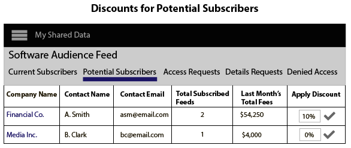

# Création, tarification et gestion des flux de données {#create-price-and-manage-data-feeds}

## Création d’un flux de données public ou privé {#create-public-private-data-feed}

Un flux de données nécessite un nom, une description, une source de données et un type de plan. Les flux sont désactivés jusqu’à ce que vous enregistriez et activiez le flux. Configurez des flux de données publics ou privés dans **[!UICONTROL Audience Marketplace > My Shared Data]**. Disponible uniquement pour les vendeurs de données.

<!-- t_data_feed.xml -->

Vous devez disposer de droits d’administrateur pour créer un flux de données public ou privé.
Pour créer un flux de données :

1. Cliquez sur **[!UICONTROL New Data Feed]**.
1. Nommez le flux de données. Les acheteurs de données peuvent rechercher votre flux en fonction de son nom.
1. Fournissez une brève description (255 caractères maximum).

   Une bonne description doit décrire votre flux avec précision. Par exemple, vous pouvez inclure du texte pour les catégories marketing, les données démographiques et la couverture géographique (par exemple, [!DNL US] ou Amérique du Nord). Le texte de description peut faire l’objet de recherches et aide les acheteurs à trouver ou à évaluer votre flux. Une bonne description est un élément important pour attirer les abonnés à votre flux de données.
1. Sélectionnez une source de données parmi les options **[!UICONTROL Data Source]**. Les flux de données sont limités à une seule source de données. Vous ne pouvez pas affecter plusieurs sources de données au même flux de données.

   >[!IMPORTANT]
   >
   >Toutes les caractéristiques actuelles et futures appartenant à cette source de données seront partagées avec vos acheteurs de données, dans le cadre de ce flux.

1. Dans [!UICONTROL Plan Types], sélectionnez les options à utiliser et cliquez sur **[!UICONTROL Add Plan]**.

   Les flux peuvent contenir plusieurs plans. Les plans peuvent contenir plusieurs cas d’utilisation. Pour plus d’informations, voir [Planification des types pour les flux de données](../../../features/audience-marketplace/marketplace-data-providers/marketplace-create-manage-feeds.md#plan-types).

1. Cliquez sur **[!UICONTROL Save]** pour enregistrer votre flux de données *sans l’activer.*
1. Pour enregistrer et activer un flux de données :
   1. Déplacez le curseur **[!UICONTROL Availability]** vers **[!UICONTROL Active]**.
   1. Cliquez sur **[!UICONTROL Save]**.

   >[!NOTE]
   >
   >* Les flux de données enregistrés et activés ne peuvent pas être supprimés.
   >* Les acheteurs ne voient que les flux actifs.

### Facultatif : création d’un flux de données privé

Dans la section [!UICONTROL Settings] , déplacez le curseur vers :

* **[!UICONTROL Private]** et **[!UICONTROL Branded]** : la liste [!UICONTROL Marketplace] de l’acheteur affiche le nom du vendeur dans la colonne du fournisseur et toutes les autres données sont masquées.

* **[!UICONTROL Private]** et **[!UICONTROL Unbranded]** : la liste [!UICONTROL Marketplace] de l’acheteur affiche uniquement le nom et la description du flux de données. Le nom du fournisseur de données s’affiche sous la forme [!UICONTROL Private Seller].

Pour voir à quoi ressemble un flux privé pour les acheteurs, reportez-vous à la section acheteurs dans [Flux de données privés](../../../features/audience-marketplace/marketplace-private-feeds.md).

## Désactivation du flux de données d’un abonné {#deactivate-data-feed}

En tant que fournisseur de données [!UICONTROL Audience Marketplace], vous pouvez révoquer l’accès de l’acheteur à un flux de données abonné. Vous pouvez supprimer un acheteur d’un flux pour des raisons telles que le paiement tardif/le non-paiement des frais ou s’il utilise incorrectement les données de caractéristiques.

<!-- marketplace-deactiva4te-subscribers.xml -->

Pour révoquer un abonné :

1. Dans [!UICONTROL My Shared Data], recherchez le flux que l’abonné utilise.

   >[!NOTE]
   >
   >Les flux de données dont les comptes sont en retard sont marqués par une icône en forme de triangle/point d’exclamation.

1. Dans la colonne [!UICONTROL Subscribers], cliquez sur le nombre bleu qui compte les abonnés pour ce flux. La page de détails de l’abonnement s’ouvre.
1. Déplacez le curseur **[!UICONTROL Subscription]** vers **[!UICONTROL Off]**. Une boîte de dialogue de confirmation s’ouvre alors.
1. Dans la fenêtre contextuelle [!UICONTROL Confirmation], cliquez sur **[!UICONTROL Yes]** pour désactiver un abonnement ou **[!UICONTROL Cancel]** pour quitter sans apporter de modifications à l&#39;abonnement.

### Que se passe-t-il après la désactivation d’un abonné

Révoquer l’accès à un flux de données envoie un courrier électronique de notification à tous les utilisateurs administrateurs du compte de l’acheteur de données. Le courrier électronique comprend une pièce jointe qui répertorie les caractéristiques révoquées. Cette liste permet aux abonnés de rechercher et de supprimer des caractéristiques désactivées de leurs segments et modèles.

### Facturation et désactivation des flux

Une fois que vous avez supprimé l’accès à un flux de données, les abonnés sont responsables des frais pour le mois précédent ou actuel, selon le moment où vous avez désactivé le flux.

## Planification des types pour les flux de données {#plan-types}

[!DNL Plan types] sont des composants essentiels d’un flux de données [!UICONTROL Audience Marketplace]. En tant que fournisseur de données, ils vous permettent de créer plusieurs cas d’utilisation et options de prix pour vos flux. En outre, il peut s’avérer judicieux de créer quelques plans pour chaque flux de données. Les acheteurs peuvent ainsi choisir entre différentes options lorsqu’ils recherchent des données à modéliser ou à envoyer à une destination.

[Créez un flux de données](../../../features/audience-marketplace/marketplace-data-providers/marketplace-create-manage-feeds.md#create-public-private-data-feed) pour sélectionner [!UICONTROL Plan Types].

## Types de plan et options de cas d’utilisation {#plan-types-use-cases}

<!-- c_feed_options.xml -->

Les paramètres [!UICONTROL Use Case] permettent aux vendeurs de contrôler la manière dont les acheteurs peuvent utiliser vos données.

### Segments et chevauchement

Un cas d’utilisation de **[!UICONTROL Segments and Overlap]** crée un plan qui permet aux acheteurs de comparer les données de caractéristiques dans un [rapport de chevauchement de caractéristiques](../../../reporting/dynamic-reports/trait-trait-overlap-report.md#trait-to-trait-overlap-report). En outre, les acheteurs peuvent ajouter vos données aux segments et effectuer des comparaisons avec les rapports [segment-à-caractéristique](../../../reporting/dynamic-reports/segment-trait-overlap-report.md) et [segment-à-segment](../../../reporting/dynamic-reports/segment-segment-overlap-report.md).

Chaque flux de données doit inclure au moins un cas d’utilisation [!UICONTROL Segments and Overlap]. Les acheteurs ne peuvent pas s’abonner à d’autres plans dans un flux de données si le flux ne contient pas de cas d’utilisation [!UICONTROL Segments and Overlap], soit seul, soit en combinaison avec un autre cas d’utilisation.

Les comparaisons de chevauchement peuvent aider les acheteurs :

* **Étendre la portée de l’audience :** Un faible chevauchement suggère que vos caractéristiques contiennent des utilisateurs que l’acheteur n’a jamais vus auparavant. Par conséquent, les acheteurs peuvent souhaiter que ces caractéristiques ajoutent de nouveaux utilisateurs à leurs segments d’audience.
* **Améliorer les audiences existantes :** Un chevauchement élevé suggère que vos caractéristiques contiennent des utilisateurs similaires à ceux qu’un acheteur connaît déjà. Par conséquent, les acheteurs peuvent souhaiter que ces caractéristiques contribuent à améliorer progressivement et de manière ciblée les audiences développées.

Mettez en prix ce cas pratique comme suit :

* Unité de mesure : frais plats
* Prix : Gratuit (0,00 $)

### Modélisation

Un cas d’utilisation de **[!UICONTROL Modeling]** crée un plan qui permet aux acheteurs de comparer leurs caractéristiques à la leur avec la [modélisation algorithmique](../../../features/algorithmic-models/understanding-models.md#understanding-models). Les acheteurs examinent les résultats du modèle pour trouver de nouvelles audiences dans vos données qui partagent des attributs de conversion similaires à leurs propres audiences. Mettez en prix ce cas pratique comme suit :

* Unité de mesure : frais plats
* Prix : Prix réduit ou prix du marché

### Activation

Un cas d’utilisation **[!UICONTROL Activation]** permet aux acheteurs d’envoyer des données à une [destination](../../../features/destinations/destinations.md). Avec ce cas d’utilisation, les acheteurs ne peuvent pas comparer les données à un rapport de chevauchement ou dans un modèle algorithmique. Mettez en prix ce cas pratique comme suit :

* Unité de mesure : [!DNL CPM]
* Prix : [!DNL CPM] rate du marché

## Options de facturation et de prix {#billing}

Les options de facturation et de prix contrôlent comment les acheteurs paient pour vos données.

<table id="table_CCEAAF24295942EA82F20753827D1A23"> 
 <thead> 
  <tr> 
   <th colname="col1" class="entry"> Option </th> 
   <th colname="col2" class="entry"> Description </th>
  </tr> 
 </thead>
 <tbody> 
  <tr> 
   <td colname="col1"> <b> Cycle de facturation</b> </td> 
   <td colname="col2"> <b> Mensuel en arréars</b> est la seule option. Le cycle de facturation se termine le 10 de chaque mois. </td> 
  </tr> 
  <tr> 
   <td colname="col1"> <b> Unité de mesure</b> </td> 
   <td colname="col2">Imputer les acheteurs de données sur un taux CPM ou sur un forfait. 
    <ul id="ul_D5F125E0F7364C568D9F3107E090059D"> 
     <li id="li_A79F47FFC1DC4B9DADC014621A9C12A1"> Avec la tarification CPM, les acheteurs de données doivent auto-signaler l’utilisation. </li> 
     <li id="li_DFED3194854A492F9DD0E7BA1A655E96">Avec le prix fixe, les acheteurs de données ne signalent pas l’utilisation, car ils sont facturés à un taux fixe. </li> 
    </ul> </td>
  </tr> 
  <tr> 
   <td colname="col1"> <b> Price</b> </td>
   <td colname="col2"> Le montant qu'un vendeur demande à l'acheteur en tant que taux CPM ou prix forfaitaire, en dollars. </td>
  </tr> 
 </tbody> 
</table>

## Notes de mise à jour {#plan-notes}

Dans le champ **[!UICONTROL Additional Notes]** , prenez du temps pour décrire chaque plan de données dans un flux. Une description rapide et précise permet aux acheteurs de comprendre le contenu ou l’objectif de chaque plan dans un flux de données. Les acheteurs peuvent lire les flux de données et planifier des descriptions lorsqu’ils recherchent ou évaluent de nouvelles sources de données.

## Gestion des demandes de flux de données privés {#manage-private-requests}

Workflows des fournisseurs pour la gestion des demandes de flux privés de la part des acheteurs.

Pour examiner, approuver ou rejeter les demandes d’acheteurs, accédez à [!UICONTROL My Shared Data] et :

<!-- t_private_feed_workflows.xml -->

1. Cliquez sur le nom du flux de données privé.
2. Cliquez sur **[!UICONTROL Access Requests]** pour passer en revue tous les acheteurs qui souhaitent accéder à votre flux de données.
3. Dans la section [!UICONTROL Allow Access] de chaque zone de demande, cliquez sur la coche pour approuver une demande ou sur le X pour refuser l’accès.
4. Confirmez ou annulez l’action sélectionnée dans la fenêtre contextuelle de confirmation.

## Remises pour les fournisseurs de données {#discounts}

Dans [!UICONTROL Audience Marketplace], les remises vous permettent de réduire le prix publié d’un flux de données pour les abonnés individuels. Vous pouvez proposer des remises aux abonnés qui ont soumis une demande d’abonnement ou aux abonnés qui ont demandé des détails sur un flux de données. Des remises s’appliquent à [!DNL CPM] et aux flux à taux fixe. Des remises peuvent s’avérer utiles lorsque vous souhaitez proposer des avantages d’abonnement pour de nouveaux clients ou pour récompenser la fidélité de vos clients.

## Application de remises à un flux de données {#apply-discounts}

<!-- marketplace-seller-discounts.xml -->

Pour réduire un flux, ajoutez un montant de remise en % au champ de remise et confirmez vos modifications. Les fournisseurs de données peuvent réduire un flux de données dans [!UICONTROL Audience Marketplace] de l’une des façons suivantes :

* **[!UICONTROL My Shared Data > Potential Subscribers]**
* **[!UICONTROL My Shared Data > Details Requests]**

Dans ces exemples, le vendeur a ajouté une remise de 10 % au flux de données [!UICONTROL Software Audience].

## Vérification de flux réduits {#review-discounted-feeds}

Les fournisseurs de données peuvent voir tous leurs abonnés et flux réduits dans **[!UICONTROL Audience Marketplace > My Shared Data > Current Subscribers]**.

>[!MORELIKETHIS]
>
>* [Flux de données privés](../../../features/audience-marketplace/marketplace-private-feeds.md)
