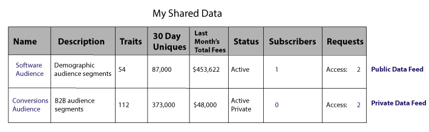

# Flux de données privés {#private-data-feeds}

Un flux de données privé est une option qui permet aux fournisseurs de limiter l’accès des acheteurs à leurs données. Les fournisseurs de données et les acheteurs doivent consulter ces informations avant de créer des flux de données privés et de s’y abonner.

<!-- c_marketplace_privatefeed.xml -->

## Flux de données privés pour les fournisseurs {#private-data-feeds-providers}

En tant que fournisseur, vos flux de données peuvent être publics ou privés. Un flux de données privé vous permet de limiter l’accès de l’acheteur à vos données, y compris le nom du vendeur de données. Vous pouvez créer un flux de données privé pour proposer des offres spéciales, des remises ou lorsque le contrôle de la confidentialité et de l’accès est important. Avec un flux de données privé, vous pouvez examiner et approuver les demandes d’acheteur. Une fois une requête approuvée, le flux ressemble à un flux de données public destiné à l’acheteur. Vous pouvez afficher et gérer tous vos flux dans **[!UICONTROL Audience Marketplace > My Shared Data]**. Comme illustré ci-dessous, ce type de flux est marqué "Privé" dans la colonne d’état.

### Gestion des requêtes de flux

En cliquant sur le nom d’un flux de données privé, vous [!UICONTROL My Shared Data] accédez à une page qui contient plusieurs onglets. Cliquez sur un onglet pour gérer vos requêtes de flux de données privées.

Le tableau suivant définit le ou les rôles fournis par chaque onglet d’action.

<table id="table_AFB429CA52A34658859448D9A5215F9F"> 
 <thead> 
  <tr> 
   <th colname="col1" class="entry"> Tabulation </th> 
   <th colname="col2" class="entry"> Description </th> 
  </tr> 
 </thead>
 <tbody> 
  <tr> 
   <td colname="col1"> 
 <b> Abonnés actuels</b> 
 </td> 
   <td colname="col2"> 
Répertorie les acheteurs approuvés qui se sont abonnés à un flux de données privé. 
 </td> 
  </tr> 
  <tr> 
   <td colname="col1"> 
 <b> Abonnés potentiels</b> 
 </td> 
   <td colname="col2"> 
Répertorie les acheteurs approuvés qui ne se sont pas abonnés à un flux de données privé. 
 
Une approbation permet aux acheteurs d’afficher un flux de données comme s’il était public. Cela leur permet de consulter et d’évaluer vos flux avant de s’abonner. Vous pouvez également proposer des remises sur les flux de données aux acheteurs répertoriés comme abonnés potentiels. Une fois que l’acheteur s’est abonné, son profil passe aux abonnés <b></b>actuels. 
 </td>
  </tr> 
  <tr> 
   <td colname="col1"> 
 <b> Demandes d’accès</b> 
 </td>
   <td colname="col2"> 
Répertorie les nouvelles demandes d’abonnement pour un flux de données privé. Cliquez sur cet onglet pour examiner, approuver ou rejeter les demandes d’acheteur. 

    <ul id="ul_BE0A835A90B14C05B3F63226B79D052D"> 
     <li id="li_2C5686CEB6F4430BA18AED5AD75C330A">Les acheteurs approuvés passent aux abonnés <b> potentiels</b>. </li>
     <li id="li_929591FCF81E43A3881813BDBD3AC278">Les acheteurs rejetés passent à Accès <b></b>refusé. </li>
    </ul> </td>
  </tr>
  <tr> 
   <td colname="col1"> 
 <b> Demandes de détails</b> 
 </td>
   <td colname="col2"> 
Répertorie les acheteurs approuvés qui ne se sont pas encore abonnés à un flux de données et qui ont demandé plus d’informations sur vos flux. 
 
Une approbation permet aux acheteurs d’afficher un flux de données comme s’il était public. Cela leur permet de consulter et d’évaluer vos flux avant de s’abonner. Vous pouvez également proposer des remises sur les flux de données aux acheteurs qui demandent un accès. La réponse à une demande de détails supprime le profil de l’acheteur de cet onglet. S’ils ne se sont pas abonnés, le profil d’acheteur est toujours dans les Abonnés <b></b>potentiels. 
 </td>
  </tr>
  <tr> 
   <td colname="col1"> 
 <b> Accès refusé</b> 
 </td> 
   <td colname="col2"> 
Répertorie les demandes d’abonnement rejetées pour un flux de données privé. 
 
Pour réapprouver les acheteurs refusés, définissez le statut  de rejet sur Autoriser <b></b>. L’acheteur est ainsi dirigé vers les abonnés <b></b>potentiels. 
 </td> 
  </tr> 
 </tbody> 
</table>

### Étapes suivantes

La documentation suivante peut vous aider à commencer à utiliser des flux de données privés.

* [Création d’un flux de données public ou privé](../../features/audience-marketplace/marketplace-data-providers/marketplace-create-manage-feeds.md#create-public-private-data-feed)
* [Révision, approbation ou rejet de requêtes de flux privés](../../features/audience-marketplace/marketplace-data-providers/marketplace-create-manage-feeds.md#manage-private-requests)
* [Flux de données privés pour les acheteurs](../../features/audience-marketplace/marketplace-private-feeds.md#private-data-feeds-for-buyers)

## Flux de données privés pour les acheteurs {#private-data-feeds-for-buyers}

En tant qu’acheteur, les flux de données privés apparaissent dans [Marketplace](../../features/audience-marketplace/marketplace-data-buyers/marketplace-data-buyers.md#about-marketplace) comme toute autre offre. Toutefois, dans ce cas, la liste des flux n’affiche pas d’informations récapitulatives sur les caractéristiques, les utilisateurs uniques et les chevauchements d’utilisateurs. Le vendeur de données peut également afficher ou masquer son nom dans la [!UICONTROL Provider] colonne de la [!UICONTROL Marketplace] liste. Une fois que le vendeur a approuvé votre demande d’abonnement, toutes les données d’un flux privé sont mises à votre disposition (il fonctionne comme un flux public). L’ [!UICONTROL Marketplace] exemple ci-dessous répertorie les 3 différents types de flux disponibles en tant qu’acheteur.

Les types de flux comprennent :

Le tableau décrit comment ces différents types de flux affichent ou masquent les données.

<table id="table_41D4A798ACF548A3A03ACB427CA4652D"> 
 <thead> 
  <tr> 
   <th colname="col1" class="entry"> Type de flux  </th> 
   <th colname="col2" class="entry"> Description </th> 
  </tr> 
 </thead>
 <tbody> 
  <tr> 
   <td colname="col1"> 
<b> Public</b> 
 </td> 
   <td colname="col2"> 
Le nom, la caractéristique et les données uniques du fournisseur apparaissent dans la liste. 
 </td> 
  </tr> 
  <tr> 
   <td colname="col1"> 
<b> Privé sans marque</b> 
 </td> 
   <td colname="col2"> 
Le nom du fournisseur est défini sur "Vendeur privé" et vous ne pouvez pas voir le nombre de caractéristiques, les données uniques et les données de chevauchement de caractéristiques. 
 </td> 
  </tr> 
  <tr> 
   <td colname="col1"> 
<b> Privé avec marque</b> 
 </td> 
   <td colname="col2"> 
Le nom du fournisseur s’affiche dans la liste, mais vous ne pouvez pas voir le nombre de caractéristiques, les données uniques et les données de chevauchement de caractéristiques. 
 </td> 
  </tr> 
 </tbody> 
</table>

### Étapes suivantes

Voir [Abonnez-vous à un flux](../../features/audience-marketplace/marketplace-data-buyers/marketplace-manage-subscriptions.md#subscript-private-data-feed) de données privé pour demander un accès.

## Configuration de la relation de partage entre le fournisseur de données et l’acheteur de données {#set-up-sharing-relationship}

### Étape 1 - Activation - Fournisseur de données et acheteur de données

La première étape du processus nécessite l’intervention du service de conseil ou du service à la clientèle d’Adobe. Le fournisseur de données et l’acheteur de données doivent contacter le service de conseil d’Adobe ou le service à la clientèle pour demander l’activation.

### Étape 2 - Fournisseur de données - Créer une source de données

Dans votre compte Audience Manager, créez une source de données de cookie avec :

* **ID** Audience Manager comme clé entrante ;
* L’option **Partager activé** est cochée.

Une fois que vous avez cliqué sur **Enregistrer**, un nouveau sous-dossier est automatiquement créé dans Stockage des **caractéristiques &gt; Données** tierces.

### Étape 3 - Fournisseur de données - Identifier les caractéristiques du partage

Au cours de cette étape, vous identifiez les caractéristiques que vous souhaitez partager avec votre partenaire. Vous pouvez créer de nouvelles caractéristiques ou modifier des caractéristiques existantes. Dans tous les cas, vous avez besoin des caractéristiques suivantes :

* À associer à la source de données que vous avez créée dans le cadre de l’étape 2.
* À stocker dans le sous-dossier nouvellement créé, sous Données tierces.

En savoir plus sur la [création de caractéristiques](/help/using/features/traits/create-onboarded-rule-based-traits.md) et la [modification de caractéristiques](/help/using/features/traits/manage-trait-rules.md#edit-trait).

### Étape 4 - Fournisseur de données - Créer un flux de données

Créez ensuite un flux de données pour partager vos caractéristiques avec l’acheteur de données. Reportez-vous à la section [Création d’un flux](/help/using/features/audience-marketplace/marketplace-data-providers/marketplace-create-manage-feeds.md) de données public ou privé pour savoir comment créer un flux de données.

>[!IMPORTANT]
>
>Dans Paramètres, sélectionnez l’option Privé. Si vous définissez ce champ sur Public, tout client Audience Marketplace peut s’abonner à votre flux.

### Étape 5 - Acheteur de données - Demande d'accès

Accédez à **Audience Marketplace &gt; Marketplace**. Recherchez le flux de données créé par le fournisseur de données à l’étape précédente. Cliquez sur **Demander l’accès**. Le contact désigné du côté du fournisseur de données recevra désormais une notification par courrier électronique. Voir aussi [S’abonner à un flux](/help/using/features/audience-marketplace/marketplace-data-buyers/marketplace-manage-subscriptions.md#subscript-private-data-feed)de données privé.

### Étape 6 - Fournisseur de données - Octroi d’un accès

Accédez à **Audience Marketplace &gt; Mes données** partagées et recherchez le flux que vous avez créé à l’étape 4. Cliquez sur dans la nouvelle requête d’accès et cliquez sur **Autoriser l’accès** pour approuver la requête. Voir aussi [Réviser, Approuver ou Rejeter les requêtes](/help/using/features/audience-marketplace/marketplace-data-providers/marketplace-create-manage-feeds.md#manage-private-requests)de flux privés.

### Étape 7 - Acheteur de données - Activer l'abonnement

Une fois que le fournisseur de données a autorisé l’accès au flux de données, vous pouvez voir le flux dans votre compte dans **Audience Marketplace &gt; Marketplace**. Passez en revue les détails, activez le bouton Abonnement, puis cliquez sur **Révision et abonnement**. Voir [Stockage pour les flux](/help/using/features/audience-marketplace/marketplace-data-buyers/marketplace-manage-subscriptions.md#find-subscribed-data-fee) de données abonnés pour en savoir plus sur l’emplacement des caractéristiques tierces.

Veuillez noter que ces caractéristiques ne peuvent être modifiées que dans le compte du fournisseur de données.

