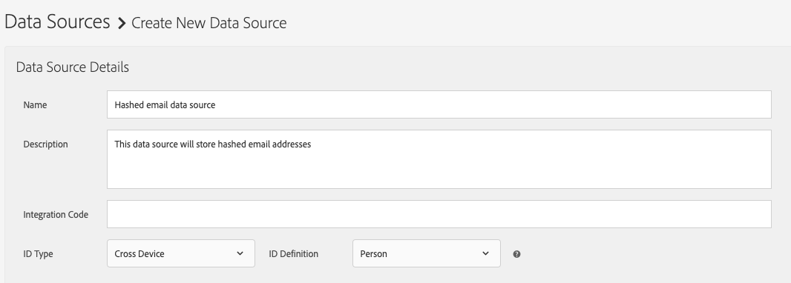
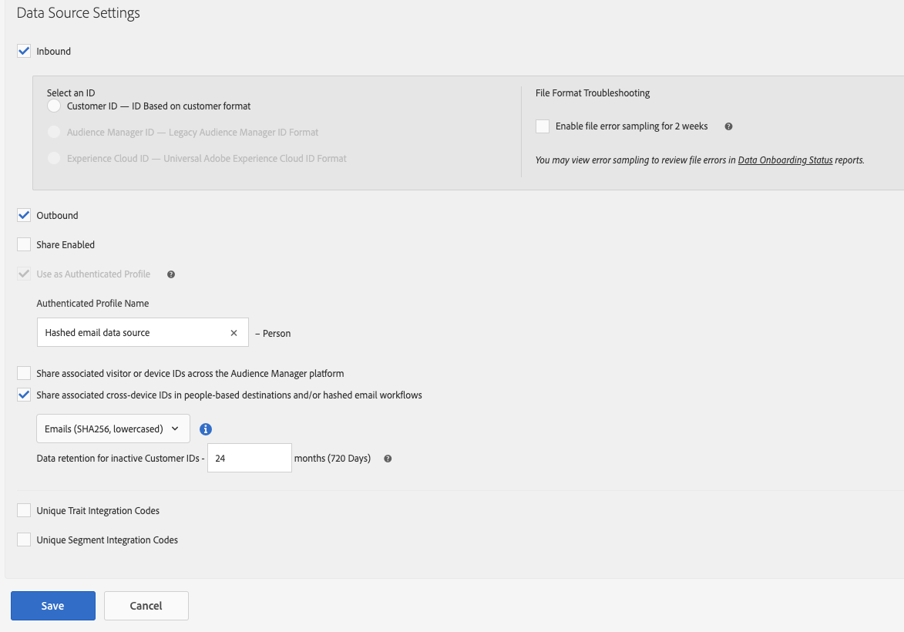

# Configurer une source de données pour les workflows d’e-mail hachés

Les workflows d’e-mail hachés, tels que les destinations basées sur les personnes, nécessitent que vous créiez une source de données pour stocker les adresses e-mail hachées.

Suivez les étapes ci-dessous pour créer et configurer une source de données pour les e-mails hachés.

1. Connectez-vous à votre compte Audience Manager, accédez à **[!UICONTROL Audience Data]** -> **[!UICONTROL Data Sources]**, puis cliquez sur **[!UICONTROL Add New]**.
1. Saisissez un **[!UICONTROL Name]** et une **[!UICONTROL Description]** pour votre nouvelle source de données.
1. Dans le menu déroulant **[!UICONTROL ID Type]**, sélectionnez **[!UICONTROL Cross Device]**.
   
1. Dans la section **[!UICONTROL Data Source Settings]**, sélectionnez les options **[!UICONTROL Inbound]** et **[!UICONTROL Outbound]**, puis activez l’option **[!UICONTROL Share associated cross-device IDs in people-based destinations]**.
1. Utilisez le menu déroulant pour sélectionner le libellé de **[!UICONTROL Emails(SHA256, lowercased)]** de cette source de données.

   >[!IMPORTANT]
   >
   >Cette option étiquette uniquement la source de données comme contenant des données hachées avec cet algorithme spécifique. Audience Manager ne hache pas les données à cette étape. Assurez-vous que les adresses e-mail que vous prévoyez de stocker dans cette source de données sont déjà hachées avec l’algorithme [!DNL SHA256]. Sinon, vous ne pourrez pas l’utiliser pour les workflows d’e-mail hachés.

   
