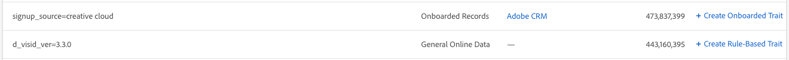

# Créer des caractéristiques à partir de signaux

Créer de nouvelles caractéristiques à partir de tous les signaux, y compris ceux qui sont déjà utilisés dans les caractéristiques, et capturer les audiences futures qui se qualifient après la création de caractéristiques. Regardez la vidéo pour une démonstration rapide ou lisez-la pour obtenir des informations détaillées :

>[!VIDEO](https://video.tv.adobe.com/v/25169/?quality=12)

## Créer des caractéristiques à partir du Tableau de bord de signal {#create-traits-from-signal-dashboard}

Le [!UICONTROL Signal Dashboard] permet de créer de nouvelles caractéristiques à partir des recherches [!UICONTROL Top Unused Signals], [!UICONTROL New Unused Signals]et enregistrées.

Lorsque vous créez une nouvelle caractéristique, le type de caractéristique est prédéfini en fonction du type de signal :

* **[!UICONTROL Rule-based]** caractéristiques des signaux en temps réel, des fichiers journaux exploitables et des [!DNL Adobe Analytics] signaux ;

* **[!UICONTROL Onboarded]** caractéristiques des signaux embarqués.

Pour créer de nouvelles caractéristiques à partir de la **[!UICONTROL Signal Dashboard]** caractéristique, identifiez le signal que vous souhaitez utiliser dans la caractéristique, puis cliquez sur le **[!UICONTROL Create Rule-Based Trait]** lien ou le lien correspondant **[!UICONTROL Create Onboarded Trait]** .

Vous serez redirigé vers le créateur **[de](../../features/traits/about-trait-builder.md)**caractéristiques pour créer vos nouvelles caractéristiques.

## Créer des caractéristiques à partir de la recherche de signaux {#create-traits-from-signal-search}

Créez des caractéristiques basées sur des signaux utilisés ou inutilisés qui ne sont pas affichés dans le [!UICONTROL Signal Dashboard].

Recherchez des signaux spécifiques et créez des caractéristiques basées sur des règles ou des caractéristiques intégrées basées sur les résultats. Voici comment procéder :

1. Accédez à **[!UICONTROL Audience Data > Signals > Search]** et exécutez une recherche basée sur les paires clé-valeur que vous recherchez, ou cliquez **[!UICONTROL Search]** sans entrer de paire clé-valeur pour afficher tous les résultats.
2. Identifiez le ou les signaux que vous souhaitez utiliser dans la caractéristique, dans la liste de résultats.
   * Pour créer une caractéristique à partir d’un signal, cliquez sur le lien correspondant **[!UICONTROL Create Rule-Based Trait]** ou **[!UICONTROL Create Onboarded Trait]** le lien correspondant.
   * Pour créer une caractéristique à partir de plusieurs signaux, cochez la case correspondante de chaque signal, puis cliquez sur **[!UICONTROL Create Trait from Multiple Signals]**.
   >[!NOTE]
   >Vous pouvez seulement créer des caractéristiques à partir de signaux du même type. Vous ne pouvez pas créer une caractéristique basée sur une combinaison d’un signal en temps réel et d’un signal intégré.
   >
   > 
   >Vous pouvez aussi créer des traits à partir de signaux usagés. Le nombre de caractères affichés dans la **[!UICONTROL Included in Traits]** colonne correspond aux signaux déjà utilisés dans les caractéristiques. Cliquez sur la flèche pour afficher les caractéristiques qui incluent le signal.
   >
   >

3. Utilisez le créateur **[de](../../features/traits/about-trait-builder.md)**caractéristiques pour créer vos nouvelles caractéristiques.
