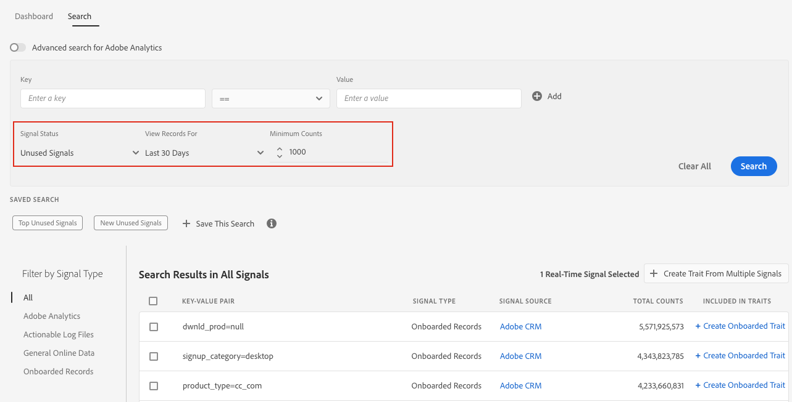

# Signaux de recherche par Filtres {#search-signals-by-filters}

Laissez les champs de valeur de clé vides pour rechercher une plus grande plage de signaux et utilisez les filtres disponibles pour restreindre les résultats.

Utilisez cette méthode lorsque vous n’avez pas en tête de paire clé-valeur spécifique, mais que vous souhaitez voir l’évolution de signaux multiples sur une période spécifique.

Dans l’exemple ci-dessous, les filtres sont configurés pour afficher tous les signaux inutilisés des 30 derniers jours avec un nombre minimum de 1000.

