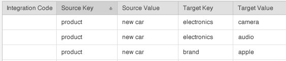

# Derived Signals {#derived-signals}

A [!UICONTROL derived signal] qualifies site visitors for additional traits based on a trait they&#39;ve already seen. En d&#39;autres termes, une qualification de caractéristique supplémentaire peut être dérivée d&#39;une caractéristique actuellement exposée, même si un utilisateur n&#39;a jamais vu la nouvelle caractéristique auparavant.

<!-- c_tb_derived_signal.xml -->

## Objectif des signaux dérivés

In [!DNL Audience Manager], you can create a relationship between signals (or trait rules) passed in during an event call to other, specified signals or traits. For example, assume an event call passes in a signal composed of the key-value [!DNL "product = new_car"] ( `https://<domain alias>/event?product=new_car`). [!DNL Audience Manager] le relie à d&#39;autres éléments créés avec l [!UICONTROL derived signals] &#39;outil. Although the associated signals can be any key-values you specify, they are most useful when linked to existing signals already set up as [!UICONTROL Trait Builder] rules. For example, in the illustration below, when a user action fires the signal [!DNL "product = new car"] that user can also qualify for traits defined by the target key and value signals.

## Emplacement des signaux dérivés

Create and manage [!UICONTROL derived signals] in **[!UICONTROL Tools > Derived Signals]** from the sidebar navigation.

## Create a Derived Signal {#create}

<!-- t_tb_create_derived.xml -->

To create a [!UICONTROL derived signal]:

1. Select **[!UICONTROL Derived Signals]** from the [!UICONTROL Tools] menu.
1. Fournissez un :
   * *(Facultatif)*[!UICONTROL Integration Code]
   * [!UICONTROL Source Key]
   * [!UICONTROL Source Value]
   * [!UICONTROL Target Key]
   * [!UICONTROL Target Value]
1. Cliquez sur **[!UICONTROL Add Signal]**.

>[!NOTE]
>
>The character limit for the [!UICONTROL Source Key], [!UICONTROL Source Value], [!UICONTROL Target Key], and [!UICONTROL Target Value] fields is 228 characters.

## Edit a Derived Signal {#edit}

<!-- t_tb_edit_derived.xml -->

To edit a [!UICONTROL derived signal]:

1. Hover over the signal, then click **[!UICONTROL Edit]**.
2. Make the required code, key, or value changes, then click **[!UICONTROL Save]**.

## Delete a Derived Signal {#delete}

<!-- t_tb_delete_derived.xml -->

To delete a [!UICONTROL derived signal], hover over the signal, then click **[!UICONTROL Delete]**.
