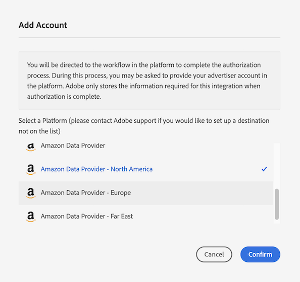
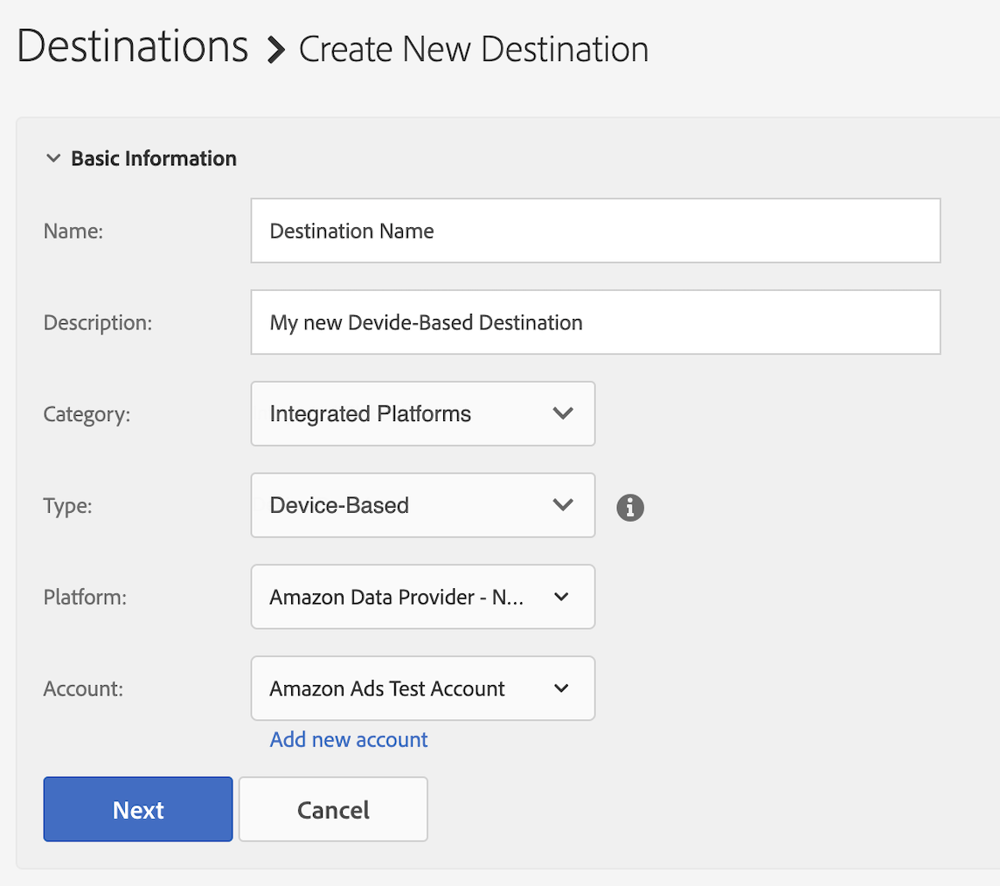

# Configurer [!DNL Amazon Advertising] comme destination basée sur un appareil en libre-service {#configure-amazon}

Cet article explique comment configurer une intégration avec [Amazon Advertising](https://advertising.amazon.com/API/docs/en-us).

## Conditions préalables {#prerequisites}

Avant de configurer votre destination [!DNL Amazon Advertising], veillez à respecter les conditions préalables suivantes.

* Votre compte [!DNL Amazon] doit être éligible à la publicité.
* Lors de la création de la première destination [!DNL Amazon Advertising] dans votre instance Audience Manager, contactez Adobe Consulting ou l’assistance clientèle pour activer la synchronisation des identifiants [!DNL Amazon] (identifiant de Source de données = 139200) pour votre compte. Cela est nécessaire à la synchronisation correcte entre Audience Manager et [!DNL Amazon].
* Une fois les nouvelles audiences de fournisseur de données créées, vous devez [mettre à jour leurs métadonnées](https://advertising.amazon.com/API/docs/en-us/data-provider/openapi#tag/Metadata/paths/~1v2~1dp~1audiencemetadata~1%7BaudienceId%7D/put) et ajouter les **[!DNL audience fees]**. Pour cette opération, vous pouvez utiliser l’API [Amazon Ads ou &#x200B;](https://advertising.amazon.com/API/docs/en-us/guides/onboarding/apply-for-access)’interface utilisateur [Amazon Advertising](https://advertising.amazon.com/).

## Ajouter une nouvelle destination [!DNL Amazon Advertising] {#add-new-amazon-destination}

Cette section décrit les étapes à suivre lors de la configuration d’une nouvelle destination basée sur un appareil pour [!DNL Amazon Advertising]. Ce scénario suppose que vous n’avez aucune destination [!DNL Amazon Advertising] existante configurée par l’intermédiaire de votre consultant Adobe ou de l’assistance clientèle.

### Étape 1 : S’authentifier avec [!DNL Amazon Advertising] {#step1-authenticate-with-amazon}

Avant de pouvoir ajouter la destination basée sur un appareil, vous devez lier Audience Manager et votre compte [!DNL Amazon Advertising]. Procédez comme suit :

1. Connectez-vous à votre compte Audience Manager et accédez à **[!UICONTROL Administration > Integrated Accounts]**. Si vous avez déjà configuré une intégration à une plateforme de destination, elle est répertoriée sur cette page. Dans le cas contraire, la page est vide.
1. Sélectionnez **[!UICONTROL Add Account]**.
1. Sélectionnez [!UICONTROL Amazon Data Provider].

   

1. Sélectionnez l’une des **[!UICONTROL Amazon Data Provider]** options en fonction de la région où votre compte [!DNL Amazon Ads] est créé (Amérique du Nord, Europe ou Extrême-Orient) et cliquez sur **[!DNL Confirm]** pour être redirigé vers la page d’authentification.

   

1. Une fois authentifié, vous êtes redirigé vers Audience Manager, où vous devriez voir les comptes publicitaires associés. Sélectionnez le compte publicitaire que vous souhaitez utiliser, puis cliquez sur **[!UICONTROL Confirm]**. Ce faisant, vous avez autorisé l’accès d’Audience Manager à envoyer des mises à jour pour vos audiences.

### Étape 2 : Création d’une destination basée sur un appareil {#step2-create-new-destination}

Après avoir lié Audience Manager et votre compte [!DNL Amazon Advertising], vous pouvez créer la nouvelle destination. Procédez comme suit :

>[!NOTE]
>
>Vous ne pouvez pas modifier le nom d’une destination existante basée sur un appareil. Veillez à fournir un nom qui vous aidera à identifier correctement la destination.

1. Connectez-vous à votre compte Audience Manager, accédez à **[!UICONTROL Audience Data > Destinations]**, puis sélectionnez **[!UICONTROL Create Destination]**.
1. Dans la section **[!UICONTROL Basic Information]** , saisissez un **[!UICONTROL Name]** et un **[!UICONTROL Description]** pour votre nouvelle destination, puis utilisez les paramètres ci-dessous :

   

1. Sélectionnez **[!UICONTROL Next]**.
1. Choisissez les [libellés d’exportation des données](/help/using/features/data-export-controls.md#controls-labels) que vous souhaitez définir pour cette destination.
1. Sélectionnez **[!UICONTROL Save]**.
1. Dans la section **[!UICONTROL Segment Mappings]** , sélectionnez les segments d’audience à envoyer à cette destination.
1. Enregistrez la destination.

## Considérations relatives aux taux de correspondance {#match-rates-considerations}

L’intégration entre Audience Manager et [!DNL Amazon Advertising] prend en charge les renvois d’audience historiques. Toutes les qualifications de segment sont envoyées à [!DNL Amazon] lorsque vous créez la destination.

## Dépannage {#troubleshooting}

Pendant la configuration ou l’envoi de données à la destination [!DNL Amazon Advertising], vous pouvez rencontrer les erreurs décrites ci-dessous. Cette section explique les causes possibles des erreurs et comment les corriger.

| Message d’erreur | Occurrence/Raison | Résolution |
|---|---|---|
| `Internal server error` | Ce message d’erreur s’affiche dans l’interface utilisateur d’Audience Manager lors de la tentative d’ajout d’un nouveau compte [!DNL Amazon] à l’aide d’une version obsolète de l’API Amazon. | Contactez l’assistance clientèle d’Adobe. |
| `Amazon Error: Account XXXXXXXXX was not found` | Ce message d’erreur s’affiche dans l’interface utilisateur d’Audience Manager lorsque les informations d’identification configurées pour la destination ne sont pas autorisées à accéder au compte Amazon Ads correspondant. | <ul><li>Assurez-vous que les informations d’identification de compte que vous utilisez sont conformes aux [conditions préalables](#prerequisites).</li><li>Accédez à l’interface utilisateur d’Amazon Ads à l’aide des mêmes informations d’identification et vérifiez si les audiences correctes s’affichent sous le compte correspondant. </li></ul> |
