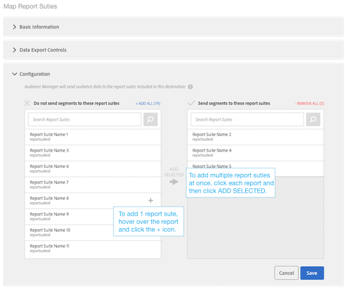

# Configuration d'une destination Analytics

## Conditions requises {#requirements}

Voir [Audience Analytics](https://marketing.adobe.com/resources/help/en_US/analytics/audiences/).

## Votre destination Analytics par défaut et les nouvelles destinations Analytics

| Type de destination Analytics | Description |
|---|---|
| Par défaut | Le nom de cette destination par défaut est « Adobe Analytics », que vous pouvez modifier. Les ID de suite de rapports mappés s'affichent dans le stockage des dossiers pour vos caractéristiques et segments Audience Manager.  Audience Manager crée automatiquement une destination si votre compte comporte :   <ul><li>Conformité aux exigences décrites dans la documentation [d'Audience Analytics](https://marketing.adobe.com/resources/help/en_US/analytics/audiences/) .</li><li>Suite [de rapports](https://marketing.adobe.com/resources/help/en_US/sc/implement/ref-reports-report-suites.html) dans Analytics.</li><li>[Association d'une suite de rapports à une organisation](https://marketing.adobe.com/resources/help/en_US/mcloud/report-suite-mapping.html).</li></ul> |
| Nouveau | Pour créer de nouvelles destinations Analytics, accédez à Données d'audience &gt; Destinations &gt; Créer une destination et suivez les étapes de chaque section décrit ci-dessous. |

## Étape 1 : Fournir des informations de base

Cette section contient des champs et des options qui démarrent le processus de création de destination d'Analytics. Pour terminer cette section :

1. Cliquez sur **Informations de base** pour exposer les commandes.
1. Nommez la destination. Evitez les abréviations et les caractères spéciaux.
1. *(Facultatif)* Décrivez la destination. Une description concise permet de définir ou fournir plus d'informations sur une destination.
1. *(Facultatif)* Dans la liste **Plate-forme** , laissez le jeu par défaut **sur Tous**. Actuellement, ces options ne font rien. Ils sont conçus pour prendre en charge les fonctionnalités qui peuvent être ajoutées ultérieurement.
1. Dans la liste **Catégorie** , sélectionnez **Adobe Experience Cloud**.
1. Dans la liste **Type** , sélectionnez **Adobe Analytics**.
1. Cliquez **sur Enregistrer** pour accéder aux paramètres de configuration ou cliquez sur **Exporter les étiquettes** d'exportation pour appliquer les commandes d'exportation à la destination.

>[!NOTE]
>
>Pour une destination Analytics, la case **à** cocher Mappage automatique de destination et **l'ID** de segment sont sélectionnées par défaut. Vous ne pouvez pas modifier ces paramètres.

## Étape 2 : Configuration des contrôles d'exportation des données

Cette section contient des options qui appliquent [les contrôles d'exportation de données](/help/using/features/data-export-controls.md) à une destination Analytics. Ignorez cette étape si vous n'utilisez pas les commandes d'exportation de données. Pour terminer cette section :

1. Cliquez sur **Contrôles d'exportation de données** pour exposer les commandes.
1. Sélectionnez un libellé correspondant au contrôle d'exportation de données appliqué à la destination (voir [Ajout d'étiquettes d'exportation de données à une destination)](/help/using/features/destinations/add-data-export-labels.md) . Pour les destinations Analytics, la case à cocher Informations d'identification personnelle est sélectionnée par défaut.
1. Cliquez sur **Enregistrer**.

## Étape 3 : Mappage des suites de rapports

La section Configuration répertorie les suites de rapports Analytics qui ont été activées pour le transfert côté serveur. Si vous disposez de plusieurs destinations Analytics, les suites de rapports affectées à ces destinations sont mutuellement : exclusives et appliquées par Audience Manager. Pour terminer cette section :

1. Cliquez **sur Configuration** pour exposer les commandes.
1. Sélectionnez une ou plusieurs suites de rapports auxquelles vous voulez envoyer des segments.
1. Cliquez sur **Enregistrer**.

## Étape 4 : Correspondances de segments

Cette section propose des options vous permettant de mapper automatiquement ou manuellement les segments.

| Option de mappage | Description |
|---|---|
| Mappage automatique de tous les segments actuels et futurs | Sélectionné par défaut, cette fonction envoie tous les segments qu'un visiteur qualifie pour, par accès, Analytics.  Si un visiteur appartient à plus de 150 segments Audience Manager sur un seul accès, seuls les 150 segments qualifiés les plus récemment qualifiés sont envoyés à Analytics, tandis que la liste restante est tronquée. Un indicateur supplémentaire est envoyé à Analytics signifiant que la liste des segments a été tronquée. Cette action s'affiche sous la forme « Limite d'audience atteinte » dans la dimension Nom des audiences et « 1 » dans la dimension ID d'audiences. Pour plus d'informations, consultez [la FAQ](https://marketing.adobe.com/resources/help/en_US/analytics/audiences/mc-audiences-faqs.html) .  Cette option affecte également la disponibilité de destination dans [le créateur de segments](/help/using/features/segments/segment-builder.md). Par exemple, si un segment est mappé automatiquement sur une destination Analytics, cette destination n'est pas disponible pour sélection dans la [section Correspondances](/help/using/features/segments/segment-builder.md#segment-builder-controls-destinations) de destination du créateur de segments. La destination Analytics apparaît grisée et affiche « Analytics » dans la colonne Type du navigateur de destination. |
| Mise en correspondance manuelle des segments | Cette option affiche les commandes de recherche et de navigation qui vous permettent de choisir les segments à envoyer à Analytics.  Pour rechercher un segment :   <ol><li>Tapez le nom ou l'identifiant du segment dans le champ de recherche.</li><li>Cliquez sur <b>Ajouter.</b></li><li>Continuez à rechercher et ajouter des segments ou cliquez sur <b>Terminé</b>.</li></ol> Pour rechercher un segment : <ol><li>Cliquez <b>sur Parcourir tous les segments</b>. Cette opération expose la liste des segments disponibles.</li><li>Dans la liste, cochez la case du segment à utiliser, puis cliquez sur <b>Ajouter les segments sélectionnés</b>.</li><li>Cliquez <b>sur Enregistrer</b> dans la fenêtre Ajouter des correspondances. Vous ne pouvez pas modifier les dates de mappage, de début ou de fin pendant la version bêta.</li><li>Continuez à parcourir et à ajouter des segments ou cliquez sur <b>Terminé</b>.</li></ol>  |

## Étapes suivantes

Après avoir créé et enregistré une destination, vous pouvez utiliser ces données dans Analytics. Toutefois, cette opération peut prendre quelques heures avant que les données ne soient disponibles dans les suites de rapports sélectionnées. See [Use the Audience Data in Analytics](https://marketing.adobe.com/resources/help/en_US/analytics/audiences/use-audience-data-analytics.html).
