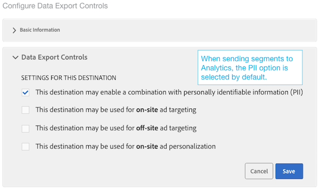

# Configuration d’une destination Analytics

## Exigences {#requirements}

Pour configurer une destination Analytics, l’utilisateur d’Audience Manager doit disposer des autorisations d’administrateur. Voir [Créer des utilisateurs](/help/using/features/administration/administration-overview.md#create-users) dans le Guide d’administration. Notez que disposer de l’autorisation `CREATE_DESTINATIONS` [caractère générique](/help/using/features/administration/administration-overview.md#wild-card-permissions) n’est pas suffisant pour créer des destinations Analytics.
Pour connaître les autres conditions requises, voir Conditions préalables dans [Audience Analytics](https://experienceleague.adobe.com/docs/analytics/integration/audience-analytics/mc-audiences-aam.html?lang=fr).

## Votre destination Analytics par défaut et vos nouvelles destinations Analytics

| Type de destination Analytics | Description |
|---|---|
| Par défaut | Le nom de cette destination par défaut est « Adobe Analytics », que vous pouvez modifier. Les identifiants de suite de rapports mappés apparaissent dans le stockage de dossiers pour vos caractéristiques et segments Audience Manager.    Audience Manager crée automatiquement une destination si votre compte possède :    <ul><li>Respectez les exigences décrites dans la documentation d’[Audience Analytics](https://experienceleague.adobe.com/docs/analytics/integration/audience-analytics/mc-audiences-aam.html?lang=fr).</li><li>Une [&#x200B; suite de rapports &#x200B;](https://experienceleague.adobe.com/docs/analytics/admin/manage-report-suites/report-suites-admin.html?lang=fr) dans Analytics.</li></ul> |
| Nouveau | Pour créer de nouvelles destinations Analytics, accédez à Données d’audience > Destinations > Créer une nouvelle destination et suivez les étapes de chaque section décrite ci-dessous. |

## Qualifications des segments Audience Manager dans Adobe Analytics {#segment-qualifications}

Lors de l’envoi d’informations sur les segments vers une destination Analytics, Audience Manager envoie uniquement les segments pour lesquels le visiteur remplit les conditions. Si un visiteur cesse de se qualifier pour un segment, ces informations ne sont _pas_ transférées à Adobe Analytics.

Prenons l’exemple des règles de segment ci-dessous :

* Segment A : caractéristique 1 ET caractéristique 2
* Segment B : Caractéristique 1 ET NON PAS Caractéristique 2

Dans les rapports Analytics, un profil peut s’afficher comme qualifié pour les deux segments, même s’il a cessé de se qualifier pour le segment B.

## Étape 1 : fournir des informations de base

Cette section contient des champs et des options qui démarrent le processus de création de destination Analytics. Pour remplir cette section, procédez comme suit :

1. Cliquez sur **Informations de base** pour afficher les contrôles.
2. Nommez la destination. Évitez les abréviations et les caractères spéciaux.
3. *(Facultatif)* Décrivez la destination. Une description concise est un moyen efficace de définir ou de fournir plus d’informations sur une destination.
4. *(Facultatif)* Dans la liste **Platform**, laissez le paramètre par défaut défini sur **Tous**. Actuellement, ces options n’ont aucun effet. Ils sont conçus pour prendre en charge des fonctionnalités qui peuvent être ajoutées ultérieurement.
5. Dans la liste **Catégorie**, sélectionnez **Adobe Experience Cloud**.
6. Dans la liste **Type**, sélectionnez **Adobe Analytics**.
7. Cliquez sur **Enregistrer** pour accéder aux paramètres de configuration, ou cliquez sur **Libellés d’exportation des données** pour appliquer des contrôles d’exportation à la destination.

>[!NOTE]
>
>Pour une destination Analytics, la case à cocher **Remplir automatiquement le mappage de destination** et l’option **Identifiant de segment** sont sélectionnées par défaut. Impossible de modifier ces paramètres.

## Étape 2 : Configurer Les Contrôles D’Exportation De Données

Cette section contient des options qui s’appliquent [&#x200B; Contrôles d’exportation de données &#x200B;](/help/using/features/data-export-controls.md) à une destination Analytics. Ignorez cette étape si vous n’utilisez pas de contrôles d’exportation des données. Pour remplir cette section, procédez comme suit :

1. Cliquez sur **Contrôles d’exportation de données** pour afficher les contrôles.
1. Sélectionnez un libellé qui correspond au contrôle d’exportation des données appliqué à la destination (voir [&#x200B; Ajouter des libellés d’exportation des données à une destination &#x200B;](/help/using/features/destinations/add-data-export-labels.md) ). Pour les destinations Analytics, la case à cocher PII est sélectionnée par défaut.
1. Cliquez sur **Enregistrer**.

## Étape 3 : Mappage des suites de rapports

La section Configuration répertorie les suites de rapports Analytics qui ont été activées pour le transfert côté serveur. Si vous disposez de plusieurs destinations Analytics, les suites de rapports affectées à ces destinations s’excluent mutuellement et sont appliquées par Audience Manager. Pour remplir cette section, procédez comme suit :

1. Cliquez sur **Configuration** pour afficher les contrôles.
1. Sélectionnez une ou plusieurs suites de rapports auxquelles vous souhaitez envoyer des segments.
1. Cliquez sur **Enregistrer**.

## Étape 4 : Mappages De Segments

Cette section propose des options permettant de mapper les segments automatiquement ou manuellement.

| Option de mappage | Description |
|---|---|
| Mapper automatiquement tous les segments actuels et futurs | Sélectionnée par défaut, cette fonctionnalité envoie à Analytics, par accès, tous les segments pour lesquels un visiteur est qualifié.    Si un visiteur appartient à plus de 150 segments Audience Manager sur un seul accès, seuls les 150 segments les plus récemment qualifiés sont envoyés à Analytics, tandis que la liste restante est tronquée. Un indicateur supplémentaire est envoyé à Analytics, ce qui signifie que la liste de segments a été tronquée. Cette action s’affiche sous la forme « Limite d’audience atteinte » dans la dimension Nom des audiences et « 1 » dans la dimension ID des audiences. Voir la [FAQ](https://experienceleague.adobe.com/docs/analytics/integration/audience-analytics/audience-analytics-workflow/mc-audiences-faqs.html?lang=fr) pour plus d’informations.    En outre, cette option affecte la disponibilité de la destination dans [Créateur de segments](/help/using/features/segments/segment-builder.md). Par exemple, si un segment est mappé automatiquement à une destination Analytics, cette destination ne peut pas être sélectionnée dans la section [mappages de destination](/help/using/features/segments/segment-builder.md#segment-builder-controls-destinations) du créateur de segments. La destination Analytics apparaît grisée et affiche « Analytics » dans la colonne Type du navigateur de destination. |
| Mappage manuel des segments | Cette option expose les contrôles de recherche et de navigation qui vous permettent de choisir les segments à envoyer à Analytics.    Pour rechercher un segment :    <ol><li>Saisissez le nom ou l’identifiant du segment dans le champ de recherche.</li><li>Cliquez sur <b>Ajouter.</b></li><li>Continuez à rechercher et à ajouter des segments ou cliquez sur <b>Terminé</b>.</li></ol>   Pour rechercher un segment : <ol><li>Cliquez sur <b> Parcourir tous les segments </b>. Une liste de segments disponibles est ainsi exposée.</li><li>Dans la liste, cochez la case du segment à utiliser et cliquez sur <b>Ajouter les segments sélectionnés</b>.</li><li>Cliquez sur <b>Enregistrer</b> dans la fenêtre Ajouter des mappages . Vous ne pouvez pas modifier les mappages, les dates de début ou de fin pendant la version bêta.</li><li>Continuez à parcourir et à ajouter des segments ou cliquez sur <b> Terminé </b>.</li></ol>  |

## Étapes suivantes

Après avoir créé et enregistré une destination, vous pouvez utiliser ces données dans Analytics. Cependant, il peut s’écouler quelques heures avant que les données ne soient disponibles dans les suites de rapports sélectionnées. Voir [Utilisation des données d’audience dans Analytics](https://experienceleague.adobe.com/docs/analytics/integration/audience-analytics/audience-analytics-workflow/use-audience-data-analytics.html?lang=fr).
