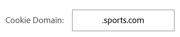

# Manage Destinations {#manage-destinations}

The [!UICONTROL Destination] landing page lists all of your [!DNL URL], cookie, and server-to-server destinations. Il offre des fonctionnalités permettant de créer, de modifier, de rechercher et de créer des rapports sur les destinations. The landing page is located in **[!UICONTROL Audience Data > Destinations]**.

## Default Landing Page {#default-landing-page}

<!-- destinations-home.xml -->

La page d'entrée par défaut répertorie vos destinations, en fonction du type. Vous pouvez filtrer les destinations à l'aide des quatre onglets disponibles :

* **Tout**: affiche tous les types de destinations.
* **Adobe Experience Cloud**: affiche les destinations qui envoient des données à d'autres solutions Adobe Experience Cloud. Actuellement, la seule option prise en charge est Adobe Analytics. See [Configure an Analytics Destination](/help/using/features/destinations/create-analytics-destination.md).
* **Plateformes intégrées**: montre les destinations basées sur les utilisateurs et les périphériques (également appelées destinations serveur à serveur). Notez que les destinations basées sur les personnes sont actuellement une fonctionnalité bêta uniquement disponible pour les clients sélectionnés.
* **Personnalisé**: affiche les destinations de cookie et d'URL.

## Addressable Audiences Landing Page {#audiences-landing-page}

To see audience data and match rates for your server-to-server destination, select **[!UICONTROL Integrated Platforms > Device-Based]**.

For more information about the displayed information, see [Addressable Audiences Interface](/help/using/features/addressable-audiences.md#addressable-audience-interface).

## Destination Builder {#destination-builder}

[!UICONTROL Destination Builder] vous permet de créer des destinations ou [!DNL URL] des destinations. You cannot create server-to-server ([!DNL S2S]) destinations with [!UICONTROL Destination Builder], but you can manage their segment mappings. Contact your consultant to set up a [!DNL S2S] destination. [!UICONTROL Destination Builder] se trouve **[!UICONTROL Audience Data > Destinations]** dans.

### Destination Builder Settings {#destination-builder-settings}

<!-- destination-builder.xml -->

[!UICONTROL Destination Builder] se compose des sections et paramètres suivants :

| [!UICONTROL Destination Builder] Section | Rôle |
|--- |--- |
| Informations fondamentales | Used to name the destination, describe it, and select destination type ([!DNL URL] or [!DNL cookie]), and platform (all, [!DNL Android], browser, or [!DNL iOS]). |
| Configuration | Includes controls for:  <ul><li>Passing in key-value data to [!DNL URL] destinations. Vous pouvez envoyer des données sous la forme de paires clé-valeur individuelles ou sérialisées. For details see, [Destination Serialization](../../features/destinations/key-value-pairs.md#destination-serialized) and [Standard and Serial Key-Value Pairs](../../features/destinations/key-value-pairs.md). </li><li>Eléments d'une destination de cookie, tels que le nom du cookie, le domaine, la taille, l'intervalle d'expiration, le format de données, etc.</li></ul> |
| Correspondances de segments | Permet de:  <ul><li>Recherchez, ajoutez et gérez les segments associés à tous les types de destination. </li><li>Set delivery priorities on individual segments (for [!DNL cookie]-based segments only).</li></ul> |

### Data Delivery Methods {#data-delivery-methods}

Send information to a destination by passing it in through a [!DNL URL] string, by writing to a browser [!DNL cookie], or through offline server-to-server data transfers.

* [!DNL URL] et les destinations basées sur cookie transmettent les données de manière synchrone lorsqu'un utilisateur agit sur une page.
* La transmission de données serveur à serveur est asynchrone et peut survenir longtemps après la sortie de la page par un utilisateur. Le type de livraison que vous sélectionnez dépend des besoins de votre entreprise et de la manière dont un partenaire de données particulier souhaite ou peut recevoir des données.

See [How to Choose a Destination Type](../../features/destinations/destinations.md) for more information.

>[!MORE_ LIKE_ THIS]
>
>* [Création d'une destination de cookie](../../features/destinations/manage-destinations.md#create-cookie-destination)
>* [Création d'une destination d'URL](../../features/destinations/manage-destinations.md#configure-url-destination)

## Configure a Cookie Destination {#create-cookie-destination}

Une destination de cookie renvoie et écrit des données dans un cookie dans le navigateur de l'utilisateur. Le cookie contient des données qui peuvent être lues par d'autres plateformes qui ont accès à la page. Follow these instructions to create a cookie destination with [!UICONTROL Destination Builder].

<!-- create-cookie-destination.xml -->

To create a new cookie destination, go to **[!UICONTROL Audience Data > Destinations > Create New Destination]** and complete the sections as described below.

### Informations fondamentales {#basic-information}

Cette section contient des champs et des options qui démarrent le processus de création de la destination des cookies. Pour terminer cette section :

1. Click **[!UICONTROL Basic Information]** to expose the controls.
2. Nommez la destination. Evitez les abréviations et les caractères spéciaux.
3. *(Facultatif)* Décrivez la destination. Une description concise permet de définir ou fournir plus d'informations sur une destination.
4. In the **[!UICONTROL Category]** list, choose **[!UICONTROL Custom]**.
5. In the **[!UICONTROL Environment]** list, select **[!UICONTROL Browser]**. Vous ne pouvez pas configurer les destinations de cookie pour les environnements mobiles natifs, tels que les applications Android ou ios.
6. In the **[!UICONTROL Type]** list, click **[!UICONTROL Cookie]**.
7. *(Facultatif)* Sélectionnez une **[!UICONTROL Auto-fill Destination Mapping]**. Les options incluent :
   * **[!UICONTROL Segment ID]**: Ajoute automatiquement l'identifiant de segment à la destination.
   * **[!UICONTROL Integration Code Value]**: Ajoute automatiquement le code d'intégration de segment au mappage de destination. Le code d'intégration est un identifiant unique créé et utilisé par le client. Elle est limitée à 255 caractères maximum.
8. Click **[!UICONTROL Next]** to go to the [!UICONTROL Configuration] settings or click **[!UICONTROL Data Export Labels]** to apply export controls to the destination.

### Data Export Labels {#data-export-labels-cookies}

This section contains options that apply [data export controls](../../features/data-export-controls.md) to a cookie destination. Ignorez cette étape si vous n'utilisez pas les commandes d'exportation de données. Pour terminer cette section :

1. Click **[!UICONTROL Data Export Labels]** to expose the controls.
2. Select a label that corresponds to data export control applied to the destination (see [Add Export Labels to a Destination](../../features/destinations/manage-destinations.md#add-data-export-labels) for details).
3. Cliquez sur **[!UICONTROL Save]**.

### Configuration {#configuration}

Cette section contient des champs et des options qui vous permettent de configurer le cookie pour votre destination.

>[!NOTE]
>
>[!DNL Audience Manager] code les données écrites dans le cookie de destination. For example, spaces are encoded as `%20` and semicolons are encoded as `%3B`.

Pour terminer cette section :

1. Click **[!UICONTROL Configuration]** to expose the controls
1. Nommez le cookie. Evitez les abréviations et les caractères spéciaux.
1. Choisissez une option de format de données. Ces options vous permettent de choisir les délimiteurs et les séparateurs pour les paires clé-valeur qui envoient des données de segment à une destination. Les options de format sont les suivantes :
   * **Clé unique :** Permet de définir la clé dans une paire clé-valeur. You'll set the value after you select a segment in the [!UICONTROL Segment Mappings] section below.
   * **Clé multi-clé :** Permet de définir la clé et la valeur d'une paire clé-valeur. Vous allez créer la paire clé-valeur après avoir sélectionné un segment dans la section Correspondances de segment ci-dessous.
See [Standard and Serial Key-Value Pairs](../../features/destinations/key-value-pairs.md) for more information about these data elements.
1. Cliquez sur **[!UICONTROL Save]**.

Tous les autres paramètres sont facultatifs. For more information about the **[!UICONTROL Cookie Domain]** and **[!UICONTROL Publish data to]** settings, see [Optional Settings for Cookie Destinations](../../features/destinations/manage-destinations.md#optional-settings-cookies).

### Segment Mappings {#segments-mapping}

Cette section vous permet de rechercher et d'ajouter des segments à votre destination. Pour terminer cette section :

1. Click **[!UICONTROL Segment Mappings]** to expose the controls.
1. In the **[!UICONTROL Search and Add Segments]** box, start typing the name of a segment or click **[!UICONTROL Browse All Segments]** to browse a list of available segments.
1. Click **[!UICONTROL Add Selected Segments]** when you find the segment you want to use. Adding a segment opens the [!UICONTROL Edit Mapping] window.
1. In the [!UICONTROL Edit Mapping] dialog:
   * **[!UICONTROL Mapping]** vous permet de définir une valeur pour la clé spécifiée dans la section Configuration ci-dessus.
   * **[!UICONTROL Publish from]** vous permet de définir la date de début et la date de fin de la destination. Si la date de fin est vide, la destination n'expire jamais.
1. Cliquez sur **[!UICONTROL Save]**.
1. Cliquez sur **[!UICONTROL Done]**.

## Configure a URL Destination {#configure-url-destination}

A [!DNL URL] destination makes pixel calls from a page to your destination. Follow these instructions to create a [!DNL URL] destination with [!UICONTROL Destination Builder].

<!-- create-url-destination.xml -->

To create a new [!DNL URL] destination, go to **[!UICONTROL Audience Data > Destinations > Create New Destination]** and complete the sections as described below.

### Informations fondamentales {#basic-info}

Cette section contient des champs et des options qui démarrent le processus de création de la cible d'URL. Pour terminer cette section :

1. Click **[!UICONTROL Basic Information]** to expose the controls.
1. Nommez la destination. Evitez les abréviations et les caractères spéciaux.
1. *(Facultatif)* Décrivez la destination. Une description concise permet de définir ou fournir plus d'informations sur une destination.
1. In the **[!UICONTROL Category]** list, choose **[!UICONTROL Custom]**.
1. In the **[!UICONTROL Environment]** list, select the environment in which to trigger the URL destination.
1. In the **[!UICONTROL Type]** list, click **[!UICONTROL URL]**.
1. *(Facultatif)* Sélectionnez une **[!UICONTROL Auto-fill Destination Mapping]**. Les options incluent :
   * **[!UICONTROL Segment ID]**: Ajoute automatiquement l'identifiant de segment à la destination.
   * **[!UICONTROL Integration Code Value]**: Ajoute automatiquement le code d'intégration de segment au mappage de destination. Le code d'intégration est un identifiant unique créé et utilisé par le client. Elle est limitée à 255 caractères maximum.
1. Click **[!UICONTROL Next]** to go to the [!UICONTROL Configuration] settings or click **[!UICONTROL Data Export Labels]** to apply export controls to the destination.

### Data Export Labels {#data-export-labels-dest}

This section contains options that apply [data export controls](../../features/data-export-controls.md) to a [!DNL URL] destination. Ignorez cette étape si vous n'utilisez pas les commandes d'exportation de données. Pour terminer cette section :

1. Click **[!UICONTROL Data Export Labels]** to expose the controls.
2. Select a label that corresponds to the data export control applied to the destination (see [Add Export Labels to a Destination](../../features/destinations/manage-destinations.md#add-data-export-labels) for details).
3. Cliquez sur **[!UICONTROL Save]**.

### Configuration {#configure-base-data}

This section contains options that let you set a base [!DNL URL] and data delimiters passed in by the [!DNL URL] string. Cette section est facultative. Pour terminer cette section :

1. Click **[!UICONTROL Configuration]** to expose the controls.
1. *(Facultatif)* Cochez **[!UICONTROL Serialize]** la case.
Vous pouvez ainsi envoyer des segments à une destination de manière séquentielle plutôt que d'effectuer des appels distincts pour chaque segment. La sérialisation facilite le transfert de données. Cette case à cocher affiche les champs URL et délimiteurs. For more information, see [Standard and Serial Key-Value Pairs](../../features/destinations/key-value-pairs.md).
1. If you select **[!UICONTROL Serialize]**, then you must also configure the URL and delimiter fields described below.

| Champ | Description |
|--- |--- |
| URL de base | The base part of a standard `HTTP` [!DNL URL] that does not change. Also, you need to place the `%ALIAS%`  [placeholder macro](../../features/destinations/destination-macros.md#destination-macros-defined) in the base URL. Exemple: `https://www.myCompany.com/%alias%...` |
| URL sécurisée | The base part of a secure `HTTPS` [!DNL URL] that does not change. Also, you need to place the `%ALIAS%`   [placeholder macro](../../features/destinations/destination-macros.md#destination-macros-defined) in the base URL. Exemple: `https://www.myCompany.com/%alias%...` |
| Délimiteur | The symbol that separates the segment variables in the [!DNL URL] string. Il s'agit généralement d'une virgule ou d'un point-virgule. Obtenez ces informations auprès de votre partenaire de destination. |

### Segment Mappings {#segment-mappings}

Cette section vous permet de rechercher et d'ajouter des segments à votre destination. Pour terminer cette section :

1. Click **[!UICONTROL Segment Mappings]** to expose the controls.
1. In the **[!UICONTROL Search and Add Segments]** box, start typing the name of a segment or click **[!UICONTROL Browse All Segments]** browse a list of available segments.
1. Click **[!UICONTROL Add Selected Segments]** when you find the segment you want to use. Adding a segment opens the [!UICONTROL Edit Mapping] window.
1. Dans [!UICONTROL Edit Mapping]:
   * **[!UICONTROL Mappings]**: Fournissez les paires clé-valeur utilisées par le segment.
   * **[!UICONTROL Start Date]** et **[!UICONTROL End Date]**: Choisissez une date de début et de fin pour la destination. Si la date de fin est vide, la destination n'expire jamais.
1. Cliquez sur **[!UICONTROL Done]**.

### Optional Settings for Cookie Destinations {#optional-settings-cookies}

In [!UICONTROL Destination Builder], the [!UICONTROL Configuration section] contains the [!UICONTROL Cookie Domain] and [!UICONTROL Publish Data To] fields. Elles vous permettent de créer des règles afin de déterminer si une destination définit un cookie ou renvoie un cookie. [!UICONTROL Cookie Domain] et [!UICONTROL Publish Data To] fonctionnent indépendamment les uns des autres et sont facultatifs. Vous pouvez créer une destination de cookie sans l'utiliser.

## Cookie Domain: Syntax and Examples {#cookie-domain-syntax}

<!-- cookie-destination-options.xml -->

<table id="table_4F4F7562AFEE49F8917AAE5712B5CCE4"> 
 <thead> 
  <tr> 
   <th colname="col1" class="entry"> Domaine du cookie </th> 
   <th colname="col2" class="entry"> Description </th> 
  </tr>
 </thead>
 <tbody> 
  <tr> 
   <td colname="col1"> 
<b>Syntaxe</b> 
 </td> 
   <td colname="col2"> 
The  Cookie Domain field accepts a simple text string that lets you set cookies on a specified domain or all domains. Lors de l'utilisation de cette fonction : 
 
 
     <ul id="ul_473CB59F2C0C4B358201BE5C8B27D73D"> 
      <li id="li_4E7F4691C1B54415963F7D5AA1558C9A">Définissez un seul domaine pour chaque destination de cookie. Do not type multiple domains in the  Cookie Domain field. Create another  Destination instead. </li> 
      <li id="li_AEBF5C5F3C264C5EA4A2A6063C3F377D">N'utilisez pas de caractères génériques. </li> 
     </ul> 
 
 Leave the  Cookie Domain field blank to set a cookie on all domains. Il s'agit du paramètre par défaut. 
 
Pour définir des cookies sur un domaine et sous-domaines spécifiques : 
 
 
     <ul id="ul_F25BC0D8C40641A2A5CA338E5C258435"> 
      <li id="li_E236D8DEE4F24F9BBA36074F7049C12C">Type the name of the domain in the  Cookie Domain field. </li> 
      <li id="li_0471C198EE344DE5963A3C2F70B9E78B">Démarrez le nom de domaine avec un point. For example, <code> .somedomain.com</code>. </li> 
      <li id="li_73D06F2BEF45487280C2245E1F6B8ED0">The <code> https://www</code> prefix is not required. </li> 
     </ul> 
 </td> 
  </tr> 
  <tr> 
   <td colname="col1"> 
<b>Exemple</b> 
 </td> 
   <td colname="col2"> 
Par exemple, supposons que nous ayons un site fictif appelé sports. com. Sports.com comporte des domaines pour golf, baseball et football. To set a cookie in all the sports domains, you would type that in the  Cookie Domain box as shown below: 
 
  
 
This tells  Audience Manager to set a cookie in any domain that contains the pattern <code><i>something</i></code>.sports.com. Voir ci-dessous pour obtenir un ensemble d'exemples plus complexe. 
 </td> 
  </tr> 
 </tbody> 
</table>

### Exemples de domaine de cookie complexes

These examples show you if [!DNL Audience Manager] will set a cookie based on how the [!UICONTROL Cookie Domain] option is configured.

<table id="table_3A7B9479CDA6493FA8104D8D9841E914"> 
 <thead> 
  <tr> 
   <th colname="col1" class="entry"> Site Web </th> 
   <th colname="col2" class="entry">Domaine du cookie : .sports.com 
Jeu de cookies 
 </th> 
   <th colname="col3" class="entry">Domaine du cookie : .golf.sports.com 
Jeu de cookies 
 </th> 
   <th colname="col4" class="entry">Domaine du cookie : Vide 
Jeu de cookies 
 </th> 
  </tr> 
 </thead>
 <tbody> 
  <tr> 
   <td colname="col1"> 
 <b>sports.com</b> 
 </td> 
   <td colname="col2"> Oui </td> 
   <td colname="col3"> Non </td> 
   <td colname="col4"> Oui </td> 
  </tr> 
  <tr> 
   <td colname="col1"> 
 <b>golf.sports.com</b> 
 </td> 
   <td colname="col2"> Oui </td> 
   <td colname="col3"> Oui </td> 
   <td colname="col4"> Oui </td> 
  </tr> 
  <tr> 
   <td colname="col1"> 
 <b>baseball.sports.com</b> 
 </td> 
   <td colname="col2"> Oui </td> 
   <td colname="col3"> Non </td> 
   <td colname="col4"> Oui </td> 
  </tr> 
  <tr> 
   <td colname="col1"> 
 <b>sports.golf.com</b> 
 </td> 
   <td colname="col2"> Non </td> 
   <td colname="col3"> Non </td> 
   <td colname="col4"> Oui </td> 
  </tr> 
 </tbody> 
</table>

## Publish Data To {#publish-data-to}

[!UICONTROL Publish Data To] Les paramètres renvoient un cookie si le domaine répond aux critères définis par les options que vous sélectionnez. Les options incluent :

* **[!UICONTROL All of our domains]**: (Par défaut) Renvoie un [!DNL cookie] pour tous les domaines.
* **[!UICONTROL Only the selected domains]**: Renvoie un cookie uniquement pour les domaines sélectionnés dans la liste des domaines.
* **[!UICONTROL All of our domains except the selected domains]**: Empêche les domaines sélectionnés de recevoir un [!DNL cookie]. All other domains can receive a [!DNL cookie].

>[!MORE_ LIKE_ THIS]
>
>* [Création d'une destination de cookie](../../features/destinations/manage-destinations.md#create-cookie-destination)

## Add or Edit Segments for Server-to-Server Destinations {#add-edit-segments}

You can only add or edit segments for a server-to-server ([!DNL S2S]) destination. You cannot create [!DNL S2S] destinations with [!UICONTROL Destination Builder]. Contact your consultant to set up [!DNL S2S] destinations. Follow these instructions to add or edit segments for an [!DNL S2S] destination.

<!-- destination-s2s-edit.xml -->

To add or edit segment mappings for an [!DNL S2S] destination:

1. Go to **[!UICONTROL Audience Data > Destinations]**. Select **Integrated Platforms &gt; Device-Based** and find the [!DNL S2S] destination you want to work with.
1. In the [!UICONTROL Action] column, click the pencil icon to edit the destination.
   * In the **[!UICONTROL Search and Add Segments]** box, start typing the name of a segment or click **[!UICONTROL Browse All Segments]** browse a list of available segments.
   * Click **[!UICONTROL Add Selected Segments]** when you find the segment you want to use. Adding a segment opens the [!UICONTROL Edit Mapping] window.
   * Dans [!UICONTROL Edit Mapping]:
      * **[!UICONTROL Mappings]**: Définissez une valeur pour la paire [clé-valeur](../../features/destinations/key-value-pairs.md) utilisée par cette destination.
      * **[!UICONTROL Start Date]** et **[!UICONTROL End Date]**: Choisissez une date de début et de fin pour la destination. Si la date de fin est vide, la destination n'expire jamais.
1. Click **[!UICONTROL Save]** and then click **[!UICONTROL Done]**.

## Add Data Export Labels to a Destination {#add-data-export-labels}

[!DNL Data Export Labels] travailler avec le jeu [!DNL Export Controls] que vous avez défini sur une source de données. [!DNL Data Export Labels] vous éviter d'ajouter des caractéristiques restreintes à un segment et d'envoyer des données de segment à une destination. You can set multiple export labels to a new or existing [!DNL cookie] or [!DNL URL] destination.

>[!NOTE]
>
>To add an export label, you need administrator permissions *or* sufficient privileges to create or edit a destination.

<!-- t_export_labels.xml -->

Pour ajouter des étiquettes d'exportation à une destination :

1. Cliquez sur **[!UICONTROL Audience Data]**:
   * For new destinations: Click **[!UICONTROL Create New Destination]**. Complete the [!UICONTROL Basic Information] section before you select a data export label. See [Create a Cookie Destination](../../features/destinations/manage-destinations.md#create-cookie-destination) or [Create a URL Destination](../../features/destinations/manage-destinations.md#configure-url-destination) for information.
   * For existing destinations: Use the [!DNL Search] box to find your destination or scroll through the list and click on the destination name to open it.
1. Sélectionnez [!DNL Data Export Label]. Laissez les cases vides si vous ne souhaitez pas définir de restrictions d'exportation. Les étiquettes d'exportation incluent les options suivantes :
   * **[!UICONTROL This destination may enable a combination with personally identifiable information (PII)]**
   * **[!UICONTROL This destination may be used for on-site ad targeting]**
   * **[!UICONTROL This destination may be used for off-site ad targeting]**
   * **[!UICONTROL This destination may be used for on-site ad personalization]**
   >[!IMPORTANT]
   >
   >Export restrictions will not work unless you set a [matching export control](../../features/data-export-controls.md) on a data source.
1. Cliquez sur **[!UICONTROL Save]**.

>[!MORE_ LIKE_ THIS]
>
>* [Création d'une source de données](../../features/manage-datasources.md#create-data-source)

