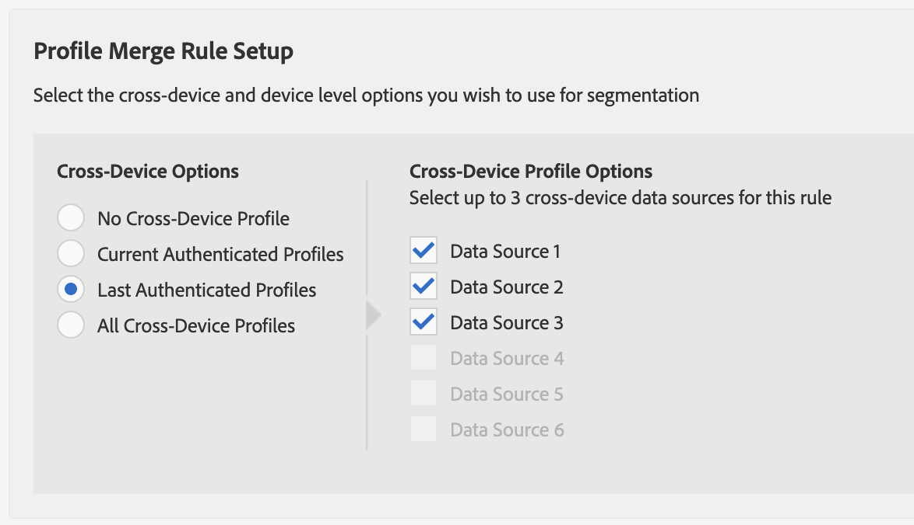

# Processus C : Personalization basé sur l’activité authentifiée associée aux données hors ligne {#workflow-c}

>[!IMPORTANT]
>Cet article contient la documentation du produit destinée à vous guider tout au long de la configuration et de l’utilisation de cette fonctionnalité. Rien dans le présent article n&#39;est un avis juridique. Veuillez consulter votre propre service juridique pour obtenir des conseils juridiques.

Cette page comprend des conseils détaillés sur la manière de combiner des données [!DNL CRM] hors ligne avec des données comportementales en temps réel pour les utilisateurs authentifiés afin de créer des segments d’audience, puis d’envoyer ces segments d’audience à [!DNL People-Based Destinations].

## Étape 1 - Configuration des paramètres de Data Source {#configure-data-source-settings}

Selon que vos [DPUUID](../../reference/ids-in-aam.md) sont des adresses électroniques hachées en minuscules, vous devrez peut-être configurer la source de données qui stockera les adresses électroniques hachées.

 

**Scénario 1 : vos [DPUUID](../../reference/ids-in-aam.md) sont déjà des adresses électroniques en minuscules hachées.**

Dans ce cas, passez à l’[Étape 5 - Configurer l’authentification de plateforme basée sur les personnes](#configure-authentication).

 

**Scénario 2 : vos [DPUUID](../../reference/ids-in-aam.md) ne sont pas des adresses électroniques hachées en minuscules.**

Dans ce cas, vous devez créer une source de données multi-appareils qui stockera vos adresses électroniques hachées. Procédez comme suit :

1. Connectez-vous à votre compte d’Audience Manager et accédez à **[!UICONTROL Audience Data]** -> **[!UICONTROL Data Sources]**, puis cliquez sur **[!UICONTROL Add New]**.
1. Saisissez **[!UICONTROL Name]** et **[!UICONTROL Description]** pour votre nouvelle source de données.
1. Dans le menu déroulant **[!UICONTROL ID Type]**, sélectionnez **[!UICONTROL Cross Device]**.
1. Dans la section **[!UICONTROL Data Source Settings]** , sélectionnez les options **[!UICONTROL Inbound]** et **[!UICONTROL Outbound]** et activez l’option **[!UICONTROL Share associated cross-device IDs in people-based destinations]**.
1. Utilisez le menu déroulant pour sélectionner le libellé **[!UICONTROL Emails(SHA256, lowercased)]** de cette source de données.
   >[!IMPORTANT]
   >
   >Cette option désigne uniquement la source de données comme contenant des données hachées avec cet algorithme spécifique. L’Audience Manager ne hachage pas les données à cette étape. Assurez-vous que les adresses électroniques que vous prévoyez de stocker dans cette source de données sont déjà hachées avec l’algorithme [!DNL SHA256]. Sinon, vous ne pourrez pas l’utiliser pour [!DNL People-Based Destinations].

   

   >[!NOTE]
   >
   > Voir [Intégration de données](people-based-destinations-prerequisites.md#data-onboarding) pour consulter les questions fréquentes sur la manière d’importer vos données hors ligne dans l’Audience Manager de destinations basées sur les personnes.

Regardez la vidéo ci-dessous pour découvrir un tutoriel vidéo sur la création d’une source de données pour [!UICONTROL People-Based Destinations].

>[!VIDEO](https://video.tv.adobe.com/v/29006/)

## Étape 2 - Utilisation des identifiants déclarés pour faire correspondre les DPUUID aux adresses électroniques hachées via des appels HTTP en temps réel {#match-email-addresses}

Pour qualifier les utilisateurs authentifiés pour les caractéristiques basées sur des règles, vous devez envoyer la qualification des caractéristiques par le biais des [identifiants déclarés](../declared-ids.md).

### Exemple

Supposons que vous ayez créé les deux sources de données suivantes.

| Identifiant de source de données | Contenu de la source de données |
| -------------- | -------------------------- |
| 999999 | DPUUID existants (identifiants CRM) |
| 987654 | Adresses électroniques hachées |

 

Ensuite, vous souhaitez qualifier les identifiants CRM ci-dessous pour la caractéristique dans le tableau.

| DPUUID (ID CRM) | Adresse e-mail | Adresse électronique hachée | Caractéristique |
| -------------------------------------- | --------------------- | ---------------------------------------------------------------- | ------------- |
| 68079982765673198504052656074456196039 | `johndoe@example.com` | 55e79200c1635b37ad31a378c39feb12f120f116625093a19bc32fff15041149 | location = US |

 

Votre ID déclaré doit respecter la syntaxe suivante :

`https://yourDomain.demdex.net/event?d_cid_ic=HashedEmailDataSourceIntegrationCode%01myHashedEmail&d_cid_ic=CRMDataSourceIntegrationCode%01myCRMID&key=value`

 

Dans l’exemple ci-dessus, l’appel d’identifiant déclaré doit se présenter comme suit :

`https://yourDomain.demdex.net/event?d_cid_ic=MyHashedEmailDataSource%0155e79200c1635b37ad31a378c39feb12f120f116625093a19bc32fff15041149&d_cid_ic=MyCRMDataSource%0168079982765673198504052656074456196039&location=US`

## Étape 3 - Création d’une règle de fusion de profils pour la segmentation {#create-profile-merge-rule-segmentation}

L’étape suivante consiste à créer une règle de fusion qui vous aidera à créer les segments d’audience à envoyer à votre [!DNL People-Based Destinations].

>[!IMPORTANT]
>
>Si une règle est déjà définie avec les options **[!UICONTROL Current Authenticated Profiles]** ou **[!UICONTROL Last Authenticated Profiles]**, vous pouvez passer à l’ [Étape 4 - Créer des segments d’audience](#create-audience-segments).

1. Connectez-vous à votre compte d’Audience Manager et accédez à **[!UICONTROL Audience Data]** -> **[!UICONTROL Profile Merge Rules]**.
2. Cliquez sur **[!UICONTROL Add New Rule]**.
3. Saisissez une règle de fusion de profils **[!UICONTROL Name]** et **[!UICONTROL Description]**.
4. Dans la section **[!UICONTROL Profile Merge Rule Setup]** , sélectionnez la règle **[!UICONTROL Current Authenticated Profiles]** ou **[!UICONTROL Last Authenticated Profiles]** dans la liste **[!UICONTROL Cross-Device Options]**.
5. Dans la liste **[!UICONTROL Cross-Device Profile Options]**, sélectionnez les sources de données sur lesquelles vous souhaitez exécuter la segmentation. Il doit s’agir des sources de données contenant vos DPUUID existants.
   

## Étape 4 - Création de segments d’audience {#create-audience-segments}

Pour créer des segments, utilisez le [créateur de segments](../segments/segment-builder.md). Si vous souhaitez envoyer des segments d’audience existants à [!DNL People-Based Destinations], passez à l’ [Étape 5 - Configurer l’authentification de plateforme basée sur les personnes](#configure-authentication).

## Étape 5 - Configuration de l’authentification de la plateforme basée sur les personnes {#configure-authentication}

1. Connectez-vous à votre compte d’Audience Manager et accédez à **[!UICONTROL Administration]** > **[!UICONTROL Integrated Accounts]**. Si vous avez configuré une intégration avec une plateforme sociale, elle doit apparaître dans cette page. Sinon, la page est vide.
   
2. Cliquez sur **[!UICONTROL Add Account]**.
3. Utilisez le menu déroulant **[!UICONTROL People-Based Platform]** pour sélectionner la plateforme avec laquelle vous souhaitez configurer l’intégration.
   
4. Cliquez sur **[!UICONTROL Confirm]** pour être redirigé vers la page d&#39;authentification de la plateforme sélectionnée.
5. Une fois que vous êtes authentifié sur votre compte de plateforme sociale, vous êtes redirigé vers l’Audience Manager dans laquelle vos comptes publicitaires associés doivent apparaître. Sélectionnez le compte de l&#39;annonceur que vous souhaitez utiliser et cliquez sur **[!UICONTROL Confirm]**.
6. Audience Manager affiche une notification en haut de la page pour vous indiquer si le compte a bien été ajouté. La notification vous permet également d’ajouter une adresse électronique de contact pour recevoir des notifications lorsque l’authentification de la plateforme sociale est sur le point d’expirer.

>[!IMPORTANT]
>
>Audience Manager gère l’intégration avec les plateformes sociales par le biais de jetons d’authentification qui expirent après un certain temps. Pour plus d’informations sur le renouvellement des jetons expirés, reportez-vous à la section Renouvellement des jetons d’authentification .

## Étape 6 - Création d’une destination basée sur les personnes {#create-destination}

1. Connectez-vous à votre compte d’Audience Manager, accédez à **[!UICONTROL Audience Data]** > **[!UICONTROL Destinations]**, puis cliquez sur **[!UICONTROL Create Destination]**.
1. Dans la section **[!UICONTROL Basic Information]** , saisissez un **[!UICONTROL Name]** et un **[!UICONTROL Description]** pour votre nouvelle source de données, puis utilisez les paramètres suivants :
   * **[!UICONTROL Category]** : Plateformes intégrées ;
   * **[!UICONTROL Type]** : basé sur les personnes ;
   * **[!UICONTROL Platform]** : sélectionnez la plateforme basée sur les personnes à laquelle vous souhaitez envoyer des segments d’audience ;
   * **[!UICONTROL Account]** : sélectionnez le compte publicitaire souhaité associé à la plateforme sélectionnée.

     
1. Cliquez sur **[!UICONTROL Next]**.
1. Sélectionnez le **[!UICONTROL Data Export Labels]** que vous souhaitez définir pour cette destination.
1. Dans la section **[!UICONTROL Configuration]** , sélectionnez la source de données qui contient vos sources de données hachées.
1. Dans la section **[!UICONTROL Segment Mappings]** , sélectionnez les segments que vous souhaitez envoyer à cette destination. Il s’agit des segments que vous avez créés à l’ [Étape 4 - Créer des segments d’audience](#create-audience-segments).
1. Enregistrez la destination.
