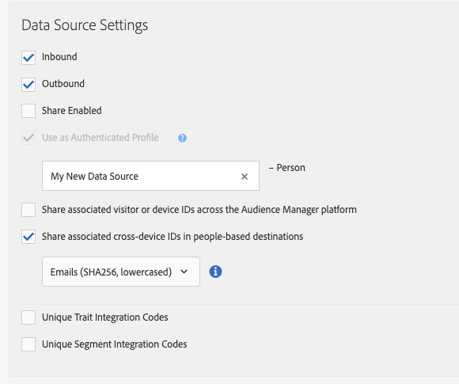

# Processus B - Personnalisation basée sur les données hors ligne uniquement {#workflow-b}

Cette page comprend des conseils détaillés sur la manière de créer des segments d'audience à partir des données client hors ligne uniquement, et de les envoyer aux destinations basées sur People.

## Etape 1 - Caractéristiques hors ligne au niveau du panorama {#step-1-onboard-traits}

La première étape de création des segments d'audience dans ce scénario consiste à importer vos données client hors ligne dans Audience Manager.

>[!IMPORTANT]
>
> Avant de poursuivre, assurez-vous que l'activité client que vous êtes sur le point d'embarquer est déjà définie dans Audience Manager avec les caractéristiques [intégrées correspondantes](../traits/trait-qualification-reference.md).

Que vos identifiants de client Audience Manager ([dpuuid](../../reference/ids-in-aam.md)) soient des courriels hachés ou non, vous devez effectuer la caractéristique à l'aide de la source de données qui contient vos [dpuuid](../../reference/ids-in-aam.md).

### Exemple

Vous souhaitez qualifier les ID de client du tableau ci-dessous pour les ID de caractéristique intégrés correspondants. Considérons que vos [dpuuid](../../reference/ids-in-aam.md) sont stockés dans une source de données avec l'ID 999999, et que votre ID partenaire Audience Manager est 123.

| ID de client (DPUUID) | Identifiant de caractéristique intégré |
| -------------------------------------- | ------------------- |
| 68079982765673198504052656074456196039 | 12345, 23456 |
| 67412682083411995725538770443620307584 | 45678 |
| 89159024796760343733111707646026765593 | 11223, 93342, 27341 |

Pour qualifier les ID de client dans l'exemple ci-dessus pour les caractéristiques intégrées correspondantes, vous devez télécharger un fichier de données [entrant](../../integration/sending-audience-data/batch-data-transfer-explained/inbound-file-contents.md) avec le contenu suivant :

```
68079982765673198504052656074456196039<TAB>d_sid=12345,d_sid=23456
67412682083411995725538770443620307584<TAB>d_sid=45678
89159024796760343733111707646026765593<TAB>d_sid=11223,d_sid=93342,d_sid=27341
```

Le fichier : le nom ressemble à ceci : `ftp_dpm_999999_123_TIMESTAMP.sync.gz`.
Pour [obtenir des informations détaillées sur la structure du fichier, voir Exigences et taille de fichier Amazon S 3 pour les fichiers](../../integration/sending-audience-data/batch-data-transfer-explained/inbound-s3-filenames.md) de données entrants.

## Etape 2 - Configuration des paramètres de la source de données {#configure-data-source-settings}

Selon que vos [dpuuid](../../reference/ids-in-aam.md) sont des adresses minuscules, des adresses électroniques hachées, vous devrez peut-être configurer la source de données qui stockera les adresses électroniques hachées.

**Scénario 1 : vos[dpuuid](../../reference/ids-in-aam.md)sont déjà en minuscules, adresses électroniques hachées.**

Dans ce cas, vous devez nommer la source de données correspondante en tant que telle :

1. Accédez **[!UICONTROL Audience Data]** à -&gt; **[!UICONTROL Data Sources]**.
1. Recherchez la source de données contenant vos [dpuuid](../../reference/ids-in-aam.md), puis cliquez dessus.
1. Assurez-vous que l'option **[!UICONTROL Cannot be tied to personally identifiable information]** n'est pas cochée.
1. Enregistrez les paramètres de la source de données.

**Scénario 2 : vos[identifiants dpuuid](../../reference/ids-in-aam.md)ne sont pas des adresses électroniques hachées.**

Dans ce cas, vous devez créer une source de données inter-périphériques qui stockera les adresses électroniques hachées. Voici comment procéder :

1. Connectez-vous à votre compte Audience Manager et accédez **[!UICONTROL Audience Data]** à -&gt; **[!UICONTROL Data Sources]**, puis cliquez **[!UICONTROL Add New]** sur.
1. Saisissez un **[!UICONTROL Name]** et **[!UICONTROL Description]** pour la nouvelle source de données.
1. Dans le **[!UICONTROL ID Type]** menu déroulant, sélectionnez **[!UICONTROL Cross Device]**.
1. Dans **[!UICONTROL Data Source Settings]** la section, sélectionnez les options **[!UICONTROL Inbound]** et **[!UICONTROL Outbound]** les options, puis activez l' **[!UICONTROL Share associated cross-device IDs in people-based destinations]** option.
1. Utilisez le menu déroulant pour sélectionner **[!UICONTROL Emails(SHA256, lowercased)]** le libellé de cette source de données.
   >[!IMPORTANT]
   >
   >Cette option considère uniquement la source de données comme contenant les données hachées avec cet algorithme spécifique. Audience Manager ne hachera pas les données à cette étape. Assurez-vous que les adresses électroniques que vous prévoyez de stocker dans cette source de données sont déjà hachées avec l [!DNL SHA256] 'algorithme. Sinon, vous ne pourrez pas l'utiliser [!DNL People-Based Destinations]pour.

   

   >[!NOTE]
   >
   > Pour [plus d'informations sur la manière de placer vos données hors ligne dans Audience Manager pour les destinations basées sur un utilisateur, reportez-vous à la section Intégration des données](people-based-destinations-prerequisites.md#data-onboarding) aux questions fréquentes.

## Etape 3 : correspondance des dpuuid avec les adresses de courriel hachées par la synchronisation des identifiants basés sur un fichier {#match-ids-emails}

>[!IMPORTANT]
>
> Cette étape s'applique uniquement au [scénario 2](people-based-destinations-workflow-offline.md#configure-data-source-settings) décrit ci-dessus. Si vos [identifiants DPUUID existants](../../reference/ids-in-aam.md) sont déjà des adresses électroniques hachées, passez à [l'étape 4 - Création d'une règle de fusion de profils pour la segmentation](#create-profile-merge-rule).

Imaginons que vous souhaitez faire correspondre vos [dpuuid existants](../../reference/ids-in-aam.md) de l'exemple 1 aux adresses de courriel hachées du tableau ci-dessous (colonne à droite) et stocker les adresses électroniques hachées dans la nouvelle source de données que vous avez créée à [l'étape 2 - Configurer les paramètres de la source de données](#configure-data-source-settings).

À titre de rappel, vous disposez maintenant de deux sources de données :

| ID de source de données | Contenu de la source de données |
| -------------- | -------------------------- |
| 999999 | DPUUID existants (identifiants CRM) |
| 987654 | Adresses électroniques hachées |

| Dpuuids (ID de CRM) | Adresse électronique | Adresse électronique hachée |
| -------------------------------------- | --------------------- | ---------------------------------------------------------------- |
| 68079982765673198504052656074456196039 | `johndoe@example.com` | 55e79200c1635b37ad31a378c39feb12f120f116625093a19bc32fff15041149 |
| 67412682083411995725538770443620307584 | `janedoe@email.com` | 16d72e3edbeb089b299e0d12fc09522fdc5ece2d11dcb1304ecdd6fab4f7193a |
| 89159024796760343733111707646026765593 | `name@mydomain.com` | feec5debcea411f54462a345a0d90c9975415d2d4862745ff8af00c49b6b4ae6 |

<br/>

Votre [fichier](../../integration/sending-audience-data/batch-data-transfer-explained/id-sync-file-based.md) de synchronisation des identifiants présenterait les contenus suivants :

```
68079982765673198504052656074456196039<TAB>55e79200c1635b37ad31a378c39feb12f120f116625093a19bc32fff15041149
67412682083411995725538770443620307584<TAB>16d72e3edbeb089b299e0d12fc09522fdc5ece2d11dcb1304ecdd6fab4f7193a
89159024796760343733111707646026765593<TAB>feec5debcea411f54462a345a0d90c9975415d2d4862745ff8af00c49b6b4ae6
```

<br/>

Le fichier de synchronisation [des identifiants](../../integration/sending-audience-data/batch-data-transfer-explained/id-sync-file-based.md) doit respecter cette structure de dénomination :

`c2c_id_<DPUUID_DATA_SOURCE_ID>_<HASHED_EMAIL_DATA_SOURCE_ID>_TIMESTAMP.sync`

<br/>

Dans l'exemple ci-dessus, le fichier - nom ressemblerait à ceci : `c2c_id_999999_987654_1560431657.sync`

[Téléchargez un exemple de fichier ici](https://marketing.adobe.com/resources/help/en_US/aam/downloads/c2c_id_999999_987654_1560431657.sync).

## Étape 4 - Création d'une règle de fusion de profils pour la segmentation {#create-profile-merge-rule}

L'étape suivante consiste à créer une règle de fusion qui vous aidera à créer les segments d'audience à envoyer à [!DNL People-Based Destinations]votre.

1. Connectez-vous à votre compte Audience Manager et accédez **[!UICONTROL Audience Data]** à -&gt; **[!UICONTROL Profile Merge Rules]**.
2. Cliquez sur [!UICONTROL Add New Rule].
3. Saisissez une règle de fusion de profil **[!UICONTROL Name]** et **[!UICONTROL Description]**.
4. Dans **[!UICONTROL Profile Merge Rule Setup]** la section, sélectionnez **[!UICONTROL All Cross-Device Profiles]** la règle dans **[!UICONTROL Cross-Device Options]** la liste.
5. Dans **[!UICONTROL Cross-Device Profile Options]** la liste, sélectionnez la source de données par rapport à laquelle vos caractéristiques sont intégrées.
   

## Etape 5 - Création de segments d'audience {#create-audience-segments}

Pour créer des segments à partir de données hors ligne uniquement, utilisez le créateur [de segments](../segments/segment-builder.md) et veillez à utiliser la nouvelle règle de fusion du profil que vous avez créée à l'étape précédente lors de la création du segment.

## Étape 6 - Configuration de l'authentification de plateforme basée sur les personnes {#configure-authentication}

1. Connectez-vous à votre compte Audience Manager et accédez **[!UICONTROL Administration]** à &gt; **[!UICONTROL Integrated Accounts]**. Si vous avez déjà configuré une intégration avec une plateforme sociale, vous devriez la voir dans cette page. Sinon, la page est vide.
   
1. Cliquez sur **[!UICONTROL Add Account]**.
1. Utilisez le menu **[!UICONTROL People-Based Platform]** déroulant pour sélectionner la plateforme à laquelle vous souhaitez configurer l'intégration.
   
1. Cliquez pour **[!UICONTROL Confirm]** être redirigé vers la page d'authentification de la plateforme sélectionnée.
1. Une fois que vous êtes authentifié sur votre compte de plateforme sociale, vous êtes redirigé vers Audience Manager, où vos comptes publicitaires associés doivent apparaître. Sélectionnez le compte publicitaire à utiliser, puis cliquez **[!UICONTROL Confirm]** sur.
1. Audience Manager affiche une notification en haut de la page pour vous informer si le compte a bien été ajouté. La notification vous permet également d'ajouter une adresse électronique de contact à laquelle recevoir des notifications lorsque l'authentification de la plateforme sociale est sur le point d'expirer.

>[!IMPORTANT]
>
>Un gestionnaire d'udience gère l'intégration à des plateformes sociales via des jetons d'authentification qui expirent après une certaine durée. Pour plus d'informations sur le renouvellement des jetons expirés, reportez-vous à la section Renouvellement du jeton d'authentification.

## Etape 7 - Création d'une destination basée sur People {#create-destination}

1. Connectez-vous à votre compte Audience Manager, accédez **[!UICONTROL Audience Data]** à &gt; **[!UICONTROL Destinations]**, puis cliquez **[!UICONTROL Create Destination]** sur.
1. Dans **[!UICONTROL Basic Information]** la section, saisissez a **[!UICONTROL Name]** et **[!UICONTROL Description]** pour la nouvelle source de données et utilisez les paramètres suivants :
   * **[!UICONTROL Category]**: Plateformes intégrées ;
   * **[!UICONTROL Type]**: Basé sur les personnes ;
   * **[!UICONTROL Platform]**: sélectionnez la plateforme basée sur people pour laquelle vous souhaitez envoyer des segments d'audience ;
   * **[!UICONTROL Account]**: sélectionnez un compte publicitaire associé à la plateforme sélectionnée.
      
1. Cliquez sur **[!UICONTROL Next]**.
1. Choisissez la **[!UICONTROL Data Export Labels]** valeur que vous souhaitez définir pour cette destination.
1. Dans **[!UICONTROL Configuration]** la section, sélectionnez la source de données contenant vos sources de données hachées.
1. Dans **[!UICONTROL Segment Mappings]** la section, sélectionnez les segments à envoyer à cette destination. Il s'agira des segments que vous avez créés à [l'étape 5 - Création de segments d'audience](people-based-destinations-workflow-offline.md#create-audience-segments).
1. Enregistrez la destination.
