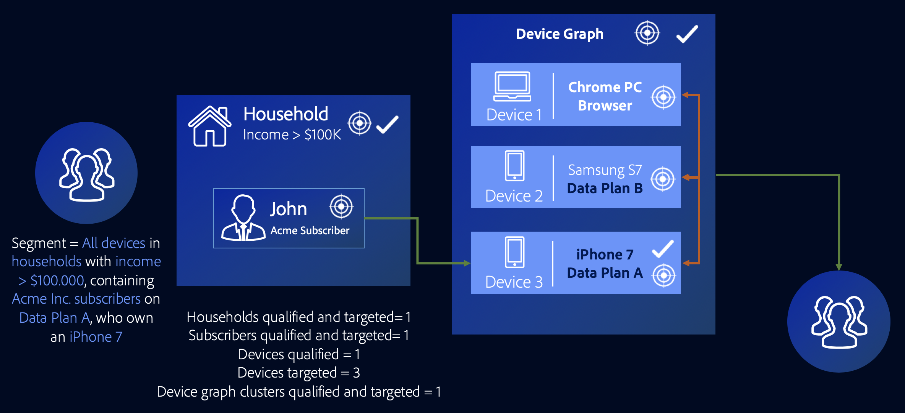

# Cas d’utilisation graphiques des périphériques externes {#external-device-graph-use-cases}

Recommandations et cas d’utilisation pour la prospection, le reciblage et la personnalisation pour les utilisateurs inconnus avec un graphique de périphérique externe. Un graphique de périphérique externe est défini comme un graphique de périphérique distinct d’Audience Manager. Cela inclut les intégrations [!DNL Adobe Experience Cloud Device Co-op] et autres d’Adobe avec des sociétés tierces de graphiques de périphériques déterministes ou probabilistes.

## Recommandations {#recommendations}

Tenez compte des options de graphique de périphériques [!DNL Experience Cloud Device Co-op] et tiers pour les campagnes qui :

* Posséder un faible niveau d’authentification sur l’ensemble de leurs propriétés numériques. Utilisez le [!UICONTROL Profile Link Device Graph option] si vous avez un grand nombre d’utilisateurs authentifiés.
* Ciblez les publics importants. Les graphiques de périphériques [!DNL Experience Cloud Device Co-op] et tiers contiennent des données authentifiées et non authentifiées.
* Segmentez les visiteurs authentifiés et/ou non authentifiés au niveau individuel et familial.

<!-- 
## Prospecting/Branding Use Case {#prospecting-branding-use-cases}

A branding campaign is designed to reach as many people as possible. It places few limits on segment qualification. But, these campaigns can waste budget and impressions by constantly targeting people who see your content multiple times and don't convert. A [!UICONTROL Profile Merge] rule that uses the [!DNL Device Co-op] or third-party option can help you create an efficient branding campaign. For example, you can add these unknown users to a "not in-market" segment after seeing them across multiple devices for your set frequency cap.

<table id="table_00F6EED172574E80A38CADA8A92A23B1"> 
 <thead> 
  <tr> 
   <th colname="col1" class="entry"> Use Case </th> 
   <th colname="col2" class="entry"> Description </th> 
  </tr> 
 </thead>
 <tbody> 
  <tr> 
   <td colname="col1"> 
 <b>Conditions</b> 
 </td> 
   <td colname="col2">This use case assumes these conditions: 
 
     <ul id="ul_F5CA7EE525774F7EBA5FBB5F94E4EDC8"> 
      <li id="li_81AE304924724146A24FAB5B6533AD8E">You want to deliver a maximum of 10 impressions to an anonymous user for a specific ad campaign. </li> 
      <li id="li_E371F989735245B0B82433DE240D56D0">A user has 4 devices and may or may not have authenticated on your site. </li> 
      <li id="li_9231ABE15CA249E6B79D8BF0E511FD33">An anonymous user sees the ad a total of 10 times while browsing in an unauthenticated state on their current device and 3 devices linked to the current device by an external device graph. </li> 
      <li id="li_8C276C07019C49EFA3A0D0D54CF73C31">You have defined an  Audience Manager segment to qualify anonymous users after they have seen 10 impressions. </li> 
     </ul> 
 </td> 
  </tr> 
  <tr> 
   <td colname="col1"> 
 <b>Results</b> 
 </td> 
   <td colname="col2"> 
Given these conditions,  Audience Manager: 
 
 
     <ul id="ul_8E988B1005324526BC6DC6637BBACCFB"> 
      <li id="li_C9DD546754914BACB8F4C92C7D4ED70E">Merges the anonymous, unauthenticated activity collected from the current device and the 3 devices linked by the external device graph (the ad impressions from each device). </li> 
      <li id="li_FB55CB9116074525BA30FF062D1136AE">Evaluates the unauthenticated user for segment qualification based on a combination of anonymous activity across all 3 devices linked by the external device graph and the current device. </li> 
      <li id="li_B28EB32F718145A7ABBDAC0AF75E2AFC">Sends the segment to any real-time destination for use as a suppression segment on the current device and all 3 devices linked by the external device graph. </li> 
     </ul> 
 </td> 
  </tr> 
 </tbody> 
</table>

## Retargeting or Site Personalization Use Case {#retargeting-use-case}

These strategies are designed to bring an unauthenticated or unknown user back to your site or personalize their browsing experience while they're on-site.

<table id="table_0EE2052AA3E744B3B76036FC06B5A453"> 
 <thead> 
  <tr> 
   <th colname="col1" class="entry"> Use Case </th> 
   <th colname="col2" class="entry"> Description </th> 
  </tr> 
 </thead>
 <tbody> 
  <tr> 
   <td colname="col1"> 
 <b>Conditions</b> 
 </td> 
   <td colname="col2">This use case assumes these conditions: 
 
     <ul id="ul_FD0B869B4AF3453FAEC9BA3A45ABF039"> 
      <li id="li_8E30BAED42E94AB3B81FCB1C7464E5FC">You want to deliver a personalized on-site and/or off-site experience to an anonymous user based on their activity on your site while in an unauthenticated state. </li> 
      <li id="li_3DBE53BA94324F1BA1C52A37AD4E426C">A user has multiple devices and may or may not have authenticated to your site. </li> 
      <li id="li_F867AFBDC1A54CD6A68AB0EC196E27C9">A user views multiple pages on your site while browsing in an unauthenticated state on their current device and 3 other devices linked by an external device graph. </li> 
      <li id="li_7E35D77949CE4E69BD51655AA4C40BEE">You have defined an  Audience Manager segment to qualify users after they have viewed multiple pages on your site while browsing in an unauthenticated state.</li>
     </ul> 
 </td> 
  </tr> 
  <tr> 
   <td colname="col1"> 
 <b>Results</b> 
 </td> 
   <td colname="col2"> 
Given these conditions,  Audience Manager: 
 
 
     <ul id="ul_301339426B0643B295DC5B17E1939CFB"> 
      <li id="li_7E8BC3B179804F4A929497DE81E76911">Merges the anonymous, unauthenticated activity collected from the current devices and the 3 devices linked by the external device graph (the multiple page views from each device). </li> 
      <li id="li_803EFD58AA124A5BBC8279C4DC695544">Evaluates the unauthenticated user for segment qualification based on a combination of anonymous activity across all 3 devices linked by the external device graph and the current device. </li> 
      <li id="li_98D749268CC5456CBC9CF3BF5EB91BA8">Sends the segment to any real-time destination to deliver a personalized on-site and/or off-site experience across the current device and all 3 devices linked by the external device graph. </li>
     </ul> 
 </td>
  </tr>
 </tbody>
</table> -->

## Ciblage étendu des périphériques {#audience-expansion}

Ce cas d’utilisation illustre la manière dont vous pouvez augmenter la taille de votre audience adressable grâce à une personnalisation inter-périphériques précise, par le biais du [!DNL Adobe Co-Op Device Graph] ou d’un autre [!DNL External Device Graphs].

Disons que Jane possède trois appareils qu'elle utilise régulièrement pour rechercher des forfaits vacances : son ordinateur portable ([!DNL Device 1]), son smartphone ([!DNL Device 2]) et sa tablette ([!DNL Device 3]). En utilisant l'ordinateur portable, Jane a recherché des vols, des hôtels et des visites guidées. En utilisant son smartphone et sa tablette, elle n'a visité que la page d'accueil de l'agence de voyage.

En utilisant la règle [!UICONTROL No Cross-Device Profile] + [!UICONTROL Adobe Co-op Device Graph] , l’agence de voyages peut fusionner les trois profils d’appareils, puisqu’ils sont liés au même propriétaire par l’intermédiaire du [!UICONTROL Adobe Co-op Device Graph].

Dans notre exemple, les caractéristiques requises pour être admissibles au segment ont toutes été collectées sur [!DNL Device 1]. Puisque Audience Manager qualifie chaque profil de périphérique qui a pris part à la fusion de profils pour un segment, les trois profils de périphérique de Jane sont maintenant segmentés.

Grâce à cette règle, le graphique de périphériques a augmenté le nombre de profils de périphériques qui remplissent les conditions pour le segment de un à trois et a permis à l’agence de voyages d’envoyer un message cohérent aux trois périphériques appartenant à Jane.

## Ciblage avancé sur plusieurs périphériques {#advanced-graph-expansion}

Ce cas d’utilisation montre comment vous pouvez développer le ciblage d’audience pour les visiteurs authentifiés avec des périphériques à partir d’un graphique de périphérique externe ou du [!DNL Adobe Co-Op Device Graph], à l’aide de la **[!UICONTROL Last Authenticated Profiles]** règle + **[!UICONTROL Adobe Co-Op Device Graph]** .

Dans l'exemple ci-dessous, la société Acme Inc. veut cibler tous les ménages dont le revenu est supérieur à 100 000 $ par année, qui ont [!DNL Acme Inc.] des abonnés [!DNL Data Plan A], qui utilisent un [!DNL iPhone 7] appareil.

John utilise son iPhone 7 sur le plan de données A pour s’authentifier sur le site Web d’Acme Inc. En même temps, la grappe de John [!DNL Co-Op Device Graph] contient deux appareils supplémentaires qu'il utilise régulièrement : son ordinateur portable ([!DNL Device 1]) et son smartphone secondaire [!DNL Device 2] (un [!DNL Samsung S7] sur [!DNL Data Plan B]).

En utilisant le **[!UICONTROL Last Authenticated Profiles]** + **[!UICONTROL Adobe Co-Op Device Graph]**, [!DNL Acme Inc.] vous pouvez envoyer des messages personnalisés aux trois périphériques à partir de la grappe graphique de périphériques de John, même si l’un d’eux seulement est admissible au segment.

>[!MORE_LIKE_This]
>
>* [Cas d’utilisation de graphiques de périphériques de lien de profil](profile-link-use-case.md)
>* [Cas d’utilisation généraux des règles de fusion de profils](merge-rule-targeting-options.md)
>* [FAQ sur les règles de fusion de profils](faq-profile-merge.md)

