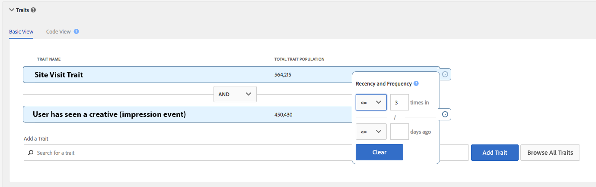

# Suppression instantanée multi-appareils {#instant-cross-device-suppression}

[!UICONTROL Instant Cross-Device Suppression] permet de supprimer des utilisateurs sur plusieurs périphériques connectés lorsqu’une expérience particulière se produit sur l’un de ces périphériques. Use the [!UICONTROL Instant Cross-Device Suppression] capability to deliver a consistent experience across devices to your users. Ceci est rendu possible grâce aux options de désegmentation en temps réel dans Audience Manager.

## Présentation {#overview}

[!UICONTROL Instant Cross-Device Suppression] fournit deux cas d’utilisation clés : amélioration de l’expérience utilisateur et de l’efficacité des médias.

* **Une meilleure expérience** utilisateur : Les utilisateurs qui ont déjà acheté votre produit ou service ne voient pas les mêmes éléments créatifs qu’avant l’achat. Au lieu de cela, vous pouvez afficher des messages d’augmentation ou de vente croisée pour des produits ou services que vous savez qu’ils n’ont pas achetés.
* **Efficacité** des médias : Optimisez vos dépenses de campagne en appliquant un plafond de fréquence global à toutes les [!DNL DSP]zones. Le plafonnement de fréquence peut être activé en temps réel pour plusieurs périphériques appartenant à un utilisateur.

Les détails techniques de la non-segmentation en temps réel sont décrits en détail dans Règles de fusion des [Profils et Processus](merge-rule-unsegment.md)de désegmentation des périphériques. Lisez la suite pour la mise en oeuvre pratique des cas d&#39;utilisation décrits ci-dessus.

## Ne pas Cible après la conversion {#do-not-target-once}

Assurez-vous que vos utilisateurs qui ont déjà effectué des conversions (ont acheté un produit, acquis un abonnement, etc.) ne verra pas le même message qu’avant la conversion. Vous pouvez obtenir ceci à l’aide de la [!UICONTROL AND NOT] logique, comme suit.

1. Créez un segment à l’aide de deux caractéristiques et utilisez la [!UICONTROL AND NOT] logique, comme illustré dans l’image ci-dessous. Vous devez utiliser une caractéristique basée sur des règles pour définir le événement de conversion pour que le non-segment soit déclenché en temps réel. En savoir plus sur la [création de caractéristiques](../traits/create-onboarded-rule-based-traits.md)basées sur des règles.
2. Faites correspondre le segment à n’importe quel nombre de destinations serveur à serveur en temps réel. Découvrez comment ajouter des segments aux destinations serveur à serveur.

Vos visiteurs sont admissibles pour le segment tant qu’ils n’ont pas effectué de conversion. Dès qu’ils répondent aux critères de la caractéristique de conversion, ils cessent de suivre la règle de segmentation et sont instantanément supprimés du segment.

## Ne pas Cible après les impressions x {#do-not-target-after-x}

Vous pouvez vous assurer de ne pas inonder vos utilisateurs de la même créativité en définissant des contrôles de récence et de fréquence. Dans ce scénario, créez un segment avec deux caractéristiques, comme indiqué dans les étapes ci-dessous.

1. Créez un segment à l’aide de deux caractéristiques et utilisez la [!UICONTROL AND] logique, comme illustré dans l’image ci-dessous. Vous devez utiliser une caractéristique basée sur des règles pour définir le événement d’impression pour que le non-segment soit déclenché en temps réel. En savoir plus sur la [création de caractéristiques](../traits/create-onboarded-rule-based-traits.md)basées sur des règles.
   >[!NOTE]
   >
   >Vous pouvez utiliser [!UICONTROL Actionable Log Files] ou [!UICONTROL Pixel Calls] créer des caractéristiques en fonction des impressions des utilisateurs. En savoir plus sur les fichiers [journaux](../../integration/media-data-integration/actionable-log-files.md) utilisables et les appels [de](../../integration/media-data-integration/impression-data-pixels.md)pixels.
2. Appliquez des contrôles de fréquence à la seconde caractéristique. Si vous le souhaitez, vous pouvez également ajouter des contrôles de récence. En savoir plus sur [l&#39;application des contrôles de récence et de fréquence](../segments/recency-and-frequency.md).
3. Faites correspondre le segment à n’importe quel nombre de destinations serveur à serveur en temps réel. Découvrez comment ajouter des segments aux destinations serveur à serveur.

Dans ce scénario, une fois que vos utilisateurs ont accumulé plus de trois impressions, ils seront supprimés de ce segment et ne verront plus ce créatif particulier.

## Aspects importants à prendre en compte - Traitement {#processing-notes}

Gardez à l’esprit les aspects suivants liés au traitement :

* Pour que la fonctionnalité de non-segmentation en temps réel fonctionne, vous devez mapper les segments de votre choix à des destinations serveur à serveur en temps réel.
* Pour les périphériques connectés à un périphérique par un graphique [de](profile-link-use-case.md#recommendations)périphérique, nous appliquons une limite de quatre périphériques en ce qui concerne l’évaluation et la non-segmentation. Cette limitation est décrite dans Options graphiques [du périphérique et Unsegmentation](merge-rule-unsegment.md#device-graph-options-unsegmentation)du périphérique. &#x200B;
* La commande unsegment sera incluse dans un fichier de commandes, qui est envoyé aux destinations toutes les 24 heures, pour plusieurs périphériques connectés par le graphique de l&#39;appareil.
* Le périphérique doit être visible en temps réel (sur le [bord](../../reference/system-components/components-edge.md) ) afin d’inciter l’évaluation des segments en temps réel. Pour les caractéristiques dont la caractéristique [!UICONTROL time-to-live (TTL)] [!DNL TTL] est atteinte, le périphérique est automatiquement désegmenté dans les 24 heures par l&#39;intermédiaire du fichier de commandes. &#x200B; En savoir plus sur la [définition d’un intervalle](../traits/create-onboarded-rule-based-traits.md#set-expiration-interval)d’expiration de caractéristique.
* Si vous utilisez en temps réel les caractéristiques [!UICONTROL DCS API] à bord basées sur des règles, vous pouvez déclencher le désegment à l’aide de la [!UICONTROL AND NOT] logique. En savoir plus sur l&#39; [envoi de données à l&#39;API](../../api/dcs-intro/dcs-event-calls/dcs-url-send.md)DCS. &#x200B;

## Aspects importants à prendre en compte - Calendrier {#timing-notes}

Gardez à l’esprit les aspects suivants liés au timing :

* Un segment est stocké sur le [bord](../../reference/system-components/components-edge.md) pendant la même période qu&#39;un profil de périphérique est stocké sur le [!UICONTROL Edge], à savoir 14 jours depuis la dernière interaction en temps réel. Pour en savoir plus sur la rétention des données, consultez notre FAQ [sur la rétention des](../../faq/faq-privacy.md#data-retention-faq)données.
* Il faut environ 24 heures pour que l&#39;opération de non-segmentation se propage à travers [!DNL DCS] les régions. Pour en savoir plus sur nos [!DNL DCS] régions, [ici](../..//reference/system-components/components-data-collection.md) et [ici](../../api/dcs-intro/dcs-api-reference/dcs-regions.md).
