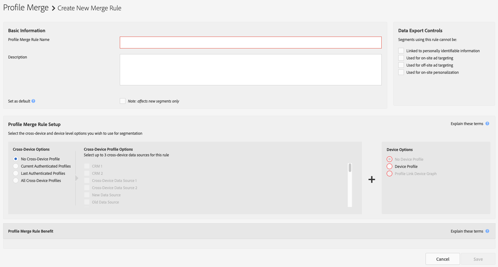

# [!UICONTROL Profile Merge Rules] Options définies {#profile-merge-rule-options-defined}

Le [!UICONTROL profile merge rule] permettent de contrôler le type de données. [!DNL Audience Manager] utilise pour la segmentation. A [!UICONTROL profile merge rule] peut inclure les profils d’appareil mappés par la variable [!UICONTROL Profile Link] Device Graph et/ou d’autres fournisseurs tiers de Device Graph intégrés à [!DNL Audience Manager]. Vous pouvez créer un maximum de 4 [!UICONTROL Profile Merge Rules]. Le quatrième [!UICONTROL Profile Merge Rule] est disponible exclusivement pour les clients qui ont acheté la variable [!UICONTROL People-Based Destinations] module complémentaire .

Vous créez une [!UICONTROL Profile Merge Rule] en effectuant une sélection parmi les options décrites ci-dessous, dans [!UICONTROL Profile Merge Rule Setup].

## [!UICONTROL Profile Merge Rule] Présentation des options {#overview}

[!UICONTROL Profile Merge Rules] permettent de nombreuses combinaisons de règles, chacune étant orientée vers des cas d’utilisation spécifiques. Consultez le tableau ci-dessous pour savoir quand utiliser chaque combinaison de règles.

| [!UICONTROL Cross-Device Option] | [!UICONTROL Device Option] | Disponibilité | Type d’évaluation | [!UICONTROL Audience Lab] Assistance | Cas d’utilisation |
| ------------------------------ | --------------------------------------------------- | ------------------------------------------------------------------------------------------------------------------------------------------------------------------------------------------------- | ------------------- | ----| -------------------- |
| [!UICONTROL No Cross-Device Profile] | [!UICONTROL Device Profile] | Tous les clients | Temps réel et lot | Oui | [Ciblage des périphériques](merge-rule-targeting-options.md#device-personalization) |
| [!UICONTROL No Cross-Device Profile] | [!UICONTROL External Device Graph] | Tous les clients | Temps réel et lot | Non | [Ciblage étendu des périphériques](external-graph-use-cases.md#audience-expansion) |
| [!UICONTROL Current Authenticated Profiles] | [!UICONTROL No Device Profile] | Tous les clients | Temps réel uniquement | Non | [Ciblage des périphériques partagés](merge-rule-targeting-options.md#target-shared-devices) |
| [!UICONTROL Last Authenticated Profiles] | [!UICONTROL Device Profile] | Tous les clients | Temps réel et lot | Oui | [Ciblage en ligne/hors ligne](merge-rule-targeting-options.md#device-household-targeting) |
| [!UICONTROL Last Authenticated Profiles] | [!UICONTROL Profile Link Device Graph] | Tous les clients | Temps réel et lot | Oui | [Ciblage sur plusieurs appareils](profile-link-use-case.md#cross-device-personalization) |
| [!UICONTROL Last Authenticated Profiles] | [!UICONTROL External Device Graph] | Tous les clients | Temps réel et lot | Non | [Ciblage avancé sur plusieurs appareils](external-graph-use-cases.md#advanced-graph-expansion) |
| [!UICONTROL All Cross-Device Profiles] | S.O. | Exclusif à [Destinations basées sur les personnes](../destinations/people-based-destinations-overview.md) clients | Lot uniquement | Non | [Ciblage des destinations basées sur les personnes](merge-rule-targeting-options.md#all-cross-device) |

## [!UICONTROL Profile Merge Rule] [!UICONTROL Segment] Évaluation {#segment-evaluation}

Selon votre [!UICONTROL Profile Merge Rules] configuration, [!DNL Audience Manager] peut exécuter la fonction [!UICONTROL segment] évaluation en temps réel, par lots ou les deux.

* Temps réel [!UICONTROL segment] l’évaluation requiert la [!DNL DCS] pour afficher les visiteurs qui accèdent à vos propriétés numériques en temps réel, afin de répondre aux critères [!UICONTROL segment].
* Lot [!UICONTROL segment] l’évaluation est effectuée par rapport à des [!UICONTROL traits].
* [!UICONTROL Profile Merge Rules] qui prennent en charge à la fois le temps réel et le lot [!UICONTROL segment] l’évaluation combine l’activité de visiteur en temps réel avec les activités précédemment qualifiées [!UICONTROL traits].

## [!UICONTROL Profile Merge Rules] Latence des rapports {#reporting-latency}

Temps réel [!UICONTROL segment] l&#39;évaluation se répercute immédiatement dans la [!UICONTROL Profile Merge Rules] rapports.

Lot [!UICONTROL segment] l’évaluation peut prendre jusqu’à 24 heures pour être reflétée dans la variable [Rapports sur les stratégies de fusion de profils](profile-link-metrics.md).

## [!UICONTROL Cross-Device Options] {#auth-options}

Le [!UICONTROL Cross-Device Options] vous permettent de sélectionner des utilisateurs authentifiés et non authentifiés et d’exploiter leur profil multi-appareils pour la segmentation. Ces options vous aident à identifier et à atteindre des utilisateurs spécifiques sur un appareil partagé. Pour plus d’informations sur les utilisateurs anonymes et authentifiés, voir [États d’authentification du visiteur dans l’Audience Manager](../../reference/visitor-authentication-states.md).

<table id="table_4CE2DD312F54480E96BEAF72800789FB"> 
 <thead> 
  <tr> 
   <th colname="col1" class="entry"> Option multi-appareils </th> 
   <th colname="col2" class="entry"> Description </th> 
  </tr> 
 </thead>
 <tbody> 
  <tr> 
   <td colname="col1"> 
 <b> Aucun profil multi-appareils</b> 
 </td> 
   <td colname="col2"> 
Tells  Audience Manager ne pas utiliser les données collectées auprès d’utilisateurs authentifiés. 
 </td> 
  </tr> 
  <tr> 
   <td colname="col1"> 
 <b> Profils authentifiés actuels</b> 
 </td> 
   <td colname="col2"> 
Tells  Audience Manager pour lire et écrire des données dans le profil authentifié si un visiteur s’est connecté à votre site. 
 </td> 
  </tr> 
  <tr> 
   <td colname="col1"> 
 <b> Derniers profils authentifiés</b> 
 </td> 
   <td colname="col2"> 
Tells  Audience Manager pour lire les données du profil authentifié de l’utilisateur qui s’est connecté pour la dernière fois à l’appareil. 
 
Lorsque cette option est sélectionnée,  Audience Manager n’écrira pas de nouvelles données de caractéristique dans le profil authentifié si l’utilisateur est anonyme. Lors de l’authentification, les nouvelles données de caractéristique sont écrites dans le profil authentifié de l’utilisateur. 
 </td>
  </tr> 
  <tr> 
   <td colname="col1"> 
 <b> Tous les profils sur plusieurs appareils</b> 
 </td> 
   <td colname="col2"> 
Indique à l’Audience Manager de lire les données de tous les profils multi-appareils, quel que soit l’état d’authentification. Cette option est disponible uniquement pour les clients d’Audience Manager qui ont acheté le module complémentaire Destinations basées sur les personnes .
 </td>
  </tr>
 </tbody>
</table>

## [!UICONTROL Cross-Device Profile Options] {#profile-options}

Le [!UICONTROL Cross-Device Profile Options] répertorie vos [!UICONTROL cross-device data sources]. Ces options utilisent les noms que vous avez fournis lors de la création d’une [!UICONTROL cross-device] [!UICONTROL data source] (voir [Création d’une source de données multi-appareils](merge-rules-start.md#create-data-source)). Vous pouvez sélectionner jusqu’à 3 [!UICONTROL cross-device data sources] à utiliser avec chaque règle de profil. Le [!UICONTROL Authenticated Profile Options] sont disponibles lorsque vous choisissez **[!UICONTROL Current Authenticated Profiles]** ou **[!UICONTROL Last Authenticated Profiles]**.

## [!UICONTROL Device Options] {#device-options}

Le [!UICONTROL Device Options] vous permet de sélectionner le type de *`device profile`* utilisé par une [!UICONTROL Profile Merge Rule]. Un profil d’appareil est créé à partir de [!UICONTROL traits] collectée à partir de l&#39;activité de navigation anonyme. Au minimum, un [!UICONTROL profile merge rule] inclut une [!UICONTROL authenticated option] et un [!UICONTROL device option].

<table id="table_D373FB787D1A4E3485C02C4A76F03395"> 
 <thead> 
  <tr> 
   <th colname="col1" class="entry"> Option du périphérique </th> 
   <th colname="col2" class="entry"> Description </th> 
  </tr> 
 </thead>
 <tbody> 
  <tr> 
   <td colname="col1"> 
 <b> Aucun profil de périphérique</b> 
 </td> 
   <td colname="col2"> 
Tells  Audience Manager ne pas utiliser les caractéristiques contenues dans le profil anonyme pour la segmentation. 
 </td> 
  </tr> 
  <tr> 
   <td colname="col1"> 
 <b> Profil du périphérique</b> 
 </td> 
   <td colname="col2"> 
Tells  Audience Manager pour utiliser le profil d’appareil anonyme pour la segmentation. 
 </td> 
  </tr> 
  <tr> 
   <td colname="col1"> 
 <b> Graphique du périphérique du lien de profil</b> 
 </td> 
   <td colname="col2"> 
Tells  Audience Manager pour lire les profils de l’appareil actuel et jusqu’à 100 autres appareils à partir desquels l’utilisateur s’est authentifié. Ce graphique d’appareil est basé sur vos propres données propriétaires dans  Audience Manager. Il est idéal pour les clients qui disposent d’un niveau élevé d’authentification dans leurs propriétés numériques. Le  Lien de profil Device Graph est mis à jour en temps réel. Cette option est disponible lorsque vous sélectionnez <b> Profil authentifié actuel</b> ou <b> Dernier profil authentifié</b>. Lorsque vous utilisez cette option, vous ne pouvez choisir qu’un seul profil authentifié ( Audience Manager grise automatiquement les autres). Voir aussi <a href="profile-link-use-case.md"> Cas d’utilisation des représentations graphiques des appareils Profile Link</a>. 
 </td>
  </tr>

<tr> 
   <td colname="col1"> 
<b>Options de représentation graphique des appareils tiers</b> (Personne et foyer) 
 </td>
   <td colname="col2"> 
Ces options vous permettent de créer des règles de fusion basées sur la technologie de représentation graphique des appareils fournie par un fournisseur tiers. Une représentation graphique tierce des appareils fournit : 
 
 
     <ul id="ul_5BA0D940BA15484FADF134A5A73815D5"> 
      <li id="li_389ACEBBF79A47499B6119B0F9CB3B5D"> Données probabilistes et/ou déterministes. </li> 
      <li id="li_E8606D3871A145A68E87BDC3554AC4EF">Données au niveau de la personne ou du foyer. </li> 
     </ul> 
 
Pour utiliser ces options, vous devez être client d’une représentation graphique des appareils qui est déjà intégrée à  Audience Manager. Contactez votre gestionnaire de compte pour plus d’informations ou pour commencer. 
 </td>
  </tr>
 </tbody>
</table>

## [!UICONTROL External Merge Policies] {#external-merge-policies}

Segments d’audience automatiquement créés à partir d’autres [!DNL Experience Cloud] solutions, basées sur des règles de fusion définies en dehors de [!DNL Audience Manager], sont marqués comme utilisant une [!UICONTROL External Merge Policy]. Par exemple, reportez-vous à la section [Partage d’audiences entre l’Audience Manager et Adobe Experience Platform](../../integration/integration-aep/aam-aep-audience-sharing.md).

>[!MORELIKETHIS]
>
>* [FAQ sur les règles de fusion de profils](../../faq/faq-profile-merge.md)

