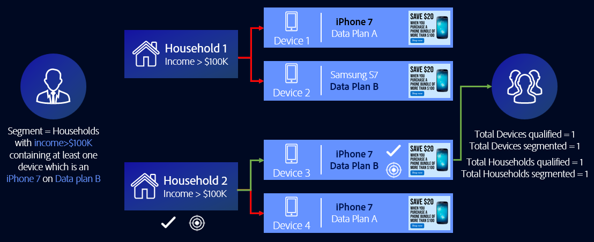

# Cas d’utilisation généraux des règles de fusion de Profils {#general-use-cases-for-profile-merge-rules}

[!UICONTROL Profile Merge Rules] vous permet d’étendre ou de renforcer l’audience en vous concentrant sur des audiences spécifiques en fonction des besoins ou des objectifs de l’entreprise. Ces cas d’utilisation généraux explorent comment utiliser les options disponibles et créent des règles de fusion pour le ciblage individuel, domestique et inter-périphériques. [!UICONTROL Profile Merge Rules] fonctionnent avec des destinations en temps réel et par lot.

>[!TIP]
>
>Pour obtenir les définitions et les descriptions de ces [!UICONTROL Merge Rule] paramètres, voir Définition [des options de règle de fusion de](merge-rule-definitions.md)Profil.

## Ciblage de périphérique {#device-personalization}

Ce scénario s’applique aux spécialistes du marketing qui souhaitent évaluer un profil de périphérique unique pour un segment d’audience défini dans l’Audience Manager, afin de fournir une expérience cohérente au périphérique à l’aide de plateformes de ciblage qui prennent en charge les ID de périphérique (DSP, plateformes de personnalisation sur site et autres plateformes de ciblage basées sur un périphérique), sans tenir compte de l’authentification des utilisateurs.

Pour créer une règle qui ne cible que les profils de périphérique, sélectionnez **[!UICONTROL No Cross-Device Profile]** + **[!UICONTROL Device Profile]**.

Disons que John possède trois smartphones. Deux d&#39;entre eux sont des iPhone 7 sur le plan de données A, et l&#39;un d&#39;eux est un Samsung sur le plan de données B. Ne prenant pas en compte son état authentifié sur l&#39;un des trois appareils, l&#39;opérateur mobile de John veut lui offre une mise à niveau du plan de données, mais seulement pour les appareils iPhone 7 qui s&#39;exécutent sur le plan de données A.

En utilisant la règle **[!UICONTROL No Cross-Device Profile]** + **[!UICONTROL Device Profile]** , [!DNL Device 1] et [!DNL Device 3] les deux remplissent les critères pour le segment, tandis que le périphérique 2 est ignoré.

## Ciblage de périphériques partagés {#target-shared-devices}

Disons que John et sa femme, Jane, utilisent le même ordinateur portable pour visiter une boutique en ligne et commander divers articles.

John utilise son propre compte pour réserver des billets de voyage et des offres spéciales, tandis que Jane utilise son propre compte pour acheter de la musique et des films.

L&#39;équipe marketing du magasin peut utiliser la règle **[!UICONTROL Current Authenticated Profiles]** + **[!UICONTROL No Device Profile]** pour cible John et Jane avec des offres spécifiques, basées uniquement sur leur activité authentifiée.

En utilisant cette règle, l’Audience Manager ignore complètement le profil de l’appareil, qualifie l’ID de gestion de la relation client de John pour le segment et ne considère pas l’ID de gestion de la relation client de Jane comme éligible.

## Ciblage en ligne/hors ligne {#device-household-targeting}

Ce cas d&#39;utilisation couvre la gestion de l&#39;identité des ménages. Une société peut fusionner un seul profil de périphérique avec le dernier profil authentifié sur ce périphérique, à l’aide de la règle **[!UICONTROL Last Authenticated Profiles]** + **[!UICONTROL Device Profile]** .

Prenons l&#39;exemple d&#39;un segment composé de ménages dont le revenu est supérieur à 100 000 $ par année, qui comprend au moins un appareil qui est un appareil [!DNL iPhone 7] à allumer [!DNL Data Plan B]. Nous avons deux profils ménagers (profils inter-appareils), chacun connecté à deux profils différents. Les caractéristiques requises pour être incluses dans le segment sont distribuées sur l’ensemble des profils du périphérique et sur plusieurs périphériques.

L’Audience Manager fusionne chaque paire de profils périphérique + périphérique pour déterminer si l’ensemble de caractéristiques fusionné est admissible pour le segment. Comme l&#39;Audience Manager évalue chaque profil inclus dans la fusion, il est possible de segmenter à la fois un profil d&#39;appareil et un profil domestique.

Le lien entre l&#39;appareil et l&#39;profil domestique permet à l&#39;Audience Manager de se qualifier [!DNL Household 2] pour le segment, mais pas [!DNL Household 1]. De [!DNL Household 2], seulement [!DNL Device 3] est admissible pour le segment. Cela [!UICONTROL Profile Merge Rule] a permis au spécialiste du marketing de diffuser un message marketing cohérent à un périphérique ([!DNL Device 3]) et au foyer ([!DNL Household 2]) en général.

## Ciblage pour les destinations basées sur les personnes {#all-cross-device}

>[!IMPORTANT]
>
>Cet article contient la documentation du produit destinée à vous guider tout au long de la configuration et de l’utilisation de cette fonction. Rien dans ce document n&#39;est un conseil juridique. Veuillez consulter votre propre conseiller juridique pour obtenir des conseils juridiques.

Ce scénario de ciblage n’est disponible que pour les clients qui ont acheté le [!DNL People-Based Destinations] module complémentaire. Cette règle permet aux spécialistes du marketing d’atteindre des clients en fonction de leurs propres données authentifiées.

Supposons qu’un détaillant en ligne souhaite atteindre des clients existants par le biais de plateformes sociales et leur montrer des offres personnalisées en fonction de leurs commandes précédentes. Grâce à [!UICONTROL People-Based Destinations]eux, ils peuvent assimiler des adresses électroniques hachées de leur propre [!DNL CRM] entreprise à l’Audience Manager, créer des segments à partir des données hors ligne et envoyer ces segments aux plateformes sociales sur lesquelles ils souhaitent faire de la publicité, en utilisant cet identifiant haché, ce qui optimise leurs dépenses publicitaires.

Pour en savoir plus sur cette option, voir Destinations [basées sur les](../destinations/people-based-destinations-overview.md)personnes.

## Options graphiques du périphérique {#device-graph-options}

Le choix d’une [!UICONTROL device graph] option pour une [!UICONTROL Profile Merge] règle dépend de conditions propres à vos propriétés numériques et à vos objectifs commerciaux. Ces instructions générales peuvent vous aider à déterminer quand utiliser un type de graphique par rapport à un autre. Remarque : vous devez être membre d’ [Adobe Experience Cloud Device Co-op](https://docs.adobe.com/content/help/en/device-co-op/using/home.html) ou avoir une relation contractuelle avec un graphique de périphérique externe pour utiliser ces options. Reportez-vous au tableau ci-dessous pour obtenir des instructions générales sur le moment de choisir une option de graphique de périphérique. Pour des cas d’utilisation spécifiques, voir Cas [d’utilisation des graphiques de périphériques de lien de](profile-link-use-case.md) Profil et Cas [d’utilisation des graphiques de périphériques](external-graph-use-cases.md)externes.

<table id="table_66D9152D4FF040A186003272D456625D"> 
 <thead> 
  <tr> 
   <th colname="col1" class="entry"> Type de graphique de périphérique </th> 
   <th colname="col2" class="entry"> Description </th> 
  </tr>
 </thead>
 <tbody> 
  <tr> 
   <td colname="col1"> 
 Graphique du périphérique de lien de Profil 
 </td> 
   <td colname="col2"> 
 Les règles de fusion de Profil créées avec l’option Lien  de Profil sont idéales pour : 
 
 
     <ul id="ul_FF44FA894BB2448887C8EDA9C8407EF9"> 
      <li id="li_E22505210C664FE6A9AA7C61244B36DA">Propriétés numériques présentant un niveau élevé d’authentification du client. </li> 
      <li id="li_BE7112EE611E4DEB95B5C0A2852BFA97">Des campagnes ciblées et peu ciblées. Le graphique du périphérique Lien  de Profil est construit sur des données déterministes uniquement. Ce pool de profils de périphériques sera toujours plus petit par rapport au pool d’utilisateurs et de périphériques non authentifiés. </li> 
      <li id="li_5FD9E936A72A4EFE80E694FA2E08E385">Cas d’utilisation où les clients doivent être authentifiés pour être admissibles à la segmentation. </li> 
     </ul> 
 </td> 
  </tr> 
  <tr> 
   <td colname="col1"> 
Options graphiques des périphériques externes 
 </td> 
   <td colname="col2"> 
 Les règles de fusion de Profil créées avec la <a href="https://docs.adobe.com/content/help/en/device-co-op/using/about/overview.html" format="https" scope="external"> Experience Cloud Device Co-op</a> ou tout graphique de périphérique externe intégré à  l'Audience Manager sont idéales pour : 
 
 
     <ul id="ul_D76D773988604A619FA4A3BF37F910F0"> 
      <li id="li_969A0755A9E34CBEB2F7331C137B9A26">Propriétés numériques présentant un faible niveau d’authentification du client. </li> 
      <li id="li_AC78C8B4AD5340FFAC44FE851096C6A6">Campagnes de grande envergure sur les marques. </li> 
      <li id="li_14AEC54CE34440889A3A36324EC6F497">Cas d’utilisation où les clients n’ont pas besoin d’être authentifiés pour être admissibles à la segmentation. </li> 
     </ul> 
 
 
Conseil : La  Device Co-op est votre meilleure option si vous êtes un client  Experience Cloud avec une faible authentification et aucune relation avec un fournisseur de graphiques de périphériques. 
 
 </td> 
  </tr> 
 </tbody> 
</table>

Regardez la vidéo ci-dessous pour un aperçu des cas d&#39;utilisation possibles pour [!UICONTROL Profile Merge Rules].

>[!VIDEO](https://video.tv.adobe.com/v/28975/)

>[!MORELIKETHIS]
>
>* [Cas d&#39;utilisation du graphique de Profil Link](profile-link-use-case.md)
>* [Cas d’utilisation graphiques des périphériques externes](external-graph-use-cases.md)
>* [FAQ sur les règles de fusion de Profils](../../faq/faq-profile-merge.md)

