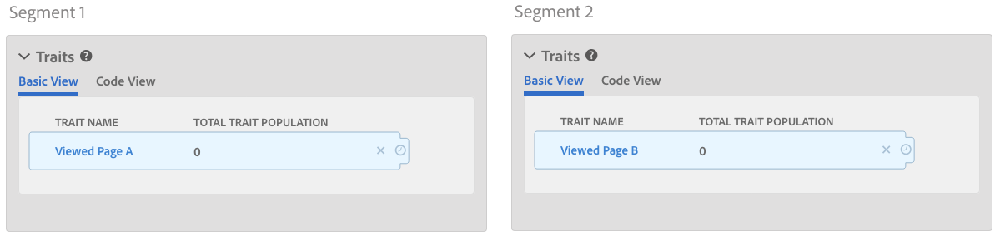
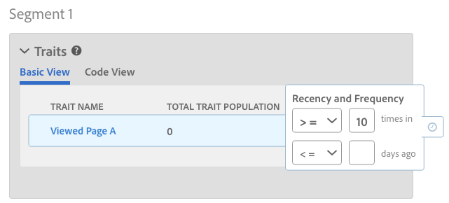

# Profile Merge Rules and Device Un-Segmentation Processes {#profile-merge-rules-and-device-un-segmentation-processes}

La segmentation décrit les processus qui excluent et suppriment les profils de périphérique des segments. Your ability to remove a device profile from a segment depends on the device option used to create a [!UICONTROL Profile Merge Rule].

## Available Device Options {#device-options}

As a reminder, the [!UICONTROL Device Options] are available in the [!UICONTROL Profile Merge Rules Setup] section when you create or edit a [!UICONTROL Profile Merge Rule].

## Current Device Profile Option and Device Unsegmentation {#current-device-profile-options}

**[!UICONTROL Current Device Profile]** est l'option de profil de périphérique par défaut pour a [!UICONTROL Profile Merge Rule]. [!DNL Audience Manager] peut supprimer un profil de périphérique d'un segment lorsque vous [!UICONTROL Profile Merge Rule] utilisez **[!UICONTROL Current Device Profile]** cette option. Dans ces conditions, la segmentation survient lorsque :

* Le profil du périphérique est inactif pendant 120 jours. Un processus de nettoyage de données hebdomadaire supprime les profils de périphérique inactifs de vos segments.
* Le périphérique ne se qualifie plus pour un segment, car les mises à jour ou les modifications apportées au profil de périphérique le désactivent. This happens when segment qualification criteria change, or you apply an [!DNL AND NOT] operator to a segment rule, or specify [recency and frequency](../../features/segments/recency-and-frequency.md) conditions that use the less than/equal to settings. Use cases are described in the [Instant Cross-Device Suppression](../../features/profile-merge-rules/instant-cross-device-suppression.md) documentation.

<!-- 

  Audience Manager can remove a device profile from a segment when your  Profile Merge Rule uses the <b> Current Device Profile</b> option. Under these conditions, unsegmentation happens when: 
 

 
 <ul id="ul_596501272A224228BD330DD56E01D973"> 
  <li id="li_E4FA1A5C722748CD82AE3A49FCBE86F6">The device profile has been inactive for 120-days. A weekly data cleanup process removes inactive device profiles from your segments. </li> 
  <li id="li_DB0CCD28425048D5B35309B8C2C384F9">The device no longer qualifies for a segment because updates or changes to the device profile disqualify it. This happens when segment qualification criteria change, or you apply an AND NOT operator to a segment rule, or specify <a href="../../features/segments/recency-and-frequency.md"> recency and frequency</a> conditions that use the less than/equal to settings. </li> 
 </ul> 
 

  

 -->

## No Device Option and Device Unsegmentation {#no-device-option}

[!DNL Audience Manager] peut supprimer un ID inter-périphérique d'un segment lorsque vous [!UICONTROL Profile Merge Rule] utilisez **[!UICONTROL No Device Profile]** l **[!UICONTROL Current Authenticated]** 'option +. Dans ces conditions, la segmentation se produit lorsque l'ID inter-périphériques ne se qualifie plus pour un segment, car les mises à jour ou les modifications apportées au profil sur plusieurs périphériques la désactivent. This happens when segment qualification criteria change, or you apply an [!UICONTROL AND NOT] operator to a segment rule, or specify [recency and frequency](../../features/segments/recency-and-frequency.md) conditions that use the less than/equal to settings. Use cases are described in the [Instant Cross-Device Suppression](../../features/profile-merge-rules/instant-cross-device-suppression.md) documentation.

## Device Graph Options and Device Unsegmentation {#device-graph-options-unsegmentation}

[!DNL Audience Manager] peut supprimer plusieurs profils de périphérique d'un segment lorsque vous [!UICONTROL Profile Merge Rule] utilisez l'option Graphique de périphérique. La segmentation survient lorsque le profil fusionné du périphérique à partir du graphique de périphérique ne se qualifie plus pour le segment, car les mises à jour ou les modifications apportées à ce profil fusionné ne le sont pas du segment. This happens when segment qualification criteria change, or you apply an [!UICONTROL AND NOT] operator to a segment rule, or specify [recency and frequency](../../features/segments/recency-and-frequency.md) conditions that use the less than/equal to settings. Use cases are described in the [Instant Cross-Device Suppression](../../features/profile-merge-rules/instant-cross-device-suppression.md) documentation.

>[!NOTE]
>
>**La limite de quatre périphériques pour l'évaluation et la disqualification des segments** [!DNL Audience Manager] fusionne jusqu'à quatre périphériques lors de l'évaluation de segments [!UICONTROL Profile Merge Rule] avec un graphique de périphérique. [!DNL Audience Manager] évalue le *périphérique actuel et trois périphériques supplémentaires sont affichés en temps réel*. Si le signal de dissociation est émis, le périphérique actuel et trois périphériques supplémentaires vus en temps réel sont supprimés du segment dans la destination. Par exemple, dans une grappe de six périphériques, quatre périphériques au maximum sont fusionnés, évalués et qualifiés pour un segment. De même, jusqu'à quatre périphériques sont fusionnés, évalués et non segmentés.

<!-- 

Currently,  Audience Manager <i>cannot </i> remove a device profile from a segment when your  Profile Merge Rule uses a device graph option. This applies to rules created with these  Device Options settings: 
 

 
 <ul id="ul_0923834C984F464E9AB12FF5A8773214"> 
  <li id="li_731F67B7A07342988B13D7F91ECA5A9E">Profile Link Device Graph. </li> 
  <li id="li_D1EFC6F124124E64A0732DD060F788BE">The  Adobe device graph. </li> 
  <li id="li_CFD4189D4488432D92732532D23B30C7">Other third-party device graph options available that are available to you. </li> 
 </ul> 
 

 Unlike the previous case above, using the AND NOT operator or less than/equal to settings won't remove all of the devices from a segment profile. However, you can unsegment device profiles if you create simple segment rules and apply unsegment logic in the destination that receives your data. The following sections walks you through different unsegmentation use cases. 

 -->

<!-- 

This workaround shows you how to unsegment with Boolean  AND NOT logic when your  Profile Merge Rule uses a device graph option. This procedure uses separate, simple segments mapped to the same destination. In this case, you apply AND NOT logic on the destination rather than creating rules in Segment Builder. To set up unsegment rules for this use case: 
 

 
 <ol id="ol_677F0F9E6CB640079D9021DE66819916"> 
  <li id="li_95F898FDFB2D4F5395201FEA2E60A3AF">Create separate, single-trait segments as shown in the following example. 
 
 </li> 
  <li id="li_3A9F6D8B3CBB4F65B9A06EEC3B265158">Map the segments to the same destination. In this case, we're sending these to  Media Optimizer. </li> 
  <li id="li_092BB5887D0D4EE4B09F4B1C6703D454">Set AND NOT logic on the destination ( Media Optimizer) rather than in  Audience Manager. 
 
 </li> 
 </ol> 
 

 If you're not using  Media Optimizer, apply AND NOT logic on whatever destination receives these segments. 

 -->

<!-- 

This workaround shows you how to unsegment with the < = (less than/equal to) recency and frequency settings when your  Profile Merge Rule uses a device graph option. To set up unsegment rules for this use case: 
 

 
 <ol id="ol_DCBEE004B9FE40A881E4EC17FAEA50C2"> 
  <li id="li_DB8C1B6D5C5546E68769902A4F367966">Create a segment that contains a single trait and apply a > = (greater than/equal to) recency and frequency rule to the trait. 
 
 </li> 
  <li id="li_0DC50960D83B4B27A40F0BC76B944E0B">Map the segment to a destination. In this case, we're sending the segment to  Media Optimizer. </li> 
  <li id="li_FC23194A9FE54296914393F8067A6672">Set NOT logic on the destination ( Media Optimizer) rather than in  Audience Manager. Use NOT logic to exclude all devices that qualify for this segment from your campaign. 
 
 </li> 
 </ol> 
 

 If you're not using  Media Optimizer, apply NOT logic on whatever destination receives these segments. 

 -->

>[!MORE_ LIKE_ THIS]
>
>* [FAQ sur la fusion des profils et le graphique des périphériques](../../faq/faq-profile-merge.md)
>* [Suppression instantanée inter-périphérique](../../features/profile-merge-rules/instant-cross-device-suppression.md)
>* [Remarques importantes concernant les règles de fusion de profils avec des graphiques de périphérique](../../features/profile-merge-rules/considerations-pmr-device-graph.md)

