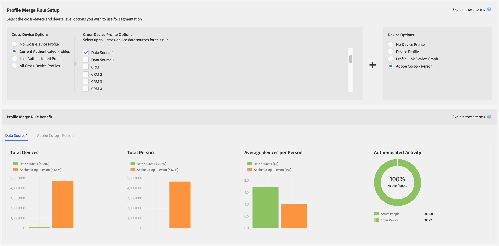

# Mesures des rapports pour les stratégies de fusion de profils {#report-metrics-for-profile-merge-rules}

Les mesures [!UICONTROL Profile Merge Rule] fournissent des données sur les personnes et les appareils qui s’authentifient sur votre site. Les données et les graphiques de [!UICONTROL Profile Merge Rule Reports] se mettent à jour dynamiquement lorsque vous créez une règle de fusion ou lorsque vous cliquez sur une règle existante dans le tableau de bord [!UICONTROL Profile Merge Rules]. Ces mesures peuvent inclure des graphiques d’appareil provenant d’autres sources de graphiques d’appareil tiers.

## Fusionner les mesures de règle {#merge-rule-metrics}

Les rapports renvoient des données dans des graphiques à barres côte à côte lorsque vos règles de fusion utilisent des données de graphiques d’appareils tiers auxquels vous avez accès dans [!DNL Audience Manager]. Vous pouvez ainsi comparer vos données propriétaires authentifiées aux données entre appareils fournies par des graphiques d’appareils tiers. Ces données sont mises à jour quotidiennement.

<table id="table_A7FB2F9804F84AC8A6DD05C0E6EE7555"> 
 <thead> 
  <tr> 
   <th colname="col1" class="entry"> Mesure </th> 
   <th colname="col2" class="entry"> Description </th> 
  </tr> 
 </thead>
 <tbody> 
  <tr> 
   <td colname="col1"> 
 <b> Activité authentifiée</b> 
 </td> 
   <td colname="col2"> 
Affiche : 
 
    <ul id="ul_7F7373919A4A49028EF4BF7B28D9F8E9"> 
     <li id="li_FE2F93C496D64ED8928B3E522C9585EA">  Personnes actives : nombre de personnes qui se sont authentifiées sur votre site au cours des 60 derniers jours. </li> 
     <li id="li_60CFD26EE68B442683C0ED5FED1A79C8">  Cross Device : nombre total de <a href="merge-rules-start.md#create-data-source"> Cross Device IDs</a> stockés dans le <a href="https://experienceleague.adobe.com/docs/audience-manager/user-guide/features/data-sources/manage-datasources.html?lang=fr"> Data Source</a> du <a href="merge-rule-definitions.md"> Authenticated Profile</a> sélectionné pour la durée de vie de la source de données. </li> 
     <li id="li_F2F07B6A326C4A18B79A0CF2C47D9677">  % Personnes actives : affiche  Personnes actives en %. </li> 
    </ul> 
  Activité authentifiée vous permet de comparer les sources de données par activité, volume et pourcentage. Il peut vous aider à trouver une source de données qui compte un grand nombre de personnes et un pourcentage élevé d’utilisateurs actifs. Vous pouvez également comparer des sources de données présentant une forte proportion d’utilisateurs actifs par rapport à la taille totale de l’audience. Par exemple, il arrive qu’une source de données avec un faible nombre total de durée de vie et une activité élevée ait plus de valeur que celles avec des résultats de durée de vie élevés et un faible nombre d’activités. 
 
 
Remarque : Les mesures  Activité authentifiée contiennent uniquement des données  Lien de profil. Ce rapport n’inclut pas les données  Device Graph. 
 
 </td> 
  </tr> 
  <tr> 
   <td colname="col1"> 
 <b> Périphériques moyens par personne</b> 
 </td> 
   <td colname="col2"> 
 Indique le nombre moyen d’appareils utilisés par les visiteurs qui se sont authentifiés sur votre site pour la source de données sélectionnée. 
 </td> 
  </tr> 
  <tr> 
   <td colname="col1"> 
 <b> Nombre total d’appareils</b> 
 </td> 
   <td colname="col2"> 
Indique le nombre total d’appareils utilisés par les visiteurs pour s’authentifier sur votre site pour la source de données sélectionnée. 
 </td> 
  </tr> 
  <tr> 
   <td colname="col1"> 
 <b> Nombre total de personnes</b> 
 </td> 
   <td colname="col2"> 
Affiche le nombre total de personnes qui ont été identifiées de manière déterministe pour la source de données sélectionnée. 
 </td> 
  </tr> 
 </tbody> 
</table>

## Mesures de Device Graph {#device-graph-metrics}

Les rapports [!UICONTROL Merge Rules] affichent également des données sur le nombre total de personnes et d’appareils qui ont visité votre site pour la source de données et la représentation graphique des appareils sélectionnés. Ces mesures renvoient des données en fonction d’intervalles de temps prédéfinis (période de recherche en amont) qui varient selon l’option de périphérique sélectionnée lors de la création d’une règle. Le tableau suivant répertorie ces intervalles de rapport pour chacune des options de représentation graphique des appareils.

<table id="table_038983EBC71F4A55BBCA99212AC5DEE6"> 
 <thead> 
  <tr> 
   <th colname="col1" class="entry"> Option Device Graph </th> 
   <th colname="col2" class="entry"> Intervalle de recherche en amont des rapports </th> 
  </tr>
 </thead>
 <tbody> 
  <tr> 
   <td colname="col1"> 
 Lien de profil 
 </td> 
   <td colname="col2"> 
 
     <ul id="ul_B2FF2341573840549FFB96579F537082"> 
      <li id="li_B37323C2F2434F41B407500AC5C15447">Nombre total de personnes : 60 jours </li> 
      <li id="li_08D911224A60418BBB3CFB4E70CE73D4">Nombre total de périphériques : 120 jours </li> 
     </ul> 
 </td> 
  </tr> 
  <tr> 
   <td colname="col1"> 
 LiveRamp 
 </td> 
   <td colname="col2"> 
 
     <ul id="ul_2772F3AD7E1440789B635794ECDE8DFB"> 
      <li id="li_1432363829D64615B1D349A3722D6268">Nombre total de personnes : 180 jours </li> 
      <li id="li_D5C0E3CE92524B54BBD36C73A326292B">Nombre total de périphériques : 180 jours </li> 
     </ul> 
 </td> 
  </tr> 
  <tr> 
   <td colname="col1"> 
 Tapad 
 </td> 
   <td colname="col2"> 
 
     <ul id="ul_274529DB58E6442E95C6AD89BECB1362"> 
      <li id="li_67102211A72A4E47AACFE5E369793C17">Nombre total de personnes : 60 jours </li> 
      <li id="li_3E8F3DA6A7B5487895A626674DA363A5">Nombre total de périphériques 60 jours </li> 
     </ul> 
 </td> 
  </tr> 
 </tbody> 
</table>

## Exemples de rapports {#sample-reports}

### Rapport Lien de profil standard

Un rapport [!UICONTROL Profile Link] standard ressemble à l’exemple suivant. Les règles de fusion qui utilisent plusieurs sources de données (jusqu’à 3, au maximum) affichent des graphiques dans des onglets distincts pour chaque source de données. Cette règle de fusion n’inclut pas les données [!UICONTROL external device graph].

### Rapport Lien De Profil Avec Données Graphiques De Périphérique

Un rapport [!UICONTROL Profile Link Device Graph] qui comprend des données de représentation graphique des appareils provenant de représentations graphiques tierces des appareils affiche [!UICONTROL Profile Link] et des données graphiques des appareils avec des graphiques à barres côte à côte. Le placement de ces graphiques les uns à côté des autres vous permet d’évaluer les avantages de l’utilisation de représentations graphiques externes des appareils par rapport à [!UICONTROL Profile Link] en soi. Les règles de fusion qui utilisent plusieurs sources de données (jusqu’à 3, au maximum) affichent des graphiques dans des onglets distincts pour chaque source de données. Pour rappel, le graphique et les mesures [!UICONTROL Authenticated Activity] ne renvoient pas de données provenant de la représentation graphique des appareils [!DNL Adobe] ou d’autres représentations graphiques tierces auxquelles vous avez accès dans [!DNL Audience Manager].

## Graphiques des tendances des liens de profil {#profile-link-trend}

Outre les autres visualisations de données, les rapports [!UICONTROL Profile Link] incluent un graphique linéaire. Le graphique linéaire est conçu pour vous montrer les tendances au fil du temps de vos règles de profil. Les graphiques de tendances (et les autres rapports) sont disponibles lorsque vous cliquez sur une règle dans la page d’entrée [!UICONTROL Profile Merge Rules] ( **[!UICONTROL Audience Data > Profile Merge Rules]**). Ces graphiques incluent des données de représentation graphique des appareils si vous êtes membre de représentations graphiques des appareils tiers auxquels vous avez accès dans [!DNL Audience Manager]. Cliquez sur une ligne de tendance pour afficher les données sous-jacentes.

>[!MORELIKETHIS]
>
>* [FAQ sur les règles de fusion de profils](../../faq/faq-profile-merge.md)
