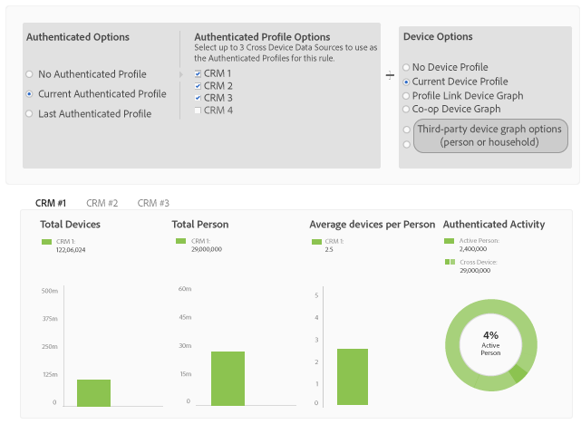

# Report Metrics for Profile Merge Rules {#report-metrics-for-profile-merge-rules}

[!UICONTROL Profile Link] les mesures fournissent des données sur les personnes et les périphériques qui s'authentifient sur votre site. The data and graphs in [!UICONTROL Profile Link] update dynamically as you create a merge rules or when you click an existing rule from the [!UICONTROL Profile Merge Rules] dashboard. These metrics can include device graph from the [!DNL Adobe Experience Cloud Device Co-op] or other third-party device graph sources.

## Merge Rule Metrics {#merge-rule-metrics}

Reports return data in side-by-side bar graphs when your merge rules use data from the [Adobe Experience Cloud Device Co-op](https://marketing.adobe.com/resources/help/en_US/mcdc/) or other, third-party device graphs you may have access to in [!DNL Audience Manager]. This lets you compare your authenticated, first-party data with cross-device data provided by the [!UICONTROL Experience Cloud Device Co-op] or another, third-party device graph. For information about data returned by the [!UICONTROL Device Co-op], see [The Device Graph: Internal Processes and Output](https://marketing.adobe.com/resources/help/en_US/mcdc/mcdc-processes.html). Ces données sont mises à jour quotidiennement.

<table id="table_A7FB2F9804F84AC8A6DD05C0E6EE7555"> 
 <thead> 
  <tr> 
   <th colname="col1" class="entry"> Mesure </th> 
   <th colname="col2" class="entry"> Description </th> 
  </tr> 
 </thead>
 <tbody> 
  <tr> 
   <td colname="col1"> 
 <b> Activité authentifiée</b> 
 </td> 
   <td colname="col2"> 
Affiche : 
 
    <ul id="ul_7F7373919A4A49028EF4BF7B28D9F8E9"> 
     <li id="li_FE2F93C496D64ED8928B3E522C9585EA">  Personnes actives: Nombre de personnes qui sont authentifiées sur votre site au cours des 60 derniers jours. </li> 
     <li id="li_60CFD26EE68B442683C0ED5FED1A79C8">  Cross Device: nombre total d'ID <a href="../../features/profile-merge-rules/merge-rules-start.md#create-data-source"> multiterminaux</a> stockés dans la source <a href="../../features/manage-datasources.md#create-data-source"> de données</a> du profil <a href="../../features/profile-merge-rules/merge-rule-definitions.md"> authentifié sélectionné</a> pour la durée de vie déjà définie par la source de données. </li> 
     <li id="li_F2F07B6A326C4A18B79A0CF2C47D9677">  % Personnes actives: Affiche  les personnes actives sous forme de %. </li> 
    </ul> 
  L'activité authentifiée vous permet de comparer les sources de données par activité, volume et pourcentage. Il peut vous aider à trouver une source de données comptant beaucoup de personnes et un pourcentage élevé d'utilisateurs actifs. Vous pouvez également trouver une valeur lors de la comparaison des sources de données avec une forte proportion d'utilisateurs actifs par rapport à la taille totale de l'audience. Par exemple, une source de données présentant un faible nombre de durée de vie et une activité élevée est plus précieuse que celles qui présentent des résultats de durée de vie élevés et des nombres d'activité faibles. 
 
 
Note: The  Authenticated Activity metrics contain  Profile Link data only. This report does not include  Device Graph data. 
 
 </td> 
  </tr> 
  <tr> 
   <td colname="col1"> 
 <b> Dispositifs moyens par personne</b> 
 </td> 
   <td colname="col2"> 
 Indique le nombre moyen de périphériques utilisés par les visiteurs qui sont authentifiés sur votre site pour la source de données sélectionnée. 
 </td> 
  </tr> 
  <tr> 
   <td colname="col1"> 
 <b> Total des périphériques</b> 
 </td> 
   <td colname="col2"> 
Indique le nombre total de périphériques que les utilisateurs ont utilisés pour s'authentifier sur votre site pour la source de données sélectionnée. 
 </td> 
  </tr> 
  <tr> 
   <td colname="col1"> 
 <b> Total des personnes</b> 
 </td> 
   <td colname="col2"> 
Indique le nombre total de personnes qui ont été identifiées de manière déterministe pour la source de données sélectionnée. 
 </td> 
  </tr> 
 </tbody> 
</table>

## Device Graph Metrics {#device-graph-metrics}

The [!UICONTROL Merge Rules] reports also show data on the total number of people and devices who have visited your site for the selected data source and device graph. Ces mesures renvoient des données basées sur des intervalles de temps prédéfinis (la période de recherche) qui varient selon l'option de périphérique sélectionnée lors de la création d'une règle. Le tableau suivant répertorie ces intervalles de rapport pour chacune des options du graphique de périphérique.

<table id="table_038983EBC71F4A55BBCA99212AC5DEE6"> 
 <thead> 
  <tr> 
   <th colname="col1" class="entry"> Option Graphique de périphérique </th> 
   <th colname="col2" class="entry"> Intervalle de consultation de rapport </th> 
  </tr>
 </thead>
 <tbody> 
  <tr> 
   <td colname="col1"> 
 Profile Link 
 </td> 
   <td colname="col2"> 
 
     <ul id="ul_B2FF2341573840549FFB96579F537082"> 
      <li id="li_B37323C2F2434F41B407500AC5C15447">Total des personnes : 60 jours </li> 
      <li id="li_08D911224A60418BBB3CFB4E70CE73D4">Total des périphériques : 120 jours </li> 
     </ul> 
 </td> 
  </tr> 
  <tr> 
   <td colname="col1"> 
 Graphique de périphérique Co-op 
 </td> 
   <td colname="col2"> 
 
     <ul id="ul_64AD1DD89DF64703B70B973A463BA020"> 
      <li id="li_D7D3A3871F434CBFA71BE8929EB41648">Total des personnes : 180 jours </li> 
      <li id="li_125D387986B2463EB310203CE5857EDA">Total des périphériques : 180 jours </li> 
     </ul> 
 </td> 
  </tr> 
  <tr> 
   <td colname="col1"> 
 Liveramp 
 </td> 
   <td colname="col2"> 
 
     <ul id="ul_2772F3AD7E1440789B635794ECDE8DFB"> 
      <li id="li_1432363829D64615B1D349A3722D6268">Total des personnes : 180 jours </li> 
      <li id="li_D5C0E3CE92524B54BBD36C73A326292B">Total des périphériques : 180 jours </li> 
     </ul> 
 </td> 
  </tr> 
  <tr> 
   <td colname="col1"> 
 Tapad 
 </td> 
   <td colname="col2"> 
 
     <ul id="ul_274529DB58E6442E95C6AD89BECB1362"> 
      <li id="li_67102211A72A4E47AACFE5E369793C17">Total des personnes : 60 jours </li> 
      <li id="li_3E8F3DA6A7B5487895A626674DA363A5">Nombre total de périphériques 60 jours </li> 
     </ul> 
 </td> 
  </tr> 
 </tbody> 
</table>

## Sample Reports {#sample-reports}

### Rapport Lien de profil standard

A standard [!UICONTROL Profile Link] report looks like the following example. Les règles de fusion qui utilisent plusieurs sources de données (jusqu'à 3, maximum) affichent des graphiques dans des onglets distincts pour chaque source de données. This merge rule does not include [!UICONTROL Device Co-op] data.

### Rapport de lien de profil avec données graphiques de périphérique

[!UICONTROL Profile Link] Un rapport qui comprend des données graphiques sur les périphériques provenant du [!UICONTROL Adobe Experience Cloud Device Co-op] graphique de périphérique tiers ou d'un graphique de périphérique tiers montre [!UICONTROL Profile Link] les données du graphique et des périphériques avec des graphiques à barres côte à côte. Placing these graphs adjacent to each other lets you evaluate the benefits of using the [!UICONTROL Experience Cloud Device Co-op] compared to [!UICONTROL Profile Link] by itself. Les règles de fusion qui utilisent plusieurs sources de données (jusqu'à 3, maximum) affichent des graphiques dans des onglets distincts pour chaque source de données. As a reminder, the [!UICONTROL Authenticated Activity] graph and metrics do not return data from the [!DNL Adobe] device graph or other, third-party device graphs you may have access to in [!DNL Audience Manager].

## Profile Link Trend Graphs {#profile-link-trend}

In addition to the other data visualizations, [!UICONTROL Profile Link] reports include a line graph. Le graphique linéaire est conçu pour vous présenter les tendances au fil du temps pour vos règles de profil. Trend graphs (and the other reports) are available when you click a rule from the [!UICONTROL Profile Merge Rules] landing page ( **[!UICONTROL Audience Data > Profile Merge Rules]**). These graphs include device graph data if you're a member of the [!UICONTROL Device Co-op] or other, third-party device graphs you may have access to in [!DNL Audience Manager]. Cliquez sur une ligne de tendance pour afficher les données sous-jacentes.

>[!MORE_ LIKE_ THIS]
>
>* [FAQ sur la fusion des profils](../../faq/faq-profile-merge.md)

