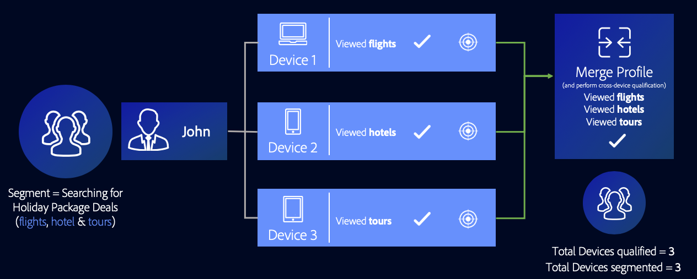

# Cas d’utilisation de graphiques de périphériques de lien de profil {#profile-link-device-graph-use-cases}

Recommandations et cas d’utilisation pour le reciblage de segments et la qualification de segment personnalisée avec le [!UICONTROL Profile Link Device Graph].

## Recommandations {#recommendations}

Tenez compte du graphique [!UICONTROL Profile Link] de périphériques pour les campagnes qui :

* Posséder un niveau élevé d’authentification sur l’ensemble de leurs propriétés numériques. Utilisez une option [de graphique de périphérique](merge-rule-definitions.md#device-options) externe si vous avez un petit nombre d’utilisateurs authentifiés.
* Exiger un ciblage précis des audiences connues. Le fichier [!UICONTROL Profile Link Device Graph] est créé à l’aide de données propriétaires authentifiées.
* Ciblez les audiences connues dans leurs états authentifiés et non authentifiés en temps réel.

## Ciblage sur plusieurs périphériques {#cross-device-personalization}

Disons que John possède trois appareils qu'il utilise régulièrement pour rechercher des forfaits vacances : son ordinateur portable ([!DNL Device 1]), son smartphone ([!DNL Device 2]) et sa tablette ([!DNL Device 3]). Cependant, John utilise ses appareils pour rechercher différents éléments des offres de forfait :

* Il utilise son ordinateur portable pour rechercher des vols;
* Il utilise son smartphone pour rechercher des hôtels ;
* Il utilise sa tablette pour rechercher des visites guidées.

Même si John n'est pas authentifié sur les trois périphériques mentionnés ci-dessus, en utilisant la règle **[!UICONTROL Last Authenticated Profiles]** + **[!UICONTROL Profile Link Device Graph]** , un fournisseur de packages de vacances peut associer ces périphériques au profil authentifié de John, en supposant qu'il était la dernière personne à s'authentifier sur les trois périphériques.

Dans la mesure où Audience Manager qualifie chaque profil de périphérique qui a pris part à la fusion de profils pour un segment, les trois profils de périphérique sont segmentés. Elle [!UICONTROL Profile Link Device Graph] permet à Audience Manager d’examiner le comportement sur les trois périphériques et de qualifier chaque périphérique pour un segment pour lequel aucun profil de périphérique unique ne peut être qualifié seul.

Cela [!UICONTROL Profile Merge Rule] permet aux spécialistes du marketing de fournir une expérience cohérente à tous les périphériques appartenant à une personne, en fonction de l’activité de l’utilisateur et non de l’activité de chaque périphérique.

>[!MORE_LIKE_This]
>
>* [Cas d’utilisation graphiques des périphériques externes](external-graph-use-cases.md)
>* [Cas d’utilisation généraux des règles de fusion de profils](merge-rule-targeting-options.md)
>* [FAQ sur les règles de fusion de profils](../../faq/faq-profile-merge.md)

