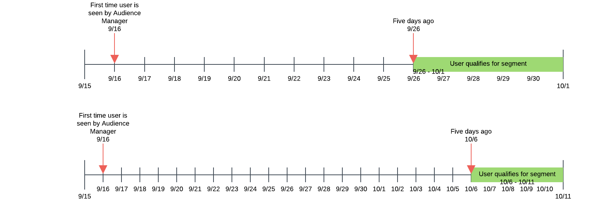

# Recency and Frequency {#recency-and-frequency}

Dans [!UICONTROL Segment Builder]ce cas, la récence et la fréquence vous permettent de segmenter les visiteurs en fonction des actions survenant ou se répétant au cours d’un intervalle quotidien défini.

Audience Manager définit [!DNL recency] et [!DNL frequency] comme suit :

* **[!UICONTROL Recency]** : Récemment où un utilisateur a consulté ou s’est qualifié pour une (ou plusieurs) caractéristiques.
* **[!UICONTROL Frequency]** : Taux auquel un utilisateur a consulté ou s’est qualifié pour une (ou plusieurs) caractéristiques.

[!UICONTROL Recency] et [!UICONTROL Frequency] les paramètres vous aident à segmenter les visiteurs en fonction de leur niveau d’intérêt réel (ou perçu) pour un site, une section ou un élément créatif particulier. Par exemple, les utilisateurs qui remplissent les conditions requises pour un segment avec des exigences de récence/fréquence élevée peuvent être plus intéressés par un site ou un produit que les utilisateurs qui visitent moins souvent ou moins fréquemment.

## Emplacement des paramètres de récence et de fréquence {#location}

Dans [!UICONTROL Segment Builder], [!UICONTROL Recency] et [!UICONTROL Frequency] les paramètres se trouvent dans la [!UICONTROL Basic View] section du [!UICONTROL Traits] panneau. Cliquez sur l’icône de l’horloge pour afficher ces commandes.

## Limites et règles {#limitations-rules}

Examinez et comprenez ces limites et règles lorsque vous souhaitez appliquer la récence et la fréquence aux caractéristiques de vos segments.

### Récence

<table id="table_026064124C694D75B7A960457D50170B"> 
 <thead> 
  <tr> 
   <th colname="col1" class="entry"> Limite ou règle </th> 
   <th colname="col2" class="entry"> Description </th> 
  </tr> 
 </thead>
 <tbody> 
  <tr> 
   <td colname="col1"> 
 <b>Valeur minimale</b> 
 </td> 
   <td colname="col2"> 
La récence doit être supérieure à 0. 
 </td> 
  </tr>
  <tr> 
   <td colname="col1"> 
 <b>Types de caractéristiques</b> 
 </td> 
   <td colname="col2"> 
Vous pouvez appliquer des contrôles de récence uniquement aux caractéristiques basées sur des règles et des dossiers. 
 </td> 
  </tr> 
  <tr> 
   <td colname="col1"> 
 <b>Caractéristiques tierces</b> 
 </td> 
   <td colname="col2"> 
Vous ne pouvez pas définir de règles de récence sur des caractéristiques tierces ou des groupes de caractéristiques qui contiennent des caractéristiques tierces. La récence et la fréquence s'appliquent à vos propres caractéristiques uniquement. 
 </td> 
  </tr> 
 </tbody> 
</table>

### Fréquence

<table id="table_EBD621D26C8B4D03933E8C0753C892A7"> 
 <thead> 
  <tr> 
   <th colname="col1" class="entry"> Limite ou règle </th> 
   <th colname="col2" class="entry"> Description </th> 
  </tr> 
 </thead>
 <tbody> 
  <tr> 
   <td colname="col1"> 
 <b>Caractéristiques tierces</b> 
 </td> 
   <td colname="col2"> 
Vous ne pouvez pas définir de règles de fréquence sur des caractéristiques tierces ou des groupes de caractéristiques qui contiennent des caractéristiques tierces. La récence et la fréquence s'appliquent à vos propres caractéristiques uniquement. 
 </td> 
  </tr> 
  <tr> 
   <td colname="col1"> 
 <b>Types de caractéristiques</b> 
 </td> 
   <td colname="col2"> 
Vous pouvez appliquer des contrôles de fréquence uniquement aux caractéristiques basées sur des règles et des dossiers. 
 </td> 
  </tr> 
  <tr> 
   <td colname="col1"> 
 <b>Conditions de récence</b> 
 </td> 
   <td colname="col2"> 
Vous pouvez configurer les exigences de fréquence <i>sans</i> configurer les exigences de récence. Il vous suffit de définir une valeur de fréquence et de laisser le champ récence vide. 
 </td> 
  </tr> 
  <tr> 
   <td colname="col1"> 
<b>Règles de fusion de profils</b> 
 </td> 
   <td colname="col2"> 
Voir <a href="../../faq/faq-profile-merge.md#trait-freq-device-rules"> Fréquence des caractéristiques, Graphiques de périphériques externes et Règles</a>de fusion de profils. 
 </td> 
  </tr> 
 </tbody> 
</table>

## Exemples de récence {#recency-examples}

Voici deux exemples de fonctionnement de la récence, selon votre sélection dans l’interface utilisateur :

### Utilisation d’un opérateur inférieur ou égal à (&lt;=)

Dans cet exemple, vous sélectionnez l’opérateur &lt;=, comme illustré dans la capture d’écran. Votre utilisateur est admissible pour le segment s’il est admissible à l’une des trois caractéristiques au moins trois fois au cours des cinq derniers jours. La chronologie ci-dessous montre la qualification du segment au moment de la création du segment, le 1er octobre et dix jours plus tard.

### Utilisation d’un opérateur supérieur ou égal à (=&gt;)

Dans cet exemple, vous sélectionnez l’opérateur =&gt;, comme illustré dans la capture d’écran. Cela permet à votre utilisateur d’accéder au segment s’il est admissible à l’une des trois caractéristiques au moins trois fois à chaque fois entre sa première qualification sur la plate-forme Audience Manager et le délai d’expiration il y a cinq jours. La chronologie ci-dessous montre la qualification du segment au moment de la création du segment, le 1er octobre et dix jours plus tard.

## Exemples de plafonnement des fréquences {#frequency-capping}

Les expressions de plafonnement des fréquences incluent tous les utilisateurs dont le nombre de réalisations de caractéristiques est inférieur à une valeur souhaitée. Voici quelques exemples de droite et de mauvaise qualité :

* Erreur : l’expression `frequency([1000T]) <= 5` inclut tous les utilisateurs qui ont réalisé que la caractéristique avec l’ID "1000" était au maximum cinq fois, mais inclut également les utilisateurs qui n’ont pas réalisé la caractéristique. Par conséquent, Audience Manager ne valide pas cette expression pour des raisons de performances, car il qualifierait trop d’utilisateurs pour le segment.

* Droit - Si vous souhaitez inclure tous les utilisateurs qui ont réalisé que la caractéristique avec l’ID "1000" était au maximum cinq fois, ajoutez une autre condition à l’expression, afin de vous assurer que les utilisateurs sont qualifiés pour la caractéristique au moins une fois :  `frequency([1000T]) >= 1  AND  frequency([1000T]) <= 5`

* Droit - Lorsque vous avez besoin que les exigences de récence/fréquence soient inférieures à un nombre spécifique de fois ou de jours, joignez cette caractéristique à une autre avec un `AND` opérateur. En utilisant l’exemple du premier point de puce, cette expression devient valide lorsqu’elle est associée à une autre caractéristique, comme illustré ici : `frequency([1000T]) <= 5 AND isSiteVisitorTrait`.

* Droit - Pour les cas d’utilisation du plafonnement de la fréquence des publicités, vous pouvez créer une règle de segmentation semblable à celle-ci : `(frequency([1000T] <= 2D) >= 5)`. Cette expression inclut tous les utilisateurs qui ont réalisé au moins cinq fois la caractéristique avec l’ID "1000" au cours des deux derniers jours. Définissez le plafonnement des fréquences en envoyant ce segment au serveur d’annonces avec une `NOT` visionneuse sur le segment dans le serveur d’annonces. Cette approche améliore les performances [!DNL Audience Manager] tout en poursuivant le même objectif pour le plafonnement des fréquences.

>[!MORELIKETHIS]
>
>* [Contrôles du créateur de segments : Section Caractéristiques](../../features/segments/segment-builder.md#segment-builder-controls-traits)
>* [Syntaxe du code utilisée dans l’éditeur d’expression de segment](../../features/segments/segment-code-syntax.md)

