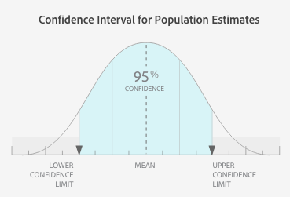
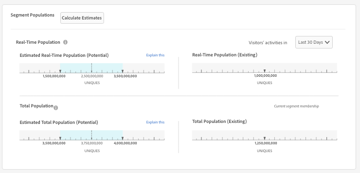

# [!UICONTROL Trait] et [!UICONTROL Segment] Données de population dans [!UICONTROL Segment Builder] {#trait-and-segment-population-data-in-segment-builder}

Ajoutez et supprimez [!UICONTROL traits] l’élément [!UICONTROL Segment Builder] pour afficher les [!UICONTROL trait] populations réelles ainsi que les données de population de segments réelles et estimées. Les données de taille de population estimée vous aident à créer le segment approprié pour votre campagne.

## [!UICONTROL Trait] Données démographiques {#trait-population-data}

[!UICONTROL Segment Builder] vous montre [!UICONTROL Total Trait Population] le dernier jour où vous ajoutez un segment [!UICONTROL trait] à un segment. Ces données s’affichent dans le champ bleu autour de votre sélection [!UICONTROL trait] dans la [!UICONTROL Basic View] section.

Le tableau suivant définit les mesures de population de caractéristiques :

| Mesure | Description |
---------|----------|
| [!UICONTROL Total Trait Population] | Nombre d’identifiants uniques présentant la caractéristique sélectionnée dans leur profil. |

## Calcul des populations de segments réelles et estimées {#calculating-real-estimated-populations}

Lorsque vous créez un segment ou modifiez un segment existant, l’Audience Manager prend jusqu’à 24 heures pour afficher les résultats des populations réelles de segments en temps réel et du total des segments.

Toutefois, l’Audience Manager peut immédiatement estimer la taille de population totale et en temps réel de votre segment. Ces estimations sont basées sur des données historiques échantillonnées et retournent les résultats à l&#39;intervalle de confiance de 95 %.

Dans [!UICONTROL Segment Builder]le cas présent, une barre bleue sur les graphiques de population estimés indique les plages supérieures et inférieures possibles pour la taille du segment. Bien que les performances passées ne garantissent pas les résultats futurs, les données estimées peuvent vous aider à comprendre la taille potentielle d’un segment nouveau ou modifié.

## Présentation des données de population de segments {#segment-populations}

[!UICONTROL Segment Builder] vous montre les données de population de segments au fur et à mesure que vous créez et modifiez des segments.

* Pour les données de population de segments estimées (en temps réel et total), [!UICONTROL Segment Builder] ne met pas automatiquement à jour les graphiques lorsque vous ajoutez ou supprimez des caractéristiques dans un segment. Cliquez sur **[!UICONTROL Calculate Estimates]** pour afficher (ou actualiser) l’estimation des chiffres de population.

* Pour les données de population de segments réelles (réelles) (en temps réel et total), [!UICONTROL Segment Builder] met à jour le graphique de segments automatiquement lorsque vous chargez un segment existant. Pour les nouveaux segments ou lorsque vous ajoutez de nouvelles caractéristiques à un segment existant, les données de population réelles ne sont mises à jour que 24 heures après la création du segment.

Voir les définitions ci-dessous pour plus d’informations sur les données de population estimées et réelles des segments.

## Estimation des données de population de segments définies {#estimated-segment-population}

Le tableau suivant définit les mesures de population estimées.

<table id="table_B24503F372E34B6BBDF5204181701A59"> 
 <thead> 
  <tr> 
   <th colname="col1" class="entry"> Mesure </th> 
   <th colname="col2" class="entry"> Description </th> 
  </tr>
 </thead>
 <tbody> 
  <tr> 
   <td colname="col1"> 
  Population estimée en temps réel (potentielle)  
 </td> 
   <td colname="col2"> 
Nombre estimé de visiteurs uniques vus en temps réel pendant la période spécifiée et qui étaient qualifiés pour le segment au moment où ils ont été vus par Audience Manager. 
 
Dans  le créateurde segments, les 30 derniers jours de population pour les caractéristiques ( Total des populationsde caractéristiques) peuvent être différents pour les caractéristiques et les segments évalués en temps réel. 
 

     <ul id="ul_CAE803D09913462CAD413A665D85C1A2"> 
      <li id="li_3E64330D6F5B4D2F8F3456730A86894F">Pour les caractéristiques, la dernière mesure de 30 jours comptabilise le nombre d’utilisateurs uniques qui se sont qualifiés pour cette caractéristique au cours des 30 derniers jours. </li>
      <li id="li_FF3CACD0B6C742CDB94D66200D77CE06">Pour les segments évalués en temps réel, la dernière mesure de 30 jours compte le nombre d’utilisateurs qui se sont qualifiés pour une caractéristique (dans ce segment) à un moment donné dans le passé et qui ont été de nouveau vus par Audience Manager au cours des 30 derniers jours. Par exemple, supposons qu’un utilisateur se soit qualifié pour une caractéristique il y a 60 jours et qu’il ait été de nouveau vu il y a 10 jours. Dans les données, cet utilisateur ne sera pas ajouté au nombre de caractéristiques car il s’est qualifié pour la caractéristique il y a plus de 30 jours. Cependant, ils seront inclus dans le décompte des 30 derniers jours pour les segments évalués en temps réel. En effet, ils se sont qualifiés pour le segment dans l’intervalle de 30 jours. </li>
     </ul> 
 
 
Remarque : La  mesure Estimation de la population en temps réel n’inclut pas les périphériques qui se sont qualifiés pour un segment en fonction des connexions fournies par une règle  de fusion de Profils qui utilise une option de graphique de périphérique. 
 
 </td> 
  </tr> 
  <tr> 
   <td colname="col1"> 
  Population totale estimée (potentielle) 
 </td> 
   <td colname="col2"> 
Nombre estimé de visiteurs uniques susceptibles d’appartenir à votre segment nouveau ou modifié. Comme pour la plupart des estimations, les performances passées ne garantissent pas les résultats futurs, mais vous pouvez utiliser le total estimé pour : 
 
 
     <ul id="ul_0490DD08C7C8493DADFB11B5872A73BC"> 
      <li id="li_AE38C8C8A4B24021BAC724B51A4799E2">Déterminer le nombre de personnes qu’un segment nouveau ou révisé peut atteindre lors de la création d’un segment. </li> 
      <li id="li_E830EC2B12DC46D4B0A4DD807A8936F6">Ajustez le segment en fonction de vos objectifs. Par exemple, les segments volumineux sont utiles pour les campagnes de sensibilisation à la marque et les segments plus petits sont utiles pour le ciblage ciblé ou le reciblage des campagnes. </li> 
     </ul> 
 
 
Remarque : La mesure Population  totale estimée n’inclut pas les périphériques qui se sont qualifiés pour un segment en fonction des connexions fournies par une règle  de fusion de Profils qui utilise une option <a href="../../features/profile-merge-rules/merge-rule-definitions.md#device-options"> de graphique de</a>périphérique. 
 
 </td> 
  </tr> 
 </tbody> 
</table>

## Définition des données de population de segments existantes (réelles) {#existing-segment-population}

[!UICONTROL Profile Merge Rules] ont une incidence sur le nombre réel de personnes en temps réel et sur le nombre total de personnes. Ces totaux varient selon que le [!UICONTROL Profile Merge Rule] segment appartient ou non à une option de graphique de périphérique. Voir aussi Définition [des options de règle de fusion](../../features/profile-merge-rules/merge-rule-definitions.md)de Profil.

### Segmenter les données de population pour [!UICONTROL Merge Rules] sans [!UICONTROL Device Graph Option]

Le tableau suivant définit les mesures réelles en temps réel et la population totale lorsque vos segments sont utilisés par un [!UICONTROL Profile Merge Rule] utilisateur créé sans [!UICONTROL device graph] option. Il s&#39;agit des paramètres des options de l&#39;appareil **[!UICONTROL No Device Options]** et **[!UICONTROL Current Device Proflie]**.

<table id="table_A18C973855DB46A0B39B81F32E0E7540"> 
 <thead> 
  <tr> 
   <th colname="col1" class="entry"> Mesure </th> 
   <th colname="col2" class="entry"> Description </th> 
  </tr> 
 </thead>
 <tbody> 
  <tr> 
   <td colname="col1"> 
  Population en temps réel (existante) 
 </td> 
   <td colname="col2"> 
Nombre réel de visiteurs uniques vus en temps réel pendant la période spécifiée et qui étaient qualifiés pour le segment au moment où ils étaient vus par Audience Manager. 
 
Dans  le créateurde segments, les 30 derniers jours de population pour les caractéristiques ( Total des populationsde caractéristiques) peuvent être différents pour les caractéristiques et les segments évalués en temps réel. 
 
 
     <ul id="ul_50D1528DDDF347858F17DA3C033B0E3F"> 
      <li id="li_ABA2BFE68FF4430DBB425C4661E1836A">Pour les caractéristiques, la dernière mesure de 30 jours comptabilise le nombre d’utilisateurs uniques qui se sont qualifiés pour cette caractéristique au cours des 30 derniers jours. </li> 
      <li id="li_1519068CBB1445E893657D12E8FE42AC">Pour les segments évalués en temps réel, la dernière mesure de 30 jours compte le nombre d’utilisateurs qui se sont qualifiés pour une caractéristique (dans ce segment) à un moment donné dans le passé et qui ont été de nouveau vus par Audience Manager au cours des 30 derniers jours. Par exemple, supposons qu’un utilisateur se soit qualifié pour une caractéristique il y a 60 jours et qu’il ait été de nouveau vu il y a 10 jours. Dans les données, cet utilisateur ne sera pas ajouté au nombre de caractéristiques car il s’est qualifié pour la caractéristique il y a plus de 30 jours. Cependant, ils seront inclus dans le décompte des 30 derniers jours pour les segments évalués en temps réel. En effet, ils se sont qualifiés pour le segment dans l’intervalle de 30 jours. </li> 
     </ul> 
 </td> 
  </tr> 
  <tr> 
   <td colname="col1"> 
  Population totale (existante) 
 </td> 
   <td colname="col2"> 
Nombre réel de visiteurs uniques ayant été qualifiés pour le segment à partir d’hier. 
 </td> 
  </tr> 
 </tbody> 
</table>

### Segmenter les données de population pour [!UICONTROL Merge Rules] avec une [!UICONTROL Device Graph] option

Le tableau suivant définit les mesures réelles de temps réel et de population totale lorsque vos segments sont utilisés par une [!UICONTROL Profile Merge Rule] option créée avec une [!DNL device graph] option. Il s’agit des paramètres des options de périphérique pour le [!UICONTROL Profile Link Device Graph], le [!DNL Adobe] et d’autres choix [!DNL device graph][!DNL device graph] de tiers qui vous sont accessibles.

| Colonne A | Colonne B |
---------|----------|
| [!UICONTROL Real-Time Population (Existing) ] | Nombre réel de périphériques vus en temps réel avec les profils en cours qui, lorsqu&#39;ils sont fusionnés avec jusqu&#39;à 100 autres profils de périphériques connectés par le graphique de périphériques, contiennent les caractéristiques permettant de qualifier le segment au moment où il a été vu par Audience Manager. |
| [!UICONTROL Total Population (Existing)] | Nombre total de périphériques dotés de profils qui, lorsqu’ils étaient fusionnés avec jusqu’à 100 autres profils de périphériques connectés par le graphique de périphériques, étaient tous qualifiés pour le segment. |

### Limites dues aux Expressions de récence et de fréquence lors de l’estimation des populations de segments

[!UICONTROL Segment Builder] prend en charge les estimations de taille des segments pour les règles de segment qui contiennent jusqu’à 4 expressions de récence et de fréquence. Si vous choisissez plus de 4 expressions de récence et de fréquence lors de la création d’une règle de segmentation, l’estimateur de segments affiche une erreur lors de l’estimation de la population.

### Limites dues à [!UICONTROL Merge Rules] l’estimation des populations de segments

Actuellement, il existe une limite connue, car notre estimateur de taille de segment ne tient pas compte de [!UICONTROL profile merge rules]. Par exemple, observez les segments contenant la règle **[!UICONTROL No Authenticated Profile + Current Device Profile]** defusion. En raison de la façon dont nous calculons actuellement les chiffres d&#39;estimation des segments, les populations estimées incluront des profils authentifiés. Cependant, les populations de segments existantes ignoreront correctement les profils authentifiés.

>[!MORELIKETHIS]
>
>* [FAQ sur les règles de fusion de Profils et le graphique de périphériques](../../faq/faq-profile-merge.md)
>* [Profile Link](../profile-merge-rules/merge-rules-overview.md)

