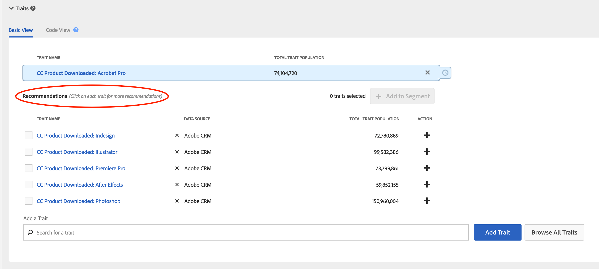

# Trait Recommendations

Obtenez des recommandations de caractéristiques dynamiques lorsque vous créez vos segments.

## Démonstration vidéo

Commencez par regarder la vidéo sur les recommandations de caractéristiques, puis accédez à la section pour en savoir plus.

>[!VIDEO](https://video.tv.adobe.com/v/26228/?captions=fre_fr)

## Aperçu

[!UICONTROL Trait Recommendations], optimisé par [!DNL Adobe Sensei], intègre la science des données dans vos processus quotidiens Audience Manager.
With [!UICONTROL Trait Recommendations], when you build or edit a segment in [Segment Builder](segment-builder.md), you get recommendations on additional traits you can include, that are similar to the traits in the segment rule. Ajoutez les caractéristiques recommandées à votre segment pour élargir votre audience cible.

**En bref :**

* Audience Manager affiche les caractéristiques propriétaires et tierces de vos flux de données actuellement abonnés comme caractéristiques recommandées.
* Audience Manager affiche un maximum de cinquante caractéristiques similaires à celle de la règle de segment.
* Vous pouvez filtrer les sources de données à partir desquelles vous ne souhaitez voir aucune recommandation.
* Lors du calcul des similitudes, Audience Manager prend en compte les [UUID](../../reference/ids-in-aam.md) qui se sont qualifiés pour la caractéristique au cours des 30 derniers jours.
* Si vous voyez le message d'erreur "Aucune caractéristique similaire trouvée. Les caractéristiques peuvent être trop nouvelles.", ce qui signifie qu’il n’y a eu aucune activité pour cette caractéristique au cours des 30 derniers jours ou qu’Audience Manager n’a pas encore mis à jour les recommandations pour cette caractéristique. Veuillez réessayer dans 24 heures.

## Cas d’utilisation

Grâce [!UICONTROL Trait Recommendations]à Audience Manager, vous pouvez améliorer vos flux de travail en fonction de la manière dont vous utilisez Audience Manager :

* En tant que spécialiste du marketing, vous pouvez rapidement trouver des audiences intéressées par des produits complémentaires à l’aide de caractéristiques similaires, afin d’accroître votre portée.
* Si vous utilisez Audience Manager en tant qu’éditeur, avec [!UICONTROL Trait Recommendations], vous pouvez comprendre le comportement de l’audience et créer de meilleurs segments pour les ventes publicitaires ou l’acquisition d’utilisateurs.

## Différences entre les recommandations de caractéristiques et les modèles algorithmiques

###  Modèles algorithmiques

[!UICONTROL Algorithmic Models] non seulement trouve les caractéristiques les plus influentes, mais note également les utilisateurs en fonction de ces caractéristiques et affecte à chaque utilisateur un score individuel. Vous créez ensuite des caractéristiques algorithmiques pour cibler vos utilisateurs. Avec des contrôles de précision et de portée dans [!UICONTROL Trait Builder], vous pouvez spécifier les utilisateurs parmi tous ceux qui ont les caractéristiques influentes à cibler.

[!UICONTROL Algorithmic Models] vous permet de sélectionner des utilisateurs à différents niveaux de précision et de tester [!UICONTROL Audience Lab] quel groupe d’utilisateurs génère le plus de conversions. Voir le cas d’utilisation détaillé dans [Comparaison de modèles dans Audience Lab](../../features/audience-lab/audience-lab-use-cases.md#compare-models).

Dans [!UICONTROL Algorithmic Models]ce cas, le modèle s’exécute tous les 8 jours et actualise les utilisateurs qualifiés pour les caractéristiques algorithmiques.

### Trait Recommendations

[!UICONTROL Trait Recommendations] permet d’obtenir rapidement des informations sur d’autres caractéristiques similaires à celles que vous utilisez dans un segment.

Vous devez utiliser [!UICONTROL Trait Recommendations] lorsque :

* Vous avez besoin d’informations rapides lors de la création d’un segment ;
* Vous utilisez les segments pour de courtes campagnes ou lorsque vous souhaitez supprimer rapidement le public qui effectue des conversions ;
* Vous essayez de maximiser la portée.

## Workflow

Lors de la création ou de la modification d’un segment dans le créateur [de](segment-builder.md)segments, vous pouvez explorer des caractéristiques similaires aux caractéristiques de la règle de segment. Le processus du créateur de segments est très similaire pour les segments nouveaux et existants :

### Nouveaux segments

1. Dans **Audience Data &gt; Segments**, sélectionnez **Ajouter nouveau**.
2. Dans la liste déroulante **Caractéristiques** , ajoutez au moins une caractéristique à la règle de segmentation.
3. Vous pouvez maintenant voir les caractéristiques recommandées similaires aux caractéristiques que vous avez ajoutées à la règle de segmentation. Faites défiler l’écran vers le bas pour afficher toutes les caractéristiques recommandées.
4. (Facultatif) Pour exclure les caractéristiques recommandées de certaines sources de données, cliquez sur le symbole **X** des sources de données à exclure.
   > [!NOTE]
   > 
   >Les sources de données exclues sont affichées juste au-dessus de la liste des caractéristiques recommandées. Appuyez sur **X** dans la zone grise pour supprimer les exclusions et afficher à nouveau les résultats des sources de données respectives.
5. Pour ajouter des caractéristiques recommandées à la règle de segment, cliquez sur le symbole **+** .

### Segments existants

1. Accédez à **[!UICONTROL Audience Data]&gt;[!UICONTROL Segments]**, sélectionnez le segment à modifier et appuyez sur .
1. Faites défiler jusqu’à la [!UICONTROL Traits] liste déroulante.
1. Vous pouvez voir les caractéristiques recommandées, similaires aux caractéristiques déjà présentes dans la règle de segmentation. Faites défiler l’écran vers le bas pour afficher toutes les caractéristiques recommandées.
1. (Facultatif) Pour exclure les caractéristiques recommandées de certaines sources de données, cliquez sur le symbole **X** des sources de données à exclure.
   > [!NOTE]
   > 
   >Les sources de données exclues sont affichées juste au-dessus de la liste des caractéristiques recommandées. Appuyez sur **X** dans la zone grise pour supprimer les exclusions et afficher à nouveau les résultats des sources de données respectives.
1. Pour ajouter des caractéristiques recommandées à la règle de segment, cliquez sur le symbole **+** .

Lorsque vous créez ou modifiez un segment et ajoutez une caractéristique à la règle de segmentation, vous affichez un maximum de cinquante caractéristiques recommandées, similaires à celle que vous avez ajoutée. Si la règle de segmentation contient plusieurs caractéristiques, Audience Manager utilise une méthode de robot circulaire pour afficher la meilleure correspondance pour chaque caractéristique, puis la deuxième meilleure correspondance pour chaque caractéristique, etc., pour les cinquante caractéristiques les plus grandes par population, dans la règle de segment.

Par exemple, lorsqu’il existe trois caractéristiques dans la règle de segmentation, comme illustré ci-dessous, les caractéristiques recommandées sont les suivantes :

1. Correspondance optimale pour le trait 3 (caractéristique avec la plus grande population);
2. Meilleure correspondance pour la caractéristique 1 ;
3. Meilleure correspondance pour le trait 2;
4. Deuxième meilleure correspondance pour le trait 3;
5. Deuxième meilleure correspondance pour le trait 1, et ainsi de suite jusqu'à ce que vous atteigniez cinquante traits.

Pour obtenir des recommandations pour une caractéristique spécifique, vous pouvez cliquer sur les caractéristiques dans la règle de segment (1) ou dans la vue des caractéristiques recommandées (2).

Cliquer sur une caractéristique ouvre une fenêtre contextuelle, comme illustré dans l’image ci-dessous. Si les caractéristiques recommandées ne font pas partie du segment, vous pouvez les ajouter au segment en appuyant sur **+**.

> [!TIP]
>
>Les sources de données exclues de la page principale sont prises en compte lors de la génération de recommandations dans la fenêtre contextuelle d’informations sur la caractéristique. Et si vous excluez les sources de données dans cette vue, les exclusions s’appliquent à la page principale.

> [!NOTE]
>
> Les caractéristiques recommandées peuvent être vos caractéristiques propriétaires ou tierces à partir des flux auxquels vous êtes abonné.

## Fonctionnement

Pour générer des recommandations de caractéristiques, Audience Manager calcule la similarité  Jaccard entre la caractéristique cible et toutes les autres caractéristiques auxquelles votre compte a accès, y compris les données tierces. Audience Manager affiche alors jusqu’à cinquante caractéristiques présentant la plus grande similarité.

## Score de similarité des caractéristiques

Audience Manager calcule le nombre [!UICONTROL Trait Similarity Score] entre deux caractéristiques en calculant l’intersection et l’union en termes de nombre de [!UICONTROL UUID]caractéristiques, puis divise les deux. Pour deux caractéristiques A et B, le calcul ressemble à ceci :

Voir aussi les deux exemples ci-dessous.

### Exemple 1 - Score de similarité de caractéristiques faibles

Compte tenu de deux caractéristiques A et B, disons que chacune de ces caractéristiques a une population de 1 000 000 [!UICONTROL UUID]s, dont 25 000 [!UICONTROL UUID]s sont admissibles aux deux caractéristiques.
En utilisant la formule ci-dessus, vous obtenez : 25 000 / 1 975 000 = 0,012. C'est un faible [!UICONTROL Trait Similarity Score], les deux traits sont très différents.

### Exemple 2 - Score de similarité des caractéristiques

Si les mêmes caractéristiques A et B comportaient 400 000 [!UICONTRL ]UUID répondant aux deux caractéristiques, la [!UICONTROL Trait Similarity Score] valeur est beaucoup plus élevée :
400 000 / 1 600 000 = 0,25

### Comment interpréter la note de similarité des caractéristiques

Utilisez le tableau ci-dessous comme un guide approximatif de la similarité des caractéristiques. Ce guide est basé sur les scores de similarité observés dans la majorité des caractéristiques.

| [!UICONTROL Trait Similarity Score] | Importance |
---------|----------|
| 0.1 et versions ultérieures | Haute similarité entre les caractéristiques |
| 0.03 - 0.1 | similarité moyenne entre les caractéristiques |
| 0.01 - 0.03 | Faible similarité entre les caractéristiques |
| 0 - 0.01 | Très faible similarité entre les caractéristiques |

## Contrôle d’accès basé sur les rôles (RBAC)

Pour les entreprises qui utilisent [!UICONTROL Role-Based Access Controls] ([!UICONTROL RBAC]), vous devez disposer des autorisations nécessaires pour créer et modifier des segments afin d’afficher les caractéristiques recommandées. Et les caractéristiques recommandées que vous voyez ne sont que celles des sources de données auxquelles vous avez accès via [!UICONTROL RBAC]. Pour en savoir plus sur [!UICONTROL RBAC] les contrôles, [cliquez ici](../administration/administration-overview.md).

## Limites

* Actuellement, Audience Manager n’affiche pas les caractéristiques de dossier comme caractéristiques recommandées. En savoir plus sur les caractéristiques des dossiers [ici](../traits/manage-folder-traits.md).
* Lors de l’affichage des recommandations de caractéristiques, Audience Manager ne prend pas en compte [!DNL Boolean] les opérateurs ([!DNL AND], [!DNL OR], [!DNL NOT]) dans les règles de segmentation.