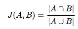

# Trait Recommendations

Obtenez des recommandations de caractéristiques dynamiques lorsque vous créez vos segments.

## Démonstration vidéo

Commencez par regarder la vidéo Recommendations Recommendations, puis lisez-la pour plus d'informations.

>[!VIDEO](https://video.tv.adobe.com/v/26228/?captions=fre_fr)

## Aperçu

[!UICONTROL Trait Recommendations], optimisé par [!DNL Adobe Sensei], apporte la science des données dans vos flux de travaux quotidiens d'Audience Manager.
With [!UICONTROL Trait Recommendations], when you build or edit a segment in [Segment Builder](segment-builder.md), you get recommendations on additional traits you can include, that are similar to the traits in the segment rule. Ajoutez les caractéristiques recommandées à votre segment pour élargir votre audience cible.

**En résumé :**

* Audience Manager affiche des caractéristiques propriétaires et des caractéristiques tierces des flux de données actuellement abonnés sous forme de caractéristiques recommandées.
* Audience Manager affiche au maximum cinquante caractéristiques similaires à celle de la règle de segment.
* Vous pouvez filtrer les sources de données à partir desquelles vous ne souhaitez pas voir de recommandations.
* Lors du calcul des similitudes, Audience Manager considère [les UUID](../../reference/ids-in-aam.md) correspondant à la caractéristique au cours des 30 derniers jours.
* Si le message d'erreur « Aucune caractéristique similaire n'est trouvée » s'affiche. Les caractéristiques peuvent être trop nouvelles.  », cela signifie qu'aucune activité pour cette caractéristique au cours des 30 derniers jours n'a été effectuée ou qu'Audience Manager n'a pas encore mis à jour les recommandations pour cette caractéristique. Veuillez réessayer dans 24 heures.

## Cas d’utilisation

Avec [!UICONTROL Trait Recommendations], vous pouvez améliorer vos flux de travail en fonction de la manière dont vous utilisez Audience Manager :

* En tant que spécialiste du marketing, vous pouvez rapidement identifier les audiences intéressées par des produits complémentaires grâce à des caractéristiques similaires, afin que vous puissiez augmenter votre portée.
* Si vous utilisez Audience Manager en tant qu'éditeur, vous [!UICONTROL Trait Recommendations]pouvez comprendre le comportement de l'audience et créer de meilleurs segments pour les ventes publicitaires ou l'acquisition de l'utilisateur.

## Différences entre les recommandations de caractéristiques et les modèles algorithmiques

### Modèles algorithmiques

[!UICONTROL Algorithmic Models] recherche non seulement les caractéristiques les plus influentes, mais aussi les utilisateurs en fonction de ces caractéristiques et affecte un score individuel à chaque utilisateur. Vous créez ensuite des caractéristiques algorithmiques pour cibler vos utilisateurs. Avec les commandes de précision et de portée dans la [!UICONTROL Trait Builder], vous pouvez spécifier les utilisateurs parmi tous ceux qui possèdent les caractéristiques influentes que vous souhaitez cibler.

[!UICONTROL Algorithmic Models] vous permet de sélectionner des utilisateurs à différents niveaux de précision et de tester dans [!UICONTROL Audience Lab] quel groupe d'utilisateurs sont convertis de manière optimale. Consultez le cas d'utilisation détaillé dans [Comparaison des modèles dans Audience Lab](../../features/audience-lab/audience-lab-use-cases.md#compare-models).

Dans [!UICONTROL Algorithmic Models], le modèle s'exécute tous les 8 jours et actualise les utilisateurs qualifiés pour les caractéristiques algorithmiques.

### Trait Recommendations

[!UICONTROL Trait Recommendations] est un moyen rapide d'obtenir des informations sur d'autres caractéristiques similaires à celles que vous utilisez dans un segment.

Vous devez utiliser [!UICONTROL Trait Recommendations] quand :

* Vous avez besoin d'informations rapides lors de la création d'un segment ;
* Vous utilisez les segments pour des campagnes courtes ou lorsque vous souhaitez rapidement supprimer le public qui effectue des conversions ;
* Vous tentez d'optimiser la portée.

## Workflow

Lors de la création ou de la modification d'un segment dans [le créateur de segments](segment-builder.md), vous pouvez explorer des caractéristiques similaires aux caractéristiques de la règle de segment. Le flux de travaux du créateur de segments est très similaire pour les segments nouveaux et existants :

### Nouveaux segments

1. Dans **Données d'audience &gt; Segments**, sélectionnez **Ajouter nouveau**.
2. Dans la liste déroulante **Caractéristiques** , ajoutez au moins une caractéristique à la règle de segment.
3. Vous pouvez maintenant voir les caractéristiques recommandées similaires aux caractéristiques que vous avez ajoutées à la règle de segment. Faites défiler la page vers le bas pour afficher toutes les caractéristiques recommandées.
4. (Facultatif) Pour exclure des caractéristiques recommandées de certaines sources de données, cliquez sur **le** symbole X pour les sources de données à exclure.
   > [!NOTE]
   > 
   >Les sources de données exclues s'affichent juste au-dessus de la liste des caractéristiques recommandées. Appuyez **sur X** dans la zone grise pour supprimer les exclusions et afficher à nouveau les résultats des sources de données respectives.
5. Pour ajouter des caractéristiques recommandées à la règle de segment, cliquez sur le **symbole +** .

### Segments existants

1. Accédez **[!UICONTROL Audience Data]à &gt;[!UICONTROL Segments]**, sélectionnez le segment à modifier et appuyez .
1. Faites défiler la liste jusqu'à la [!UICONTROL Traits] liste déroulante.
1. Vous pouvez voir les caractéristiques recommandées, similaires aux caractéristiques déjà présentes dans la règle de segment. Faites défiler la page vers le bas pour afficher toutes les caractéristiques recommandées.
1. (Facultatif) Pour exclure des caractéristiques recommandées de certaines sources de données, cliquez sur **le** symbole X pour les sources de données à exclure.
   > [!NOTE]
   > 
   >Les sources de données exclues s'affichent juste au-dessus de la liste des caractéristiques recommandées. Appuyez **sur X** dans la zone grise pour supprimer les exclusions et afficher à nouveau les résultats des sources de données respectives.
1. Pour ajouter des caractéristiques recommandées à la règle de segment, cliquez sur le **symbole +** .

Lorsque vous créez ou modifiez un segment et que vous ajoutez une caractéristique à la règle de segment, un maximum de cinquante caractéristiques recommandées est affiché, semblable à celui que vous avez ajouté. Si la règle de segment contient plusieurs caractéristiques, Audience Manager utilise une méthode ronde en double pour montrer la meilleure correspondance pour chaque caractéristique, puis la deuxième correspondance meilleure pour chaque caractéristique, et ainsi de suite, pour les cinquante caractéristiques les plus importantes par population, dans la règle de segment.

Par exemple, lorsqu'il existe trois caractéristiques dans la règle de segment, comme illustré ci-dessous, les caractéristiques recommandées sont les suivantes :

1. Meilleure correspondance pour la caractéristique 3 (caractéristique avec la plus grande population) ;
2. Meilleure correspondance pour la caractéristique 1 ;
3. Meilleure correspondance pour la caractéristique 2 ;
4. Correspondance second meilleure pour la caractéristique 3 ;
5. Correspondance second meilleure pour caractéristique 1, etc. jusqu'à cinquante caractéristiques.

Pour obtenir des recommandations pour une caractéristique spécifique, vous pouvez cliquer sur les caractéristiques dans la règle de segment (1) ou dans la vue des caractéristiques recommandées (2).

Cliquez sur une caractéristique pour ouvrir une fenêtre contextuelle, comme illustré dans l'image ci-dessous. Si les caractéristiques recommandées ne font pas partie du segment, vous pouvez les ajouter au segment en appuyant **sur +**.

> [!TIP]
>
>Les sources de données exclues issues de la page principale sont prises en compte lors de la génération des recommandations dans la fenêtre contextuelle d'informations sur la caractéristique. Et, si vous excluez les sources de données dans cette vue, les exclusions s'appliquent à la page principale.

> [!NOTE]
>
> Les caractéristiques recommandées peuvent être vos caractéristiques propriétaires ou tierces à partir des flux auxquels vous êtes abonné.

## Fonctionnement

Pour produire des recommandations de caractéristiques, Audience Manager calcule la [similarité Jaccard](https://en.wikipedia.org/wiki/Jaccard_index) entre la caractéristique cible et toutes les autres caractéristiques auxquelles votre compte a accès, y compris les données tierces. Audience Manager affiche ensuite jusqu'à cinquante caractéristiques dont la similarité est la plus élevée.

## Score de similarité de caractéristique

Audience Manager calcule les [!UICONTROL Trait Similarity Score] deux caractéristiques en calculant l'intersection et l'union en termes de nombre [!UICONTROL UUID]de s, puis divise les deux. Pour deux caractéristiques A et B, le calcul ressemble à ceci :

Voir également les deux exemples ci-dessous.

### Exemple 1 - Score de similarité faible trait

Avec deux caractéristiques A et B, disons que chacune des caractéristiques présente une population de 1 000 000 [!UICONTROL UUID]s, dont 25 000 [!UICONTROL UUID]sont admissibles pour les deux caractéristiques.
À l'aide de la formule ci-dessus, cela se produit : 25 000/1 975 000 = 0,012. Cette valeur est faible [!UICONTROL Trait Similarity Score], les deux caractéristiques sont très dissemblables.

### Exemple 2 - Score de similarité de caractéristique

Si les mêmes caractéristiques A et B comprenaient [!UICONTRL 400 000 UUID]qui remplissent les deux caractéristiques, la [!UICONTROL Trait Similarity Score] valeur est beaucoup plus élevée :
400/1 600 000 = 0,25

### Interprétation du score de similarité de caractéristique

Utilisez le tableau ci-dessous comme guide brut pour la similarité des caractéristiques. Ce guide repose sur les scores de similarité observés à la majorité des caractéristiques.

| [!UICONTROL Trait Similarity Score] | Signification |
---------|----------|
| 0,1 et plus | Similarité élevée entre caractéristiques |
| 0.03 - 0.1 | Similarité moyenne entre caractéristiques |
| 0.01 - 0.03 | Similarité faible entre les caractéristiques |
| 0 - 0.01 | Similarité très faible entre les caractéristiques |

## RBAC (Role-Based Access Control)

Pour les entreprises qui utilisent [!UICONTROL Role-Based Access Controls] ([!UICONTROL RBAC]), vous devez disposer d'autorisations pour créer et modifier des segments afin de voir les caractéristiques recommandées. Et les caractéristiques recommandées que vous voyez sont uniquement celles qui proviennent des sources de données auxquelles vous avez accès. [!UICONTROL RBAC] En savoir plus sur [!UICONTROL RBAC] les commandes [ici](../administration/administration-overview.md).

## Limites

* Actuellement, Audience Manager n'affiche pas les caractéristiques de dossier comme caractéristiques recommandées. En savoir plus sur les caractéristiques du dossier [ici](../traits/manage-folder-traits.md).
* Lors de l'affichage des recommandations de caractéristique, Audience Manager ne prend pas en compte [!DNL Boolean] les opérateurs ([!DNL AND][!DNL OR], [!DNL NOT]) dans les règles de segmentation.