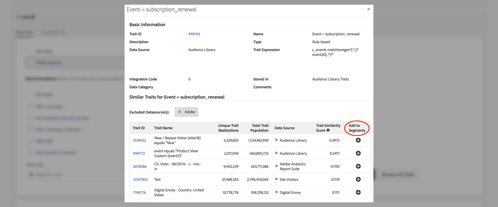

# Trait Recommendations

Obtenez des recommandations de caractéristiques dynamiques lorsque vous créez vos segments, à partir de vos propres caractéristiques propriétaires et de vos flux de données [!UICONTROL Audience Marketplace] .

## Vidéo de démonstration

 en regardant la [!UICONTROL Trait Recommendations] vidéo ci-dessous, puis lisez pour plus d&#39;informations. La démonstration vidéo vous montre comment utiliser les recommandations issues de vos propres caractéristiques propriétaires, ainsi que les recommandations de caractéristiques issues de [!UICONTROL Audience Marketplace] flux de données auxquels *vous êtes déjà abonné*.

>[!VIDEO](https://video.tv.adobe.com/v/26228/)

La vidéo suivante décrit le flux de travaux pour [!UICONTROL Marketplace Recommendations], en vous montrant comment ajouter des caractéristiques à vos segments, en fonction des recommandations issues des flux de données dans [!UICONTROL Audience Marketplace]. Ces recommandations reposent sur des flux de données auxquels *vous n’êtes pas abonné*.

>[!VIDEO](https://video.tv.adobe.com/v/29363/)

## Aperçu

[!UICONTROL Trait Recommendations], optimisé par [!DNL Adobe Sensei], intègre la science des données dans votre   de gestion de la  au jour le jour.
With [!UICONTROL Trait Recommendations], when you build or edit a segment in [Segment Builder](segment-builder.md), you get recommendations on additional traits you can include, that are similar to the traits in the segment rule.

 Gestionnaire de  de vous présente les recommandations de caractéristiques de vos caractéristiques propriétaires, dans la **[!UICONTROL Recommendations]** section et **[!UICONTROL Audience Marketplace]**, dans la **[!UICONTROL Recommendations from Marketplace]** section.

Ajoutez les caractéristiques recommandées à votre segment pour élargir votre audience cible.

**En un mot :**

*  Gestionnaire de  affiche les caractéristiques propriétaires dans la [!UICONTROL Recommendations] section. Les recommandations Marketplace issues de flux publics et privés auxquels vous n’êtes pas abonné sont visibles dans la [!UICONTROL Recommendations from Marketplace] section. Cliquez sur le nom du flux auquel vous souhaitez vous abonner [!UICONTROL Audience Marketplace] .
*  Gestionnaire de  de affiche un maximum de cinquante caractéristiques similaires à celle de la règle de segmentation.
* Vous pouvez filtrer les sources de données à partir desquelles vous ne souhaitez voir aucune recommandation.
* Lors du calcul des similitudes,   Manager considère les [UUID](../../reference/ids-in-aam.md) qui ont été qualifiés pour la caractéristique au cours des 30 derniers jours.
* Si vous voyez le message d&#39;erreur &quot;Aucune caractéristique similaire trouvée. Le(s) trait(s) peut(nt) être trop nouveau(s).&quot;, cela signifie qu’il n’y a eu aucun   pour cette caractéristique au cours des 30 derniers jours ou que le Gestionnaire de n’a pas encore mis à jour les recommandations pour cette caractéristique. Veuillez réessayer dans 24 heures.

## Cas d’utilisation

Avec [!UICONTROL Trait Recommendations]cela, vous pouvez améliorer vos  de, selon la manière dont vous utilisez  Gestionnaire de  de :

* En tant que spécialiste du marketing, vous pouvez rapidement trouver   intéressés par des produits complémentaires à l&#39;aide de caractéristiques similaires, afin d&#39;augmenter votre portée.
* Si vous utilisez   Manager comme éditeur, avec [!UICONTROL Trait Recommendations], vous pouvez comprendre le comportement des  et créer de meilleurs segments pour les ventes publicitaires ou l’acquisition d’utilisateurs.
* En tant qu’acheteur de [!UICONTROL Audience Marketplace] données, je souhaite découvrir des données tierces pertinentes sans parcourir un grand nombre de flux.
* En tant que fournisseur de [!UICONTROL Audience Marketplace] données, je souhaite recommander des données pertinentes aux acheteurs afin de pouvoir bénéficier d&#39;un  de  optimal et pertinent.

## Différences entre les recommandations de caractéristiques et les modèles algorithmiques

### Modèles algorithmiques

[!UICONTROL Algorithmic Models] non seulement trouve les caractéristiques les plus influentes, mais note également les utilisateurs en fonction de ces caractéristiques et affecte à chaque utilisateur un score individuel. Vous créez ensuite des caractéristiques algorithmiques pour vos utilisateurs. Grâce aux contrôles de précision et de portée [!UICONTROL Trait Builder], vous pouvez spécifier les utilisateurs parmi tous ceux qui ont les caractéristiques influentes que vous souhaitez .

[!UICONTROL Algorithmic Models] vous permet de sélectionner des utilisateurs à différents niveaux de précision et de tester [!UICONTROL Audience Lab] quel groupe d’utilisateurs génère le plus de conversions. Voir le cas d&#39;utilisation détaillé dans [Comparaison de modèles dans   Lab](../../features/audience-lab/audience-lab-use-cases.md#compare-models).

Dans [!UICONTROL Algorithmic Models]ce cas, le modèle s’exécute tous les 8 jours et actualise les utilisateurs qualifiés pour les caractéristiques algorithmiques.

### Trait Recommendations

[!UICONTROL Trait Recommendations] est un moyen rapide d’obtenir des informations sur d’autres caractéristiques similaires à celles que vous utilisez dans un segment.

Vous devez utiliser [!UICONTROL Trait Recommendations] lorsque :

* Vous avez besoin d’informations rapides lors de la création d’un segment ;
* Vous utilisez les segments pour des campagnes courtes ou lorsque vous souhaitez supprimer rapidement   qui convertit ;
* Vous essayez de maximiser la portée.

## Workflow

Lors de la création ou de la modification d’un segment dans le créateur [de](segment-builder.md)segments, vous pouvez explorer des caractéristiques similaires aux caractéristiques de la règle de segment. Le flux de travail [du créateur](segment-builder.md) de segments est très similaire pour les segments nouveaux et existants :

### Nouveaux segments

1. Accédez à **Données de > Segments**, puis cliquez sur **Ajouter Nouveau**.
2. Dans la liste déroulante **Caractéristiques** , ajoutez au moins une caractéristique à la règle de segmentation.
3. Vous pouvez consulter les caractéristiques recommandées propriétaires et les recommandations [!UICONTROL Audience Marketplace] de caractéristiques des flux auxquels vous êtes abonné, dans la **[!UICONTROL Recommendations]** section. La **[!UICONTROL Recommendations from Marketplace]** section présente les recommandations relatives aux caractéristiques des flux auxquels vous n’êtes pas abonné. Toutes ces recommandations sont similaires aux caractéristiques que vous avez ajoutées à la règle de segmentation. Faites défiler l’écran vers le bas pour afficher toutes les caractéristiques recommandées.
4. (Facultatif) Pour exclure les caractéristiques propriétaires recommandées de certaines sources de données, cliquez sur le symbole **X** des sources de données à exclure.

   >[!NOTE]
   >
   >Les sources de données exclues sont affichées juste au-dessus du  des caractéristiques recommandées. Cliquez sur **X** dans la zone grise pour supprimer les exclusions et afficher à nouveau les résultats des sources de données respectives.
1. Pour ajouter des caractéristiques recommandées à la règle de segment, cliquez sur le symbole **+** .

>[!IMPORTANT]
>
>Lorsque vous ajoutez [!UICONTROL Marketplace] des caractéristiques à un segment, elles ne sont utilisées que pour l’estimation des segments, jusqu’à ce que vous vous abonniez au flux de données correspondant. Les caractéristiques provenant des flux de données auxquels vous n’êtes pas abonné sont marquées par une icône de panier dans le  de caractéristiques. Cliquez sur le nom de la caractéristique pour accéder à la page du flux de données et vous y abonner.
>
>
>
>Vous ne pouvez enregistrer un segment avec des caractéristiques tierces qu’après avoir souscrit un abonnement aux flux de données correspondants.

### Segments existants

1. Accédez à **[!UICONTROL Audience Data]>[!UICONTROL Segments]**, sélectionnez le segment à modifier, puis cliquez sur.
1. Faites défiler l’écran jusqu’à la [!UICONTROL Traits] liste déroulante.
1. Vous pouvez voir les caractéristiques recommandées, similaires aux caractéristiques déjà présentes dans la règle de segmentation. Faites défiler l’écran vers le bas pour afficher toutes les caractéristiques recommandées.
1. (Facultatif) Pour exclure les caractéristiques recommandées de certaines sources de données, cliquez sur le symbole **X** des sources de données à exclure.

   >[!NOTE]
   >
   >Les sources de données exclues sont affichées juste au-dessus du  des caractéristiques recommandées. Cliquez sur **X** dans la zone grise pour supprimer les exclusions et afficher à nouveau les résultats des sources de données respectives.
1. Pour ajouter des caractéristiques recommandées à la règle de segment, cliquez sur le symbole **+** .

Lorsque vous créez ou modifiez un segment et ajoutez une caractéristique à la règle de segmentation, vous affichez un maximum de cinquante caractéristiques recommandées, similaires à celle que vous avez ajoutée. Si la règle de segmentation contient plusieurs caractéristiques,  Gestionnaire de  de utilise une méthode circulaire pour afficher la meilleure correspondance pour chaque caractéristique, puis la deuxième meilleure correspondance pour chaque caractéristique, etc., pour les cinquante caractéristiques les plus grandes par population, dans la règle de segmentation.

Par exemple, lorsqu’il existe trois caractéristiques dans la règle de segmentation, comme illustré ci-dessous, les caractéristiques recommandées sont les suivantes :

1. Correspondance optimale pour le trait 3 (caractéristique ayant la plus grande population);
1. Meilleure correspondance pour la caractéristique 1 ;
1. Meilleure correspondance pour le trait 2;
1. Deuxième meilleure correspondance pour le trait 3;
1. Deuxième meilleure correspondance pour le trait 1, et ainsi de suite jusqu&#39;à ce que vous atteigniez cinquante traits.

Pour obtenir des recommandations pour une caractéristique spécifique, vous pouvez cliquer sur les caractéristiques dans la règle de segmentation (1) ou dans la  de caractéristiques recommandées (2).

Cliquez sur une caractéristique propriétaire pour ouvrir une fenêtre contextuelle, comme illustré dans l’image ci-dessous. Si les caractéristiques recommandées ne font pas partie du segment, vous pouvez les ajouter au segment en appuyant sur **+**.

>[!TIP]
>
>Les sources de données exclues de la page principale sont prises en compte lors de la génération de recommandations dans la fenêtre contextuelle d’informations sur la caractéristique. Et si vous excluez les sources de données dans ce , les exclusions s’appliquent à la page principale.

>[!NOTE]
>
>Les caractéristiques recommandées peuvent être vos caractéristiques propriétaires ou tierces à partir des flux de données auxquels vous êtes abonné dans [!UICONTROL Audience Marketplace].

## Fonctionnement

Pour générer des recommandations de caractéristiques,  Gestionnaire de  de calcule la similarité  Jaccard entre la caractéristique de l’ et toutes les autres caractéristiques auxquelles votre compte a accès, y compris les données tierces.  Gestionnaire de  de affiche alors jusqu’à cinquante caractéristiques présentant la similitude la plus élevée.

## Score de similarité des caractéristiques {#trait-similarity-score}

 Gestionnaire de  de calcule la valeur [!UICONTROL Trait Similarity Score] entre deux caractéristiques en calculant l’intersection et le de  en termes de nombre de [!UICONTROL UUID]s, puis divise les deux. Pour deux caractéristiques A et B, le calcul ressemble à ceci :

Voir aussi les deux exemples ci-dessous.

### Exemple 1 - Score de similarité de caractéristiques faibles

Compte tenu de deux caractéristiques A et B, disons que chacune de ces caractéristiques a une population de 1 000 000 [!UICONTROL UUID]s, dont 25 000 [!UICONTROL UUID]s sont admissibles aux deux caractéristiques.
En utilisant la formule ci-dessus, vous obtenez : 25 000 / 1 975 000 = 0,012. C&#39;est un faible [!UICONTROL Trait Similarity Score], les deux traits sont très différents.

### Exemple 2 - Score de similarité des caractéristiques

Si les mêmes caractéristiques A et B avaient 400 000 [!UICONTROL UUID]s qui répondent aux deux caractéristiques, la [!UICONTROL Trait Similarity Score] valeur est beaucoup plus élevée :
400 000 / 1 600 000 = 0,25

### Comment interpréter la note de similarité des caractéristiques

Utilisez le tableau ci-dessous comme un guide approximatif de la similarité des caractéristiques. Ce guide est basé sur les scores de similarité observés dans la majorité des caractéristiques.

| [!UICONTROL Trait Similarity Score] | Importance |
---------|----------|
| 0.1 et versions ultérieures | Haute similarité entre les caractéristiques |
| 0.03 - 0.1 | similarité moyenne entre les caractéristiques |
| 0.01 - 0.03 | Faible similarité entre les caractéristiques |
| 0 - 0.01 | Très faible similarité entre les caractéristiques |

##  basée sur les rôles (RBAC)

Pour les  utilisant [!UICONTROL Role-Based Access Controls] ([!UICONTROL RBAC]), vous devez disposer des autorisations nécessaires pour créer et modifier des segments afin d’afficher les caractéristiques recommandées. Les recommandations de caractéristiques que vous voyez ne sont que celles des sources de données auxquelles vous avez accès par l’intermédiaire de [!UICONTROL RBAC].

>[!IMPORTANT]
>
>Pour ajouter [!UICONTROL Marketplace Recommendations] à un segment, les utilisateurs doivent d’abord s’abonner aux flux de données correspondants. Seuls les utilisateurs disposant de droits d’administrateur peuvent s’abonner à [!UICONTROL Audience Marketplace] des flux de données.

Pour en savoir plus sur [!UICONTROL RBAC] les contrôles, [cliquez ici](../administration/administration-overview.md).

## Limites

*  Gestionnaire de  de n’affiche actuellement pas les caractéristiques de dossier comme caractéristiques recommandées. En savoir plus sur les caractéristiques des dossiers [ici](../traits/manage-folder-traits.md).
* Lors de l’affichage des recommandations de caractéristiques,  Gestionnaire de  de ne prend pas en compte [!DNL Boolean] les opérateurs ([!DNL AND], [!DNL OR], [!DNL NOT]) dans les règles de segmentation.
