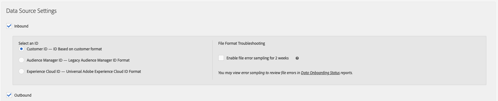

# Caractéristiques d’audience active et caractéristiques synchronisées de sources de données {#active-audience-traits-and-data-source-synced-traits}

Il s’agit de caractéristiques spéciales utilisées par [!UICONTROL Addressable Audiences]. [!UICONTROL Active Audience] et  [!UICONTROL Data Source Synced Traits] se trouvent dans  [!UICONTROL Audience Data > Traits > Audience Traits].

>[!NOTE]
>
>L’accès nécessite des autorisations d’administrateur.

## Principales caractéristiques d’audience {#active-audience-traits}

Une caractéristique [!UICONTROL Active Audience] contient tous les appareils gérés dans votre compte [!DNL Audience Manager]. Vous pouvez utiliser une balise [!UICONTROL Active Audience Trait] comme d’autres caractéristiques lorsque vous créez ou modifiez des segments. En outre, [Audiences adressables](../../features/addressable-audiences.md) nécessite cette caractéristique pour générer des données de chevauchement. Par défaut, tous les comptes ont une caractéristique [!UICONTROL Active Audience] . Cette caractéristique ne peut pas être supprimée.

## Caractéristiques synchronisées de la source de données {#data-source-synced-traits}

[!UICONTROL Data Source Synced Traits] apparaissent dans le  [!UICONTROL Audience Traits] dossier lorsque vous  [créez ou modifiez une source de ](../../features/manage-datasources.md#create-data-source) données et que vous appliquez l’un de ces paramètres :

[!UICONTROL Data Source Synced Traits] effectuer le suivi de tous les utilisateurs associés à une source de données ; Vous pouvez utiliser une balise [!UICONTROL Data Source Synched Trait] comme d’autres caractéristiques lorsque vous créez ou modifiez des segments. Lorsque vous créez un [!UICONTROL Data Source Synced Trait], le nom de la caractéristique correspond au nom utilisé par votre source de données. Modifiez la source de données pour modifier le nom de la caractéristique. Ces caractéristiques ne peuvent pas être supprimées.

>[!TIP]
>
>[!UICONTROL Data Source Synced Traits] sont utiles pour le dépannage. Cliquez sur le nom d’une caractéristique pour vérifier les mesures sur la page de résumé des caractéristiques. Si la caractéristique sélectionnée renvoie des données, cela indique que le processus de synchronisation des identifiants est configuré correctement et que les données sont envoyées à [!DNL Audience Manager].

>[!MORELIKETHIS]
>
>* [Audiences adressables](../../features/addressable-audiences.md)

