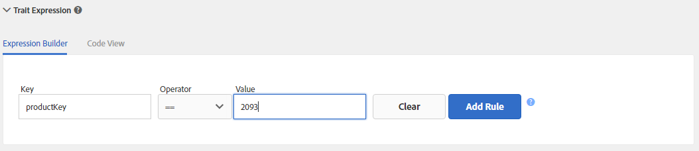

# Gestion des règles de caractéristiques {#managing-trait-rules}

Dans [!UICONTROL Trait Builder]le, [!UICONTROL Expression Builder] vous permet de créer et de tester des règles qui définissent les exigences de qualification des audiences. Les règles se composent de paires clé-valeur, telles que `color == blue` ou `price > 100`. Les opérateurs de comparaison établissent la relation entre les clés et les valeurs. [!DNL Boolean] Les expressions déterminent la relation entre les groupes de règles.

<!-- c_tb_rules.xml -->

## Principales fonctionnalités des règles de signal décrites

1. Les **[!UICONTROL Expression Builder]** onglets ou **[!UICONTROL Code View]** les onglets fournissent un aperçu des règles de votre caractéristique. L’ **[!UICONTROL Expression Builder]** onglet permet de créer des règles avec des champs et des menus déroulants. Le **[!UICONTROL Code View]** permet de créer des règles en écrivant manuellement ces expressions en tant que code. L&#39;illustration ci-dessus montre une caractéristique simple composée d&#39;un signal qui évalue les données pour une condition de qualification lorsqu&#39;une clé de produit est égale à une valeur spécifique, dans ce cas `color == "blue"`.

1. Les champs et les contrôles de cette section vous permettent de créer des signaux à partir de paires clé-valeur et de définir la relation entre eux avec un opérateur de comparaison. Une clé, un opérateur et une valeur sont requis.
1. Vous [!UICONTROL Data Explorer Options] pouvez ainsi renvoyer des réalisations de caractéristiques pour vos signaux.
   >[!NOTE]
   >
   >Cette option est disponible uniquement pour [!UICONTROL Data Explorer] les clients. Contactez votre consultant Adobe pour plus de détails.
1. Cette section présente une estimation des réalisations de caractéristiques pour les 7 derniers jours, pour les signaux définis dans le [!UICONTROL Expression Builder], pour les caractéristiques renvoyées et non renversées.
   >[!NOTE]
   >
   >Cette option est disponible uniquement pour [!UICONTROL Data Explorer] les clients. Contactez votre consultant Adobe pour plus de détails.
1. Les champs de test vous permettent de valider des combinaisons de règles de signal ou les [!DNL URL]règles à utiliser lors de l’envoi de données à l’Audience Manager.

## Créer une règle de caractéristiques {#create-trait-rule}

Les règles (ou expressions) se composent de paires clé-valeur individuelles ou de groupes de paires clé-valeur. Les opérateurs de comparaison définissent la relation entre les paires clé-valeur. Pour créer une règle, fournissez une clé, une valeur, sélectionnez un opérateur, puis cliquez sur **[!UICONTROL Add Rule]**.

<!-- t_tb_create_rules.xml -->

Renseignez les champs obligatoires de la **[!UICONTROL Basic Information]** section *avant* de créer des règles de caractéristiques.

1. Développez la **[!UICONTROL Trait Expression]** section et saisissez une clé et un nom de valeur. Cela crée un *`signal`* problème.
   >[!NOTE]
   >
   >Incluez le `c_` préfixe (ou toute autre convention d’affectation de nom) pour la variable clé si vos appels de événement envoient des données à [!DNL Audience Manager] l’aide de cette syntaxe.
1. Sélectionnez un opérateur [de](../../features/traits/trait-comparison-operators.md) comparaison dans la **[!UICONTROL Operator]** liste déroulante. L’opérateur de comparaison évalue la relation entre les éléments d’un signal.
   >[!NOTE]
   >
   >L&#39; [!DNL Boolean] opérateur [!UICONTROL OR] établit la relation entre plusieurs signaux *au sein* d&#39;un groupe et ne peut pas être modifié.
1. Cliquez sur **[!UICONTROL Add Rule]**. La règle enregistrée s&#39;affiche dans l&#39;espace de travail des caractéristiques au-dessus des champs de saisie de données.

### Exemple {#example-trait-rule}

Dans l’exemple ci-dessous, un utilisateur a créé une nouvelle règle de caractéristiques basée sur l’identifiant du produit. Pour créer cette règle, l’utilisateur a fourni la clé `productkey` associée à un opérateur égal ( `==`) à la valeur `2093`.

Cliquez sur **[!UICONTROL Add Rule]** pour enregistrer et déplacer la caractéristique dans l’ [!UICONTROL Expression Builder] espace de travail.

## Create a New Rule Group {#create-rule-group}

Cette procédure décrit comment créer un nouveau groupe de règles.

<!-- t_tb_new_rule_group.xml -->

Votre caractéristique doit contenir au moins deux règles avant de pouvoir créer un nouveau groupe de règles.

1. Placez le curseur sur la règle à déplacer pour la mettre en surbrillance.
1. Passez la souris sur la bordure de la règle mise en surbrillance.
Cette opération sépare automatiquement la règle de son groupe actuel et la déplace dans un nouveau groupe.
   >[!NOTE]
   >
   >Faites glisser une règle vers son groupe d’origine si vous la déplacez involontairement.
1. Sélectionnez un [!DNL Boolean] opérateur ( [!UICONTROL AND], [!UICONTROL OR], [!UICONTROL AND NOT]) dans le menu déroulant pour définir la relation entre les groupes de règles.

## Déplacer les règles entre les groupes {#move-rules-between-groups}

Pour déplacer une règle, cliquez dessus et faites-la glisser vers un autre groupe.

## Modifier une caractéristique {#edit-trait}

Cette procédure décrit la modification d’une caractéristique.

<!-- t_tb_edit.xml -->

1. Dans le [!UICONTROL Traits] tableau de bord, passez la souris sur la **[!UICONTROL Actions]** colonne correspondant à la caractéristique que vous souhaitez modifier. Ceci affiche les icônes de gestion des caractéristiques.
1. Cliquez sur le crayon pour modifier la caractéristique.

   

## Supprimer une règle de caractéristiques {#delete-trait}

Cette procédure décrit la suppression d’une règle de caractéristiques.

<!-- t_tb_delete_rule.xml -->

1. Dans le [!UICONTROL Traits] tableau de bord, passez la souris sur les [!UICONTROL Actions] colonnes correspondant à la caractéristique à modifier, puis cliquez sur l’icône représentant un crayon. Ceci affiche les icônes de gestion des caractéristiques.
1. Expand the [!UICONTROL Trait Expression] section.
1. Passez la souris sur la règle à supprimer, puis cliquez sur l’icône X. La règle est supprimée immédiatement.

>[!MORELIKETHIS]
>
>* [Créer un groupe de règles](../../features/traits/manage-trait-rules.md#create-rule-group)
>* [Déplacer les règles entre les groupes](../../features/traits/manage-trait-rules.md#move-rules-between-groups)
>* [Créer une règle de caractéristiques](../../features/traits/manage-trait-rules.md#create-trait-rule)
>* [Supprimer une règle de caractéristiques](../../features/traits/manage-trait-rules.md#delete-trait)
>* [Déplacer les règles entre les groupes](../../features/traits/manage-trait-rules.md#move-rules-between-groups)

