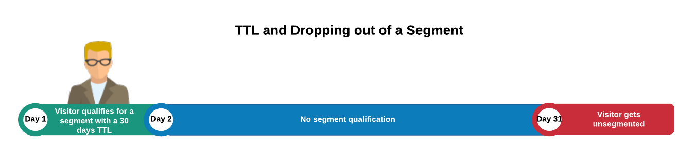

# Présentation de la durée de vie des segments et des caractéristiques {#segment-time-to-live-explained}

Impact de l’intervalle de [!UICONTROL time-to-live] des caractéristiques ([!DNL TTL]) sur l’appartenance à un segment.

<!-- segment-ttl-explained.xml -->

## Durée de vie

[!DNL TTL] définit la durée pendant laquelle un visiteur du site reste dans un segment après le dernier événement de qualification de caractéristique. [!DNL TTL] est défini sur les caractéristiques et non sur les segments. Les visiteurs sont exclus d’un segment s’ils ne remplissent pas les critères pour une caractéristique avant la fin de l’intervalle de [!DNL TTL]. La [!DNL TTL] par défaut pour les nouvelles caractéristiques est de 120 jours. Lorsqu’elle est définie sur 0 jour, la caractéristique n’expire jamais. [Définissez la valeur de durée de vie](../../features/traits/create-onboarded-rule-based-traits.md#set-expiration-interval) lorsque vous créez ou modifiez une caractéristique dans la section [!UICONTROL Advanced Options] de l’interface de création de caractéristiques.

### Présentation de la durée de vie d’1 jour

Lors de la définition de la [!DNL TTL] sur 1 jour, le minuteur de durée de vie commence le lendemain de la réalisation de la caractéristique, sans compter les heures restantes dans ce jour.

Audience Manager calcule l’expiration du [!DNL TTL] pour les caractéristiques avec une [!DNL TTL] d’un jour à l’aide de la formule suivante :

`24 + (24 - Hour of the day the trait was realized, in UTC)`

* **Exemple 1** : un trait réalisé à 1 :00 [!DNL UTC], avec un [!DNL TTL] de 1 jour. [!DNL TTL] expirera 24 + 24 - 1 = 47 heures plus tard.
* **Exemple 2** : un trait réalisé à 23:00 [!DNL UTC], avec un [!DNL TTL] de 1 jour. [!DNL TTL] expirera 24 + 24 - 23 = 25 heures plus tard.

## [!DNL TTL] et abandon d’un segment

Un utilisateur est exclu d’un segment s’il n’est éligible à aucune de ses caractéristiques dans l’intervalle de [!DNL TTL]. Par exemple, si vous disposez d’un segment à une caractéristique avec une [!DNL TTL] de 30 jours, l’utilisateur abandonnera ce segment s’il n’est pas éligible à nouveau à la caractéristique dans les 30 jours suivants.

## [!DNL TTL] et renouvellement de segment

L’[!DNL TTL] se réinitialise et l’utilisateur reste dans un segment s’il est admissible pour la caractéristique de ce segment pendant la période [!DNL TTL]. En outre, comme la plupart des segments contiennent plusieurs caractéristiques avec leurs propres intervalles de [!DNL TTL], un utilisateur ou une utilisatrice peut rester dans un segment et réinitialiser l’intervalle de [!DNL TTL], à condition qu’il ou elle continue de se qualifier pour les caractéristiques associées au segment.

Supposons, par exemple, que vous ayez le segment 1 composé du trait A (30 jours [!DNL TTL]) et du trait B (15 jours [!DNL TTL]). En supposant qu’un visiteur se qualifie pour chaque caractéristique une seule fois, l’illustration ci-dessous décrit le processus de renouvellement des [!DNL TTL] et la durée totale du segment.

## Les TTL [!DNL Audience Manager] sont indépendantes des paramètres de TTL tiers

N’oubliez pas que le jeu de [!DNL TTL] de votre pixel [!DNL Audience Manager] fonctionne indépendamment du jeu de [!DNL TTL] des autres pixels utilisés par des tiers ([!DNL DSP], réseaux publicitaires, etc.).

>[!MORELIKETHIS]
>
>* [Définir un intervalle d’expiration des caractéristiques](../../features/traits/create-onboarded-rule-based-traits.md#set-expiration-interval)
