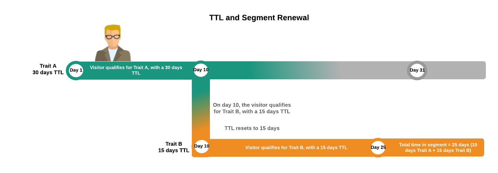

# Segment et temps de publication des caractéristiques {#segment-time-to-live-explained}

Comment l’intervalle [!UICONTROL time-to-live] ([!DNL TTL]) de caractéristiques affecte l’appartenance au segment.

<!-- segment-ttl-explained.xml -->

## Temps de vivre

[!DNL TTL] définit la durée pendant laquelle un visiteur du site reste dans un segment après le dernier événement de qualification de caractéristique. [!DNL TTL] est définie sur les caractéristiques et non sur les segments. Les visiteurs sortent d’un segment s’ils ne remplissent pas les critères d’une caractéristique avant la fin de l’ [!DNL TTL] intervalle. La valeur par défaut [!DNL TTL] des nouvelles caractéristiques est de 120 jours. Lorsqu’il est défini sur 0 jour, le trait n’expire jamais. [Définissez la valeur](../../features/traits/create-onboarded-rule-based-traits.md#set-expiration-interval) TTL lorsque vous créez ou modifiez une caractéristique dans la [!UICONTROL Advanced Options] section de l’interface de création de caractéristiques.

### 1 jour d'explication de la durée totale de vie

Lorsque vous définissez la valeur [!DNL TTL] sur 1 jour, le minuteur TTL commence le lendemain de la prise de conscience de la caractéristique, sans compter les heures restantes dans le jour de la réalisation de la caractéristique.

Audience Manager calcule l’ [!DNL TTL] expiration des caractéristiques avec 1 jour [!DNL TTL] en fonction de la formule suivante :

`24 + (24 - Hour of the day the trait was realized, in UTC)`

* **Exemple 1**: Caractéristique réalisée à 1:00 [!DNL UTC], avec 1 jour [!DNL TTL]. [!DNL TTL] expirera 24 + 24 - 1 = 47 heures plus tard.
* **Exemple 2**: Caractéristique réalisée à 23:00 [!DNL UTC], avec 1 jour [!DNL TTL]. [!DNL TTL] expirera 24 + 24 - 23 = 25 heures plus tard.

## [!DNL TTL] et abandonner un segment

Un utilisateur sort d’un segment s’il ne remplit aucune de ses caractéristiques dans l’ [!DNL TTL] intervalle. Si, par exemple, vous disposez d’un segment à 1 caractéristique avec 30 jours [!DNL TTL], l’utilisateur abandonnera ce segment s’il ne remplit pas à nouveau les conditions requises pour la caractéristique dans les 30 prochains jours.

## [!DNL TTL] et renouvellement des segments

Les [!DNL TTL] réinitialisations et l’utilisateur reste dans un segment, s’ils remplissent les conditions requises pour la caractéristique de ce segment au cours de la [!DNL TTL] période. En outre, comme la plupart des segments contiennent plusieurs caractéristiques avec leurs propres [!DNL TTL] intervalles, un utilisateur peut rester dans un segment et réinitialiser l’ [!DNL TTL] intervalle, tant qu’il reste admissible pour les caractéristiques associées au segment.

Supposons, par exemple, que vous ayez le segment 1 composé du Caractéristique A (30 jours [!DNL TTL]) et du Caractéristique B (15 jours [!DNL TTL]). En supposant qu’un visiteur soit admissible pour chaque caractéristique une seule fois, l’illustration ci-dessous décrit le processus de [!DNL TTL] renouvellement et la durée totale du segment.

## [!DNL Audience Manager] Les TTL sont indépendants des paramètres TTL tiers

N’oubliez pas que la [!DNL TTL] visionneuse de votre [!DNL Audience Manager] pixel fonctionne indépendamment de la [!DNL TTL] visionneuse des autres pixels utilisés par des tiers ([!DNL DSP]s, réseaux publicitaires, etc.).

>[!MORE_LIKE_This]
>
>* [Définir un intervalle d’expiration des caractéristiques](../../features/traits/create-onboarded-rule-based-traits.md#set-expiration-interval)

