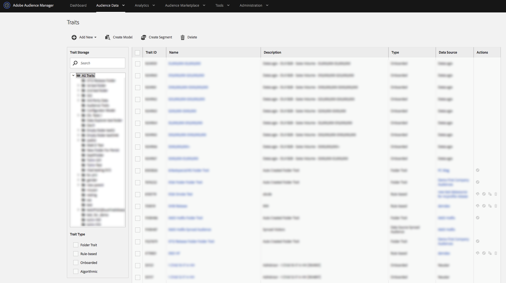

# Tableau de bord des caractéristiques {#traits-dashboard}

Le tableau de bord des caractéristiques est un espace de travail centralisé pour la gestion des caractéristiques. Pour afficher le tableau de bord [!UICONTROL Traits], accédez à **[!UICONTROL Audience Data]** > **[!UICONTROL Traits]**.

<!-- c_tb_dashboard.xml -->

Le tableau de bord [!UICONTROL Traits] contient des fonctionnalités et des outils qui vous aident à :

1. Affichez toutes vos caractéristiques et les détails connexes dans un tableau avec des colonnes que vous pouvez trier.
2. Examinez et utilisez [Caractéristiques d’audience actives et Caractéristiques de Source de données synchronisées](../../features/traits/client-activity-synced-audience-traits.md).
3. Créer, modifier et supprimer des caractéristiques.
4. Afficher et gérer les dossiers de stockage des caractéristiques.
5. Recherchez des caractéristiques par nom, ID, description ou source de données. Cliquez sur un dossier lors de la recherche pour limiter les résultats à ce dossier et à ses sous-dossiers.
6. Filtrer les caractéristiques par type de caractéristique (caractéristiques intégrées, basées sur des règles, algorithmiques, de dossier).
