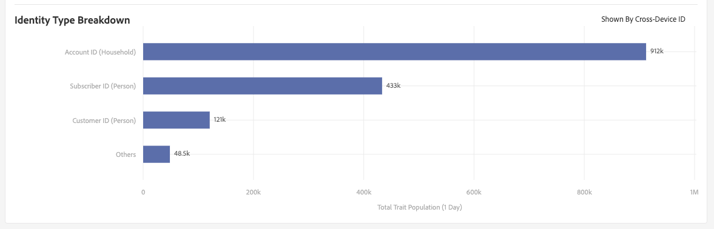

# Page Détails du trait {#trait-details-page}

La page de détails d’une caractéristique individuelle fournit un aperçu des détails de la caractéristique, tels que le nom de la caractéristique, l’ID, les mesures de performances, les expressions qui définissent la caractéristique, les segments auxquels elle appartient et le journal d’audit de la caractéristique. Pour vue ces détails, cliquez sur **[!UICONTROL Audience Data]** > **[!UICONTROL Traits]** et cliquez sur le nom de la caractéristique que vous souhaitez utiliser.

## Outils de gestion des caractéristiques {#trait-management-tools}

La partie supérieure de la page des détails de la caractéristique contient les outils que vous pouvez utiliser pour gérer vos caractéristiques :

1. **[!UICONTROL Add New]**: Utilisez cette option pour créer de nouvelles caractéristiques basées sur des règles, algorithmiques ou intégrées.
2. **[!UICONTROL Edit]**: Utilisez cette option pour modifier la configuration de la caractéristique actuelle.
3. **[!UICONTROL Delete]**: Utilisez cette option pour supprimer la caractéristique actuelle de votre compte Audience Manager.
4. **[!UICONTROL Marketplace Recommendations]**: Utilisez cette option pour trouver des caractéristiques similaires à celles que vous consultez, à partir des [!UICONTROL Audience Marketplace] frais de données auxquels vous n’êtes pas abonné. Voir [Audience Marketplace pour les acheteurs](../audience-marketplace/marketplace-data-buyers/marketplace-data-buyers.md) de données pour savoir comment naviguer sur le Marketplace et trouver des caractéristiques similaires.

## Informations sur les caractéristiques {#basics}

La [!UICONTROL Trait Information] section affiche des détails sur les champs obligatoires et facultatifs que vous avez remplis lors de la création de la caractéristique. Il s’agit notamment du type de caractéristique, de l’ID de caractéristique, de la description, de la source de données et d’autres métadonnées. Ces détails varient en fonction du type de caractéristique (dossier, intégré ou basé sur des règles).

## Graphique de caractéristiques {#trait-graph}

Il [!UICONTROL Trait Graph] fournit des mesures de performances en un coup d’oeil pour votre caractéristique sélectionnée. Placez le curseur sur une ligne de tendance pour afficher des données supplémentaires pour la caractéristique sélectionnée.

[!UICONTROL Unique Trait Realizations] représentent le nombre d’utilisateurs uniques qui ont ajouté cette caractéristique à leur profil au cours d’une période donnée. Le [!UICONTROL Total Trait Population] indique le nombre d’utilisateurs uniques actuellement qualifiés pour cette caractéristique.

Pour les caractéristiques basées sur des règles, la qualification des caractéristiques se produit en temps réel, dans la mesure où les utilisateurs remplissent les critères d’une caractéristique dans leur navigateur.

Pour les caractéristiques intégrées, la qualification des caractéristiques se produit après le traitement d’un fichier entrant, c’est-à-dire que le fichier entrant est [ajouté à Audience Manager](../../faq/faq-inbound-data-ingestion.md) et que la qualification des caractéristiques se produit.

Le [!UICONTROL Trait Graph] montre les informations suivantes :

* **[!UICONTROL Show results by]**
   * **[!UICONTROL Cross-Device ID]**: sélectionnez cette option pour afficher les résultats des caractéristiques qui collectent des données pour les profils authentifiés. Lorsque vous sélectionnez cette option, seules les données du [!UICONTROL Cross-Device ID] rapport s’affichent et aucune donnée ne s’affiche sous le [!UICONTROL Device ID] rapport.
   * **[!UICONTROL Device ID]**: sélectionnez cette option pour afficher les résultats des caractéristiques qui collectent des données pour les profils de périphériques. Lorsque vous sélectionnez cette option, seules les données du [!UICONTROL Device ID] rapport s’affichent et aucune donnée ne s’affiche sous le [!UICONTROL Cross-Device ID] rapport.

      

* **[!UICONTROL Unique Trait Realizations]**: Nombre d’utilisateurs uniques qui ont ajouté cette caractéristique à leur profil au cours d’une période donnée.
* **[!UICONTROL Total Trait Population]**: Nombre d’utilisateurs uniques actuellement qualifiés pour cette caractéristique.

* **[!UICONTROL Identity Type Breakdown]**: Les trois premières entrées montrent les trois principales sources de données inter-périphériques ayant le plus grand nombre de population ayant qualifié la caractéristique, dans l’ordre décroissant. La quatrième entrée présente la somme de tous les autres [!DNL DPUUIDs] ([!DNL CRM IDs]) qui ont qualifié la caractéristique, provenant des sources de données sur plusieurs périphériques qui ne figurent pas dans les trois premières. Ce rapport s’affiche uniquement si vous sélectionnez ID entre plusieurs périphériques dans le menu [!UICONTROL Show Results By] déroulant en haut à droite de la page. L’option de liste déroulante par défaut est [!UICONTROL Device ID]l’endroit où ce rapport n’est pas affiché.

   

   >[!NOTE]
   >
   >Audience Manager affiche le [!UICONTROL Identity Type Breakdown] rapport uniquement si les identifiants de plusieurs périphériques sont qualifiés pour cette caractéristique.

   >[!VIDEO](https://video.tv.adobe.com/v/27977/)

## Expression de caractéristiques {#trait-expression}

La [!UICONTROL Trait Expression] section présente les critères que les utilisateurs doivent respecter pour pouvoir bénéficier de la caractéristique. Ces règles sont définies lorsque vous [créez ou modifiez une caractéristique](../../features/traits/about-trait-builder.md).

## Segments de caractéristiques {#trait-segments}

La [!UICONTROL Segments with this Trait] section liste tous les segments auxquels appartient la caractéristique sélectionnée. Vous pouvez cliquer sur le nom d’un segment pour afficher les détails sur ce segment.

## Journal d&#39;audit/historique des caractéristiques {#trait-audit-history}

Pour les caractéristiques basées sur des règles et les caractéristiques intégrées, le [!UICONTROL Trait Expression Change History] montre les 10 dernières modifications apportées aux règles d’expression des caractéristiques et leur auteur. Si votre caractéristique comporte plus de 10 modifications, cliquez sur **[!UICONTROL Export to CSV]** pour télécharger l’intégralité du journal d’audit. Le journal d&#39;audit n&#39;est pas disponible pour les caractéristiques de dossier ou d&#39;algorithme.

>[!NOTE]
>
>[!UICONTROL Not Available] dans la [!UICONTROL By User] colonne signifie que le compte de cet utilisateur a été supprimé.

