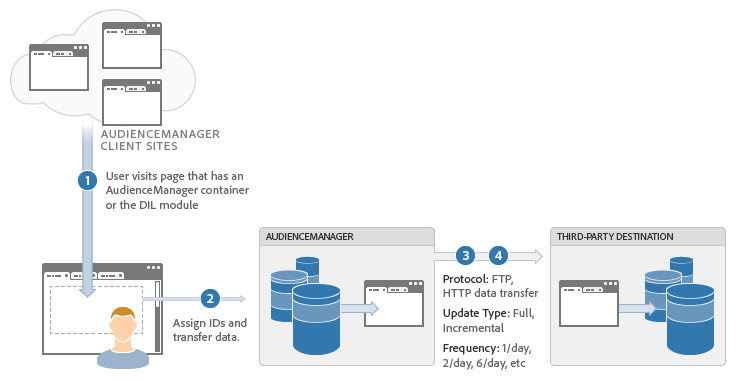

# Méthodes d’intégration des données {#data-integration-methods}

Présentation générale de la manière dont l’Audience Manager échange des informations avec d’autres fournisseurs et systèmes de données.

## Méthodes d’intégration de données prises en charge : Temps réel et [!DNL Server-to-Server] {#supported-methods}

Le choix de la bonne méthode d’intégration dépend de la combinaison des exigences de l’entreprise et des fonctionnalités techniques de votre partenaire de données. Audience Manager échange les informations sur les visiteurs avec d’autres fournisseurs de données en utilisant l’une des méthodes suivantes :

* **Temps réel :** transfère immédiatement les données lorsqu’un utilisateur visite votre site. Cette méthode est également appelée intégration *`synchronous`*.
* **Lot ([!DNL Server-to-Server]) :** transfère les données entre les serveurs selon une planification définie une fois qu’un visiteur a quitté la page. Cette méthode est également connue sous le nom d’intégration *`out-of-band`* ou *`asynchronous`*.

## Conditions préalables : Créer une taxonomie des caractéristiques {#prereqs}

Avant de commencer le processus d’intégration, pensez à [créer des caractéristiques](../features/traits/create-onboarded-rule-based-traits.md) et une [structure de dossiers](../features/traits/trait-storage.md#create-trait-storage-folder) dans l’interface utilisateur de [!DNL Audience Manager]. La taxonomie contiendra tous vos [!UICONTROL traits] organisés dans une hiérarchie logique.

## Cas d’utilisation d’intégration {#integration-use-cases}

Résumé du cas d’utilisation des méthodes d’intégration des données d’Audience Manager avec les avantages et les inconvénients de chacune d’elles.

### Intégrations en temps réel [!DNL Server-to-Server]

<!-- c_int_types_use_cases.xml -->

Une intégration de données [!DNL server-to-server] en temps réel synchronise rapidement les données utilisateur entre les serveurs d’Audience Manager et un autre système de ciblage. Dans la plupart des cas, l&#39;échange de données se fait en quelques secondes ou minutes, selon le taux d&#39;actualisation du système de ciblage. Notez toutefois que le système ciblé détermine cet intervalle d’actualisation, et non l’Audience Manager. En outre, le taux d’actualisation peut varier selon les différents systèmes. Une intégration [!UICONTROL server-to-server] en temps réel est le type d’intégration préféré pour les échanges de données. Audience Manager utilise cette méthode chaque fois que les partenaires de ciblage peuvent la prendre en charge.

<table id="simpletable_5307DEC378E5486CB92A354287F33AD8"> 
 <tr class="strow">
  <td class="stentry"> 
Avantages: 
</td>
  <td class="stentry"> 
   <ul id="ul_F251AFF8A2FA49D0849E36D7FAE87DE7"> 
    <li id="li_1737EBB1AD8844BD87E736BB4D8080EF">Vous permet de qualifier les utilisateurs pour les segments sans les revoir sur la page, dans un lecteur vidéo, etc. </li>
    <li id="li_1C1F346CB7BD40508AA5A6918C6B8514"> Réduit le nombre d’appels HTTP de la page. Un nombre moins élevé d’appels permet de préserver l’expérience de l’utilisateur. </li>
    <li id="li_046BF4568B104F53A0E5372568C957CD">Permet d’effectuer rapidement un ciblage en fonction du temps, de telle sorte que vous puissiez agir sur un utilisateur qualifié. </li>
    <li id="li_70F7AB19AC5D4A9AB80216A2B05163B8">Utile lors du passage à un DSP pour le ciblage hors site. </li>
   </ul></td>
 </tr>
 <tr class="strow">
  <td class="stentry"> Inconvénients :</td>
  <td class="stentry"> Moins utile pour le ciblage sur site lorsque vous devez cibler l’utilisateur sur la même page, ou sur la page suivante, en fonction de la qualification d’un utilisateur pour ce segment.</td>
 </tr>
</table>

### [!DNL Server-to-Server] Intégrations par lots

Une intégration par lots [!DNL server-to-server] regroupe les données et les envoie à d’autres systèmes à des intervalles définis plutôt qu’en temps quasi réel. Les intervalles de transfert des données commencent à 24 heures. Certains fournisseurs de données prennent uniquement en charge ce type d’intégration. Cependant, nous avons observé une tendance générale, qui s’éloigne des intégrations par lots, vers des méthodologies d’intégration en temps réel.

<table id="simpletable_6878241639114DE68E61A251486C6317"> 
 <tr class="strow">
  <td class="stentry"> 
Avantages: 
</td>
  <td class="stentry"> 
   <ul id="ul_1E9B48B06E764D3AB6F2D702EB4922DC"> 
    <li id="li_1CF0E018660347B3A5AF79160F74FBDB">Vous permet de qualifier les utilisateurs pour les segments sans les revoir sur la page, dans un lecteur vidéo, etc. </li> 
    <li id="li_B6A9DF9C0D8B44A48F032F2FDB5B3956">Utile pour un ciblage qui n’est pas sensible au temps. </li>
   </ul></td>
 </tr>
 <tr class="strow">
  <td class="stentry"> Inconvénients :</td>
  <td class="stentry"> L’intervalle de synchronisation peut retarder le ciblage par rapport aux données les plus récentes.</td>
 </tr>
</table>

### Appels en temps réel

Les appels en temps réel échangent immédiatement des données avec l’Audience Manager, lorsqu’un utilisateur visite votre site ou agit sur la page. Grâce à cette méthode, les systèmes de ciblage obtiennent les données de qualification de segment les plus récentes et peuvent prendre ces informations en compte lors d’une décision de diffusion de contenu ou de publicité. En outre, ce processus fonctionne avec les serveurs d’annonces de l’éditeur où nous mettons à jour des segments qualifiés vers un cookie propriétaire qui est lu dans un appel publicitaire en tant que paires clé-valeur. Actuellement, Audience Manager utilise des appels en temps réel pour s’intégrer à [!DNL Adobe Target] et à d’autres systèmes de gestion de contenu.

<table> 
 <tr>
  <td> 
Avantages: 
</td>
  <td> 
 Permet de cibler la page, la zone de contenu ou l’impression publicitaire suivante en fonction de la qualification de segment la plus récente. 
</td> 
 </tr> 
 <tr>
  <td> 
Inconvénients : 
</td>
  <td> 
Ajoute un appel à l’Audience Manager depuis la page.
</td>
 </tr> 
</table>

### Synchronisations des pixels avec les systèmes de ciblage

La synchronisation des pixels mappe les segments aux pixels sur la page. Le pixel se déclenche et transmet des données lorsqu’un utilisateur est admissible pour un segment particulier. La synchronisation des pixels est un mécanisme de transfert de données rudimentaire et peu fiable. Les fournisseurs de données et les systèmes de haut niveau l’utilisent rarement.

<table id="simpletable_39E4CD139CCF4417842AA28CDFFB6EB1"> 
 <tr class="strow">
  <td class="stentry"> 
Avantages: 
</td>
  <td class="stentry"> 
 Transferts de données en temps réel. 
</td> 
 </tr> 
 <tr class="strow">
  <td class="stentry"> 
Inconvénients : 
</td>
  <td class="stentry"> 
   <ul id="ul_5217EDC82434401493C2C96823C068E9"> 
    <li id="li_26EB0458CA1844908C005A47F55E50AC">Peuvent ajouter de nombreux appels côté client à partir de la page. </li>
    <li id="li_CD91F3DC92F2429293787D61506E5E04">Peu fiable pour la transmission des données. Une perte de 5 à 20 % est normale. </li>
   </ul></td>
 </tr> 
</table>

## Choix d’une méthode de remise des données {#data-delivery-choices}

Décrit les raisons techniques et commerciales d’envoi des données par des méthodologies synchrones (temps réel) ou asynchrones (serveur à serveur).

<!-- c_int_delivery_choices.xml -->

### Sélection d’un type de diffusion de données

* **Considérations techniques :**  la diffusion des données dépend des fonctionnalités techniques du partenaire de données. L’Audience Manager peut envoyer/recevoir des données en temps réel depuis le navigateur ou par mise à jour par lots via des processus de communication serveur à serveur hors ligne.
* **Considérations commerciales :**  les raisons commerciales de la sélection d’un mode de remise ou d’un autre dépendent des fonctionnalités techniques de votre partenaire de destination et de la manière dont vous souhaitez utiliser ces données. En règle générale, les transferts de données synchrones sont utiles lorsque vous devez agir immédiatement sur les données utilisateur. Les transferts de données asynchrones peuvent s’avérer utiles lorsque l’action immédiate n’est pas requise et lorsque vous avez le temps de créer des profils utilisateur plus approfondis pour une utilisation ultérieure.

## Processus de transfert de données en temps réel {#real-time-data-transfer-process}

Présentation générale de la manière dont l’Audience Manager effectue un échange de données synchrone avec un fournisseur tiers.

### Transfert de données en temps réel

<!-- c_int_overview_sync.xml -->

Les transferts de données en temps réel envoient et reçoivent des identifiants de segment lorsqu’un utilisateur visite votre site ou effectue une action sur celui-ci. En règle générale, les transferts de données synchrones sont utiles lorsque vous devez qualifier ou segmenter immédiatement les utilisateurs lorsqu’ils parcourent votre inventaire.

### Étapes d’intégration des données en temps réel

Le processus d’intégration des données en temps réel fonctionne comme suit :

1. Un utilisateur visite le site d’un client qui contient le code d’Audience Manager.
1. Audience Manager charge un Iframe et appelle la balise [!UICONTROL Data Collection Server] ([!DNL DCS]).
1. [!DNL DCS] appelle le serveur tiers (en temps réel) pour vérifier si le fournisseur dispose d’informations sur le segment de l’utilisateur.
1. Le tiers renvoie des informations de segment sur cet utilisateur à l’Audience Manager.
1. Audience Manager ingère des informations sur les segments et les rend disponibles pour le ciblage.

## Processus de transfert de données par lots  {#batch-data-transfer-process}

Présentation générale de la manière dont l’Audience Manager échange des données de manière synchrone (en temps réel) avec un fournisseur tiers.

### Intégration de données par lots

<!-- c_int_overview_async.xml -->

Le processus d’intégration des données par lots ([!DNL server-to-server]) suit la plupart des étapes décrites dans le processus de transfert des données en temps réel. Cependant, au lieu de renvoyer immédiatement les identifiants de segment, les informations utilisateur sont enregistrées sur nos serveurs et synchronisées avec un fournisseur de données tiers à intervalles réguliers. Le processus de transfert de données asynchrone est utile dans les cas suivants :

* Les transferts de données immédiats ne sont pas requis.
* Collecte de données pour créer un grand groupe d’utilisateurs segmentés.
* Vous souhaitez réduire les incohérences de données et les appels `HTTP` du navigateur.

### Étapes d’intégration des données par lots

1. Un utilisateur visite un site client.
1. L’Audience Manager et le fournisseur de données tiers attribuent au visiteur un identifiant unique (généralement avec un cookie).
1. Audience Manager appelle le fournisseur de données tiers pour qu’il corresponde aux identifiants visiteur.
1. Une requête planifiée, généralement à intervalle quotidien, échange des données de segment des visiteurs entre l’Audience Manager et votre fournisseur de données tiers.

Pour plus d’informations sur les délais pendant lesquels l’Audience Manager traite les transferts de fichiers entrants et sortants [!DNL Server-to-Server] ([!UICONTROL S2S]), voir [Instructions sur les délais de création de rapports et de transfert de fichiers](../reference/reporting-file-transfer-timeframe.md).
