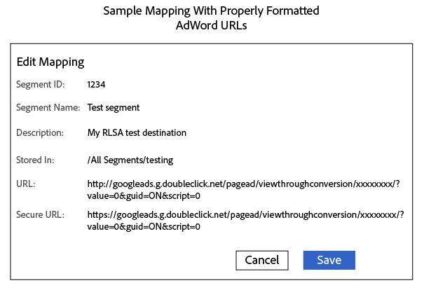

# Envoyer des segments à une Liste de remarketing d&#39;annonces Google {#send-segments-to-a-google-adwords-remarketing-list}

Cette procédure nécessite une liste de remarketing [!DNL Google Ads], un code de pixel et une Audience Manager [!DNL URL] [!DNL destination]. Il s’agit également d’une liste de marketing de relance pour l’intégration des publicités de recherche ([!DNL RLSA]). S’applique uniquement à la recherche payante.

>[!IMPORTANT]
>Veuillez noter qu&#39;il ne s&#39;agit pas d&#39;une intégration productive des deux systèmes.

Pour configurer une liste de remarketing [!DNL Google Ads] en tant que [!DNL Audience Manager] [!DNL URL destination] :

1. Dans votre compte [!DNL Google Ads], [créez une liste de remarketing](https://support.google.com/adwords/answer/2454064?hl=en) du site Web et notez votre identifiant de conversion.
1. Utilisez l’URL suivante comme modèle pour l’URL de base et l’URL sécurisée. Remplacez la section xxxxxxxx par votre ID de conversion.

   ```
    //googleads.g.doubleclick.net/pagead/viewthroughconversion/xxxxxxxx/?value=0&guid=ON&script=0&data=%ALIAS%
   ```

1. En Audience Manager, [Créez un  [!DNL URL destination]](../../features/destinations/create-url-destination.md) ou modifiez un [!DNL destination] existant. Utilisez les paramètres suivants lors de la création du [!DNL destination] :
   * Type : URL
   * Sérialiser : Activé
   * Délimiteur : Point-virgule (;)

1. Dans la section [!UICONTROL Segment Mappings] de votre [!DNL URL] [!DNL destination], ajoutez le code de l&#39;étape 2 aux champs [!DNL URL] et [!DNL Secure URL]. Préfixez le code avec `http:` et `https:` dans les champs [!DNL URL] et [!DNL Secure URL], respectivement.

   >[!IMPORTANT]
   >
   >Remplacer les esperluettes codées `&` par des esperluettes non codées `&`

   Code [!DNL URL] non sécurisé :

   ```
    http://googleads.g.doubleclick.net/pagead/viewthroughconversion/xxxxxxxx/?
    value=0&guid=ON&script=0&data=%ALIAS%
   ```

   Sécuriser le code [!DNL URL] :

   ```
    https://googleads.g.doubleclick.net/pagead/viewthroughconversion/xxxxxxxx/?
    value=0&guid=ON&script=0&data=%ALIAS%
   ```

1. Cliquez sur **[!UICONTROL Save]**.

   >[!NOTE]
   >
   >Si vous travaillez sur plusieurs segments, obtenez un nouveau pixel pour chaque segment que vous souhaitez mapper à un [!DNL Google Ads] [!DNL destination]. Ainsi, les données sont appliquées à la liste de marketing de relance appropriée.

1. Lors du mappage d’un nouveau segment à ce [!DNL destination] en Audience Manager, définissez le mappage sur `aam=segmentID` et remplacez `segmentID` par l’identifiant de votre segment.
1. Lors de la définition d&#39;un compartiment dans [!DNL Google Ads], créez une règle correspondant au mappage défini à l&#39;étape 6.

Un mappage terminé peut ressembler à ceci :



>[!MORELIKETHIS]
>
>* [[!DNL Destinations]](../../features/destinations/destinations.md)
>* [Créez un [!DNL URL Destination]](../../features/destinations/create-url-destination.md)
>* [A propos des Listes de remarketing AdWords](https://support.google.com/adwords/answer/2472738)
>* [Fonctionnement du remarketing AdWords](https://support.google.com/adwords/answer/2454000)

