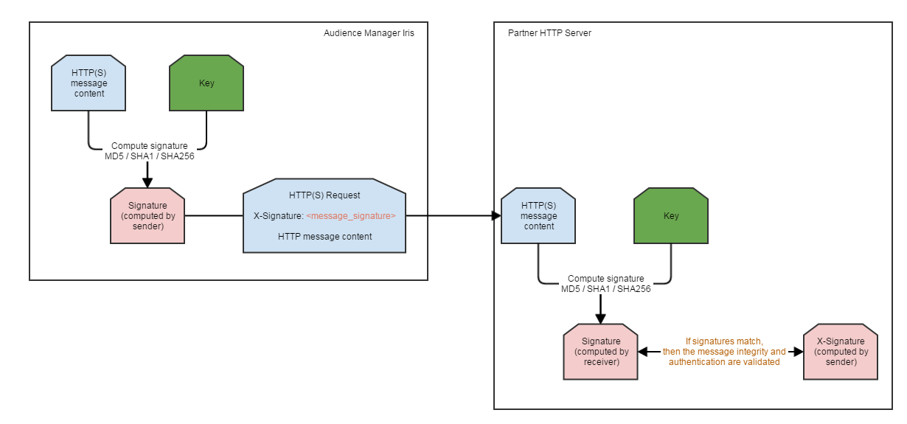

# Demandes `HTTP(S)` signées numériquement {#digitally-signed-http-requests}

Audience Manager exige que les requêtes serveur à serveur `HTTP(S)` soient signées numériquement pour validité. Ce document décrit comment signer des requêtes `HTTP(S)` avec des clés privées.

## Présentation {#overview}

<!-- digitally_signed_http_requests.xml -->

À l&#39;aide d&#39;une clé privée que vous avez fournie et partagée avec [!DNL Audience Manager], nous pouvons signer numériquement les demandes `HTTP(S)` envoyées entre [IRIS](../../../reference/system-components/components-data-action.md#iris) et votre serveur HTTP(S). Cela permet d’assurer les éléments suivants :

* **Authenticité** : seul l&#39;expéditeur possédant la clé privée ([!UICONTROL IRIS]) peut envoyer des messages `HTTP(S)` valides au partenaire.
* **Intégrité des messages** : grâce à cette approche, même sur `HTTP`, vous êtes protégé contre un homme au milieu de l&#39;attaque où les messages sont déformés.

[!UICONTROL IRIS] dispose d’une prise en charge intégrée de la rotation des clés sans temps d’arrêt, comme illustré dans la section [&#x200B; Rotation de la clé privée &#x200B;](../../../integration/receiving-audience-data/real-time-outbound-transfers/digitally-signed-http-requests.md#rotate-private-key) ci-dessous.

## Informations à fournir {#info-to-provide}

Pour une destination serveur à serveur en temps réel `HTTP(S)`, contactez votre consultant [!DNL Audience Manager] et indiquez les informations suivantes :

* Clé utilisée pour signer la requête.
* Nom de l’en-tête `HTTP(S)` qui contiendra la signature générée (Signature X dans l’exemple d’en-tête ci-dessous).
* Facultatif : type de hachage utilisé pour la signature (md5, sha1, sha256).

```
* Connected to partner.website.com (127.0.0.1) port 80 (#0)
> POST /webpage HTTP/1.1
> Host: partner.host.com
> Accept: */*
> Content-Type: application/json
> Content-Length: 20
> X-Signature: +wFdR/afZNoVqtGl8/e1KJ4ykPU=
POST message content
```

## Fonctionnement {#how-it-works}

1. [!UICONTROL IRIS] crée le message `HTTP(S)` à envoyer au partenaire.
1. [!UICONTROL IRIS] crée une signature basée sur le message `HTTP(S)` et la clé privée communiquée par le partenaire.
1. [!UICONTROL IRIS] envoie la demande de `HTTP(S)` au partenaire. Ce message contient la signature et le message réel, comme illustré dans l’exemple ci-dessus.
1. Le serveur partenaire reçoit la demande de `HTTP(S)`. Il lit le corps du message et la signature reçue de [!UICONTROL IRIS].
1. En fonction du corps du message reçu et de la clé privée, le serveur partenaire recalcule la signature. Consultez la section [Comment calculer la signature](../../../integration/receiving-audience-data/real-time-outbound-transfers/digitally-signed-http-requests.md#calculate-signature) ci-dessous pour savoir comment procéder.
1. Comparez la signature créée sur le serveur partenaire (récepteur) à celle reçue de [!UICONTROL IRIS] (expéditeur).
1. Si les signatures correspondent, les **authenticité** et **intégrité du message** ont été validées. Seul l’expéditeur, qui dispose de la clé privée, peut envoyer une signature valide (authenticité). De plus, un homme au milieu ne peut pas modifier le message et générer une nouvelle signature valide, puisqu&#39;il n&#39;a pas la clé privée (intégrité du message).



## Comment calculer la signature {#calculate-signature}

[!DNL HMAC] (code d’authentification de message basé sur le hachage) est la méthode utilisée par [!UICONTROL IRIS] pour la signature des messages. Les implémentations et les bibliothèques sont disponibles essentiellement dans tous les langages de programmation. [!DNL HMAC] n’a aucune attaque d’extension connue. Consultez un exemple dans la [!DNL Java] ci-dessous :

```
// Message to be signed.
// For GET type HTTP(S) destinations, the message used for signing will be the REQUEST_PATH + QUERY_STRING
// For POST type HTTP(S) destinations, the message used for signing will be the REQUEST_BODY.
// String getData = "/from-aam-s2s?sids=1,2,3";
String postData = "POST message content";
// Algorithm used. Currently supported: HmacSHA1, HmacSHA256, HmacMD5.
String algorithm = "HmacSHA1";
// Private key shared between the partner and Adobe Audience Manager.
String key = "sample_partner_private_key";
  
// Perform signing.
SecretKeySpec signingKey = new SecretKeySpec(key.getBytes(), algorithm);
Mac mac = Mac.getInstance(algorithm);
mac.init(signingKey);
byte[] result = mac.doFinal(postData.getBytes());
  
String signature = Base64.encodeBase64String(result).trim(); 
// signature = +wFdR/afZNoVqtGl8/e1KJ4ykPU=
```

La RFC pour l’implémentation du hachage [!DNL HMAC] est [https://www.ietf.org/rfc/rfc2104.txt](https://www.ietf.org/rfc/rfc2104.txt). Un site de test : [https://asecuritysite.com/encryption/hmac](https://asecuritysite.com/encryption/hmac) (notez que vous devez [convertir](https://tomeko.net/online_tools/hex_to_base64.php?lang=en) le codage hex en base64).

## Rotation de la clé privée {#rotate-private-key}

Pour appliquer une rotation à la clé privée, les partenaires doivent communiquer la nouvelle clé privée à leur consultant [!DNL Adobe Audience Manager]. L’ancienne clé est supprimée de [!DNL Audience Manager] et [!UICONTROL IRIS] envoie uniquement le nouvel en-tête de signature. Les clés ont pivoté.

## Données utilisées pour la signature {#data-signing}

Pour les destinations de type `GET`, le message utilisé pour la signature sera le *REQUEST_PATH + QUERY STRING* (par exemple */from-aam-s2s?sids=1,2,3*). IRIS ne prend pas en compte le nom d’hôte ou les en-têtes `HTTP(S)`. Ceux-ci peuvent être modifiés ou mal configurés le long du chemin ou signalés de manière incorrecte.

Pour les destinations de type `POST`, le message utilisé pour la signature est *REQUEST BODY*. Là encore, les en-têtes ou autres paramètres de requête sont ignorés.
