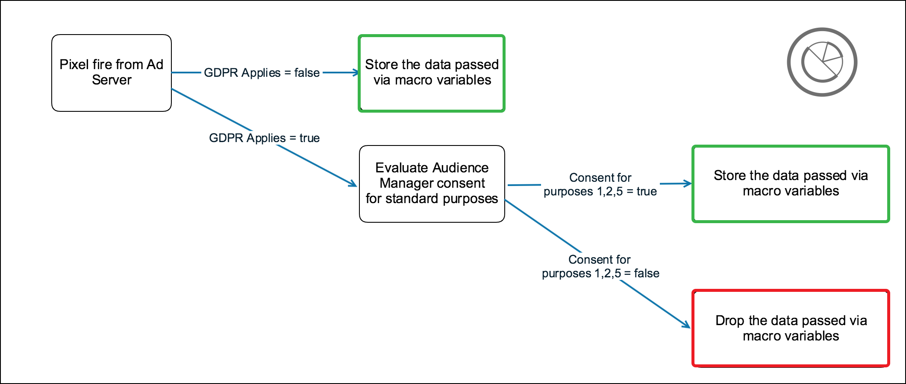

# Module externe Audience Manager pour IAB TCF {#aam-iab-plugin}

## Aperçu

Un aspect important des obligations de confidentialité que vous avez envers vos utilisateurs réside dans l’acquisition et le respect des choix des utilisateurs quant à la façon dont leurs données personnelles sont utilisées (c’est-à-dire les « objectifs ») et quant aux entités qui les utilisent (les « entreprises »).

Adobe vous fournit les moyens de gérer et de communiquer les choix de confidentialité de vos utilisateurs via la [fonctionnalité d’adhésion](https://marketing.adobe.com/resources/help/en_US/mcvid/overview.html) et la prise en charge d’[IAB Transparency and Consent Framework (TCF)](https://iabtechlab.com/standards/gdpr-transparency-and-consent-framework/).

Cet article décrit les cas d’utilisation d’Audience Manager qui prennent en charge IAB TCF et l’implémentation de la prise en charge d’IAB TCF dans Audience Manager. Audience Manager est enregistré dans l&#39;IAB TCF avec l&#39;ID de fournisseur 565.

The Audience Manager Plug-in for IAB TCF utilizes the [Opt-in functionality](https://marketing.adobe.com/resources/help/en_US/mcvid/iab.html), which is, in turn, part of the Adobe [Experience Cloud ID Service (ECID)](https://marketing.adobe.com/resources/help/en_US/mcvid/) library.

## Scope and Limitations {#scope-and-limitations}

En tant qu&#39;éditeur ou annonceur travaillant avec Audience Manager, vous pouvez transmettre les choix d&#39;utilisateurs à Audience Manager selon l&#39;IAB TCF. Vous disposez ainsi d&#39;un moyen facile et cohérent de communiquer les choix des utilisateurs à tous les partenaires que vous collaborez et Audience Manager peut vous aider à respecter les choix de confidentialité de vos utilisateurs.

La prise en charge de l&#39;IAB TCF décrite dans cet article représente la première phase de la prise en charge prévue par Audience Manager pour la structure IAB. Actuellement, Audience Manager ne prend pas en charge :

* Processus des périphériques mobiles ;
* Gestion des autorisations inter-périphériques ;
* Appending consent to URLs sent to [URL destinations](/help/using/features/destinations/manage-destinations.md#configure-url-destination);
* Ajout de l&#39;autorisation aux segments.

## Conditions préalables {#prerequisites}

Pour utiliser l&#39;IAB TCF avec Audience Manager, vous devez respecter les conditions préalables suivantes :

1. Vous devez utiliser le service ECID (Experience Cloud ID) version 4.1 ou ultérieure. [Téléchargez](https://github.com/Adobe-Marketing-Cloud/id-service/releases) notre dernière version d&#39;ECID.
2. 
   1. You must be using Audience Manager Data Integration Library (DIL) version 9.0 or newer, downloadable from [here](https://github.com/Adobe-Marketing-Cloud/dil/releases). Read about [DIL in the Audience Manager documentation](/help/using/dil/dil-overview.md).
   2. Si vous utilisez le transfert côté serveur (SSF) pour importer des données dans Audience Manager, vous devez effectuer la mise à niveau vers la dernière version d&#39;appmeasurement. Download AppMeasurement using the [Analytics Code Manager](https://marketing.adobe.com/resources/help/en_US/reference/code_manager_admin.html).
3. Vous devez utiliser une plateforme de gestion de l&#39;approbation (CMP), commerciale ou vôtre, qui prend en charge l&#39;IAB et est enregistrée auprès de l&#39;IAB TCF. See the list of [CMPs registered within the IAB framework](https://advertisingconsent.eu/cmp-list/).

## Recommendations and how to implement {#recommendations}

To enable the IAB TCF support in Audience Manager, read our documentation on [how to set up IAB with Opt-in](https://marketing.adobe.com/resources/help/en_US/mcvid/iab.html).

This is easiest done by using [Adobe Launch](https://docs.adobelaunch.com/) to instrument ECID Opt-in on your properties. Read the documentation for the [ECID Opt-in extension](https://docs.adobelaunch.com/extension-reference/web/experience-cloud-id-service-extension#opt-in) to learn how to set up the Launch extension.

## User choice workflow when using the IAB framework {#user-choice-workflow}

Lors de la visite d&#39;une propriété Web, vos utilisateurs peuvent définir leurs choix quant à l&#39;utilisation de leurs données par l&#39;éditeur et par les fournisseurs tiers avec lesquels l&#39;éditeur travaille. Users provide their choices in the form of *standard purposes* and permissions to *third-party vendors* registered in the global vendor list. L&#39;image ci-dessous représente un exemple de dialogue CMP, présenté à un nouveau visiteur d&#39;un site Web. Gardez à l&#39;esprit que ce dialogue peut être très différent, selon la mise en œuvre des clients.


Les objectifs standard de la structure IAB sont les suivants :

* Stockage d&#39;informations et accès
* Personnalisation
* Sélection, diffusion et création de rapports publicitaires
* Sélection de contenu, diffusion et création de rapports
* vidéo

Refer to the [IAB framework specification page](https://github.com/InteractiveAdvertisingBureau/GDPR-Transparency-and-Consent-Framework/blob/master/Consent%20string%20and%20vendor%20list%20formats%20v1.1%20Final.md#purposes-features) for a description of the five standard purposes.

Les utilisateurs peuvent accorder leur consentement à une combinaison d&#39;objectifs standard et de fournisseurs. Par exemple, les utilisateurs peuvent accorder leur consentement à un stockage, à une personnalisation et à une mesure et accorder leur autorisation à tous les fournisseurs tiers affichés par le CMP. Ou, dans un autre exemple, ils peuvent accorder leur autorisation aux cinq objectifs standard, mais seulement accorder le consentement à quelques fournisseurs affichés par le CMP.

Une fois que l&#39;utilisateur sélectionne son choix de confidentialité, le ou les choix utilisateur sont enregistrés dans la chaîne de consentement IAB TCF. The IAB TCF consent string stores the combination of approved purposes and vendors, along with other metadata information (see the [IAB page](https://github.com/InteractiveAdvertisingBureau/GDPR-Transparency-and-Consent-Framework/blob/master/Consent%20string%20and%20vendor%20list%20formats%20v1.1%20Final.md#Consent-string-and-vendor-list-format) for more information). Chaque fournisseur enregistré dans l&#39;IAB TCF évalue la chaîne de consentement de l&#39;IAB TCF et décide en fonction des choix de confidentialité des utilisateurs. Gardez à l&#39;esprit que les choix de confidentialité des utilisateurs sont valides pour tous les fournisseurs approuvés.

## Standard purposes needed by Audience Manager {#aam-standard-purposes}

Audience Manager évalue les choix des utilisateurs stockés dans la chaîne de consentement de l&#39;IAB TFC pour :

* Information storage and access (purpose ID 1 in the [global vendor list](https://vendorlist.consensu.org/vendorlist.json))
* Personnalisation (ID 2)
* Mesure (ID d&#39;objectif 5)
* Le fournisseur d&#39;Audience Manager consent à stocker, traiter ou activer les données pour un éditeur.

>[!IMPORTANT]
>
>Audience Manager needs consent for *all three purposes, plus vendor consent* in order to deploy cookies and initiate or honor ID syncs.

## Audience Manager behavior depends on whether the user grants consent {#aam-behavior-consent}

Audience Manager fonctionne différemment selon qu&#39;Audience Manager détecte dans la chaîne de consentement IAB TCF que l&#39;utilisateur a fourni le consentement à trois fins (stockage, personnalisation, mesure) ou non.

| When your user *provides consent*, Audience Manager: | When your user *declines* consent, Audience Manager: |
|---|---|
| <ul><li>exécute tous les cas d&#39;utilisation d&#39;Audience Manager que vous avez demandés.</li><li>Envoie le consentement à des tiers dans les synchronisations de l&#39;ID (en transmettant gdpr = 1 et la chaîne d&#39;autorisation comme gdpr_ permission sur les appels de synchronisation des identifiants).</li><li>Evalue et respecte le consentement transmis à partir des pixels du serveur d&#39;annonces.</li><li>Respecte les synchronisations des identifiants initiés par le partenaire.</li></ul> | <ul><li>Ne stocke aucune donnée utilisateur dans votre instance. Cela inclut les ID de partenaire, les signaux, les caractéristiques ou les données de pixels.</li><li>Ne déclenche pas la synchronisation des identifiants tiers.</li><li>Ne respecte pas les synchronisations d&#39;ID lancées par le partenaire.</li></ul> |


## Publisher Use Case {#publisher-use-case}

En implémentant l&#39;IAB TCF, vous n&#39;êtes pas tenu de conserver le code personnalisé pour la gestion des autorisations sur vos propriétés Web via un mécanisme différent avec Adobe ou d&#39;autres fournisseurs tiers. Le cas d&#39;utilisation est décrit dans l&#39;image et dans les étapes ci-dessous. Commence à gauche de l&#39;image :

1. Un utilisateur visite l&#39;une de vos propriétés Web. As long as you are using the latest versions of the ECID and DIL libraries (see [Prerequisites](/help/using/overview/aam-gdpr/aam-iab-plugin.md#prerequisites)), the opt-in flow is triggered.
2. Audience Manager checks whether the IAB flow applies (`isIabContext=true`). See [Recommendations and how to implement](/help/using/overview/aam-gdpr/aam-iab-plugin.md#recommendations).
3. Audience Manager checks whether GDPR applies (`gdpr = 1`) and whether there is a CMP, registered with IAB, on your web property. Par exemple, cela s&#39;applique aux utilisateurs qui visitent la région Union européenne. Notez qu&#39;il appartient à l&#39;éditeur de définir l&#39;indicateur GDPR.
4. If GDPR applies, Audience Manager checks the IAB TCF consent string, passed in the parameter `gdpr_consent`, for the needed permissions. Audience Manager requiert des autorisations pour le stockage, la personnalisation, la mesure et le consentement du fournisseur d&#39;Audience Manager pour stocker, traiter ou activer les données.
5. If the IAB TCF consent string is present and it contains the required permissions, Audience Manager passes the IAB TCF consent string on to our [data collection servers](/help/using/reference/system-components/components-data-collection.md) (DCS).
6. Audience Manager responds by setting a [demdex cookie](https://marketing.adobe.com/resources/help/en_US/whitepapers/cookies/cookies_am.html) on the browser. Audience Manager démarre et respecte également les synchronisations d&#39;identifiants tiers.
7. Sinon, si la chaîne de consentement IAB TCF transmise à l&#39;étape 5 ne contient pas toutes les autorisations nécessaires, Audience Manager ne collecte, ne traite ou n&#39;active pas les données et ne procède pas à la synchronisation des identifiants.


## Advertiser Use Case {#advertiser-use-case}

Audience Manager evaluates and honors consent passed in [pixel calls](/help/using/integration/sending-audience-data/real-time-data-integration/pixel-based-data-transfer.md), in accordance with the IAB TCF.

Les pixels sont généralement placés par les clients Audience Manager sur leurs pages partenaires ou sont placés dans des serveurs d&#39;annonces à inclure dans la réponse publicitaire. Dans le premier cas, votre partenaire doit récupérer le paramètre de consentement par programmation et l&#39;ajouter au pixel avant de le déclencher. Dans le second cas, qui est plus fréquent et décrit en détail ci-dessous, les serveurs d&#39;annonces ajoutent les paramètres de consentement qu&#39;ils reçoivent de la plateforme SSP (Supply-Side Platform) ou des serveurs d&#39;annonces de l&#39;éditeur à tous les pixels.

Audience Manager utilise deux paramètres pour transmettre le consentement de l&#39;utilisateur aux appels de pixels :

* `gdpr` peut être 0 (GDPR ne s&#39;applique pas) ou 1 (GDPR s&#39;applique) ;
* `gdpr_consent` est la chaîne de consentement GDPR 64 codées sans URL (voir [spécifications](https://github.com/InteractiveAdvertisingBureau/GDPR-Transparency-and-Consent-Framework/blob/master/URL-based%20Consent%20Passing_%20Framework%20Guidance.md#specifications)). Exemple d&#39;appel pour un pixel d&#39;impression, avec les deux paramètres ressemblant à :

```
http://yourcompany.demdex.net/event?d_event=imp&gdpr=1&gdpr_consent=consentstring&d_src=datasource_id&d_site=siteID&d_creative=creative_id&d_adgroup=adgroup_id&d_placement=placement_id
```

Le cas d&#39;utilisation est décrit dans l&#39;image et dans les étapes ci-dessous. Commence à gauche de l&#39;image :

1. Votre utilisateur reçoit une impression via un serveur d&#39;annonces. Ceci traduit par un appel de pixels à nos serveurs de collecte de données.
1. Audience Manager vérifie si l&#39;indicateur GDPR s&#39;applique. Dans le cas contraire, Audience Manager stocke les données transmises dans les variables de macro dans les appels de pixels.
1. Si la chaîne de consentement est présente et qu&#39;elle contient les autorisations requises, Audience Manager stocke les données transmises dans les variables de macro dans les appels de pixels.
1. Si la chaîne de consentement manque ou ne dispose pas des autorisations requises, Audience Manager abandonne les données transmises dans les variables de macro dans les appels de pixels.



## Activation partners that support IAB TCF {#aam-activation-partners}

Le module externe Audience Manager pour IAB TCF permet de transférer la chaîne de consentement IAB TCF aux partenaires d&#39;activation tout en respectant les choix de confidentialité des utilisateurs. For information on which activation partners support IAB TCF (accurate as of March 21st, 2019), refer to our **[Partner Excel sheet](/help/using/overview/aam-gdpr/assets/AAM-Partners-March2019.xlsx)**.

## Test your IAB implementation {#test-iab-implementation}

To test that you have correctly implemented the Audience Manager Plug-in for IAB TCF, read [Use Case 4 in Validation Methods for Opt-in and IAB implementation](https://marketing.adobe.com/resources/help/en_US/mcvid/testing-optin-and-iab-plugin.html).

## IAB et exclusion dans Audience Manager. Order of precedence. {#iab-and-optout}

Une autre option de confidentialité à la disposition des utilisateurs est la possibilité de désactiver toutes les collectes de données. Adobe provides users with the means to do so within the [Your Privacy Choices](https://www.adobe.com/privacy/opt-out.html#customeruse) page.

Audience Manager addresses opt-out management in a [separate article in our documentation](/help/using/overview/data-security-and-privacy/opt-out-management.md).

>[!NOTE]
>
>**Ordre de priorité** : si votre utilisateur choisit de ne pas collecter de données à l&#39;aide d&#39;un outil d&#39;exclusion global, comme décrit dans le lien ci-dessus, il prévaut sur les vérifications de souscription et d&#39;IAB.

## Ressources supplémentaires {#additional-resources}

* [Souscription du service Experience Cloud ID](https://marketing.adobe.com/resources/help/en_US/mcvid/overview.html)
* [IAB Europe GDPR Transparence et structure de consentement](https://iabtechlab.com/standards/gdpr-transparency-and-consent-framework/)
* [Spécifications techniques de la structure de l&#39;IAB Europe GDPR et du cadre de consentement](https://github.com/InteractiveAdvertisingBureau/GDPR-Transparency-and-Consent-Framework/blob/master/Consent%20string%20and%20vendor%20list%20formats%20v1.1%20Final.md)
* [Module externe IAB TCF - démonstration vidéo](https://helpx.adobe.com/audience-manager/kt/using/iab-tcf-support-audience-manager-technical-video-implement.html)