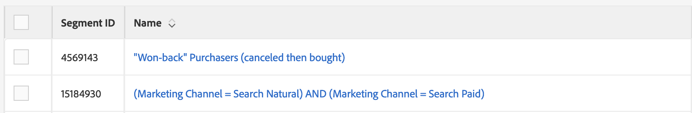

# Accessibilité dans l&#39;Audience Manager {#accessibility}

## Présentation {#overview}

L&#39;accessibilité se rapporte à une série de fonctions qui rendent un produit logiciel utilisable, avec le moins d&#39;effort possible de la part d&#39;utilisateurs ayant divers handicaps, tels que visuels, auditifs, cognitifs, moteurs ou autres.

adobe est un chef de file dans le domaine de l&#39;accessibilité et soutient la création d&#39;expériences Web exceptionnelles en encourageant les développeurs à produire du contenu riche et attrayant accessible à tous les utilisateurs. Pour plus d&#39;informations sur l&#39;engagement de l&#39;Adobe en matière d&#39;accessibilité, voir Accessibilité [des](https://www.adobe.com/accessibility.html)Adobes.

Les fonctions d&#39;accessibilité les plus courantes des produits logiciels sont les suivantes : navigation au clavier, structure sémantique, contraste suffisant entre les éléments de premier plan et les éléments d’arrière-plan, prise en charge de la technologie d’assistance, libellés d’éléments clairs, etc.

Afin de faciliter [!DNL Audience Manager] l&#39;utilisation pour tous, nous avons développé la prise en charge de plusieurs fonctions d&#39;accessibilité.

## Navigation par clavier {#keyboard-navigation}

[!DNL Audience Manager] prend en charge l’accessibilité complète du clavier :

* La `Tab` touche et les flèches se déplacent entre des éléments individuels de l’interface utilisateur.

   

* Les `Return` (`Enter`) et `Space` clés activent l’élément sélectionné.

## Tri des tableaux accessibles {#table-sorting}

Les en-têtes de tableau peuvent être sélectionnés lorsque vous naviguez à l’aide de la `Tab` touche et vous pouvez modifier l’ordre de tri en appuyant sur `Space`la touche.

## Prise en charge des technologies d&#39;assistance {#assistive-technologies}

Grâce à l&#39;utilisation de code sémantique et d&#39; [ARIA](https://www.w3.org/WAI/standards-guidelines/aria/), les éléments interactifs dans l&#39;interface [!DNL Audience Manager] utilisateur incluent des étiquettes correspondantes, des noms accessibles et des rôles qui identifient à la fois leur but et leur état actuel.

Ainsi, les technologies d’assistance, telles que les lecteurs d’écran, peuvent lire les étiquettes et d’autres informations aux utilisateurs afin qu’ils puissent interagir facilement avec les commandes de l’application.

Tous les éléments interactifs de l’interface utilisateur de l’Audience Manager incluent des étiquettes correspondantes. Ainsi, les technologies d’assistance, telles que les lecteurs d’écran, peuvent lire les étiquettes aux utilisateurs.

## Couleurs et contraste {#colors-contrast}

L’interface [!DNL Audience Manager] utilisateur s’efforce de fournir un contraste suffisant dans l’application afin de garantir une expérience d’affichage accessible aux utilisateurs présentant une vision faible ou des déficiences en couleur.

Par exemple, les écrans de chargement incluent un compteur de chargement à l’intérieur d’une boîte modale blanche, le tout sur une incrustation gris foncé.

## Lectures supplémentaires {#further-reading}

[!DNL Audience Manager] s&#39;efforce d&#39;offrir un niveau d&#39;accessibilité toujours plus élevé, rendant le produit facile à utiliser pour tous.

Nous vous encourageons à utiliser le Formulaire [de rétroaction sur l&#39;accessibilité des](https://www.adobe.com/accessibility/feedback.html) Adobes pour nous envoyer des suggestions d&#39;amélioration et des questions d&#39;accessibilité que vous rencontrez. Nous serons très heureux de prendre en compte vos commentaires et de les améliorer [!DNL Audience Manager].