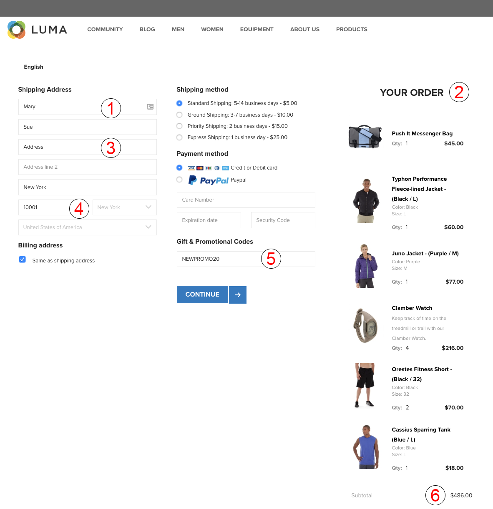

# Types de données collectées {#types-of-data-collected}

[!DNL Audience Manager] vous aide à collecter et à gérer des données propriétaires, propriétaires et tiers.

Déverrouiller les ressources d&#39;informations client stockées dans plusieurs silos est l&#39;un des plus grands défis auxquels sont confrontées les sociétés aujourd&#39;hui en matière de données. Des [!DNL CRM] bases de données aux systèmes d’enregistrement en passant par les serveurs d’annonces, etc., les sociétés ont besoin d’outils qui permettent de centraliser des données précieuses et de gérer les informations client/audience en tant qu’actif de données stratégiques unique. [!DNL Audience Manager] vous aide à déverrouiller des informations client isolées et à gérer la collecte de données à partir de plusieurs sources. Les données collectées peuvent être gérées en fonction des valeurs de durée de vie ([!DNL TTL]) des éléments de données, ce qui permet à l’éditeur de contrôler l’expiration des données sur toutes les sources. [!DNL Audience Manager] est conçu pour vous aider à gérer les types de données suivants :

| Type de données | D&#39;où proviennent les données |
|---|---|
| **Propriétaire** | Clients. Les données sont collectées en ligne (à partir des interactions des utilisateurs sur vos sites Web) ou hors ligne. |
| **Second niveau** | Partenaires stratégiques et annonceurs. |
| **Tiers** | Fournisseurs et/ou échanges de données. Les données peuvent inclure des informations telles que l&#39;intention, la démographie, le mode de vie/social, la psychographie, etc. |

## First-Party Data Collection {#first-party-data}

La collecte de données propriétaires est une [!DNL Audience Manager] fonction principale. Cette compétence de base répond aux besoins de nos clients (éditeurs ou annonceurs) qui veulent utiliser les données propriétaires comme pierre angulaire de leurs programmes marketing ou pour cibler et modéliser en fonction d’autres sources de données.

[!DNL Audience Manager] travaille avec les clients pour comprendre leur stratégie de données, puis fait correspondre cette stratégie à un plan de collecte de données personnalisé. Notre équipe Solutions partenaires travaille avec vous pour évaluer les sites, les signaux de données brutes et les autres interactions des utilisateurs sur vos sites Web. Grâce à ces informations, nous vous aiderons à créer une stratégie de collecte de données personnalisée qui capture les signaux de données au niveau de l&#39;utilisateur provenant de différentes pages de votre inventaire. Les données capturées sont stockées et reassociées à une taxonomie prédéfinie, qui peut être mise à jour à tout moment, en fonction des besoins de votre entreprise.

L’exemple suivant illustre comment capturer des éléments de données potentiels à partir d’un exemple de page d’achat.

| Élément | Description |
|---|---|
| 1 | **Sexe**. Le prénom d&#39;un acheteur indique habituellement son sexe. Dans notre exemple, le prénom de l&#39;acheteur est Mary, nous savons donc que l&#39;acheteur est une femme. Les noms ne sont jamais stockés par Audience Manager. |
| 2 | **Intérêts**. Les articles du panier peuvent indiquer divers intérêts. Dans notre exemple, Marie dépense beaucoup pour l&#39;équipement de remise en forme. |
| 3 | **Type** de logement. En vous basant sur les adresses de livraison et/ou de facturation, vous pouvez déduire si Mary achète de l&#39;équipement de remise en forme pour elle-même ou pour une société. |
| 4 | **Emplacement**. [!DNL ZIP] les codes sont plus fiables que [!DNL IP] les adresses lorsqu&#39;il s&#39;agit de localiser un emplacement. |
| 5 | **Affinité** de promotion. Si un acheteur utilise des codes promotionnels ou des cartes-cadeaux, il est probablement un chasseur de bonnes affaires à la recherche des meilleures affaires. |
| 6 | **Dépenser le pouvoir**. Les données de prix corrélées aux [!DNL ZIP+4] codes indiquent le pouvoir de dépense d&#39;un emplacement donné. |

Une fois les données brutes collectées, elles sont mises en correspondance avec les caractéristiques définies par le client dans la [!DNL Audience Manager] plate-forme. La taxonomie et les mappages de données peuvent être ajustés à tout moment sans apporter de modifications au code de collecte de données.

## Collecte de données tierces {#second-party-data}

Les données tierces proviennent d’un partenaire commercial stratégique (il ne s’agit pas de données d’éditeur). Ces informations sont collectées et gérées comme des données propriétaires.

Dans un scénario de données tierces, les annonceurs envoient leurs propres ressources de données aux éditeurs afin qu’ils puissent combiner ces informations avec les données de l’éditeur, puis exécuter un programme publicitaire plus ciblé. En outre, les éditeurs peuvent étendre leur pool d’audiences en s’associant avec leurs annonceurs. Dans la plupart des cas, ces arrangements impliquent des relations contractuelles limitées à placer la balise de [!DNL Audience Manager] conteneur sur le site partenaire pour faciliter la collecte et le partage des données.

Un exemple de collecte et de marketing de relance de données de fournisseurs tiers pourrait impliquer un détaillant de vêtements qui collecte des données sur ses produits, puis partage ces informations avec des partenaires clés. Dans ce cas, le produit de vente au détail peut proposer différentes publicités sur un site [!DNL Audience Manager] partenaire pour les consommateurs qui ont choisi différentes couleurs et tailles de veste.

## Third-Party Data Collection {#third-party-data}

Les données tierces sont des informations collectées et partagées par les fournisseurs en dehors de [!DNL Audience Manager].

Les données tierces peuvent être utilisées pour qualifier les données existantes [!UICONTROL segments] (par exemple, l’âge, le revenu du ménage, etc.), fournir des données qui sont en demande mais qui ne sont pas disponibles d’une autre manière, ou être utilisées dans la modélisation semblable à celle d’une base d’utilisateurs connue à partir de données propriétaires et secondaires. [!DNL Audience Manager] travaille avec de nombreux fournisseurs de données tiers et vous aidera à comprendre le type de données que ces fournisseurs collectent afin que vous puissiez conclure des accords stratégiques avec chaque fournisseur.

>[!NOTE]
>
>Pour obtenir une liste complète des fournisseurs de données tiers pris en charge par [!DNL Audience Manager], consultez l’outil de recherche [d’Audience](https://www.adobe-audience-finder.com/)Adobe.

[!DNL Audience Manager] s’intègre à d’autres fournisseurs de données en fonction de leurs jeux de données [!DNL APIs] et de leurs disponibilités. La collecte de données fonctionne en temps réel, lorsqu’un utilisateur navigue sur votre site ou au moyen de méthodologies hors bande où les identifiants sont synchronisés entre les partenaires et où les données sont transférées entre les serveurs après qu’un utilisateur a quitté votre site. Dans les deux cas, [!DNL Audience Manager] les clients bénéficient de la synchronisation de données tierces sur notre plateforme, ce qui signifie que chaque client, ou domaine, n&#39;a pas à effectuer sa propre synchronisation. Cela permet d’accroître la portée et de réduire les appels serveur à partir de la page.

## Correspondance avec les partenaires {#match-partners}

De nombreux clients choisissent de travailler avec des partenaires tiers de correspondance de données. Ces entités entretiennent des relations avec les sites nécessitant une inscription et peuvent traiter les fichiers de données client en les faisant correspondre (en temps réel) en fonction de leur réseau d’inscription.

