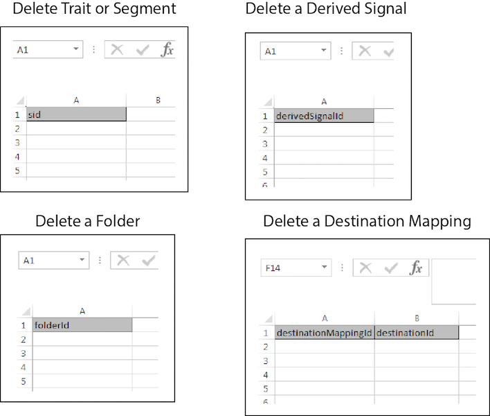

# Suppression en bloc{#bulk-delete}

La suppression en bloc vous permet de supprimer plusieurs segments, caractéristiques, dossiers, signaux dérivés, sources de données, modèles et destinations avec une seule opération. Suivez ces instructions pour effectuer une demande de suppression en bloc.

<!-- 

t_bulk_delete.xml 

 -->

>[!NOTE]
>
>[Les ](../../features/administration/administration-overview.md) autorisations de groupe RBAC attribuées dans l’ [!DNL Audience Manager] interface utilisateur sont respectées dans le  [!UICONTROL Bulk Management Tools].

>[!NOTE]
>
>Une suppression en bloc pour les mappages de destination échoue si des segments sont mappés à la destination. Supprimez vos segments de cette destination dans l’interface utilisateur avant de tenter de supprimer en masse des destinations. En outre, les dossiers de caractéristiques et de segments doivent être vides avant de pouvoir les supprimer.

Pour supprimer plusieurs éléments, ouvrez la feuille de calcul [!UICONTROL Bulk Management Tools] et :

1. Cliquez sur l&#39;onglet **[!UICONTROL Headers]** et copiez les en-têtes de création de l&#39;élément à ajouter.
2. Cliquez sur l&#39;onglet **[!UICONTROL Delete]**.
3. Collez les en-têtes de suppression dans la première ligne de la feuille de calcul de mise à jour.
4. Collez ou tapez les ID des objets à supprimer dans la colonne située sous l&#39;en-tête.
5. Fournissez les [informations de connexion requises](../../reference/bulk-management-tools/bulk-management-intro.md#auth-reqs) et cliquez sur **[!UICONTROL Submit]**.

   La feuille de calcul crée une colonne [!UICONTROL Results]. La colonne [!UICONTROL Results] renvoie un message indiquant si l&#39;élément a été supprimé ou un message d&#39;erreur.
Avant de saisir des données, votre feuille de calcul de mise à jour en masse doit se présenter comme suit :

Si votre mise à jour en masse renvoie une erreur ou échoue, voir [Résolution des problèmes liés aux outils de gestion en bloc](../../reference/bulk-management-tools/bulk-troubleshooting.md).
