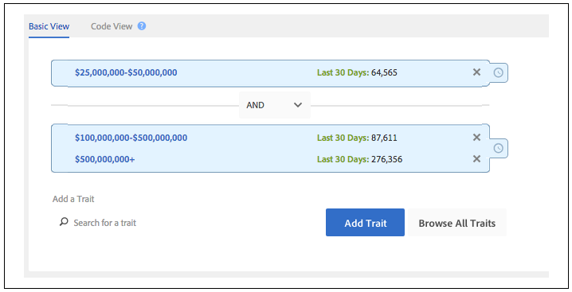
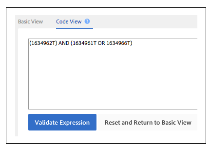

# Créer ou mettre à jour des règles de caractéristiques et des règles de segments{#create-or-update-trait-rules-and-segment-rules}

Les feuilles de calcul de création et de mise à jour acceptent un en-tête traitRule qui vous permet d’appliquer plusieurs règles en une seule opération. Suivez ces instructions pour effectuer des requêtes de règles en bloc.

>[!IMPORTANT]
>
>Les outils de gestion en bloc ne sont pas une offre Adobe officiellement prise en charge. Le dépannage et l’assistance par l’intermédiaire de l’assistance clientèle seront gérés au cas par cas.

<!-- 

c_bulk_rules.xml 

 -->

>[!NOTE]
>
>Les [autorisations de groupe RBAC](../../features/administration/administration-overview.md) attribuées dans l’interface utilisateur de [!DNL Audience Manager] sont respectées dans la [!UICONTROL Bulk Management Tools].

## Utilisation des règles de caractéristiques {#trait-rules}

Dans votre feuille de calcul, la colonne de règle de caractéristique renvoie et accepte les règles composées d’expressions booléennes, d’opérateurs de comparaison et d’expressions régulières. Vous pouvez créer des règles avec le créateur de caractéristiques ou de segments dans [!DNL Audience Manager] et les copier dans votre feuille de calcul. Ou, si vous connaissez la syntaxe des règles, vous pouvez écrire des expressions directement dans les feuilles de calcul.

## Exemple de créateur de règles {#rule-builder-example}

Prenons un exemple qui montre comment utiliser [!UICONTROL Segment Builder] pour créer une règle que vous pouvez appliquer à la feuille de calcul en bloc. Cependant, il ne s’agit pas d’un ensemble d’instructions détaillées pour ces outils. Au lieu de cela, nous allons commencer avec une règle simple qui a déjà été créée. Pour obtenir des instructions sur l’utilisation des créateurs de règles, voir [Créateur de segments](../../features/segments/segment-builder.md) et [Créateur de caractéristiques](../../features/traits/about-trait-builder.md).

Avec le créateur de règles visuel, nous avons créé une règle de segment avec 3 caractéristiques et un opérateur [!UICONTROL AND] booléen.

Cliquez sur **[!UICONTROL Code View]** pour obtenir la version texte de cette règle.

>[!TIP]
>
>Cliquez sur **[!UICONTROL Validate Expression]** pour vérifier la logique de vos règles. Cela vous aidera à éviter de charger une règle non valide.

Collez la règle dans la feuille de calcul [!UICONTROL Bulk Management Tools] et validez vos modifications pour mettre à jour les règles de segment en bloc.

## Création de vos propres règles {#create-rules}

Vous pouvez écrire vos propres règles en dehors de [!UICONTROL Rule Builder]. Avant de commencer, veillez à lire la documentation qui couvre des éléments tels que les opérateurs, l’expression et les variables requises. Nous vous recommandons de consulter les éléments suivants :

* [Utilisation Des Opérateurs De Comparaison Dans Le Générateur De Caractéristiques](../../features/traits/trait-comparison-operators.md)
* [Ordre des opérations](../../features/traits/trait-operator-precedence.md)
* [Exigences de préfixe pour les variables clés](../../features/traits/trait-variable-prefixes.md)
* [Exemples d’expressions avec des opérateurs booléens et de comparaison](../../features/traits/trait-expression-samples.md)
