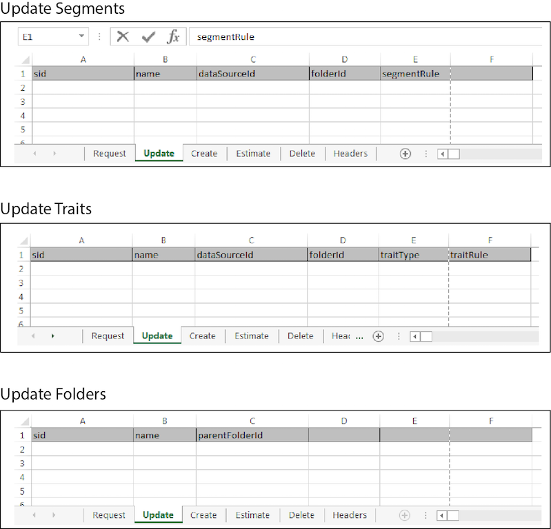

# Mises à jour en bloc{#bulk-updates}

Une mise à jour en bloc vous permet de modifier plusieurs segments, caractéristiques, modèles, sources de données et éléments de dossier de segments ou de caractéristiques en une seule opération. Suivez ces instructions pour effectuer des mises à jour en bloc.

>[!IMPORTANT]
>
>Les outils de gestion en bloc ne sont pas une offre Adobe officiellement prise en charge. Le dépannage et l’assistance par l’intermédiaire de l’assistance clientèle seront gérés au cas par cas.

<!-- 

t_bulk_updates.xml

 -->

>[!NOTE]
>
>Les [autorisations de groupe RBAC](../../features/administration/administration-overview.md) attribuées dans l’interface utilisateur de [!DNL Audience Manager] sont respectées dans la [!UICONTROL Bulk Management Tools].

Pour effectuer des mises à jour en bloc, ouvrez la feuille de calcul [!UICONTROL Bulk Management Tools] et :

1. Cliquez sur l’onglet **[!UICONTROL Headers]** et copiez les en-têtes de mise à jour de l’élément à modifier.
2. Cliquez sur l’onglet **[!UICONTROL Update]** .
3. Collez les en-têtes de mise à jour dans la première ligne de la feuille de calcul de mise à jour. Notez ce qui suit :

   * Lors de la mise à jour d’un dossier, tous les en-têtes sont requis.
   * Lors de la mise à jour des segments ou des caractéristiques, vous n’avez besoin que de l’identifiant du segment (SID) et de l’élément d’en-tête qui doit être modifié. Supprimez les en-têtes inutilisés.

4. Collez ou saisissez les données à modifier dans une colonne correspondante en fonction du libellé de l’en-tête.
5. Dans la barre d&#39;outils de la feuille de calcul, cliquez sur un bouton de mise à jour correspondant au        élément que vous mettez à jour.
Cette action ouvre la boîte de dialogue [!UICONTROL Account Information].

6. Fournissez les [informations de connexion](../../reference/bulk-management-tools/bulk-management-intro.md#auth-reqs) requises, puis cliquez sur **[!UICONTROL Submit]**.

   La feuille de calcul crée une colonne [!UICONTROL Results]. La colonne [!UICONTROL Results] renvoie la réponse JSON pour une opération réussie. Voir les [API REST](../../api/rest-api-main/rest-api-main.md) pour obtenir des exemples. Avant de saisir des données, votre feuille de calcul de mise à jour en bloc doit ressembler à ce qui suit :

Si votre mise à jour en bloc renvoie une erreur ou échoue, consultez [Dépannage pour les outils de gestion en bloc](../../reference/bulk-management-tools/bulk-troubleshooting.md).
